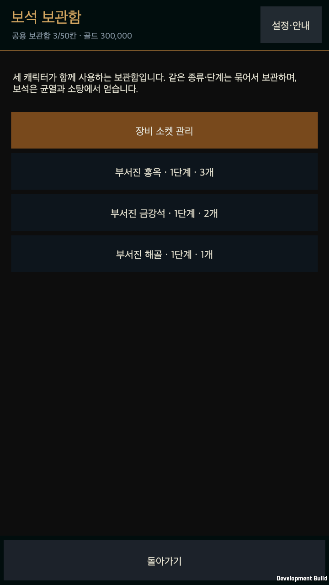
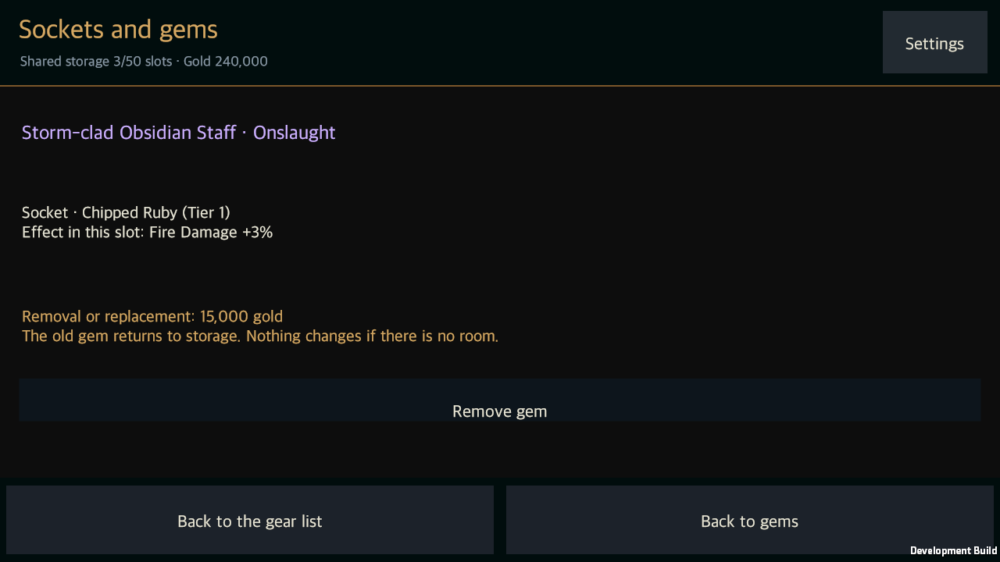

# 로컬 플레이 완성과 보석 서비스

작성일: 2026-09-13 · [English](Playable_Completion.en.md)

이번 작업의 목표는 사용자가 직접 플레이를 시작할 수 있는 게임이다. 세부 수치·파밍 효율·밸런스는 사용자가 플레이하며 조절한다. 따라서 밸런스 측정과 대규모 반복 실험을 수행하지 않고, 주요 기능 구현과 진행·저장에 필요한 확인만 진행했다. 아래 내용은 기존 설계 문서의 미완료 표시보다 우선하는 현재 구현 기록이다.

## 연결한 플레이 기능

3직업과 추천 빌드, 사냥 칙령 편집·저장·공유·5개 슬롯, 자동 생성 균열과 탐험 목표, 상자·성소·보스, 전리품과 캐릭터별 초회 보상, 장비·접두사·접미사·전설·세트·강화·재설정·걸작, 룬 성장, 반복 사냥, 전투 기록과 저장 후 이어하기를 유지한다. 임시 음향과 18개 스킬의 기본 도형·발사체·동작은 [직전 개발 기록](Audio_Skill_Presentation.md)에 포함되어 있다.

이번에 보석 획득 → 공용 보관 → 소켓 생성 → 장착·교체·분리 → 합성을 연결했다. 보석 7종·6단계와 부위별 효과는 기존 표를 그대로 사용한다. 보석이 박힌 장비는 판매·분해와 자동 정리에서 보호하며, 효과는 장비 비교와 실제 전투 능력치에 반영된다.

## 보석과 소탕

- 일반 적·정예는 기존 확률로 보석을 떨어뜨리고, 보스는 2개를 떨어뜨린다. 획득하지 않은 보석은 바닥에 남는다. 훈련에는 실제 보상을 지급하지 않는다.
- 계정의 세 캐릭터가 같은 보관함을 사용한다. **50칸·한 묶음 999개는 플레이를 위한 조정 가능한 임시 기본값**이며, 사용자가 별도로 확정한 보관 상품 정책이 아니다.
- 희귀 이상 무기·머리·몸통·목걸이·반지에 소켓을 하나 낸다. 비용은 아이템 레벨당 2,000골드와 일반 재료 30개다. 빈 소켓 장착은 무료이며, 교체·분리는 아이템 레벨당 500골드다. 기존 보석은 보관함으로 돌아온다.
- 같은 종류·단계 3개와 기존 합성 비용으로 다음 단계 1개를 만든다. 최상위 단계는 합성할 수 없다. 재료 소비 후 생기는 빈칸까지 계산하며 공간 부족 시 전체 변경을 취소한다.
- 소탕은 기존 하루 3회와 해금 조건을 유지하고 장비 3개·보석 2개·골드·재료를 한 거래로 저장한다. 보관 공간이나 저장에 문제가 있으면 횟수와 보상을 함께 보존한다.

성소 메뉴, 가방 목록의 **보석 보관함**, 장비 상세의 **소켓과 보석 관리**에서 접근한다. 재설정 담당 NPC도 같은 가방 화면으로 연결한다. 진행 중인 균열의 장비 능력치를 바꾸지 않도록 소켓 서비스는 완료 후에만 제공한다. 포탈에서는 보관함 합성을 허용한다.

보관함이 가득 차면 균열 상태와 미회수 보석을 보존한다. 합성으로 공간을 만든 뒤 **균열 복귀**를 누르거나, **남은 보상 두고 종료**를 확인하여 남은 전리품을 포기하고 결과로 이동할 수 있다. 이미 얻은 보상은 유지한다.

## 사냥 칙령에서 수정한 연결

재화 회수 설정이 존재해도 실제 바닥 전리품 행동에 연결되지 않았던 부분을 수정했다. 금화·재료·보석·코어의 지나가며 획득, 전투 후 추적, 전투 중 우선 추적과 지원되는 무시 선택을 각각 적용한다. 추적 거리·시야·위험 경로·종료 시 회수 여부도 같은 판단에 연결한다. 최소 금화 기준은 추적할 더미에 적용하며, 경로에서 만난 소액 금화는 회수할 수 있다.

전역 행동 순서가 ‘우선 회수’를 판단할 때 장비 등급만 보던 문제도 수정했다. 재화 중 하나라도 우선 추적으로 설정하면 해당 회수 행동을 지정한 순서에 배치한다. 보석 추첨에는 별도 난수 상태를 사용해 기존 장비 추첨과 전투 난수 흐름을 소비하지 않는다. 직접 개봉한 상자의 확정 재화와 초회 보상은 기존 직접 정산을 유지한다.

## 저장과 화면

보석 거래와 소탕은 복사본에서 검사한 뒤 저장에 성공해야 계정에 반영된다. 같은 요청을 재전송해도 비용과 보상을 중복 적용하지 않는다. 저장 형식은 4로 올려 이전 앱이 새 보석 보관함을 누락하는 일을 막는다. 기존 저장에는 빈 보관함을 추가하며, 지원하지 않는 보석 기록을 임의로 삭제해 복구하지 않는다.

바닥 금화·재료·코어·보석은 작은 기본 도형으로 구분한다. 보석 획득음과 결과 화면의 보관함 바로가기를 제공한다. 새 문구에는 한국어·영어를 함께 추가했다. [화면 대응 기획](../Design/HELLSCRIPT_Screen_Layout_Detail.md)에 따라 본문은 스크롤하고 복귀 버튼은 고정 영역에 둔다.

## 확인 범위

사냥 칙령 기능 검사 1,007개와 기존 실제 앱의 저장·공유·재시작 확인을 먼저 통과했다. 이번 변경은 보석 거래, 재화 추적·회수, 저장 실패와 재시도, 이전 저장 읽기, 소탕, 번역을 포함한 집중 검사 99개를 통과했다. 전체 검사 수를 합산해 새로운 전체 회귀 검사로 표현하지 않는다.

최종 실행 결과와 화면은 [확인 요약](../../Artifacts/Validation/PlayableCompletion/validation-summary.json)에 기록한다. 자연 균열 확인은 합법적인 레벨 30 장비로 1단계를 진행하는 기능 확인이며, 보석 서비스와 가득 찬 보관함은 별도 준비 자료로 조작한다. 난이도·파밍·성장 속도의 적절성을 판정하지 않는다.

실행 방법과 이번 작업에서 제외한 출시 준비 범위는 [직접 플레이 안내](Local_Play_Guide.md)를 따른다.

최종 macOS 실행본의 세 프로세스에서 같은 균열 복원, 자연 탐험·상자·보스·보상, 보석 서비스, 포탈 정리·종료, 다음 균열과 소탕, 최종 재시작이 통과했다. 한국어 세로·영어 가로를 포함한 화면 9장을 직접 검토했다.

