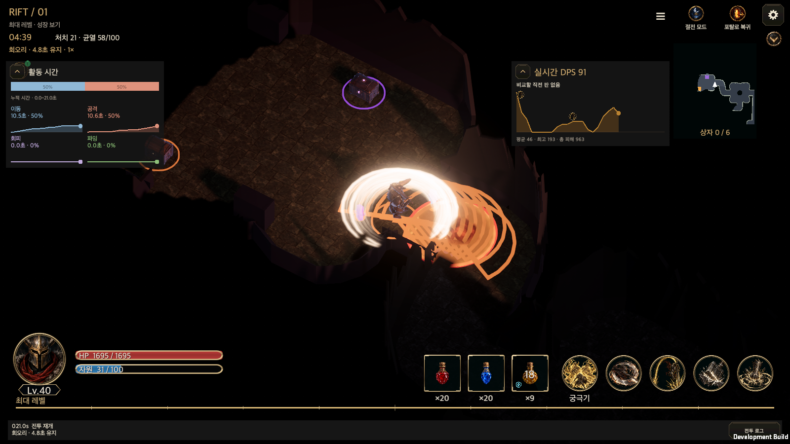
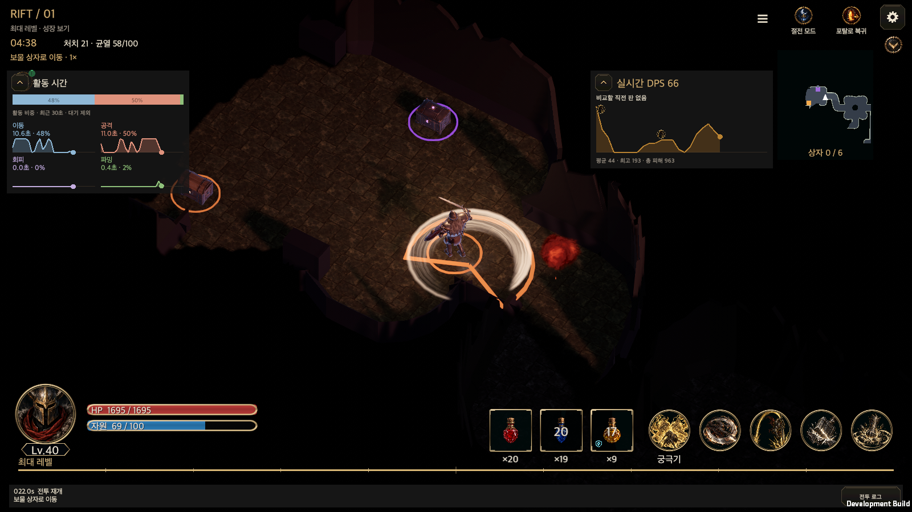

# Rift activity time graphs

Updated: 2026-10-03 · [한국어](Rift_Activity_Time.md)

Rift battles show **Movement, Attack, Evasion and Farming** in real time. An independent HUD places one stacked 100% bar above four cumulative time/share labels and cumulative graphs. The horizontal axis is elapsed Rift time; the vertical axis is total seconds spent on that activity by that moment. Farming for 0.4 seconds, doing something else, then farming for another 0.4 seconds produces a flat stretch at 0.4 seconds followed by a rise to 0.8 seconds. The graph spans this play session's observation start through the current moment, rather than only the last 30 seconds. The hint above the graphs states the displayed start/end times.

| Activity | Recorded purpose |
| --- | --- |
| Movement | Actual travel toward unexplored areas, the boss room or other destinations |
| Attack | Basic/skill preparation, channeling and recovery; enemy pursuit, gathering and combat positioning |
| Evasion | Executed survival skills and retreat walking; a movement skill used for survival belongs here |
| Farming | Approaching loot or approaching/opening a chest |

Each simulation interval belongs to at most one activity. Within an interval, transitions use Evasion → Attack → Farming → Movement priority. Incidental pickups during attacks, projectiles and ongoing damage do not create additional activity time. Idle time and other stationary interactions are excluded from the four-activity denominator. Pause, town, portal maintenance and instantaneous post-battle collection add no time. Once activity exists, largest-remainder rounding makes the four displayed integer shares total exactly 100%. Before that, the bar is empty and shows a waiting hint.

Drag the heading to move the panel and press its left arrow to fold/unfold. **Position and folding are independent of DPS**. HUD rebuilds, orientation and language changes retain both. Position is device-only in `hellscript-activity-position-v1.json`; a new launch restores the position and starts expanded. Safe-area bounds and the lower log/controls constrain placement. Graphs and the share bar do not intercept gameplay input.

The existing `CombatFeedback` owns actual-purpose timing. Cumulative totals persist in `RunState.statistics.feedback` and completed records; live graph samples stay in memory. At completion, `CombatHistory.Capture` copies the actual timestamps and cumulative samples, including the final tick, into `CombatReview.activityHistory`. Checkpoint sampling rules remain the same; completed curves survive a file reload. Activity transitions and second boundaries are sampled. Long sessions coarsen intermediate samples to stay within 257 points while retaining the observation start, current endpoint and exact totals. The chart respects actual time spacing. Resuming starts the graph at the saved cumulative totals and does not infer the earlier detailed curve. Older timing lacks purpose evidence, so migration preserves skill evidence and starts a new timing observation at resumption.

The result's **View Graph** shows the four activities' final seconds, integer shares and curves below the existing DPS and cast inspection. It also reports active total and excluded idle time. Opening copies the completed evidence, so reflow and language changes never mutate owned records. Older records without curves show final totals with an explicit notice; missing or older-version activity aggregates show an unavailable-record message. Pre-resume curves are never inferred.

`RiftActivityPanel` is the shared activity presentation for the live HUD and result graph. `GameUI.RiftActivity` is a read-only adapter on the existing battle canvas. It reuses `TrainingDpsChart`, `DpsHudDrag`, `DpsHudPosition`, `UiTheme`, `UiFonts` and `Loc`, retaining the original DPS position file. No new content window, canvas or chart engine is introduced. Display interactions do not mutate account or combat evidence.

Sources: [Shared activity panel](../../Assets/HELLSCRIPT/Runtime/Presentation/RiftActivityPanel.cs), [Result graph](../../Assets/HELLSCRIPT/Runtime/Presentation/RiftCombatGraphWindow.cs), [Completed record](../../Assets/HELLSCRIPT/Runtime/Core/CombatHistory.cs), [Timing](../../Assets/HELLSCRIPT/Runtime/Core/CombatFeedback.cs), [HUD](../../Assets/HELLSCRIPT/Runtime/Presentation/GameUI.RiftActivity.cs), [Focused checks](../../Assets/HELLSCRIPT/Tests/Editor/CombatActivityTests.cs), [macOS interaction checks](../../Assets/HELLSCRIPT/Runtime/Presentation/RuntimeTrainingGroundSmoke.Activity.cs).

## 2026-10-03: Final activity records and repeat settings shortcut validation

Completed reviews persist actual movement, attack, evasion and farming curves through the final tick. **View Graph** shows these beside the existing DPS and cast inspection. Result stages 1–14 always show a dimmed button and a two-second locked message. From stage 15, the compact **Go to settings** action opens the existing Hunt Edict repeat tab; closing it restores the same result.

The related Edit Mode scope completed 107 cases. Five initial failures came from new UI tests calling runtime `Destroy` during Edit Mode cleanup. Only test cleanup changed to reuse the existing `DestroyImmediate` teardown; those five cases then passed with **5 passed, 0 failed, 0 skipped**. MCP returned no full initial summary, so this is not reported as 107/107 passed. The shared UI ownership contract and **11/11** contract tests passed. The full game suite was not repeated.

The macOS development build succeeded with zero errors and 191 warnings. One combined native acceptance checked 30 existing HUD conditions and ten KO/EN result-activity and shortcut viewport combinations. A naturally completed 88.6-second Rift produced 114 real samples matching final totals and shares; an independent `GameStore` file reload preserved the complete review. Actual raycasts and synthetic pointers opened and closed graphs and repeat settings while retaining the same result, battle and loot position. Town/training had no activity HUD and retained existing training DPS. The player emitted `HELLSCRIPT_RIFT_ACTIVITY_SMOKE_OK`, exited zero and logged zero managed exceptions. All 28 real gameplay/preferences files retained their hashes; Unity analytics caches and shared Editor test output are separate. Mobile safe areas were simulated on macOS; physical mobile and WebGL were not verified in this task.

The additional stage gate passed **6/6 focused checks** for configured/unconfigured stages 14/15/16 and the English table. The final development build had zero errors and 193 warnings. The initial 30 HUD conditions were reused, while only the ten affected result conditions were rerun. Stage 14 remains dim even with a saved repeat policy and shows only the locked message, which expires after two seconds; neither a shortcut nor the configured information page opens. Configured stages 15/16 have full opacity. Unconfigured stage 15 retains the compact shortcut and same-result return. Only the gate UI uses stage 14/15/16 fixtures; activity totals, damage and cast times are from the real naturally completed stage-1 battle.

[Boundary checks](RiftResultActivityEvidence20261003/editmode-repeat-gate.json) · [Final build](RiftResultActivityEvidence20261003/native-build-gated.json) · [Reused initial HUD acceptance](RiftResultActivityEvidence20261003/runtime-initial.txt) · [Korean stage-14 hint](RiftResultActivityEvidence20261003/repeat-locked-1600x900-ko.png) · [Portrait English stage-14 hint](RiftResultActivityEvidence20261003/repeat-locked-440x956-en.png).

[Scope and source hashes](RiftResultActivityEvidence20261003/validation.json) · [Initial checks](RiftResultActivityEvidence20261003/editmode-first.json) · [Failed-case retest](RiftResultActivityEvidence20261003/editmode-retest.json) · [Build](RiftResultActivityEvidence20261003/native-build.json) · [Runtime actions](RiftResultActivityEvidence20261003/runtime.txt) · [Final totals](RiftResultActivityEvidence20261003/final-feedback.json) · [Actual curve samples](RiftResultActivityEvidence20261003/final-activity-samples.json).

[Portrait Korean result graph](RiftResultActivityEvidence20261003/result-activity-440x956-ko.png) · [Landscape Korean result graph](RiftResultActivityEvidence20261003/result-activity-956x440-ko.png) · [PC English result graph](RiftResultActivityEvidence20261003/result-activity-1600x1000-en.png) · [Korean repeat shortcut](RiftResultActivityEvidence20261003/repeat-shortcut-1600x900-ko.png) · [Portrait English shortcut](RiftResultActivityEvidence20261003/repeat-shortcut-440x956-en.png) · [Korean repeat tab](RiftResultActivityEvidence20261003/repeat-tab-1600x900-ko.png) · [Landscape English repeat tab](RiftResultActivityEvidence20261003/repeat-tab-956x440-en.png).

## Cumulative graph validation

The cumulative update was checked across **61 scoped Edit Mode cases**: two 0.4-second farming intervals totaling 0.8 seconds with a flat gap, boundary interpolation, bounded long-run samples retaining the origin, actual elapsed-time spacing, resumption from saved totals, uniform DPS spacing and unchanged combat outcomes. Sixty cases passed initially. An ambiguous Reflection overload in the new coordinate check was fixed in the test helper only, and that single failed check passed on rerun. The other successful checks were retained. This update used scoped validation; the full Edit Mode suite was not rerun. The full-suite results below describe the initial implementation.

The macOS development build succeeded with 0 errors and 225 warnings. In a real seeded Rift, graph endpoints matched cumulative totals and both timestamps and cumulative values were monotonic. One native acceptance run covered 30 conditions: Korean/English × portrait 440×956, landscape 956×440 and PC 16:9/16:10/21:9 × three map modes. It verified the exact 100% bar, fold/drag, independent persisted position, rebuild retention, safe areas and text bounds. Display interactions left combat totals unchanged and the training DPS adapter remained present. Input used synthetic macOS uGUI events and simulated safe areas; physical mobile devices were not tested.

[Scoped checks](RiftActivityCumulativeEvidence20261002/focused-tests.json) · [Build](RiftActivityCumulativeEvidence20261002/native-build.json) · [Interaction record](RiftActivityCumulativeEvidence20261002/runtime.txt)

| Viewport | Korean | English |
| --- | --- | --- |
| Portrait 440×956 | [Cumulative view](RiftActivityCumulativeEvidence20261002/activity-440x956-ko.png) | [Cumulative view](RiftActivityCumulativeEvidence20261002/activity-440x956-en.png) |
| Landscape 956×440 | [Cumulative view](RiftActivityCumulativeEvidence20261002/activity-956x440-ko.png) | [Cumulative view](RiftActivityCumulativeEvidence20261002/activity-956x440-en.png) |
| PC 16:9 | [Cumulative view](RiftActivityCumulativeEvidence20261002/activity-1600x900-ko.png) | [Cumulative view](RiftActivityCumulativeEvidence20261002/activity-1600x900-en.png) |
| PC 16:10 | [Cumulative view](RiftActivityCumulativeEvidence20261002/activity-1600x1000-ko.png) | [Cumulative view](RiftActivityCumulativeEvidence20261002/activity-1600x1000-en.png) |
| PC 21:9 | [Cumulative view](RiftActivityCumulativeEvidence20261002/activity-1680x720-ko.png) | [Cumulative view](RiftActivityCumulativeEvidence20261002/activity-1680x720-en.png) |

## Initial implementation validation

The **46/46** focused Edit Mode checks, **11/11** shared UI checks and final ownership validator passed: actual tick purposes, farming approach attribution, paused/portal exclusions, exact 100% rounding, interval boundaries and bounded history, save/resume migration, unchanged simulation outcomes and independent device positions.

The full final Edit Mode suite ran once: **5,037 total, 4,909 passed, 128 failed, 0 skipped**. All 128 failing names match failures in earlier validation files; this is not a fully passing suite. Preserve the [full result](RiftActivityTimeEvidence20261002/editmode-final.json) and [baseline comparison](RiftActivityTimeEvidence20261002/failure-baseline-comparison.json).

The macOS development build succeeded with 0 errors and 190 warnings. Native acceptance covered natural Rift ticks, live updates and paused exclusions, exact 100% segments, non-blocking graph input, heading raycasts and drag/fold, DPS independence, persisted position readback, rebuild retention and bounds clamps. Both languages passed at all five viewports below in three map modes. UI interactions left cumulative evidence unchanged; town/training removed the activity panel and training retained its DPS adapter. The first run found clipped English labels; placing the name and time/share on two lines fixed it. Only the directly affected UI acceptance was rerun; unchanged timing code reused the full suite result.

[Focused checks](RiftActivityTimeEvidence20261002/focused-tests.json) · [Build](RiftActivityTimeEvidence20261002/native-build.json) · [Runtime record](RiftActivityTimeEvidence20261002/runtime.txt). Input was synthetic macOS uGUI input with simulated safe areas. Physical mobile devices were not tested.

| Viewport | Korean | English |
| --- | --- | --- |
| Portrait 440×956 | [Screen](RiftActivityTimeEvidence20261002/activity-440x956-ko.png) | [Screen](RiftActivityTimeEvidence20261002/activity-440x956-en.png) |
| Landscape 956×440 | [Screen](RiftActivityTimeEvidence20261002/activity-956x440-ko.png) | [Screen](RiftActivityTimeEvidence20261002/activity-956x440-en.png) |
| PC 16:9 | [Screen](RiftActivityTimeEvidence20261002/activity-1600x900-ko.png) | [Screen](RiftActivityTimeEvidence20261002/activity-1600x900-en.png) |
| PC 16:10 | [Screen](RiftActivityTimeEvidence20261002/activity-1600x1000-ko.png) | [Screen](RiftActivityTimeEvidence20261002/activity-1600x1000-en.png) |
| PC 21:9 | [Screen](RiftActivityTimeEvidence20261002/activity-1680x720-ko.png) | [Screen](RiftActivityTimeEvidence20261002/activity-1680x720-en.png) |

