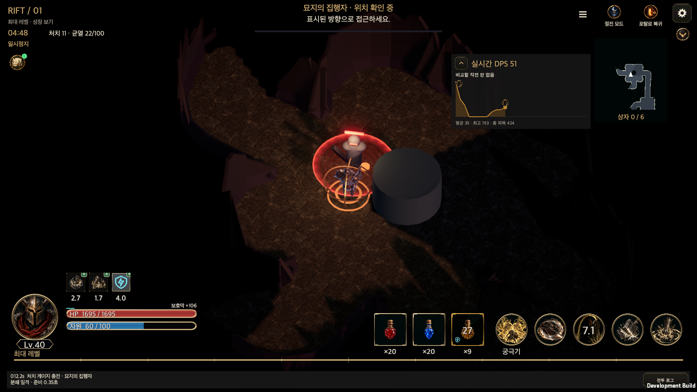
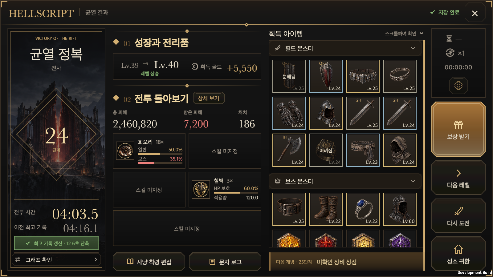
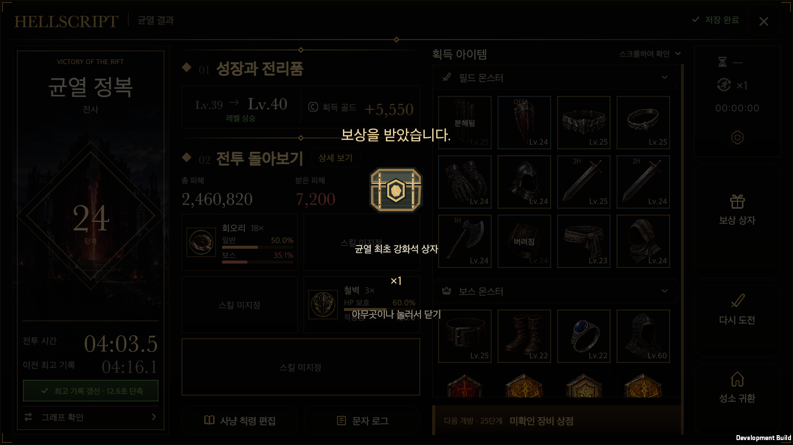
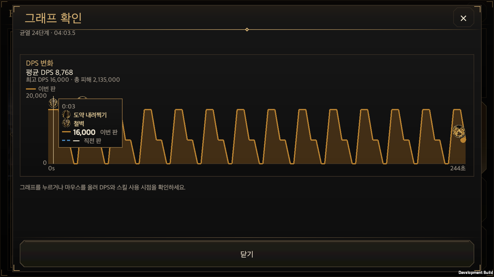

# Rift result actions and battle graph

Updated: 2026-10-03 · [한국어](Rift_Result_Actions.md)

Rift result actions now connect reward claims, acquired equipment changes, graph inspection and retry to the actual saved state.

- **Claim Reward** commits `GameStore.ClaimRiftFirstRewards` immediately, then shows only the saved box grants over a black dim: icons, names, counts and **Tap anywhere to close**. No claim confirmation or follow-up popup appears. Already granted gold, XP and loot are not granted again; boxes are not automatically opened. Failed saves do not show success.
- **Empty skills** show only **Skill unassigned**, including the ultimate. The shared `RiftSkillShareView` creates no empty icon or frame in rift details and training results.
- **Acquired equipment** retains its acquisition snapshot while **Compare with equipped** and **Equip** resolve current ownership by ID. `EquipmentComparisonView` and `ItemComparison` provide the common ring/dual-wield target selector. Existing `EquipmentSlots` and `GameStore` transactions commit equipment changes. Automatically stored equipment is retrieved through `Storage.Move` and equipped in one transaction. Disposed or missing equipment is never recreated.
- **View Graph** replaces the previous-record text comparison with this battle's graph. It shares the training ground's existing `TrainingDpsPanel`, `TrainingChartView`, `TrainingDpsChart`, three-second DPS window and cast inspection. Damage uses actual HP loss, as in training; cooldown icons and all-cast tooltips keep the same rules. Rift checkpoints and completed reviews own their per-second samples and release times. Old saves without samples show an explicit unavailable-record message. The same window also shows final movement, attack, evasion and farming evidence through the shared [battle activity panel](Rift_Activity_Time.en.md).
- **Repeat settings** stay dim for result stages 1–14 regardless of saved configuration. A press shows only **Repeat settings unlock at Rift level 15.** for two seconds, without a shortcut or configured-repeat information page. At stage 15 and above they appear dim when repetition for this result is off. A press shows a two-second **Repeat hunting has not been configured** bubble. Its compact **Go to settings** action opens the existing Hunt Edict **Repeat hunting** tab. Closing it restores the same result, battle and loot position. Automatic repetition and manual retry countdown pause while settings are open. The configured result's information page has no header settings shortcut.
- **Next level** sits between claim and retry and enters the completed Rift tier plus one. Completing tier 24 enters tier 25 even when the hero's highest clear is tier 30. It requires a saved victory, an unlocked successor and a target within the 1,000-tier cap. Existing `PrepareResultRetry`, `ReturnTown` and `Begin` cancel the current repeat reservation/manual retry and retain normal admission, fatigue, potion and save checks. Wide layouts stack claim→next level→retry→return; portrait uses claim/next level followed by retry/return in two rows.
- **Centered action content** groups each wide-layout button's icon with the measured text height, including wrapped lines, and centers the group vertically. Removing unused space below the label fixes the upward bias through the shared Korean/English button path.
- **Retry** keeps the result open and displays 5, 4, 3, 2, 1 with **Tap to cancel** on the button. Another press cancels entry. Manual retry takes over the automatic reservation for this result while preserving the hero's repeat configuration for the next battle. Nested windows and lost app focus pause the timer. Save failures or closing the result prevent entry.

## Live battle DPS, 2026-10-02

Rift battles use the existing training DPS HUD. Creation, layout and refresh in `GameUI.TrainingGround`, `TrainingChartView` and `TrainingDpsChart` are shared; no separate graph or damage collector is added.

- The same rules show the three-second DPS window, average/peak/total damage, time series and cooldown-skill/ultimate cast icons. The source is the current Rift's `RunState.dps`. Pausing combat stops samples and combat time.
- The comparison line and delta read the latest retained successful run with real samples for the same hero and tier. They exclude the current run, other characters/tiers, failures and legacy records without samples. No eligible record displays the existing no-previous-run message.
- The arrow folds to one live-DPS line and expands again. Training and Rifts share the session-only fold choice, including HUD rebuilds. Wide layouts place it beside the minimap; compact strips sit below the header/map. The default position stays clear of boss status; a deliberate user position takes precedence.
- Resumed legacy saves without samples show `—` and the unavailable-record message, without recalculating historical damage from current equipment. Town, results and mandatory tutorials retain no live panel. Training-specific pause/stop dialogs remain on the training path; Rifts retain their existing observation-menu pause.

Validation passed: 66/66 related Edit Mode tests, shared UI ownership and 11/11 contract tests, macOS development build and native runtime acceptance. Korean/English × 440×956 portrait, 956×440 landscape, and 1600×900, 1600×1000, 1680×720 PC × three minimap modes cover 30 combinations. Checks include safe bounds, boss/map/log separation, pointer folding/unfolding, retention after HUD rebuild and recorded-data agreement. The original training graph and pause/resume also passed. Mobile safe areas and pointer input were simulated on macOS, not physical iOS/Android. The first runtime attempt stopped because the harness did not await asynchronous Rift admission; after correcting the wait, only the failed runtime check was repeated with the required rebuild. The full game test suite was not repeated. Four URP post-processing shader warnings are retained in the evidence; there were no managed exceptions.

[Validation summary](RiftResultActionsEvidence/live-dps-validation.json) · [Edit Mode](RiftResultActionsEvidence/live-dps-editmode.xml) · [Shared UI](RiftResultActionsEvidence/live-dps-ui-contract.txt) · [Runtime record](RiftResultActionsEvidence/live-dps-runtime.txt)

[PC Korean](RiftResultActionsEvidence/live-dps-rift-dps-1600x900-ko.png) · [PC English](RiftResultActionsEvidence/live-dps-rift-dps-1600x900-en.png) · [Portrait Korean](RiftResultActionsEvidence/live-dps-rift-dps-440x956-ko.png) · [Portrait English](RiftResultActionsEvidence/live-dps-rift-dps-440x956-en.png) · [Landscape Korean](RiftResultActionsEvidence/live-dps-rift-dps-956x440-ko.png) · [Landscape English](RiftResultActionsEvidence/live-dps-rift-dps-956x440-en.png) · [Folded](RiftResultActionsEvidence/live-dps-rift-dps-folded-1600x900-ko.png) · [Shared training panel](RiftResultActionsEvidence/live-dps-training-shared-dps-1600x900-ko.png)

## DPS position and battle header, 2026-10-02

- Drag the live DPS title with a mouse or touch. The fold arrow remains a separate control.
- `DpsHudPosition` atomically saves the drop location in the device-only `hellscript-dps-position-v1.json`. Rifts and training share it and restore it after HUD rebuilds and game restarts. Account, character and battle saves remain separate. A failed save shows a message; another drag retries it.
- The top-left anchor is normalized to the safe area. Resizing, rotation and folding clamp the visible panel into safe bounds above the skill/potion/log controls without overwriting the stored anchor.
- Boss name, action and health stay at the top centre; narrow screens use the central row immediately below the header. Moving the graph cannot push boss status downward.
- Power Saving and Return to Portal sit side by side to the left of Settings, with the observation menu to their left. The minimap begins below the shortcut captions.

Validation passed **13/13** related Edit Mode tests and **11/11** shared UI contract tests. The first native attempt exposed a drag handle hidden behind the bottom HUD. After limiting the usable bottom bound, the affected drag regression passed **1/1** and the affected native acceptance was rerun. The final build had zero errors and the final player had no managed exceptions. KO/EN x five viewports x three map modes covered 30 drag/fold/rebuild/top-alignment cases, and a fresh process restored the position. Ten entry layouts verified the help popup's actual next unlock tier without changing selected tier 4. The fixture's next unlock was tier 5; real accounts pass their actual next tier, such as 10. No full game suite or physical-mobile run was performed.

English-table parsing and runtime translation coverage passed **2/2**. The orphan-key check failed on two entries already present at the baseline commit (`{0}단계 · {1}` and `기록 목록`); these are recorded separately from the change.

[Scope and source hashes](RiftResultActionsEvidence/dps-drag-validation.json) · [Runtime](RiftResultActionsEvidence/dps-drag-runtime.txt) · [Fresh process](RiftResultActionsEvidence/dps-drag-relaunch.txt) · [Localization baseline](RiftResultActionsEvidence/dps-drag-localization-baseline.json)

[Moved graph](RiftResultActionsEvidence/dps-drag-1600x900-en.png) · [Portrait](RiftResultActionsEvidence/dps-drag-440x956-en.png) · [Landscape](RiftResultActionsEvidence/dps-drag-956x440-ko.png) · [Restart](RiftResultActionsEvidence/dps-drag-relaunch-1600x900-ko.png)

## Shared UI adapters

`RiftRewardRevealWindow` and `RiftCombatGraphWindow` started with `tools/new_content_ui.py` and use `ContentWindowView` for safe areas, input and pause leases. The reward reveal intentionally hides the standard chrome and shows only the black dim and centered receipt. It has no separate canvas, equipment calculation or save owner. Its committed `RewardSnapshot` is presentation-only; tapping only dismisses it.

## 2026-10-03: Final activity records and repeat settings shortcut validation

Completed reviews persist actual movement, attack, evasion and farming curves through the final tick. **View Graph** shows these beside the existing DPS and cast inspection. Result stages 1–14 always show a dimmed button and a two-second locked message. From stage 15, the compact **Go to settings** action opens the existing Hunt Edict repeat tab; closing it restores the same result.

The related Edit Mode scope completed 107 cases. Five initial failures came from new UI tests calling runtime `Destroy` during Edit Mode cleanup. Only test cleanup changed to reuse the existing `DestroyImmediate` teardown; those five cases then passed with **5 passed, 0 failed, 0 skipped**. MCP returned no full initial summary, so this is not reported as 107/107 passed. The shared UI ownership contract and **11/11** contract tests passed. The full game suite was not repeated.

The macOS development build succeeded with zero errors and 191 warnings. One combined native acceptance checked 30 existing HUD conditions and ten KO/EN result-activity and shortcut viewport combinations. A naturally completed 88.6-second Rift produced 114 real samples matching final totals and shares; an independent `GameStore` file reload preserved the complete review. Actual raycasts and synthetic pointers opened and closed graphs and repeat settings while retaining the same result, battle and loot position. Town/training had no activity HUD and retained existing training DPS. The player emitted `HELLSCRIPT_RIFT_ACTIVITY_SMOKE_OK`, exited zero and logged zero managed exceptions. All 28 real gameplay/preferences files retained their hashes; Unity analytics caches and shared Editor test output are separate. Mobile safe areas were simulated on macOS; physical mobile and WebGL were not verified in this task.

The additional stage gate passed **6/6 focused checks** for configured/unconfigured stages 14/15/16 and the English table. The final development build had zero errors and 193 warnings. The initial 30 HUD conditions were reused, while only the ten affected result conditions were rerun. Stage 14 remains dim even with a saved repeat policy and shows only the locked message, which expires after two seconds; neither a shortcut nor the configured information page opens. Configured stages 15/16 have full opacity. Unconfigured stage 15 retains the compact shortcut and same-result return. Only the gate UI uses stage 14/15/16 fixtures; activity totals, damage and cast times are from the real naturally completed stage-1 battle.

[Boundary checks](RiftResultActivityEvidence20261003/editmode-repeat-gate.json) · [Final build](RiftResultActivityEvidence20261003/native-build-gated.json) · [Reused initial HUD acceptance](RiftResultActivityEvidence20261003/runtime-initial.txt) · [Korean stage-14 hint](RiftResultActivityEvidence20261003/repeat-locked-1600x900-ko.png) · [Portrait English stage-14 hint](RiftResultActivityEvidence20261003/repeat-locked-440x956-en.png).

[Scope and source hashes](RiftResultActivityEvidence20261003/validation.json) · [Initial checks](RiftResultActivityEvidence20261003/editmode-first.json) · [Failed-case retest](RiftResultActivityEvidence20261003/editmode-retest.json) · [Build](RiftResultActivityEvidence20261003/native-build.json) · [Runtime actions](RiftResultActivityEvidence20261003/runtime.txt) · [Final totals](RiftResultActivityEvidence20261003/final-feedback.json) · [Actual curve samples](RiftResultActivityEvidence20261003/final-activity-samples.json).

[Portrait Korean result graph](RiftResultActivityEvidence20261003/result-activity-440x956-ko.png) · [Landscape Korean result graph](RiftResultActivityEvidence20261003/result-activity-956x440-ko.png) · [PC English result graph](RiftResultActivityEvidence20261003/result-activity-1600x1000-en.png) · [Korean repeat shortcut](RiftResultActivityEvidence20261003/repeat-shortcut-1600x900-ko.png) · [Portrait English shortcut](RiftResultActivityEvidence20261003/repeat-shortcut-440x956-en.png) · [Korean repeat tab](RiftResultActivityEvidence20261003/repeat-tab-1600x900-ko.png) · [Landscape English repeat tab](RiftResultActivityEvidence20261003/repeat-tab-956x440-en.png).

## Validation

### 2026-10-02: Next-level entry and centered action content

**27/27** `RiftResultTests` and shared UI ownership plus **11/11** contract tests passed. Localization passed **32/33**; the one failure checks two orphan keys already present in the baseline commit (`{0}단계 · {1}` and `기록 목록`). The new wording has no missing translation. C# compilation and the final macOS development build had zero errors. Editor Unity AI subscription errors and four existing player URP post-processing shader warnings are recorded separately.

Ten Korean/English combinations at 440×956 portrait, 956×440 landscape, and 1600×900, 1600×1000 and 2100×900 PC verified order, safe bounds and label fit. After the centering change, only the eight affected wide combinations were measured again; each icon/text group's centre differs from its button by less than 1.5 pixels. The unchanged two portrait results and successful reward/equip/graph interactions were reused.

With highest clear 30, an actual tier-24 run was completed, manual retry was started and **Next level** was pressed. Normal admission cancelled the countdown and created a new tier-25 battle and saved checkpoint without changing repeat configuration. An actual failed result disabled the button. The final process emitted `HELLSCRIPT_RIFT_RESULT_ACTIONS_OK`, exited zero and had no managed exceptions. This is macOS uGUI raycast/synthetic-pointer acceptance, not a physical-mobile run.

Early existing-retry checks stopped on focus/automatic-delay issues; a focused attempt subsequently recorded 5→4→3→2→1 and entry. A cached-build URP startup failure was resolved with an asset refresh and a clean separate output. A fixture that expected repeat configuration to always be enabled was corrected to compare the real pre-entry setting. Final acceptance targeted the changed button layout and next-level flow. The full game suite was not repeated.

[Scope and source hashes](RiftResultActionsEvidence/next-level-validation.json) · [Related XML](RiftResultActionsEvidence/next-level-editmode.xml) · [Localization baseline](RiftResultActionsEvidence/next-level-localization-baseline.json) · [Build](RiftResultActionsEvidence/next-level-build.json) · [Runtime](RiftResultActionsEvidence/next-level-runtime.txt) · [Save readback](RiftResultActionsEvidence/next-level-save-readback.json)

[PC English](RiftResultActionsEvidence/next-level-centered-result-1600x900-en.png) · [Landscape English](RiftResultActionsEvidence/next-level-centered-result-956x440-en.png) · [Portrait Korean](RiftResultActionsEvidence/next-level-result-440x956-ko.png) · [Portrait English](RiftResultActionsEvidence/next-level-result-440x956-en.png) · [Actual tier-25 entry](RiftResultActionsEvidence/next-level-battle.png)

### 2026-10-02: Editor result initialization failure after killing the boss

When the repeat-settings button had no `CanvasGroup`, `GetComponent<CanvasGroup>() ?? AddComponent<CanvasGroup>()` did not recognize Unity Editor's null object. Assigning alpha in `StyleRepeatSettings` first threw `MissingComponentException`, preventing `ContentWindowView.Open` from returning. `Update` line 47 subsequently repeated `NullReferenceException` because the result view had never been assigned.

The shared styling path now uses `TryGetComponent`, matching the existing window host. Both portrait and landscape add the component only when absent and reuse it otherwise. Dimming, the clickable unconfigured hint and configured-state styling remain unchanged.

An actual Unity Editor regression covers first creation without the component, enabled settings, cancellation, reuse of one component and clickability while dimmed. **19/19** `RiftResultTests`, the shared UI contract and its 11 tests passed, with no new C# compilation errors. [Current Editor test evidence](RiftResultActionsEvidence/canvas-null-editmode.json).

The merged-main macOS development build completed with zero errors. One existing result-actions smoke used an isolated save to verify boss completion and the result, ten KO/EN viewport combinations, the unconfigured repeat hint, claims, equipment, graphs and manual retry. The player emitted `HELLSCRIPT_RIFT_RESULT_ACTIONS_OK`, exited zero, had none of the reported exceptions and entered a new battle after 5→4→3→2→1. The full game suite and physical-mobile checks were not repeated. [Current scope and source hashes](RiftResultActionsEvidence/canvas-null-validation.json) · [Build result](RiftResultActionsEvidence/canvas-null-build.json) · [Runtime actions](RiftResultActionsEvidence/canvas-null-runtime.txt) · [Retry input trace](RiftResultActionsEvidence/canvas-null-retry.txt) · [Landscape Korean result and repeat hint](RiftResultActionsEvidence/canvas-null-result-wide-ko.png) · [Portrait English result](RiftResultActionsEvidence/canvas-null-result-portrait-en.png).

The shared UI contract and its 11 tests passed. **64/64** tests from `RiftResultTests`, `TrainingGroundTests` and `TrainingGroundUiTests` passed. After latest main added an equipment recommendation hook, only the directly affected result equipment transactions were rechecked: **2/2** passed. Unchanged coverage was reused.

The native macOS development player verified default text size and KO/EN at **440×956, 956×440, 1600×900, 1600×1000 and 2100×900**, with mobile safe areas simulated on macOS. Actual UI raycast checks precede synthetic pointer input for graph inspection, comparison, equipping, claim, dismissal and cancellation. An isolated save readback confirmed equipment and one first-clear box. Result chart layout samples are a representative fixture; the separate training regression advances live combat and checks graphs, release timing, restart and edict changes. The focused native retry observed **5→4→3→2→1**, cancellation and a new battle after the existing online admission finished. The build had zero errors. No physical mobile device was verified.

The full Edit Mode suite ran once and completed 4,960 tests, but **did not pass overall**. All 25 capped failures returned by MCP match the pre-existing failure list. No final result object was returned, and domain reload discarded the detailed totals; full passed/failed/skipped counts are unavailable. The full suite was not repeated. The 64 directly related tests have complete XML results.

[Scope and source hashes](RiftResultActionsEvidence/validation.json), [related test XML](RiftResultActionsEvidence/related-editmode.xml), [integrated equipment checks](RiftResultActionsEvidence/integrated-equipment.xml), [layout progress](RiftResultActionsEvidence/layout-progress.txt), [retry input report](RiftResultActionsEvidence/runtime-actions.txt), [5-to-1 and entry trace](RiftResultActionsEvidence/retry-diagnostic.txt), [training regression](RiftResultActionsEvidence/training-runtime.txt), [save readback](RiftResultActionsEvidence/save-readback.json), [full suite job](RiftResultActionsEvidence/full-editmode-job.json), [baseline failures](RiftResultActionsEvidence/baseline-failures.json).

[Portrait result](RiftResultActionsEvidence/result-portrait-ko.png) · [English result](RiftResultActionsEvidence/result-wide-en.png) · [Portrait equipment detail](RiftResultActionsEvidence/loot-detail-portrait-en.png) · [Landscape comparison](RiftResultActionsEvidence/loot-comparison-landscape-en.png) · [Equipped receipt](RiftResultActionsEvidence/loot-equipped-ko.png) · [Portrait reward](RiftResultActionsEvidence/reward-portrait-en.png) · [Portrait retry](RiftResultActionsEvidence/retry-portrait-en.png) · [Four and cancel](RiftResultActionsEvidence/retry-four.png) · [Portrait graph](RiftResultActionsEvidence/graph-portrait-en.png).

During the new Rift 15 rune introduction, Injel Mir requires reward claiming and opens only the **Rune Block Set** in the same transaction. After saving, its emblem flies to the content menu and the existing five-step playable guide follows, with NPC explanations before every step. Other result rewards follow the rules above. See the [Rune Board unlock tutorial](Rune_Board_Unlock_Tutorial.en.md).
