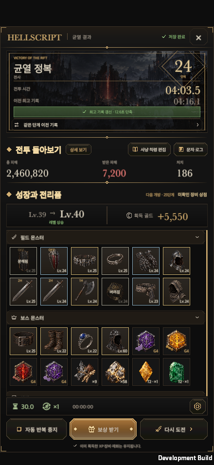
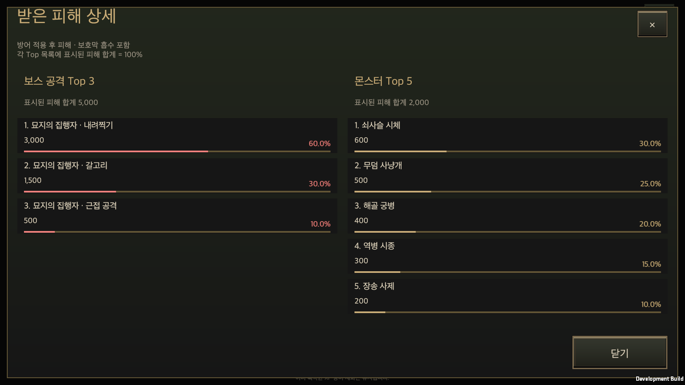
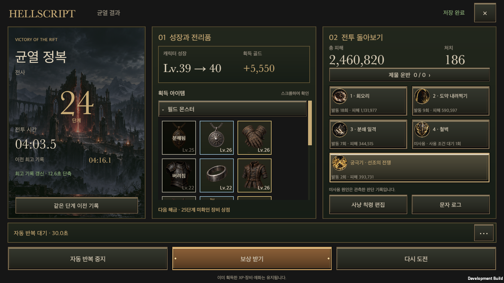

# 균열 승리 결과창

2026-09-28 통합 갱신: 게임 구현과 후속 수정은 [전체 워크트리 통합](All_Work_Integration_20260928.md)에 포함했다. 아래의 브랜치 단독 검증·문서만 게시한 범위 설명은 당시 이력이며, 현재 통합 상태는 이 갱신과 통합 기록을 따른다.

갱신일: 2026-09-30 · 작성일: 2026-09-27 · [English](Rift_Victory.en.md)

## 2026-09-30 배치 개편

사용자가 2026-09-30에 승인한 `Prototypes/RiftVictory` 시안의 배치를 게임의 `RiftVictoryWindow`에 옮겼다. 기능 구성은 그대로이고 배치·표시만 바뀌었다. 보상·재도전·반복 중지·귀환·칙령 편집·문자 로그는 기존 거래와 창을 그대로 사용한다. 아래 절들의 내용 가운데 배치 설명은 이 절이 대신한다.

**섹션 제목.** ‘전투 돌아보기’와 ‘성장과 전리품’은 금빛 마름모 뒤에 굵은 밝은 금색(`UiTheme.GoldBright`, `FontStyle.Bold`)으로 본문보다 크게 쓴다. 가로·PC에서는 앞의 번호(01·02)도 금색이다. 서체는 공용 `UiFonts.Body`를 유지하고 굵기만 바꿨다. 한국어 명조 계열은 플랫폼마다 설치 여부가 달라 글꼴 파일을 새로 넣어야 하므로 이번에는 쓰지 않았다.

**세로(440×956).** 위에서부터 균열 정복, 전투 돌아보기, 성장과 전리품 순이다. 전투 돌아보기 제목 옆에 ‘상세 보기’, 오른쪽에 ‘사냥 칙령 편집’·‘문자 로그’를 두고 그 아래 총 피해·받은 피해·처치를 표시한다. 성장과 전리품 제목 줄 오른쪽에는 다음 개방을, 그 아래에는 레벨과 골드를 한 줄로 묶은 카드를 둔다. 스크롤은 획득 아이템 목록에만 있고 나머지는 화면에 고정된다. 세 영역 사이에는 공통 `UiHeaderRule` 금빛 구분선을 넣었다. 하단에는 자동 반복 표시, 세 행동 버튼, 유지 안내를 고정한다. 세로 화면에서는 스킬 카드를 본문에 두지 않고 상세 보기의 탭으로 옮겼다.

**가로·PC(956×440, 1600×900, 1600×1000, 2100×900).** 네 열 배치를 쓴다. 균열 정복 | 성장과 전리품 + 전투 돌아보기 | 획득 아이템 목록 + 다음 개방 | 세로 행동 레일이다. 전투 돌아보기 열에는 스킬 2×2와 궁극기 한 줄, 그 아래 사냥 칙령 편집·문자 로그가 있다. 레일에는 위에서부터 자동 반복 표시, 보상 받기(가장 큼), 다시 도전, 자동 반복 중지(중지 후 성소 귀환)가 있다. 레일 폭은 화면 폭의 10%(88~104)다.

**스킬 카드(`RiftSkillShareView`).** 스킬 아이콘을 키우고 게이지가 아이콘 오른쪽에서 시작한다. 좁은 가로 격자는 짧은 라벨(일반·보스·HP 보호·적용량 등)을, 상세창은 긴 라벨을 쓴다. 글자를 키워도 라벨과 수치가 한 줄에 남고 그 아래 막대가 그대로 보인다. 계산은 기존 `CombatStatistics`의 대상별·역할별 집계를 읽으며 카드는 누를 수 없다.

**전투 상세(`RiftReviewDetailWindow`).** ‘상세 보기’가 여는 창이다. 신규 창 템플릿(`tools/new_content_ui.py`)으로 만들었고 `ContentWindowView`와 `EquipmentViewSource.BattleSnapshot`을 사용한다. 세로에서는 목표(예: 봉인 해제)·스킬 피해 비중·받은 피해 탭을 오간다. 가로와 PC에서는 스킬 카드가 결과 화면에 있으므로 탭 없이 목표 단계 시간과 받은 피해 Top 목록을 나란히 한 화면에 보여 준다. 956×440·100%에서 스크롤 없이 들어간다. 받은 피해 순위를 그리는 부분은 `IncomingDamageRanking`으로 옮겼고 기존 `IncomingDamageWindow`를 대체한다. 순위와 비중 계산은 그대로 `CombatStatistics.TopIncoming`이 한다.

**목표 단계 시간.** 봉인 파괴, 정수 운반자 처치, 제물 회수가 확정될 때 `RiftObjectives.RecordStep`이 그 전투 초를 `RiftLayout.objectiveSteps`에 남긴다. 결과와 전투 기록의 `RiftObjectiveRecord.steps`에 고정되어 저장·재개 뒤에도 유지된다. 표시는 ‘1 / 2 해제 시간 31.2초’ 형식이다. 관문이 처치 게이지로 먼저 열려 도달하지 못한 단계는 ‘미달성’이다. 이 기능 이전의 기록이나 재개 전에 끝난 단계는 ‘기록 없음’이며 시간을 만들어 넣지 않는다. 제물은 회수 시점을 기록하고, 제단 전달은 관문이 열린 시점으로 표시한다.

**자동 반복 표시.** 글자를 쓰지 않는다.
- 모래시계 + 다음 판까지 남은 초
- 반복 횟수 아이콘(반복 화살표 원 안에 달리는 사람) + 완료한 판 수(×3)
- 반복 세션의 실제 경과 시간 HH:MM:SS(레일은 아랫줄, 세로는 같은 줄 오른쪽)

대기가 멈춘 상태(상세창을 연 동안·중지·저장 대기)는 흐린 색으로, 조치가 필요한 상태는 금색과 기존 재시도 버튼으로 구분한다. 두 아이콘은 사용자 요청에 따라 Codex의 내장 이미지 생성으로 그린 흰 단색 PNG(`Resources/Art/RiftResult`)이며 게임이 색을 칠한다. 처음에는 달리는 사람과 반복 화살표를 따로 놓았으나, 사용자 요청으로 ‘반복 횟수’로 한눈에 읽히도록 둘을 합친 한 그림으로 바꿨다. 생성 모델은 도구가 알려 주지 않아 ‘제작 후보’로 기록했다. 텍스처가 없으면 벡터 기호로 대신 그린다. 프롬프트·원본 경로·알파 측정은 [생성 기록](../Art/RiftResult/rift-result-icons-manifest.json)에 있다. `RiftResultArtImporter`가 투명도·밉맵을 정하고 `ResourceTextureBudget`이 플랫폼별 크기를 128로 제한한다.

HTML 시안도 같은 아이콘과 배치를 사용한다. 검증 결과는 아래 [2026-09-30 검증](#2026-09-30-검증)에 적는다.

`Prototypes/RiftVictory/HELLSCRIPT-RiftVictory.html`의 구성을 실제 균열 승리 결과에 연결한다. 일반 스킬 네 칸은 2×2로, 궁극기는 그 아래 전체 폭으로 배치한다. 실패도 같은 결과창을 사용하고, 실패 원인 분석은 기존 분석 창으로 연결한다. 훈련 결과는 기존 진입점을 유지한다.

## 2026-09-30 검증

전체 Edit Mode는 `main`의 아이템 그림 작업(#41, `9a22067e`)을 합친 커밋 `47a68801`에서 실행했다. 그 뒤 `main`에 들어온 스킬 전투 미리보기 작업(5개 커밋, `ee9f9055`)을 한 번 더 합친 최종 커밋 `e3c4731c`에서는 전체 Edit Mode를 다시 돌리지 않고, 두 병합이 만나는 영역의 관련 Edit Mode 1,234개와 스모크를 다시 확인했다. Unity 6000.6.0f1 배치 모드로 작업 폴더의 사본에서 검사하고 macOS 개발 빌드를 만들었다. 스모크마다 격리된 `-hellscriptSavePath`를 사용했으며 사용자 저장은 읽거나 쓰지 않았다. 입력은 uGUI 합성 이벤트이며 실기기(iOS/Android)에서는 확인하지 않았다. 아래 화면 사진은 최종 커밋의 빌드에서 다시 찍었다. [검증 요약](RiftVictoryLayoutEvidence/validation.json)

- **전체 Edit Mode**: 커밋 `47a68801`에서 4,752개 중 4,705개 통과, 47개 실패, 0개 건너뜀. 실패 47개는 모두 기존 기준선(변경 전 `main`에서 실패하던 47개) 안에 있다. 기준선에 없는 새 실패는 0개다.
- **관련 Edit Mode**: 커밋 `47a54f24`에서 190개, `9ada7d88`에서 리소스 예산·번역·버튼·결과 기록 74개 모두 통과. 번역 표·저장 로그 번역(`CombatJournalTests`·`StoredLocalizationTests`)·리소스 예산·목표 진행·봉인·결과 기록 검사를 포함한다. 새 검사 4개는 봉인·정수 운반자·제물의 단계 시간과, 이전 기록·재개된 판에서 시간을 만들지 않는 것을 확인한다.
- **최종 커밋 `e3c4731c`의 관련 Edit Mode**: 1,234개 중 1,227개 통과, 7개 실패(모두 기존 기준선 안, 새 실패 0개). 이 작업이 바꾼 영역(번역·리소스 예산·목표 진행·봉인·결과 기록·유휴 사냥 상태)과 두 번째 병합이 건드린 영역(스킬 프리셋·미리보기·칙령 대응·클래스 스킬·균열 흐름·월드 효과·저장 복원)을 함께 덮는다. 전체 Edit Mode는 이 병합 뒤에는 다시 돌리지 않았다.
- **공통 UI 계약**: `check_ui_contract.py` 통과, `test_ui_contract.py` 11개 통과.
- **균열 결과 스모크**(`-hellscriptRiftVictorySmoke`): 승리·재실행·유틸리티 스킬·실패 네 가지 모두 통과. 5개 화면비 × 한국어·영어 × 100·120% = 20개 배치마다 세로 쌓기·가로 네 열·세로 행동 레일, 구분선 2개, 반복 표시가 아이콘과 숫자만 쓰는지(HH:MM:SS 포함), 글자 잘림·번역 누락·안전 영역을 검사했다. 전투 상세도 20개 배치에서 목표 단계 시간, 보스 Top 3·몬스터 Top 5와 비중, 세로 탭 전환, 가로·PC의 탭 없는 배치, 956×440·100%에서 스크롤이 없는지를 확인했다. 전리품 스크롤·출처 접기, 분해·버림 아이템의 공통 상세, 반복 중지 → 성소 귀환(카운트다운이 ‘—’로 바뀜), 보상·사냥 칙령·문자 로그, 저장 실패 복구와 별도 프로세스 재실행도 통과했다. [승리](RiftVictoryLayoutEvidence/victory-runtime.txt) · [유틸리티](RiftVictoryLayoutEvidence/utility-runtime.txt) · [실패](RiftVictoryLayoutEvidence/defeat-runtime.txt) · [재실행](RiftVictoryLayoutEvidence/restart.txt)
- **최종 커밋의 스모크**: 승리·재실행·패배와 `main`의 아이템 그림 스모크(20개 배치, 세트 상세 6개, 지갑 3개, 보조 화면), 스킬 전투 미리보기 스모크가 통과했다. 유틸리티 스킬 스모크는 이 묶음에서 한 번 실패했다. 세로 440×956·한국어·120%에서 ‘상세 보기’ 버튼 글자 높이 21.17이 허용치(20+1)를 넘었고, 글자가 두 줄로 접혀 ‘상세’만 보였다. 같은 빌드로 다시 실행한 5번(유휴 2번, 인위적 CPU 부하 3번)은 모두 통과해 재현하지 못했다. 글자 폭을 재는 시점에 따라 달라지는 간헐 문제로 보이며 원인은 확인하지 못했다.
- **목표·관문 스모크**: `-hellscriptObjectiveSmoke`, `-hellscriptChainSmoke`(정수 운반자·제물), `-hellscriptGateSmoke` 네 개가 실패한다. 변경 전 `main`(a6612e09) 빌드에서도 같은 예외로 실패한다. 새 계정 픽스처가 필수 튜토리얼 지도로 시작해 목표 코드에 닿기 전에 멈추므로, 이 스모크들은 단계 시간 기록을 검증하지 못한다. 단계 시간은 위 Edit Mode 검사와 균열 결과 스모크의 픽스처로 확인했다.
- 자연 플레이로 균열을 끝까지 진행해 결과창에 도달하는 과정은 이번에 돌리지 않았다(스모크는 실제 지급·완료 경로를 쓰는 픽스처다).

[세로 영어 120%](RiftVictoryLayoutEvidence/layout-440x956-en-120.png) · [가로](RiftVictoryLayoutEvidence/layout-956x440-ko-100.png) · [가로 영어 120%](RiftVictoryLayoutEvidence/layout-956x440-en-120.png) · [PC](RiftVictoryLayoutEvidence/layout-1600x900-ko-100.png) · [21:9 영어 120%](RiftVictoryLayoutEvidence/layout-2100x900-en-120.png) · [가로 전투 상세](RiftVictoryLayoutEvidence/details-956x440-ko-100.png) · [PC 전투 상세](RiftVictoryLayoutEvidence/details-1600x900-en-120.png) · [세로 봉인 탭](RiftVictoryLayoutEvidence/details-objective-440x956-ko-100.png) · [세로 스킬 탭](RiftVictoryLayoutEvidence/details-skills-440x956-ko-100.png) · [세로 받은 피해 탭](RiftVictoryLayoutEvidence/details-incoming-440x956-en-120.png) · [유틸리티 스킬](RiftVictoryLayoutEvidence/utility-956x440-en-120.png) · [실패](RiftVictoryLayoutEvidence/defeat-1600x900-ko-100.png)

## 게시 범위와 구현 상태

**게임 구현은 작업 브랜치에서 검증을 마쳤으며, 게임 코드의 `main` 병합은 대기 중이다.** 이 문서의 화면·동작·검증 결과는 [구현 커밋 `1acade60`](https://github.com/dakrdong/HELLSCRIPT/commit/1acade602665ee46f62b4bb95ca90bcbe3920a4f)의 상태를 설명한다. 현재 `main` 게임에 이미 적용됐다는 뜻은 아니다.

사용자의 공개 위키 게시 요청에 따라 한국어·영어 문서, 문서 이력과 검증 자료만 `main`에 반영한다. 공개 위키의 게임 DB·공통 UI 계약·`sources/Assets/`는 병합된 `main` 기준을 유지한다. 아래에서 설명하는 새 창과 전투 집계는 작업 브랜치의 구현이며, 공개 DB의 현행 기능으로 간주하지 않는다. 다른 스레드의 변경과 진행 중인 3D 작업은 포함하지 않는다.

## 배치와 공통 부품

`GameUI.ShowResult`가 완료된 일반 균열의 승리와 실패를 `RiftVictoryWindow`로 전달한다. 창 생성기에서 시작한 `ContentWindowView` 어댑터이며 `EquipmentViewSource.RewardSnapshot`을 사용한다. 가로와 PC에서는 정복 기록·성장과 전리품·전투 돌아보기를 나란히, 세로에서는 위아래로 배치한다. 본문 전체를 밀어 올리지 않도록 전리품 영역만 독립적으로 스크롤한다. 자동 반복 안내와 세 행동 버튼은 하단에 고정한다.

성소 원화, 장비·보석·룬·스킬 리소스를 그대로 사용한다. 새로운 래스터 이미지나 개별 폰트를 만들지 않는다. `UiTheme`, `UiFonts`, `EquipmentSlotView`, `ItemDetailView`, `SkillIconView`, `JewelerArt`, `RuneV13Art`와 공통 버튼을 사용한다. 슬롯 크기와 간격은 공통 기준을 유지하고 너비에 따라 열 수를 줄인다. 제목과 수치의 명암·서체는 HTML의 위계를 따르며, 큰 장식 수치는 고정 크기를 유지하고 읽기 배율은 설명과 버튼에 적용한다.

이 화면은 진행 중 전투를 가리는 모달이 아니라 완료 결과 페이지다. `ContentWindowHost`에서 결과 페이지만 `blocksGameplay:false`로 등록한다. 정렬·배경 입력 차단·뒤로가기는 공통 창 관리자가 계속 처리하고, 중첩된 아이템·보상·비교 창은 기본 차단을 유지한다. 따라서 결과를 보는 동안 자동 반복은 진행되지만 상세창에서는 대기가 멈춘다.

## 획득 기록의 소유

| 내용 | 기록 시점과 소유자 |
| --- | --- |
| 장비 출처 | `CombatSimulation.DropFrom`의 몬스터·보스 경로와 `ChestRewards.Apply`의 실제 상자 지급 경로에서 `DropState.source`를 기록한다. |
| 룬 | `RuneGrowth.GrantMonster`·`GrantVictory`가 실제 지급한 `OwnedRune` 사본을 출처와 함께 `RunState.runeDrops`에 보존한다. 기존 지급 영수증과 난수 소비는 유지한다. |
| 보석·재료·강화석 | `RiftResourceDrop.source`와 기존 지급·수거 상태를 읽는다. 골드는 성장 요약에서 합계를 표시한다. |
| 분해·버림·판매 | 성공한 `Economy` 소비 또는 가방 교체에서 해당 판의 아이템 ID를 찾아 처리 상태만 갱신한다. 실패한 보호 검사·저장은 처리 상태도 바꾸지 않는다. |
| 자동 창고 이동 | 성공한 `EdictCleanupPolicy` 실행에서 창고 보관 상태를 남긴다. |
| 저장과 재개 | `GameStore`는 성공한 거래의 처리 상태를 실제 전투 객체에 동기화한다. `pendingResult`와 결과 요약에 보존하며, 이전 판의 상태는 바꾸지 않는다. |

장비를 줍는 데 성공하면 획득 기록과 소유 인벤토리의 객체를 분리한다. 이후 장착·강화가 획득 당시의 표시를 바꾸지 않도록 한다.

아이템은 필드 몬스터·보스 몬스터·상자·오브젝트의 접을 수 있는 그룹에 표시한다. 분해되거나 버려진 장비도 원래 그룹과 슬롯에 남고, 어두운 반투명 덮개에 상태 문구를 표시한다. 모든 슬롯은 인벤토리와 같은 `ItemDetailPopup` 창틀을 연다. 제목·닫기·옵션 범위 버튼·고정 하단·스크롤 본문을 공유하며, 장비 카드는 `ItemDetailView`가 능력치·옵션·고유 효과를 표시한다. 결과창 전용 요약 팝업은 만들지 않는다. 하단 높이와 행동 배치도 `ItemDetailPopup.SetFooter`가 계산한다. 균열은 출처·상태·동작만 전달하며, 보관된 아이템의 출처와 닫기를 한 줄에 놓는다. 처리 안내가 필요한 경우에만 설명 높이를 추가한다. 인벤토리의 잠금·장착·비교 역시 같은 하단 배치를 사용한다. 분해·버림 상태도 같은 획득 스냅샷을 읽으며 회수·장착을 실행하지 않는다. 보석은 `GemCatalog`의 부위별 효과와 수량을, 룬은 실제 계열·등급·모양을 표시한다. 실제 드롭이 없는 오브젝트 그룹에는 빈 상태를 표시하며 예시 아이템을 게임 보상으로 만들지 않는다.

기존 저장에 출처나 처리 결과가 없으면 `Unknown`을 유지한다. 출처를 위치·이름·현재 인벤토리로 추측하지 않고 ‘출처 기록 없음’으로 분리한다. 기존 전투 로그 보관 파일과 전송 바이트를 다시 작성하지 않는다. 사후 정리 상태의 현재 표시 근거는 계정에 저장된 결과와 `pendingResult`다.

## 전투 시간과 스킬

입장 화면의 실제 시간 최고 기록은 그대로 유지한다. 승리창은 별도의 `RiftEntryProgress.combatBest`에 전투 시간을 저장한다. 입장 시 이전 최고 기록을 `RiftCombatRecord`에 고정하고 정상 완료 시에만 갱신한다. 화면 표기와 단축 계산은 같은 0.1초 단위를 사용한다. 최초 기록·최고 기록 갱신과 단축 시간·이전 최고 기록 유지·기록 부족 상태를 구분한다. 중복 완료, 실패와 전리품 정리 중 귀환은 최고 기록을 갱신하지 않는다.

새 필드가 없는 저장은 같은 캐릭터·같은 단계의 남아 있는 승리 기록에서 비교 기준을 찾는다. 전체 과거 기록이 없는 기존 클리어를 최초 기록으로 표시하지 않는다. 첫 비교 기준은 보존된 기록 범위에 한정된다.

스킬은 현재 편집 설정 대신 해당 전투의 `RunState.build`에 저장된 일반 네 칸과 궁극기 칸을 읽는다. `CombatStatistics`의 실제 발동 횟수와 사용 여부를 표시한다. 카드는 클릭 동작이 없는 정보 영역이며 일반 몬스터와 보스 몬스터에게 준 피해 비중을 각각 표시한다. 미사용 판단의 자세한 기록은 기존 전투 기록에 유지한다. 미장착 칸도 위치를 유지한다. 상세 기록에는 기본 공격·패시브·장비 효과 등 나머지 집계가 그대로 남는다.

비중의 분모는 각 대상 분류에 준 전체 최종 피해다. 일반 몬스터에는 보스가 아닌 정예·소환 몬스터도 포함된다. 기본 공격·패시브·장비 효과는 분모에 포함하고 스킬 자체의 추가·지속 피해는 해당 스킬에 합산한다. 피해 이벤트를 만드는 시점에 대상의 보스 여부를 기록하므로 최근 2,000개 이벤트가 삭제되어도 누적 수치가 유지된다. `CombatTelemetry` 4판은 대상별 피해, 회복·보호 누계와 받은 피해의 출처별 누계를 저장·복원한다. 해당 분류에 피해가 없으면 0%, 분류 정보가 없는 이전 기록은 ‘기록 없음’을 표시하며 과거 피해를 추정하지 않는다.

회복·방어 등 유틸리티 스킬은 `ClassSkills.json`의 표시 역할을 읽는다. HP 회복은 해당 스킬의 실제 HP 회복량 / 모든 출처의 HP 회복량, MP 회복은 실제 자원 회복량 / 모든 출처의 자원 회복량, HP 보호는 해당 스킬로 방지·흡수한 피해 / 모든 출처에서 방지·흡수한 피해를 표시한다. 일반 공격·자연 재생·물약·장비·패시브도 해당 분모에 포함한다. 회복 상한을 넘긴 양과 아직 소비되지 않은 보호막은 집계하지 않는다. 피해와 회복이 함께 있는 스킬은 주 역할을 표시하며, 도발의 낙인은 HP 보호와 MP 회복 비중을 각각 표시한다. 단일 회복·보호 역할은 두 번째 줄에 실제 적용량을 표시한다. 이동기는 실제 이동 거리, 표식은 효과 적용 횟수를 표시한다.

HP 보호는 실제 피해 처리 순서에 맞춰 기본 방어, 직업 피해 감소, 도약 방어, 방어 성공, 소비된 보호막으로 나눠 중복 없이 누적한다. 직업 피해 감소가 여러 개면 실제 적용된 감소량을 각 효과의 비율로 배분하고 공통 상한을 지킨다. 추가 방어 확률로 성공한 판정만 해당 스킬에 귀속하며 난수를 추가로 소비하지 않는다. 회피와 완벽한 방어도 전체 보호량의 분모에 포함한다. 보호량은 방지한 공격 피해량이며 남은 HP를 상한으로 둔 생존 효과 추정치가 아니다. 전투 효과 이벤트 보관 한도와 별개로 누계는 계속 유지된다. 이전 집계에는 없는 수치를 재구성하지 않고 ‘기록 없음’으로 표시한다.

문자 로그는 `CombatLogWindow`가 `ContentWindowView`와 `EquipmentViewSource.BattleSnapshot`을 사용하는 공통 모달이다. `GameStore.ReadCombatRecord`로 읽은 보관 기록을 시간·본문 행으로 표시하고 본문만 스크롤한다. 100줄 단위 페이지 이동과 고정 하단의 ‘닫기’를 제공한다. ‘전투 요약으로’ 동작은 제거했다. 원래 결과창을 아래에 유지하므로 닫으면 같은 결과로 돌아오며, 로그 열람은 계정·장비·보상 상태를 변경하지 않는다. 모달을 읽는 동안 자동 반복 대기는 멈춘다. 보관 파일을 읽지 못한 경우에는 기존 저장 요약·문자 로그와 안내를 표시한다.

실패 시 성소 원화 위에 짙은 적색을 입히고 ‘균열 실패’ 제목, 실패 표식, 실제 종료 원인을 표시한다. 성공 기록 갱신 문구를 표시하지 않으며 기존 최고 기록을 보존한다. 중앙 행동은 ‘실패 원인 분석’으로 바뀌고 기존 분석 화면을 연다. 별도 실패 보상 거래나 새 이미지 리소스는 추가하지 않는다.

## 받은 피해와 출처 순위

‘전투 돌아보기’ 상단에 총 피해·받은 피해·처치를 함께 표시한다. 받은 피해 아래의 ‘상세 보기’는 `IncomingDamageWindow`를 연다. 공통 `ContentWindowView` 창틀, 본문 스크롤, 고정 닫기를 사용하고 `EquipmentViewSource.BattleSnapshot`을 명시한다. 닫으면 아래에 유지된 같은 결과로 돌아온다.

받은 피해는 기존 전투 통계와 같은 **방어 적용 후 최종 피해**이며 보호막이 흡수한 피해도 포함한다. HP 손실량과는 다르다. 공격이 실제로 명중한 `RecordDamage`에서 출처를 기록하며, 최근 이벤트 보관 한도와 별개로 전투 전체 누계를 유지한다.

- **보스 공격 Top 3**: 보스 종류와 공격 ID를 함께 키로 사용한다. 같은 공격의 반복 명중은 합산하고, 서로 다른 공격은 분리한다. 피해가 큰 세 공격만 표시하며 **선택된 세 공격의 합계**를 100%로 삼는다.
- **몬스터 Top 5**: 일반 몬스터는 개체와 공격 종류에 관계없이 몬스터 종류별로 합산한다. 보스는 제외하며 보스가 소환한 일반 몬스터는 포함한다. 피해가 큰 다섯 종류의 이름·피해·비중을 표시하며 **선택된 다섯 종류의 합계**를 100%로 삼는다.
- 동률은 고정 ID 순서로 정렬한다. 실제 피해가 있는 행만 표시하므로 대상이 적으면 빈 순위를 채우지 않는다. 환경·출처 미확인 피해는 별도 안내하고 순위의 분모에서 제외한다.
- 4판 이전의 저장은 기존 총 피해를 보존한다. 전투 전체 출처 기록이 없으면 최근 로그로 순위를 추정하지 않고 기록 없음 안내를 표시한다. 조회·정렬·닫기는 계정과 보상을 변경하지 않는다.

## 행동과 저장 경계

- ‘자동 반복 중지’는 기존 `StopAutoRepeat`를 호출하고 같은 버튼을 ‘성소 귀환’으로 바꾼다. 중지 자체로 화면을 떠나지 않는다.
- ‘보상 받기’는 `RewardBoxesWindow`의 기존 최초 보상 거래로 연결한다. 수령 후에는 보상 상자를 확인할 수 있다. 중복 수령 규칙을 별도로 구현하지 않는다.
- ‘다시 도전’은 같은 단계의 기존 입장 검사·피로도·물약·저장 경로를 실행한다.
- 저장 실패 시 귀환·재도전·보상 행동을 막고 저장 재시도를 제공한다. 중지 후 저장을 재시도해도 자동 반복을 다시 켜지 않는다.
- ‘사냥 칙령 편집’은 기존 `HuntEdictWindow`의 스킬 칙령 편집 화면을 바로 연다. 편집하는 동안 자동 반복 대기가 멈추며 닫으면 같은 결과로 돌아온다. 저장은 기존 `HuntEdictEditSession`·`GameStore.CommitHuntEdict`가 처리하고 종료한 전투의 스킬 기록은 바꾸지 않는다.
- ‘문자 로그’와 같은 단계 비교는 저장된 기록을 읽는다. 전체 전투 상세 기록은 기존 전투 기록 창에서 확인한다. ‘첫 플레이 안내’와 중복 최초 보상 버튼은 이 결과 페이지에 두지 않는다.

## 최신 보완 검증 — 2026-09-27

최종 검사 근거는 [보완 검증 요약](RiftResultRefinementsEvidence/validation.json)에 모았다. 이전 구현 검증과 구분한다.

- 관련 Edit Mode **138개 통과**, 실패·건너뜀 0개. 회복 상한, 마나 집중의 자연 재생 분리, 보호량 중복 제외, 차단 난수, 출처별 전투 전체 누계, Top 목록별 분모, 과거 저장 호환을 포함한다. 이후 변경은 세로 배치와 검증용 슬롯 높이 검사뿐이며 macOS 빌드·화면 검사를 다시 통과했다.
- 공통 UI 소유 검사와 **9개 계약 검사**를 통과했다. 최종 macOS 개발 빌드는 컴파일 오류 0건으로 완료됐다. 연결된 Editor가 없어 배치 검증을 사용했으며 실시간 Editor Console 0건을 확인했다는 뜻은 아니다.
- 일반 승리·회복/방어 스킬 승리·실패의 각 20개 배치, 총 **60개 결과 배치**를 확인했다. 받은 피해 상세도 같은 60개 조합에서 보스 3개·몬스터 5개, 표시 목록 기준 비중, 번역·텍스트·닫기 경계를 통과했다. 문자 로그는 승리 두 구성의 **40개 조합**을 통과했다.
- 세로에서는 중복 제목과 상단 여백을 압축해 전리품 첫 슬롯 줄이 전부 보이도록 했다. 고정 행동과 스킬 2×2+궁극기는 유지한다. 전리품·로그 스크롤, 출처 접기, 공통 상세, 자동 반복, 칙령 이동과 결과 복귀도 확인했다. [승리](RiftResultRefinementsEvidence/victory-runtime.txt) · [유틸리티](RiftResultRefinementsEvidence/utility-runtime.txt) · [실패](RiftResultRefinementsEvidence/defeat-runtime.txt)
- 별도 프로세스로 받은 피해 순위·이전 최고 기록·분해/버림 출처·반복 중지의 [저장 복원](RiftResultRefinementsEvidence/restart.txt)을 확인했다. macOS 실제 창을 활성화한 뒤 포인터·휠로 피해 상세 열기/닫기, 로그 끝까지 스크롤/닫기, 공통 아이템 상세와 닫은 뒤 단일 슬롯 테두리를 확인했다. [포인터 기록](RiftResultRefinementsEvidence/native-pointer.json)
- HTML은 331개 양언어 문구와 기존 PNG 16개로 다시 생성했고 구문 검사를 통과했다. 내장 브라우저가 로컬 URL 탐색을 거부하여 최신 HTML 렌더링은 확인하지 못했다. 다른 브라우저나 우회 경로는 사용하지 않았다.

실제 사용자 저장은 사용하지 않았다. 안전 영역과 macOS 입력 검증은 iOS/Android 실기기 검증과 구분한다. 게임 구현은 `codex/rift-result-refinements`에 커밋·푸시했다. 게임 코드의 `main` 병합과 문서의 공개 게시는 별도 범위로 관리한다.

[세로 결과](RiftResultRefinementsEvidence/result-portrait-ko-120.png) · [가로 영어 120% 유틸리티](RiftResultRefinementsEvidence/utility-landscape-en-120.png) · [실패 화면](RiftResultRefinementsEvidence/failure-pc.png) · [문자 로그](RiftResultRefinementsEvidence/log-pc.png) · [공통 아이템 상세](RiftResultRefinementsEvidence/native-pointer-common-item.png)

## 검증

최신 변경은 `codex/rift-result-refinements` 브랜치에서 검증한다. 이 브랜치는 이 대화의 균열 결과창 변경만 포함하며, 다른 스레드의 기능 브랜치와 3D 작업을 병합하지 않는다. 게임 코드의 `main` 병합은 보류하고, 이 문서와 검증 자료는 별도로 공개 위키에 게시한다. 아래 내용은 최초 구현 당시의 검증 이력이다.

2026-09-27, Unity 6000.6.0f1의 별도 작업 폴더에서 검증했다. 연결된 Editor 인스턴스가 없어 기존 프로젝트의 Unity 배치 검사와 `ProjectBuilder.BuildMac`을 사용했다. 검증 저장은 `-hellscriptSavePath`로 격리했으며 실제 사용자 저장을 읽거나 덮어쓰지 않았다.

- 공통 UI 소유 검사와 공통 UI 검사 9개를 통과했다. 공통 상세창 수정 뒤 관련 Edit Mode 검사 69개도 다시 통과했다.
- 관련 Edit Mode 검사 162개를 통과했다. 획득 스냅샷 분리 보강 후 결과·탐색 검사 23개도 통과했다. 두 실행의 중복을 제외하면 173개 검사이며 실패·건너뜀은 없다. 전체 4천여 개 검사를 모두 실행했다는 의미는 아니다. [검사 요약](RiftVictoryEvidence/validation.json)
- macOS 개발 빌드가 컴파일 오류 0건으로 완료됐다. 440×956·956×440·1600×900·1600×1000·2100×900 × 한국어·영어 × 100%·120%의 20개 배치에서 스킬 위치, 버튼 경계, 텍스트 높이와 번역 누락을 검사했다. 안전 영역은 시뮬레이션이다.
- 실제 uGUI 레이캐스트에서 최상위 버튼을 확인한 뒤 포인터·휠 이벤트를 보냈다. 전리품 스크롤과 그룹 접기, 분해·버림 아이템의 공통 상세, 중첩창 반복 대기, 중지→귀환, 보상창, 사냥 칙령 편집 화면, 문자 로그와 저장 재시도 보호를 확인했다. [실행 결과](RiftVictoryEvidence/runtime.txt)
- 별도 프로세스로 재실행해 획득 출처·분해/버림 상태·이전 최고 기록·반복 중지가 보존되는 것을 확인했다. [재실행 결과](RiftVictoryEvidence/restart.txt)
- HTML도 같은 20개 배치와 297개 양언어 문구를 확인했다. 공통 상세창도 20개 조합에서 창 경계·내부 스크롤·고정 하단과 가로 넘침이 없는지 별도로 확인했다. 공통 장비 상세·보석 효과의 예시를 Unity에서 내보냈으며 별도 장비 수치 계산은 만들지 않았다.

공통 상세창에 한정한 인벤토리 검사는 다섯 비율 × 한국어·영어, 기본·150% 글자에서 카드 내용·옵션 범위·비교·잠금/해제·장착·저장 재조회를 통과했다. [공통 상세창 실행 결과](RiftVictoryEvidence/popup-result.txt)

확장 검사 전체가 통과한 것은 아니다. 기존 `ItemPolishAcceptance`는 상세·비교 10개 배치 후 드래그 취소의 계정 전체 일치 검사에서 중단됐다. `RangeAcceptance`는 인벤토리 상세·도움말·Ctrl·창고 검사 후 상점 대상이 없어 중단됐다. 이 두 실행은 전체 통과 수에 포함하지 않았고, 원인이 이번 변경 전에도 있었는지는 별도 비교하지 않았다.

macOS 앱에서도 실제 포인터로 버려진 장비의 공통 상세창, 옵션 범위 버튼과 도움말, 사냥 칙령 탭 이동·복귀를 확인했다. [포인터 조작 기록](RiftVictoryEvidence/native-pointer.json) · [공통 상세창 화면](RiftVictoryEvidence/native-common-item-detail.png)

개발용 전투 결과의 수치와 합성 입력은 일반 플레이 완주·물리적 터치·모바일 실기기 검증과 구분한다. 실제 iOS/Android 기기 검증은 수행하지 않았다. 최초 구현은 `codex/rift-victory-preview`, 후속 수정은 `codex/rift-result-refinements`에서 관리한다. 문서와 검증 자료만 `main`에 반영해 공개하며, 게임 구현의 병합은 별도 작업으로 남긴다.

[세로 결과](RiftVictoryEvidence/portrait-ko.png) · [가로 영어 120%](RiftVictoryEvidence/landscape-en-120.png) · [버린 장비 상세](RiftVictoryEvidence/discarded-detail.png) · [사냥 칙령 편집 이동](RiftVictoryEvidence/hunt-edict-tab.png)
