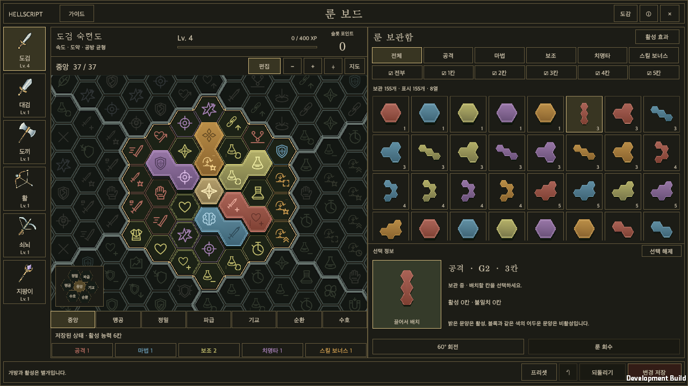

# Rune board v13 implementation

갱신일: 2026-09-22 · [한국어](Rune_V13_Implementation.md) · [Current design](../Design/HELLSCRIPT_Rune_Mastery.en.md)

## Reference and implementation

The supplied v13 package now drives the actual Unity rune content. Its six boards contain exactly 259 slots each, in seven 37-slot regions. Coordinates, abilities, values, colors and tiers come directly from the reference. This replaces the generated 427-slot boards, clear-stage unlocking and grade-as-color placement. The [original archive](../Design/RuneV13/reference-v13.zip) and [provenance](../Design/RuneV13/provenance.json) are preserved. Operational instructions embedded in the archive were treated as reference content; publication follows the repository's standing authorization.

Each weapon starts at mastery level 1 with 19 open central slots, gains six points per level and expands from the connected open frontier. Complete the current region before choosing another. The outer region's free elite center is not a new connection origin. Five independent colors connect from the shared central origin; only matching colors activate normal abilities. A mismatched slot can relay a connection, and elites accept any color. All effects apply only while the corresponding weapon category is equipped.

Existing ownership, 34 PackBound shapes, G0–G6 loot and fusion are retained. Color is independent of acquisition grade. Fusion pairs matching colors first; unmatched mixed pairs roll each color at 20%. Five presets store all weapon layouts together, referencing physical rune IDs and never creating ownership. Preset edits remain drafts until Save Changes.

The reference did not implement combat mastery rewards. The initial integration awards 5/25/100 XP for normal/elite/boss kills, multiplied by the documented stage factor. This is a tuning choice, not a verified long-term progression curve.

## Native UI and combat

The existing UGUI screen was replaced with the reference's landscape weapon rail, board and storage arrangement, and its portrait weapon row, board and storage arrangement. Portrait and landscape windows use the full shared safe-area width. Storage and ability details scroll independently while the enlarged selected-block pickup tile and actions remain fixed. The initial import extracted six supplied weapon images and 328 SVG glyphs, converting them into transparent runtime assets; no new AI-generated artwork was used. The weapon icons now use the new assets described below; the imported originals remain intact. Shared internal edges are removed to draw solid blocks and continuous region boundaries.

The screen provides pan, zoom, fit, full map, a seven-region minimap, anchored region previews, view/edit modes, color and multi-size filters, per-color active effects, searchable codex with weapon/region choices, assigned-slot navigation, rotation, recovery, 50-step undo, revert and save. Korean, English, landscape, portrait and 140% interface size are checked. Unity and browser font rendering can differ. Reference screenshots use isolated fixture ownership; real new accounts do not receive the demo's 160 runes.

Conditional bonuses are consumed by existing combat paths: direct/basic/elite/area/multi-target damage, shielded damage, outgoing control duration, additional basic resource, potion cooldown and post-mobility protection. Skill radius, duration, target count and cooldown modifiers reach their actual skill execution. Direct damage excludes periodic, thorn and triggered hits. Multi-target damage requires three distinct enemies within one strike, not separate chain-lightning hops. Boss stagger does not increase with control duration; field-bound slows retain their existing exit/expiry rules. Exposed Weakness uses the reference's four seconds and 10%; Cascade uses 30% of the attack basis.

Changes are validated on a copy and applied to combat only after persistence succeeds. Loading a preset validates all layouts atomically. Missing runes are not duplicated and partial layouts are not accepted. Existing attack snapshots, actions, cooldowns, health and resources retain their preservation rules. Migration keeps owned IDs, grades, shapes, counts and pending fusion results, preserves previously earned region access, keeps legal placements and returns others to storage. Original layouts and presets remain archived in `legacyV1`.

## Verification

The [initial full run](RuneV13Evidence/editmode-initial-full.xml) passed 2,743 of 2,746 tests. Three failures were addressed: missing CanvasRenderer declarations, three missing translations and a test fixture that incorrectly assumed every ability could be reached using single-hex paths alone. Both the [affected regression run](RuneV13Evidence/editmode-fixed.xml) and [final affected run](RuneV13Evidence/editmode-final-focused.xml) passed **146/146**. These are separate runs, not additive coverage.

The **full rerun passed 2,747/2,747** ([report](RuneV13Evidence/editmode-full.xml)). After merging the latest main HUD and hunt-edict changes, **342/342 affected tests passed** ([integration report](RuneV13Evidence/editmode-merged.xml)). The merged macOS build and native workflow, including 14 screenshots, also passed. The full pre-integration run and post-integration affected run are separate scopes.

The [macOS development build](RuneV13Evidence/build.txt) and [native workflow](RuneV13Evidence/result.txt) passed. The workflow covers placement/save, cross-weapon recovery, slot-point draft/save, five preset drafts/file reload/load, undo, per-color effects and codex search/weapon/region choices. Korean, English and large text produced zero missing translations. After the last minimap sizing adjustment, the build and native workflow were repeated.

[Separate desktop input verification](RuneV13Evidence/manual-desktop.txt) used the actual game window: opening the content dock, switching weapons and selecting/recovering a rune by mouse changed storage 155→156 and active slots 6→5. Undo restored both; all five saved presets were visible. The [asset reproduction check](RuneV13Evidence/import-validation.txt) confirmed identical regenerated content and metadata. [RGBA and transparent-pixel validation](RuneV13Evidence/art-validation.json) also passed. [Source hashes](RuneV13Evidence/source-hashes.json) identify the verified files.

[Landscape](RuneV13Evidence/02-reference-landscape-ko.png) · [Portrait](RuneV13Evidence/04-reference-portrait-ko.png) · [English](RuneV13Evidence/08-reference-landscape-en.png) · [140% text](RuneV13Evidence/10-large-type-portrait-ko.png) · [Presets](RuneV13Evidence/03-global-presets-ko.png) · [Region preview](RuneV13Evidence/06-region-dialog-ko.png) · [Codex](RuneV13Evidence/12-codex-search-ko.png)

Native UI automation invokes UGUI buttons and pointer events. It is distinct from physical input testing. Physical mobile touch/pinch behavior, device performance, long-term progression and all equipment combinations are outside this macOS verification scope.

## 2026-09-20: Pointer-following drag and storage recovery

A dragged rune now follows the grabbed point immediately for mouse input. Pickup identifies the piece at the press position. The moving visual is rendered above the entire rune screen, outside the board mask, so it remains visible over storage. A separate snapped preview shows the prospective board placement.

Dropping a placed rune over storage uses the existing recovery operation, preserving ownership and instance IDs while supporting Undo and explicit Save. Recovery that disconnects other pieces retains the existing refusal rule. Invalid drops or cancellation keep the original placement. Switching weapons or closing the screen removes the floating visual. Stored runes also follow the pointer; dropping them back over storage leaves them stored.

The [focused Edit Mode run](RuneV13Evidence/Drag/editmode.xml) passed **69/69**. The [macOS build](RuneV13Evidence/Drag/build.txt) and [landscape/portrait runtime checks](RuneV13Evidence/Drag/runtime.txt) passed. Checks cover subpixel grabbed-point alignment, visibility over storage, recovery, Undo, save/disk reload, replacement, invalid drops and cancellation. A separate check queues mouse press, held movement and release states through the actual InputSystem UI input module and verifies recovery and Undo. These are automated input checks, not evidence of human mouse dragging or physical mobile testing. The [scope and source hashes](RuneV13Evidence/Drag/validation.json) are preserved.

[Landscape drag](RuneV13Evidence/Drag/01-drag-over-storage-landscape.png) · [Portrait drag](RuneV13Evidence/Drag/02-drag-over-storage-portrait.png) · [Recovery through the input module](RuneV13Evidence/Drag/03-input-module-recovered.png)

## 2026-09-20: Clarity, rotation and detail pickup

Landscape now divides the area after the weapon rail equally between board and storage. Portrait retains its stacked layout. The selected block has a pickup tile up to 128 UI units wide, with an enlarged block, a bright closed border and the existing localized “Drag to arrange” label. Both stored and placed runes can be dragged from this tile.

A rune's 60-degree rotation is shared by its inventory card, detail, lifted visual and placement. Stored preview orientations survive selection and weapon changes within the editing session. The picked point is scaled from the source preview to the lifted block. Dragging a placed rune from its detail hides its original board visual, recovers it on storage drop, and retains its placement on invalid drop. Undo and explicit Save Changes preserve the ownership boundary. Saved board rotations persist on disk; unplaced preview rotations remain session state.

The shared central origin is rendered as a permanent gold single-cell block, with a raised face and dark sides. It remains the common start for all five colors and is neither owned nor recoverable nor available for placement.

Clipped outer `Outline` effects caused missing or doubled edges. The [closed inset frame](../../Assets/HELLSCRIPT/Runtime/Presentation/UIRectBorder.cs) draws all four sides inside each control. Rune panels, filters, inventory slots, details, dialogs and shared UI buttons use it. Circular seals and minimap markers keep their shapes; separately skinned inventory UI retains its complete slot artwork. The shared canvas uses pixel alignment.

Six weapon icons were redrawn as original SVG geometry with distinct silhouettes, silver edges and gold fittings, then rendered to uncompressed 512×512 transparent PNGs without mipmaps, fading masks or cropped UVs. See [sword](../Design/RuneV13/weapons-clear/sword.svg) · [greatsword](../Design/RuneV13/weapons-clear/greatsword.svg) · [axe](../Design/RuneV13/weapons-clear/axe.svg) · [bow](../Design/RuneV13/weapons-clear/bow.svg) · [crossbow](../Design/RuneV13/weapons-clear/crossbow.svg) · [staff](../Design/RuneV13/weapons-clear/staff.svg), [renderer](../../tools/runes/render_weapons.cjs) and [six-icon RGBA report](../Design/RuneV13/weapons-clear/validation.json). Imported reference art remains intact. No AI-generated raster assets were used.

The connected Unity GameView also had low-resolution aspect ratios enabled. Disabling that local preference increased the same window's render target from 907×763 to 1814×1526. The [editor record](RuneV13Evidence/Clarity/editor-display.txt) distinguishes this preview setting from runtime and serialized project settings.

Evidence: [focused Edit Mode: 102/102 passed](RuneV13Evidence/Clarity/editmode.xml), [macOS development build](RuneV13Evidence/Clarity/build.txt), [clarity/rotation/detail input](RuneV13Evidence/Clarity/runtime.txt), [existing drag regression](RuneV13Evidence/Clarity/drag-runtime.txt), and [source hashes and scope](RuneV13Evidence/Clarity/validation.json). The actual UI input module receives mouse press, held movement and release to verify rotated pickup from both sources, placement, recovery, undo and disk reload. This is automated macOS input evidence, not physical mouse or mobile-device verification.

[Rotated detail pickup](RuneV13Evidence/Clarity/02-rotated-detail-drag.png) · [Portrait](RuneV13Evidence/Clarity/03-clear-portrait-ko.png) · [English](RuneV13Evidence/Clarity/05-clear-landscape-en.png) · [140% type](RuneV13Evidence/Clarity/07-clear-large-type-ko.png)

## 2026-09-22: Full-width portrait window

Removed the 480 UI-unit width cap from portrait rune windows. Both phone-sized and wider portrait windows now fill the usable width supplied by `UiSafeArea`, respecting device insets and any selected display aspect ratio.

The specialized hex board and storage layout remains in its existing `GameUI.Runes` adapter, using the shared `UiSafeArea`, `UiFonts` and button components. Only the width calculation changed. Landscape retains equal board/storage widths, and placement editing and persistence keep their existing owners.

Focused Edit Mode tests passed **145/145**. The [native macOS run](RuneV13Evidence/PortraitWidth/runtime.txt) verified rotation, detail pickup, placement, storage return, undo and save/reload. **24 combinations** cover 440×956, 956×440, 960×1440, 1920×1080, 1920×1200 and 2520×1080, Korean/English and 100%/140% reading size. Every window matches its safe-area width and keeps close/save/undo/revert within that area. Evidence includes [measured widths](RuneV13Evidence/PortraitWidth/window-widths.tsv), [scope and source hashes](RuneV13Evidence/PortraitWidth/validation.json), [Edit Mode results](RuneV13Evidence/PortraitWidth/editmode.xml) and [build results](RuneV13Evidence/PortraitWidth/build.txt). This is automated native macOS input verification, not physical-mobile testing.

[Portrait 440×956](RuneV13Evidence/PortraitWidth/portrait-ko.png) · [Wide portrait 960×1440](RuneV13Evidence/PortraitWidth/wide-portrait-ko.png) · [Landscape 956×440](RuneV13Evidence/PortraitWidth/landscape-ko.png) · [PC 16:9](RuneV13Evidence/PortraitWidth/pc-16-9-ko.png) · [PC 16:10](RuneV13Evidence/PortraitWidth/pc-16-10-ko.png) · [PC 21:9](RuneV13Evidence/PortraitWidth/pc-21-9-ko.png) · [Korean 140%](RuneV13Evidence/PortraitWidth/portrait-ko-large.png) · [English 140%](RuneV13Evidence/PortraitWidth/portrait-en-large.png)

## Maintenance

[Runtime reference data](../../Assets/HELLSCRIPT/Resources/Runes/V13/catalog.json) is checked against the [Unity export](Rune_Mastery_Catalog.json) and wiki databases. The [importer](../../tools/runes/import_v13.py) checks the supplied archive hash without executing embedded scripts. The [art converter](../../tools/runes/render_v13.cjs) regenerates assets from supplied SVGs and images.

Separate modules own [progression](../../Assets/HELLSCRIPT/Runtime/Core/RuneMasteryProgress.cs), [placement rules](../../Assets/HELLSCRIPT/Runtime/Runes/RuneV13Validation.cs), [combat bonuses](../../Assets/HELLSCRIPT/Runtime/Core/RuneCombatBonuses.cs), [UI](../../Assets/HELLSCRIPT/Runtime/Presentation/GameUI.Runes.cs) and [native verification](../../Assets/HELLSCRIPT/Runtime/Presentation/RuntimeRuneV13Smoke.cs). Older smoke harnesses and reports remain historical evidence and are not presented as validation of v13.
