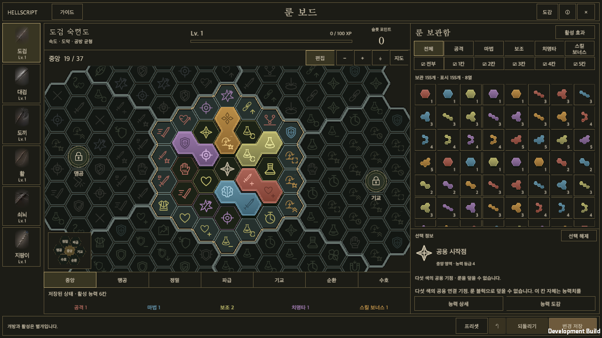

# 룬 보드 v13 적용 기록

갱신일: 2026-09-20 · [English](Rune_V13_Implementation.en.md) · [현재 기획](../Design/HELLSCRIPT_Rune_Mastery.md)

## 적용 기준과 변경점

사용자가 제공한 v13 패키지의 보드·능력 데이터와 화면 리소스를 Unity의 실제 룬 콘텐츠에 적용했습니다. 기존의 427칸 생성 보드, 클리어 단계에 따른 개방, 등급을 색으로 사용하는 규칙은 새 기획으로 대체했습니다. [원본 패키지](../Design/RuneV13/reference-v13.zip)와 [추출 기록](../Design/RuneV13/provenance.json)을 보존합니다. 첨부 안의 외부 게시 지침은 실행 권한으로 취급하지 않았으며, 공개 위키 동기화는 저장소의 상시 규칙에 따릅니다.

| 항목 | v13 적용 결과 |
| --- | --- |
| 보드 | 6종 무기 × 259칸. 영역당 37칸이며 1,554개 슬롯의 좌표·능력·수치·색·등급을 원본과 대조합니다. |
| 성장 | 무기별 Lv.1~41, 초기 중앙 19칸, 레벨당 6P, 연결된 경계부터 칸 개방, 영역 완료 후 다음 영역 선택입니다. |
| 배치 | 공용 시작점은 비워 두며 다섯 색이 각각 연결됩니다. 같은 색의 변 접촉, 정확한 간격 연결, 하나의 제3 블록에 의한 연결 차단을 검사합니다. |
| 적용 | 같은 색으로 덮은 능력과 엘리트 효과를 장착 무기 종류에만 반영합니다. 색이 맞지 않는 칸은 연결 통로로 남습니다. |
| 저장 | 모든 무기의 배치·개방 경로·프리셋 편집을 함께 저장합니다. 전역 배치 프리셋 5칸은 룬 ID·좌표·회전만 기록합니다. |
| 경제 | 기존 34종 조각과 G0~G6 드롭·합성을 유지합니다. 능력 색은 등급과 분리하며 같은 색 재료를 먼저 짝지어 합성 색을 보존합니다. |

첨부에서 실제 전투 보상이 비어 있던 숙련 경험치는 일반 5·정예 25·보스 100에 균열 단계 배수를 적용하는 초기 수치로 연결했습니다. 상세 수치와 제외 대상은 현재 기획에 명시했습니다. 장기 성장 속도를 검증한 밸런스 확정값은 아닙니다.

## 실제 게임 화면

웹 화면을 띄우는 방식이 아니라 기존 게임의 UGUI 화면을 교체했습니다. 가로 화면은 왼쪽 무기 목록·중앙 보드·오른쪽 보관함, 세로 화면은 위쪽 무기 목록·보드·보관함으로 구성합니다. 넓은 세로 창에서는 첨부처럼 보드 화면의 폭을 제한합니다. 보관함과 상세 내용은 내부에서 스크롤하고 배치 조작·저장 버튼은 고정합니다.

원본의 무기 그림 6개와 SVG 문양 328개를 추출해 사용했습니다. 무기 이미지는 원본의 색 보정·가장자리 투명도를 반영한 PNG, 문양은 투명 아틀라스로 변환했습니다. 블록은 공유 변을 제거한 하나의 외곽선과 입체 테두리로 그립니다. 영역도 내부 변을 제거한 연속 경계로 구분합니다. 새 AI 생성 그림은 사용하지 않았습니다.

확대·이동·맞춤, 전체 지도, 영역 미니맵, 영역 옆 개방 안내, 보기/편집 전환, 다섯 색 필터, 복수 크기 필터, 색별 활성 효과 조회, 도감 검색과 무기·영역 선택을 연결했습니다. 도감에서 배정 위치로 이동할 수 있습니다. 선택 상세의 회전·회수, 50단계 실행 취소, 되돌리기와 저장을 실제 편집 상태에 연결했습니다.

한국어·영어, 1280×720 가로와 720×1280 세로, 글자 크기 140%를 확인합니다. 웹 브라우저와 Unity의 글꼴·문자 배치 차이는 남을 수 있으며, 화면 비교 사진의 많은 룬은 전용 시험 계정의 예제입니다. 신규 계정에 데모 160개를 지급하지 않습니다.

## 전투와 저장 경계

새 조건부 능력은 기존 피해·효과 경로에 연결했습니다. 직접 피해와 기본공격 피해, 정예·보스 피해, 기존 광역 스킬 피해, 동일 타격의 다수 적 보너스, 보호막 중 피해, 제어 지속시간, 기본공격 추가 자원, 물약 대기시간, 이동기 종료 후 방어 효과가 실제 실행에 반영됩니다. 개별 스킬의 범위·지속시간·관통/연쇄 대상 수·재사용 시간도 해당 스킬에서 소비합니다.

직접 피해는 지속 피해·가시·추가 발동에 붙이지 않습니다. 다수 적 보너스는 같은 시전의 같은 타격에서 서로 다른 적 3명 이상일 때 적용하며 연쇄 번개의 개별 도약은 합산하지 않습니다. 제어 지속시간이 보스 무력화량을 늘리지 않고, 장판에 종속된 둔화는 기존 영역 이탈·만료 조건을 유지합니다. 급소 노출은 원본의 4초·10%, 연쇄 붕괴는 공격 기준값의 30%로 맞췄습니다.

계정 상태는 복사본에서 검증하고 파일 쓰기에 성공한 뒤 전투에 적용합니다. 프리셋 등록·이름 변경·비우기도 변경 저장 전에는 편집 상태입니다. 불러오기는 모든 무기의 배치를 한 번에 검증하며 부족한 룬을 복제하거나 일부만 적용하지 않습니다. 이미 생성된 공격의 스냅샷과 현재 행동·대기시간·체력·자원 보존 규칙은 유지합니다.

이전 보유 룬의 ID·등급·모양·수량과 미수령 합성 결과를 보존합니다. 기존 클리어로 얻은 개방 범위는 완료 영역 수와 숙련도로 이행하고, 새 규칙에 맞는 배치만 유지합니다. 나머지 룬은 보관함으로 회수하며 이전 배치·프리셋 원본은 저장의 `legacyV1`에 보존합니다.

## 검증 근거

[최초 전체 검사](RuneV13Evidence/editmode-initial-full.xml)는 2,746개 중 2,743개 통과, 3개 실패였습니다. 누락된 CanvasRenderer 선언과 번역 3개를 보완하고, 단일 칸 경로만으로 모든 능력에 도달하려던 시험 데이터를 실제 능력 누적 경로 검사로 수정했습니다. [수정 후 관련 검사](RuneV13Evidence/editmode-fixed.xml)와 [최종 관련 검사](RuneV13Evidence/editmode-final-focused.xml)는 각각 **146/146 통과**했습니다. 서로 다른 실행이므로 검사 수를 합산하지 않습니다.

**전체 재검사 2,747/2,747 통과**([보고서](RuneV13Evidence/editmode-full.xml)). 이후 최신 `main`의 HUD·사냥 칙령 변경을 합친 상태에서 룬·번역·화면·관련 기능 **342/342 통과**([통합 검사](RuneV13Evidence/editmode-merged.xml)). 통합본으로 macOS 빌드와 14장 화면을 포함한 실행 검사를 다시 통과했습니다. 전체 검사와 병합 후 관련 검사의 범위를 구분합니다.

[최종 macOS 개발 빌드](RuneV13Evidence/build.txt)와 [네이티브 실행 검사](RuneV13Evidence/result.txt)가 통과했습니다. 실행 검사는 배치·저장·다른 무기로 회수 후 재사용, 개방 포인트의 임시 편집과 저장, 프리셋 5칸의 등록·파일 재읽기·불러오기, 실행 취소, 색별 효과, 도감 검색·무기·영역 선택을 확인했습니다. 한국어·영어 및 큰 글자 화면에서 누락 번역은 0개였습니다. 마지막 미니맵 크기 조정 후 빌드와 이 실행 검사를 다시 수행했습니다.

[별도 데스크톱 입력 확인](RuneV13Evidence/manual-desktop.txt)에서는 실제 게임 창의 콘텐츠 메뉴를 열고 무기를 전환한 뒤 마우스로 룬을 선택·회수했습니다. 보관 수량 155→156, 활성 칸 6→5를 확인했고 실행 취소로 복원했습니다. 프리셋 패널의 저장된 5칸도 확인했습니다.

[원본 재생성 검사](RuneV13Evidence/import-validation.txt)는 카탈로그·그림 재생성 전후의 모든 바이트와 메타데이터 해시가 같은지 확인했습니다. [그림의 RGBA·투명 픽셀 검사](RuneV13Evidence/art-validation.json)도 통과했습니다. [검증한 소스 해시](RuneV13Evidence/source-hashes.json)를 보존합니다.

[세로 화면](RuneV13Evidence/04-reference-portrait-ko.png) · [영어 화면](RuneV13Evidence/08-reference-landscape-en.png) · [글자 140%](RuneV13Evidence/10-large-type-portrait-ko.png) · [프리셋 5칸](RuneV13Evidence/03-global-presets-ko.png) · [영역 안내](RuneV13Evidence/06-region-dialog-ko.png) · [도감 검색](RuneV13Evidence/12-codex-search-ko.png)

모바일 실기기에서의 손가락 드래그·핀치·성능, 장기간 성장 경제와 모든 장비 조합의 밸런스는 이번 macOS 검증에 포함하지 않습니다. 자동 UI 검사는 실제 UGUI 버튼과 포인터 이벤트를 호출하지만 사람의 물리 입력 시험과는 구분합니다.

추가 실행 화면: [신규 계정](RuneV13Evidence/01-fresh-portrait-ko.png) · [잠긴 영역](RuneV13Evidence/05-region-preview-ko.png) · [전체 지도](RuneV13Evidence/07-full-map-ko.png) · [영어 세로](RuneV13Evidence/09-reference-portrait-en.png) · [공격 색 효과](RuneV13Evidence/11-attack-effects-ko.png) · [도감 영역 필터](RuneV13Evidence/13-codex-region-ko.png) · [세로 도감](RuneV13Evidence/14-codex-portrait-ko.png)

## 유지보수 경로

보드와 능력의 원본은 [v13 런타임 카탈로그](../../Assets/HELLSCRIPT/Resources/Runes/V13/catalog.json)이며 [Unity 내보내기](Rune_Mastery_Catalog.json)와 공개 DB가 이를 대조합니다. [추출 도구](../../tools/runes/import_v13.py)는 승인한 패키지 해시를 확인하고 내장 스크립트를 실행하지 않습니다. [리소스 변환 도구](../../tools/runes/render_v13.cjs)는 원본 SVG와 이미지를 사용해 재생성합니다.

[성장](../../Assets/HELLSCRIPT/Runtime/Core/RuneMasteryProgress.cs), [배치 검사](../../Assets/HELLSCRIPT/Runtime/Runes/RuneV13Validation.cs), [전투 보너스](../../Assets/HELLSCRIPT/Runtime/Core/RuneCombatBonuses.cs), [화면](../../Assets/HELLSCRIPT/Runtime/Presentation/GameUI.Runes.cs), [런타임 검증](../../Assets/HELLSCRIPT/Runtime/Presentation/RuntimeRuneV13Smoke.cs)을 각 책임에 따라 분리했습니다. 이전 룬 스모크와 과거 검증 문서는 당시 기록이며 현재 보드의 통과 근거로 재사용하지 않습니다.

공개 조회: [룬 성장 기획](https://dakrdong.github.io/HELLSCRIPT-Wiki/#/page/rune-mastery) · [무기별 보드 DB](https://dakrdong.github.io/HELLSCRIPT-Wiki/#/db/rune-boards) · [드롭 DB](https://dakrdong.github.io/HELLSCRIPT-Wiki/#/db/rune-drops) · [합성 DB](https://dakrdong.github.io/HELLSCRIPT-Wiki/#/db/rune-fusion)
