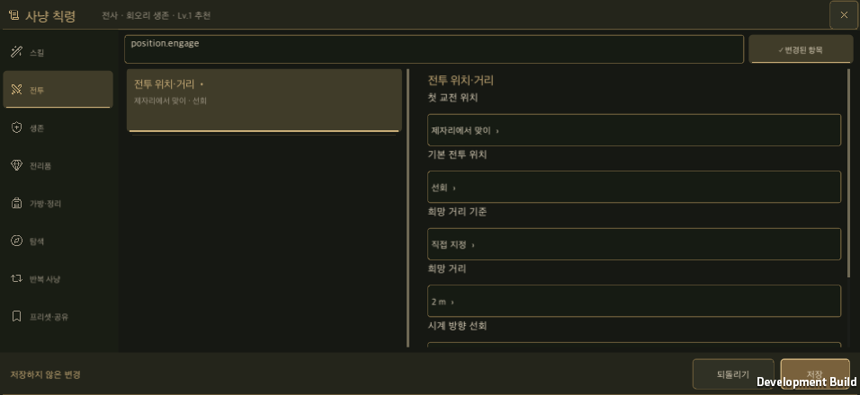
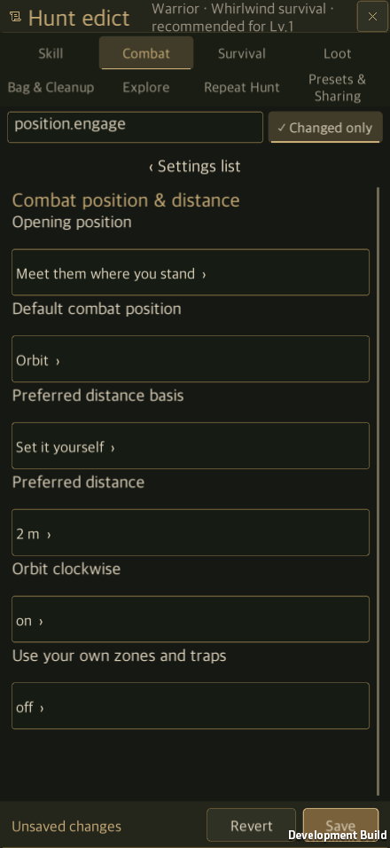

# 공통 UI 통합 검증

갱신일: 2026-09-22

완료 개발분이 합쳐진 `2a5012f`를 기준으로 공통 장비 표시·창 관리·테마를 적용하고 사냥 칙령을 재구성했다. 신규 콘텐츠도 같은 부품을 사용하도록 기본 틀, 저장소 규칙, 자동 검사를 함께 추가했다. [개발 규칙](Shared_UI_Contract.md) · [영어판](Shared_UI_Validation.en.md)

## 적용 범위

- 인벤토리·창고·상점·갬블·대장간·보석·제작·훈련의 장비 상세는 `ItemDetailView`와 기존 `ItemTooltip`을 사용한다. 비교는 기존 `ItemComparison`과 `EquipmentComparisonView`를 유지한다. 도감의 고유 장비 정의도 같은 본문 부품에 연결하되 실제 획득 수치를 만들어 넣지 않는다.
- 장비 슬롯과 캐릭터 장착 배치는 `EquipmentSlotView`·`CharacterEquipmentView`가 관리한다. 실제 소유 장비·편집본·전투 기록·도감의 출처를 구분한다. 장비 위치와 기존 저장 형식은 바꾸지 않는다.
- 테마·폰트·기본 크기와 버튼 상태를 공유한다. 창고 양쪽 보관함, 대장간 1:1:1, 룬 육각 보드 등 특수 배치는 보존한다. 기존 큰 화면에는 공통 부품의 좌표를 변환하는 어댑터를 사용한다.
- 창 관리자는 표시 순서·배경 입력·뒤로가기·중첩 일시정지 복원을 담당한다. 저장 성공 알림 후 화면을 갱신하며, 모달 편집 중인 갱신은 닫을 때까지 보류한다.
- 사냥 칙령은 분류·요약 목록·선택 편집으로 구성한다. 세로 목록 왕복 슬라이드, 검색·변경 항목 필터, 현재 값 중심의 편집, 고정 저장 영역을 제공한다. 입력 중인 숫자 팝업도 회전·언어 변경 후 유지한다. 기존 25개 묶음·130개 전역 옵션과 전투 동작은 유지한다.
- HUD·기록·지도·룬·설정은 기존 공통 능력치·아이콘·스냅샷·설정 공급자를 유지하고 공용 테마·폰트·창 관리에 연결한다. 판매·분해·장착·육각 배치의 서로 다른 유효성 검사는 해당 기능이 계속 소유한다.

진행 중인 신규 스킬 기획은 포함하지 않았다. 원본 작업 폴더의 다른 변경, 리소스 GUID, 기존 소켓·각성·걸작·투자 기록은 보존했다. 통합 전 병합 범위는 [완료 개발분 기록](Completed_Work_Integration.md)을 참고한다.

## 검사 결과

| 검사 | 결과와 범위 |
| --- | --- |
| Unity 전체 Edit Mode | **3,080개 통과, 실패 0, 건너뜀 0**. 공통 부품·거래 알림·칙령 전환을 포함한다. [XML](SharedUiEvidence/full-editmode.xml) |
| 최종 보완 후 관련 Edit Mode | **275개 통과, 실패 0, 건너뜀 0**. 공통 UI·HUD, 번역, 에디터 객체 유효성, 설정, 인벤토리·비교, 칙령 저장, 훈련을 다시 확인했다. [XML](SharedUiEvidence/final-focused-editmode.xml) |
| 신규 UI 규칙 | 현재 소스 검사와 위반 주입 검사 **9개 통과**. 하위 폴더의 새 창·별도 캔버스·독립 폰트·계정 직접 접근·누락된 공통 상세를 검사하고, 기본 틀의 파일 덮어쓰기를 막는다. |
| macOS 개발 빌드 | Unity **6000.6.0f1**, Metal 개발 앱 빌드 성공. |
| 공통 화면 | 5개 기준 비율, 공통 슬롯 크기와 대장간 동일 너비, 중첩 창의 입력·일시정지 복원. [실행 기록](SharedUiEvidence/shared-runtime.txt) |
| 사냥 칙령 | 전체 옵션 접근, 실제 선택·드래그 순서 변경, 스킬·프리셋 저장/공유/불러오기, 한국어·영어·150% 글자. [실행 기록](SharedUiEvidence/edict-runtime.txt) · [저장 영역](SharedUiEvidence/edict-actions.txt) |
| 인벤토리·상세 | 두 반지·양손·보조 장비, 보호·분해·필터 저장, 실제 포인터 드래그·길게 누르기, 공통 상세·비교. [실행 기록](SharedUiEvidence/inventory-runtime.txt) · [옵션 범위 설정](SharedUiEvidence/ranges-runtime.txt) |
| 대장간 | NPC 거리·옵션 고정·강화 묶음·슬롯 작업·즉시 완료·저장 검사. [실행 기록](SharedUiEvidence/blacksmith-runtime.txt) |
| 룬 마스터 | NPC 진입·재형성·승급·재료 보호·중복 실행 방지·드래그·회전·저장. [실행 기록](SharedUiEvidence/rune-runtime.txt) |
| 설정 | 화면 비율·글자·가시거리·언어·캐릭터 변경, 월드 미리보기와 일시정지 복원, 별도 프로세스 재실행. [실행](SharedUiEvidence/settings-runtime.txt) · [재실행](SharedUiEvidence/settings-restart.txt) |
| 훈련·재시작 | A/B의 실제 행동 차이, 빌린 장비의 소유 상태 유지, 결과·B 프리셋·룬·칙령의 별도 프로세스 복원. [실행](SharedUiEvidence/training-runtime.txt) · [재실행](SharedUiEvidence/training-restart.txt) |

전체 검사 뒤에는 팝업 입력 보존·설정 배경 복원·도감 본문 연결·공통 색상 참조와 실행 검사 선택자를 보완했다. 확대 글자의 훈련 결과 화면에서 발견한 HUD와 하단 버튼의 겹침도 수정했다. 콘텐츠 화면에서는 HUD가 예약 영역 안에 들어가도록 크기를 조정하며 전투 화면의 배치는 유지한다. 최종 관련 검사 275개가 통과했다. 두 Unity 보고서는 범위가 겹치므로 수를 합산하지 않는다. [전체 검사 당시 소스 해시](SharedUiEvidence/full-run-source.json) · [최종 소스 해시](SharedUiEvidence/final-source.json)

검증 도중 예전 버튼 이름·스크롤 객체·일시정지 방식과 타이틀 진입을 전제로 한 실행 검사를 현재 계약에 맞췄다. 훈련 검사용 룬 좌표도 현재 v13 보드에서 허용하는 좌표로 바꿨다. 게임의 저장 검사를 완화하거나 실패 결과를 통과로 바꾸지 않았다.

별도 작업 폴더의 Unity 배치 검사와 실제 macOS 앱에서 uGUI 포인터·드래그 이벤트를 실행했다. 원본 작업 폴더의 실행 중인 에디터와 사용자 저장을 검증용으로 변경하지 않았다. **모바일 실기기 터치·안전 영역·성능은 이번 검증에 포함되지 않는다.**

주요 macOS 실행·재실행 **13개 시나리오가 모두 종료 코드 0으로 통과**했다. [결과 요약](SharedUiEvidence/summary.json) · [칙령 재실행](SharedUiEvidence/shared-restart.txt) · [훈련 장착 화면](SharedUiEvidence/training-equipment.png) · [복원된 영어 결과](SharedUiEvidence/training-restored.png).

HUD를 마지막으로 보완한 뒤 공통 화면과 재시작, 설정과 재시작, 전투 HUD, 훈련과 재시작의 **관련 7개 시나리오를 다시 실행해 모두 통과**했다. 나머지 기능별 시나리오는 앞선 공통 UI 빌드에서 확인했다. [최종 실행 결과](SharedUiEvidence/final-native-results.json) · [전투 HUD](SharedUiEvidence/hud-runtime.txt). 훈련 결과는 150% 글자와 다섯 기준 비율에서 본문을 스크롤할 수 있고 하단 버튼이 HUD 위에 표시된다: [세로](SharedUiEvidence/training-restored-result-440x956.png), [가로](SharedUiEvidence/training-restored-result-956x440.png), [16:9](SharedUiEvidence/training-restored-result-1440x810.png), [16:10](SharedUiEvidence/training-restored-result-1440x900.png), [21:9](SharedUiEvidence/training-restored-result-1680x720.png).

## 기준 화면

표의 각 링크는 해당 비율의 실제 macOS 앱 화면이다. 인벤토리는 기존 고정 프레임을 중앙에 배치하고, 확장형 화면은 안전 영역을 채운다. 같은 조건의 장비 슬롯은 공통 배율과 규격을 사용한다.

| 비율 | 인벤토리 | 창고 | 상점 | 장비 강화 | 슬롯 성장 | 칙령 |
| --- | --- | --- | --- | --- | --- | --- |
| 440×956 | [↗](SharedUiEvidence/inventory-440x956.png) | [↗](SharedUiEvidence/storage-440x956.png) | [↗](SharedUiEvidence/shop-440x956.png) | [↗](SharedUiEvidence/forge-440x956.png) | [↗](SharedUiEvidence/slot-growth-440x956.png) | [↗](SharedUiEvidence/edict-440x956-ko.png) |
| 956×440 | [↗](SharedUiEvidence/inventory-956x440.png) | [↗](SharedUiEvidence/storage-956x440.png) | [↗](SharedUiEvidence/shop-956x440.png) | [↗](SharedUiEvidence/forge-956x440.png) | [↗](SharedUiEvidence/slot-growth-956x440.png) | [↗](SharedUiEvidence/edict-956x440-ko.png) |
| PC 16:9 | [↗](SharedUiEvidence/inventory-1440x810.png) | [↗](SharedUiEvidence/storage-1440x810.png) | [↗](SharedUiEvidence/shop-1440x810.png) | [↗](SharedUiEvidence/forge-1440x810.png) | [↗](SharedUiEvidence/slot-growth-1440x810.png) | [↗](SharedUiEvidence/edict-1440x810-ko.png) |
| PC 16:10 | [↗](SharedUiEvidence/inventory-1440x900.png) | [↗](SharedUiEvidence/storage-1440x900.png) | [↗](SharedUiEvidence/shop-1440x900.png) | [↗](SharedUiEvidence/forge-1440x900.png) | [↗](SharedUiEvidence/slot-growth-1440x900.png) | [↗](SharedUiEvidence/edict-1440x900-ko.png) |
| PC 21:9 | [↗](SharedUiEvidence/inventory-1680x720.png) | [↗](SharedUiEvidence/storage-1680x720.png) | [↗](SharedUiEvidence/shop-1680x720.png) | [↗](SharedUiEvidence/forge-1680x720.png) | [↗](SharedUiEvidence/slot-growth-1680x720.png) | [↗](SharedUiEvidence/edict-1680x720-ko.png) |

상세 본문 확인: [인벤토리](SharedUiEvidence/detail-inventory.png) · [창고](SharedUiEvidence/detail-storage.png) · [상점](SharedUiEvidence/detail-shop.png). 추가 상태: [칙령 요약 목록](SharedUiEvidence/edict-portrait-summary.png) · [숫자 팝업 회전·영어](SharedUiEvidence/edict-number-rotated-en.png) · [룬 세로](SharedUiEvidence/rune-portrait.png) · [룬 가로](SharedUiEvidence/rune-landscape.png).

## 이후 콘텐츠

새 UI는 `tools/new_content_ui.py`로 공통 창에서 시작한다. `AGENTS.md`와 `CLAUDE.md`가 이 경로를 필수로 지정하며, `tools/check_ui_contract.py`와 GitHub Actions가 공유 부품의 연결을 검사한다. 특수 배치를 추가할 때에도 공통 표시·입력·저장 경계를 유지하고 실제 화면을 검증한다. 자동 검사가 임의의 화면을 다시 그리거나 모든 시각 오류를 찾아주는 것은 아니다.
