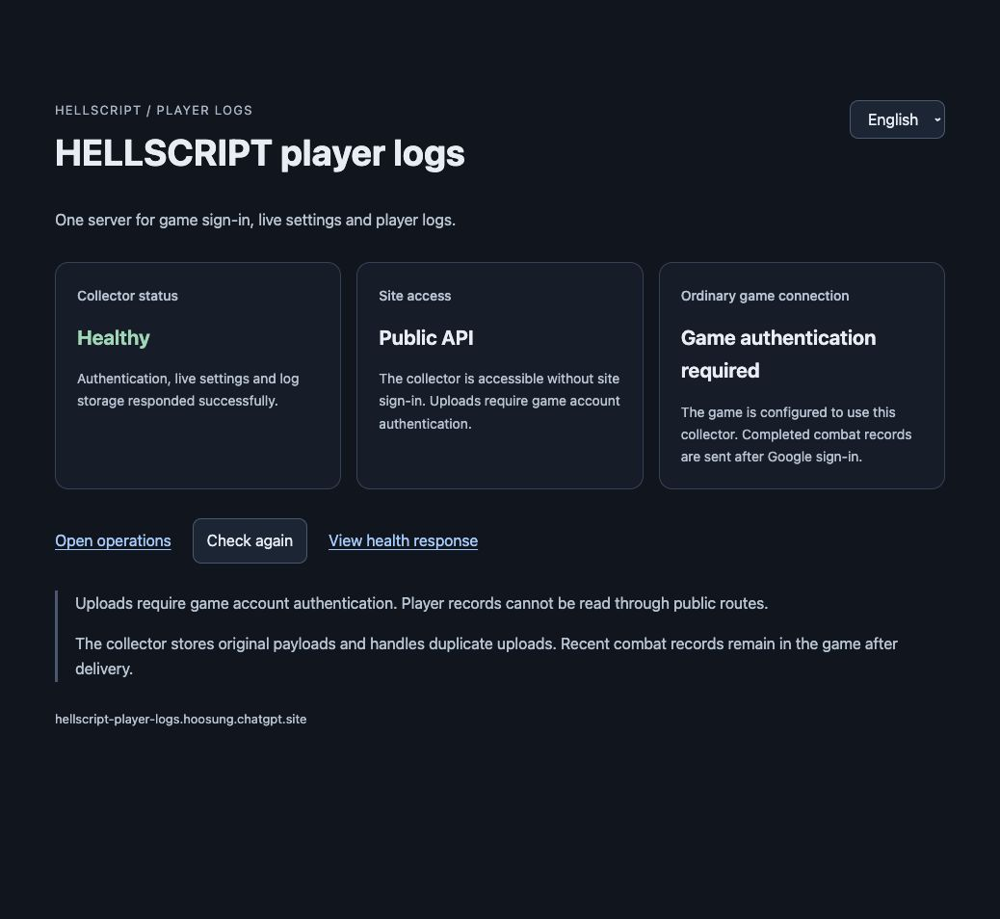

# Sites single backend and player logs

Updated: 2026-10-01

[한국어](Sites_Player_Logs.md) · [Google sign-in](Google_Login.en.md) · [Live operations](Live_Operations.en.md) · [Combat records](Combat_Journal_Server.en.md)

## One management destination

The server is https://hellscript-player-logs.hoosung.chatgpt.site with operations at `/ops`. One Worker owns Google identity/game sessions, operator sessions/drafts/publication/rollback, and QA/ordinary-player combat ingestion. Dedicated account/settings/log tables use D1 `DB`; raw payloads/private migration backups use R2 `LOGS`. No external authentication server or Railway fallback is used.

Both version-2 `baseUrl` and `telemetryBaseUrl` in the game use this exact HTTPS Site origin without credentials, paths or query strings. Ordinary Google players use in-memory game sessions, checked against local D1 hashes, expiry and revocation on every request. QA files must use their separate upload key and this same origin. Operators, QA identities and Google players retain independent permissions.

## Preserve ownership and data

Existing opaque account IDs migrate unchanged. On the device, an atomic index update changes the old origin-derived key to the new key while retaining the same save-directory reference. Save/combat bytes are never copied, merged or deleted. The old origin is used only for an offline hash; no network request is made. Conflicting pre-existing old/new profiles fail closed with both originals preserved.

Published configuration versions, exact JSON bytes/SHA-256, active markers, drafts and audit migrate intact. D1 atomic batches and revision comparison protect publication/rollback. SQL triggers prevent release/audit mutation. Configuration applies to new rifts; existing combat snapshots stay fixed. Ingestion stores client observations and cannot grant rewards or change saves.

All three legacy SQLite databases are write-frozen for cutover and copied with their online backup API into private local storage and R2. Legacy combat originals use R2; matching hash/summary rows use D1. Events, drops, authority evidence, audit and configuration snapshots remain in `legacy_telemetry_rows` and the original backups. Existing Site runs remain intact. Public evidence contains aggregate counts/hashes rather than account identities, secrets or database files.

The importer requires a temporary secret and exact part hashes, counts and backups. All totals must match before completion. Completed migration routes return 404 even with the original key; remove that temporary runtime secret afterwards. A one-time migration backup is distinct from automatic backup or scheduled restore testing.

## Operations and publishing

The root page shows real `/healthz` responses in Korean/English and links to `/ops`, which uses the existing operator key. Google player sign-in never grants operator access. Site access is public; account access, uploads and operator mutations are separately authenticated. Public combat-list/payload-query routes are absent.

Manage secrets in this Site’s Settings: the existing Google client ID/secret, separate operator/QA keys, and `HELLSCRIPT_AUTH_ORIGIN`/`HELLSCRIPT_OPS_ORIGIN` set to this exact origin. Google’s approved callback is this Site’s `/auth/google/callback`. Credentials never belong in game builds, Git or wiki.

Open the existing Site source with the installed Sites workflow. `server/sites/publish.py` exports only curated service files. Build, push and package that same source, then save/deploy its version. Exclude the Unity project and private files. Drizzle SQL migrations own schema changes; runtime routes never create tables. Applied migrations are immutable. Container deployment files and the Railway GitHub source connection are removed.

## Validation status

- All 18 server tests passed: RSA/issuer/audience/expiry/nonce, stable account IDs, cookie/PKCE/replay prevention, immediate revocation, separate operator/QA permissions, Origin/CSRF, concurrent draft/publication/rollback, immutable history, sealed migration, original payloads/duplicates/conflicts/storage failures/retries/request budgets.
- Unit tests with synthetic Google responses and real account evidence are distinguished below.
- Physical mobile and Windows behavior are outside this macOS acceptance scope. Use the default text size.

[Worker](../../server/sites/_worker.js) · [Authentication](../../server/sites/auth.js) · [Operations](../../server/sites/liveops.js) · [Migration](../../server/sites/migrate.py) · [Tests](../../server/sites/test_backend.mjs) · [Local ownership](../../Assets/HELLSCRIPT/Runtime/Core/AccountProfiles.cs)

## Migration completed on 2026-10-01

Version **11**, source `060989e60771dc9af5768453333d78aa6a7a8cf9`, deployed successfully to the existing Site. Environment revision 3 removes the temporary migration credential. The Google approved callback was saved to this Site before two real Google logins from the macOS game. Both retained the original Railway account ID. Three native checks passed guest linking, sign-out, fresh guest isolation, returning progress and Mage gameplay entry.

One existing account/session and one release/active marker/draft were preserved. Two old runs joined four existing Site runs, giving 6 `runs` rows at migration completion. The 21 `legacy_telemetry_rows` and original backups retain old events, configuration and audit data. All three SQLite backups passed `quick_check`; downloaded and R2-stored copies matched hashes and sizes. Synthetic verification runs created later are separate from these cutover totals.

| Scope | Actual result |
| --- | --- |
| Server and CI | Sites Node 18/18, legacy Python contracts 82/82, operator web model and Site build passed. All three required CI workflows succeeded for this `main`. |
| Unity | Focused account/server Edit Mode 26/26 and shared UI contract 11/11. macOS development build: 0 errors, 176 warnings. The whole Unity suite was not run. |
| Public APIs and operations | 10 collector and 11 live-operations HTTPS checks passed. Original release 0 JSON/hash remained exact; live balance was unchanged. |
| Real Google | Two real logins through the new backend preserved the old account ID and passed guest isolation, progress restoration and gameplay entry. |
| Native macOS uploader | An isolated QA save and fixed simulation generated a synthetic battle sent by the real game uploader. Original and duplicate ACKs matched runId/hash; D1 contained one row, the outbox zero and local history one record. This is separate from ordinary Google-player battle upload or physical input validation. |
| Cutover | Railway GitHub source disconnected; zero running deployments. After stopping it, Site `/healthz` returned HTTP 200 and Korean/English status screens were healthy. Migration routes were sealed; temporary SSH and local keys were retired. |

Daily backend management uses this Site and `/ops`. The Railway account and stopped service's original volume remain as recovery material without a runtime dependency. Neither permanent deletion nor a plan change was performed. Retained-volume billing can be separate from compute shutdown. Private backups also exist in Site R2 and local storage. Scheduled backups/restore tests, Windows and physical mobile are unverified.

[Summary](../../Artifacts/Validation/sites-backend-migration-20261001/validation-summary.json) · [Migration counts/hashes](../../Artifacts/Validation/sites-backend-migration-20261001/migration.json) · [Backups](../../Artifacts/Validation/sites-backend-migration-20261001/source-backups.json) · [Deployment](../../Artifacts/Validation/sites-backend-migration-20261001/deployment.json) · [Real Google](../../Artifacts/Validation/sites-backend-migration-20261001/google-runtime.json) · [Native upload](../../Artifacts/Validation/sites-backend-migration-20261001/native-uploader.json) · [Stored row](../../Artifacts/Validation/sites-backend-migration-20261001/native-storage.json) · [Railway shutdown](../../Artifacts/Validation/sites-backend-migration-20261001/cutover.json) · [CI](https://github.com/dakrdong/HELLSCRIPT/actions/runs/36807731836)

[Korean healthy screen](../../Artifacts/Validation/sites-backend-migration-20261001/site-ko.jpg) · [Operator sign-in](../../Artifacts/Validation/sites-backend-migration-20261001/ops-login.jpg)
