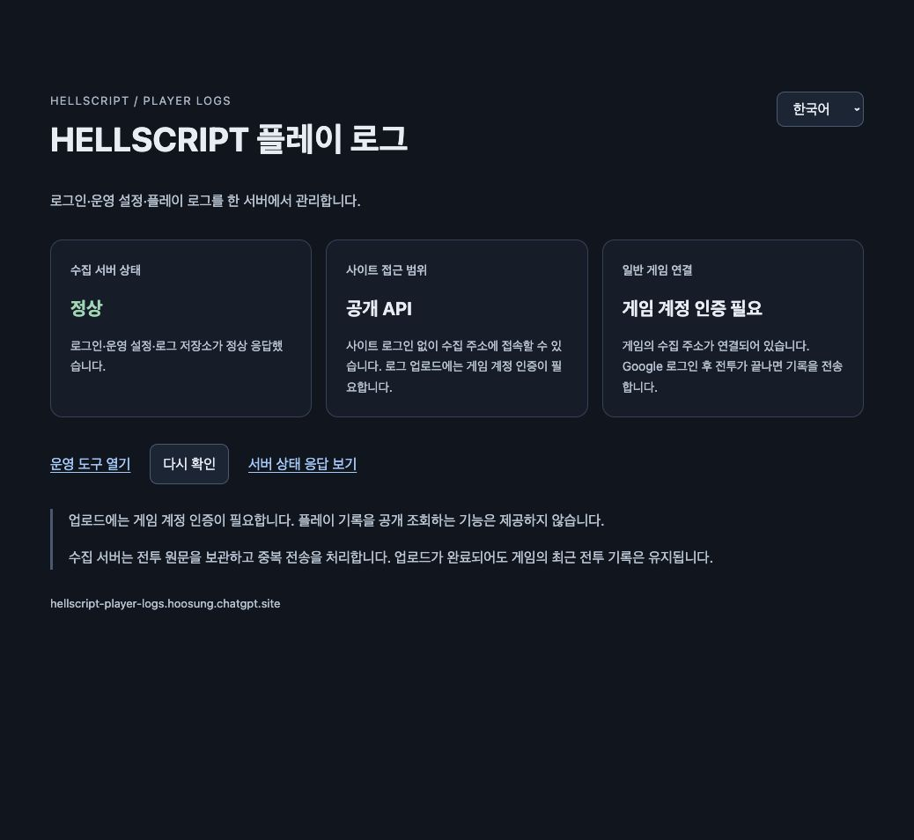

# Sites 통합 서버와 플레이 로그

갱신일: 2026-10-01

[English](Sites_Player_Logs.en.md) · [Google 로그인](Google_Login.md) · [운영 설정](Live_Operations.md) · [전투 기록](Combat_Journal_Server.md)

## 한 곳에서 관리

서버와 운영 화면은 https://hellscript-player-logs.hoosung.chatgpt.site 와 `/ops`다. 같은 Sites Worker가 Google 계정 인증·게임 세션, 운영자 로그인·초안·게시·복원, QA·일반 플레이어 전투 수집을 처리한다. 계정·설정·로그 요약은 D1 `DB`, 원문·비공개 이전 백업은 R2 `LOGS`에 보관한다. 다른 인증 서버에 요청하거나 Railway로 돌아가는 경로는 없다.

게임 `Resources/Data/ServerConnection.json` 버전 2의 `baseUrl`과 `telemetryBaseUrl`은 모두 같은 Sites 원점이다. 자격 증명·경로·쿼리가 없는 HTTPS 주소만 허용한다. 일반 Google 플레이어는 메모리의 세션을 사용하며 서버가 같은 D1에서 토큰 해시·만료·로그아웃을 매 요청마다 확인한다. QA 파일은 별도 업로드 키와 같은 주소를 가져야 한다. 운영자 키, QA 키, Google 플레이어 세션은 서로 권한을 공유하지 않는다.

## 계정·설정·기록 보존

기존 계정의 불투명한 ID를 그대로 옮긴다. 기기의 계정 색인은 이전 서버 주소로 계산한 키를 새 키로 원자적으로 바꾸고 같은 저장 폴더를 연다. 저장과 전투 파일은 복사·합치기·삭제하지 않는다. 이전 주소는 오프라인 키 계산에만 쓰며 접속하지 않는다. 새 주소와 이전 주소의 서로 다른 저장이 이미 함께 있으면 원본을 보존하고 진입을 거부한다.

기존 운영 설정의 게시 버전, JSON 원문, SHA-256, 활성 버전, 초안과 감사 이력을 옮긴다. 새 게시·복원은 D1의 원자적 batch와 버전 비교를 사용한다. 게시본과 감사는 SQL 트리거로 수정·삭제를 막는다. 새 균열에서 설정을 읽고 진행 중인 전투의 스냅샷은 유지한다. 로그 수집은 관측 기록일 뿐 보상이나 저장의 권한을 갖지 않는다.

이전 원본 SQLite 3개는 쓰기를 막은 상태에서 online backup API로 일관된 백업을 만들고 비공개 로컬 저장소와 R2에 보관한다. 이전 전투 원문은 R2, 동일 해시의 요약은 D1에 넣는다. 이벤트·보상·권한 근거·감사·설정 스냅샷은 `legacy_telemetry_rows`와 원본 백업으로 남긴다. 기존 Sites 기록도 그대로 유지한다. 공개 위키에는 개인정보·자격 증명·원문 DB 대신 건수·해시만 게시한다.

이전 API는 임시 비밀키로만 접근하며 각 묶음의 해시·행 수·백업·전체 건수가 일치해야 완료된다. 완료 뒤에는 같은 키를 사용해도 404를 반환한다. 이 임시 키는 이후 서버 설정에서 제거한다. 1회 이전 백업은 자동 백업이나 정기 복원 검증과 구분한다.

## 운영과 배포

사이트 첫 화면은 실제 `/healthz` 결과를 한국어·영어로 표시하고 운영 화면으로 연결한다. `/ops`는 기존 운영자 키로 로그인한다. Google 플레이어 로그인은 운영 권한을 주지 않는다. 사이트 접근은 공개이지만 로그 원문·계정·운영 변경 API는 각각 인증한다. 공개 전투 목록·개별 원문 조회 API는 제공하지 않는다.

서버의 비밀 설정은 이 Sites의 Settings에서 관리한다. Google 클라이언트 ID·비밀키, 분리된 운영자·QA 키를 유지하고 `HELLSCRIPT_AUTH_ORIGIN`과 `HELLSCRIPT_OPS_ORIGIN`을 같은 Sites 원점으로 설정한다. Google OAuth 승인 반환 주소는 이 사이트의 `/auth/google/callback`이다. 비밀키를 게임·Git·위키에 넣지 않는다.

기존 사이트의 소스를 Sites 워크플로로 연 뒤 `server/sites/publish.py`가 서비스 파일만 내보낸다. 같은 소스를 검사·빌드·푸시·패키징해 저장한 버전을 배포한다. 원본 프로젝트나 개인 파일은 포함하지 않는다. 스키마는 Drizzle SQL 마이그레이션으로만 바꾸고 런타임 요청에서 테이블을 생성하지 않는다. 적용한 마이그레이션은 수정하지 않는다. 컨테이너 배포 파일과 Railway 자동 배포 연결은 제거한다.

## 검증 상태

- 서버 코드 18개 검사 통과: RSA 서명·발급자·대상·만료·nonce, 기존 계정 ID 유지, 쿠키·PKCE·재사용 차단, 즉시 세션 철회, 운영자·QA 권한 분리, Origin·CSRF, 동시 초안·게시·복원, 변경 불가능한 이력, 이전 완료 봉인, 원문·중복·충돌·저장 실패·재시도·요청 한도.
- 합성 Google 응답을 사용한 단위 검사와 실제 계정 검증을 아래에서 구분한다.
- 모바일·Windows 실기기는 이 macOS 검증 범위에 포함하지 않는다. 기본 글자 크기를 사용한다.

[통합 Worker](../../server/sites/_worker.js) · [인증](../../server/sites/auth.js) · [운영](../../server/sites/liveops.js) · [이전](../../server/sites/migrate.py) · [검사](../../server/sites/test_backend.mjs) · [로컬 계정 소유](../../Assets/HELLSCRIPT/Runtime/Core/AccountProfiles.cs)

## 2026-10-01 이전 완료와 검증

기존 사이트의 버전 **11**, 소스 `060989e60771dc9af5768453333d78aa6a7a8cf9`를 배포했다. 배포 상태는 `succeeded`이며 임시 이전 비밀키를 제거한 환경 revision 3을 사용한다. Google Console의 승인 반환 주소를 이 사이트로 저장한 뒤 실제 Google 계정으로 macOS 게임에 두 번 로그인했다. 이전 Railway 계정 ID가 그대로 유지됐으며 게스트 연결·로그아웃·새 게스트 분리·진행 복원·Mage 게임 진입의 3개 런타임 검사를 통과했다.

원본 계정 1개와 세션 1개, 게시본·활성 설정·초안 각 1개를 보존했다. 이전 전투 2개와 기존 Sites 전투 4개를 합쳐 이전 완료 시점의 `runs`는 6행이었다. 이전 이벤트·설정·감사 등은 `legacy_telemetry_rows` 21행과 원본 백업으로 보존했다. 세 SQLite 백업은 모두 `quick_check=ok`이며 다운로드와 R2 저장에 같은 SHA-256·크기를 확인했다. 검증 중 생성한 합성 전투는 이 완료 시점 건수에 포함하지 않는다.

| 검증 범위 | 실제 결과 |
| --- | --- |
| 서버·CI | Sites Node 18/18, 기존 Python 계약 82/82, 운영 웹 모델과 Sites 빌드 성공. 해당 `main`의 필수 CI 3개 성공. |
| Unity | 계정과 서버 주소의 집중 Edit Mode 26/26, 공통 UI 계약 11/11. macOS 개발 빌드 오류 0·경고 176. 전체 Unity 검사는 실행하지 않았다. |
| 공개 API·운영 | 수집 API 10개와 운영 HTTPS 11개 검사 통과. 원래 게시 버전 0의 JSON·해시가 그대로이며 실제 밸런스는 변경하지 않았다. |
| 실제 Google | 새 서버를 통한 실제 로그인 2회, 기존 서버의 계정 ID 유지, 게스트 분리·진행 복원·게임 진입 통과. |
| 실제 macOS 업로더 | 격리 QA 저장과 고정 시뮬레이션의 합성 전투를 실제 게임 업로더로 전송. 동일 runId·본문 해시 ACK와 재전송 ACK를 확인했고, D1은 1행·대기열은 0·로컬 최근 기록은 1개였다. 이 검사는 일반 Google 플레이어 전투 업로드나 물리 입력 검사와 구분한다. |
| 이전 종료 | Railway GitHub 소스 연결 해제, 실행 중인 배포 0개. 중지 후 새 서버 `/healthz` HTTP 200과 한국어·영어 정상 화면 확인. 임시 이전 경로는 봉인했고 SSH 키와 로컬 임시 키를 폐기했다. |

일상 서버 관리는 위 사이트와 `/ops` 한 곳에서 한다. Railway 계정과 정지 서비스의 원본 볼륨은 복구 자료로 남겨 두었으며 운영 의존성은 없다. 계정·볼륨 영구 삭제와 요금제 변경은 수행하지 않았다. 남겨 둔 볼륨의 청구는 실행 중지와 별개일 수 있다. 비공개 이전 백업은 Sites R2와 로컬에도 있다. 정기 자동 백업·복원 검사, Windows·물리 모바일은 미검증이다.

[검증 요약](../../Artifacts/Validation/sites-backend-migration-20261001/validation-summary.json) · [이전 건수·해시](../../Artifacts/Validation/sites-backend-migration-20261001/migration.json) · [백업](../../Artifacts/Validation/sites-backend-migration-20261001/source-backups.json) · [배포](../../Artifacts/Validation/sites-backend-migration-20261001/deployment.json) · [실제 Google](../../Artifacts/Validation/sites-backend-migration-20261001/google-runtime.json) · [게임 업로드](../../Artifacts/Validation/sites-backend-migration-20261001/native-uploader.json) · [저장된 1행](../../Artifacts/Validation/sites-backend-migration-20261001/native-storage.json) · [Railway 종료](../../Artifacts/Validation/sites-backend-migration-20261001/cutover.json) · [CI](https://github.com/dakrdong/HELLSCRIPT/actions/runs/36807731836)

[English 정상 화면](../../Artifacts/Validation/sites-backend-migration-20261001/site-en.jpg) · [운영자 로그인](../../Artifacts/Validation/sites-backend-migration-20261001/ops-login.jpg)
