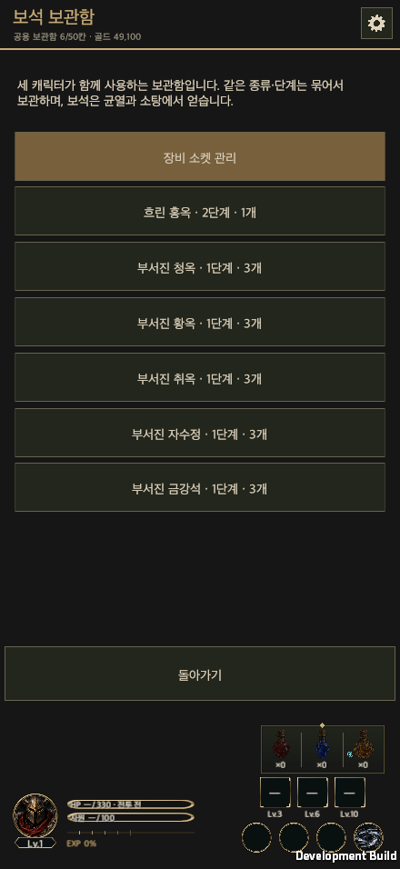
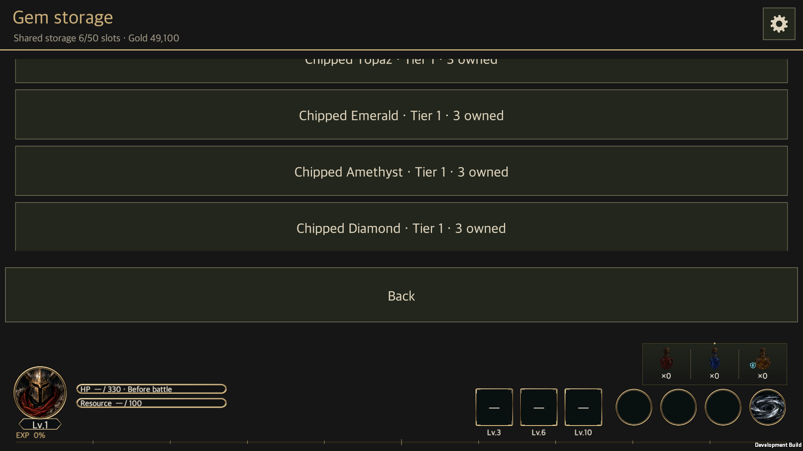

# Six-gem catalog and icon production

Updated: 2026-09-23 · [한국어](Six_Gem_Catalog.md)

The owner's decision removes Skull and retains **Ruby, Sapphire, Topaz, Emerald, Amethyst and Diamond**. Six tiers remain, giving 36 type/tier combinations. The [current design](../Design/HELLSCRIPT_Gem_Socket_Detail.en.md) documents their values and rules.

## Changes

GemCatalog version 2 removes G07. G01–G06 IDs, effect values, fusion costs and socket rules remain unchanged. New drops select equally from six types, and new transactions reject G07.

On load, valid Skull gems become Diamonds at the same tier and quantity. This covers stored stacks, persisted equipment sockets and gem pickups in suspended runs or pending repeat-hunt results. Stack boundaries and pickup ownership flags are preserved, and the original save is archived before persistence. Invalid quantities and unsupported socket structures still stop loading. Claimed pickups are not awarded again, and loading a converted save does not repeat the migration.

## Images

[Six representative icon candidates](../Art/Gems/2026-09-23/Gem_Icon_Candidates.md) are 1254×1254 RGBA PNGs. Their native alpha is unchanged. Light/dark surfaces and 48px previews were reviewed for color and silhouette. These are six type icons, not 36 tier-specific assets.

The built-in generation interface did not return its model identity, so the requested `gpt-image-2` provenance cannot be verified. The files remain review candidates and are not installed in the game. Exact prompts, hashes and alpha checks accompany them.

## Validation

> Integration baseline: the current jeweler upgrades 5:1 and downgrades 1:5 without gold. The 3:1 and 900-gold results below are historical branch evidence. See [2026-09-23 main integration](Main_Integration_20260923.en.md) for current integrated validation.

| Check | Result | Scope |
|---|---|---|
| Unity 6000.6.0f1 Edit Mode | 219 passed, 0 failed, 0 skipped | Gem effects, sockets, services, resource loot and localization |
| macOS development build | Successful | Final code and native verification fixture |
| Native Mac fixture | Exit 0 | 3:1 fusion with exactly 900 gold, G07 rejection, 10,000 rolls without Skull, save migration, original archival and restart |
| Real gem-storage menu | Verified | Korean at 440×956; English at 1920×1080 |
| Shared UI contract | Passed | Contract check and 9 checker tests |
| Wiki | Passed | Build/check, 10 Python tests and JavaScript page/database route checks |

The landscape menu scrolls. Each of the six actual text labels was brought into the viewport and checked against its bounds before capture. Transactions and scrolling were invoked by the native fixture; physical mouse/touch input and mobile devices were not exercised.

[Evidence summary and hashes](Validation/SixGems/validation.json) · [Native result](Validation/SixGems/six-gems-evidence.txt)

English scroll captures: [Ruby](Validation/SixGems/six-gems-en-G01.png) · [Sapphire](Validation/SixGems/six-gems-en-G02.png) · [Topaz](Validation/SixGems/six-gems-en-G03.png) · [Emerald](Validation/SixGems/six-gems-en-G04.png) · [Amethyst](Validation/SixGems/six-gems-en-G05.png) · [Diamond](Validation/SixGems/six-gems-en-G06.png)

## Limits

These are focused checks, not a full-game regression. An initial 956×440 landscape capture showed an excessively shallow list viewport. Layout was not changed by this catalog task, and short landscape usability needs separate attention. Native logs contain stripped post-processing shader warnings; this is not a warning-free execution claim.

Image model provenance, production adoption and runtime artwork integration remain open. Public wiki deployment follows repository policy when this branch is merged into `main`.
