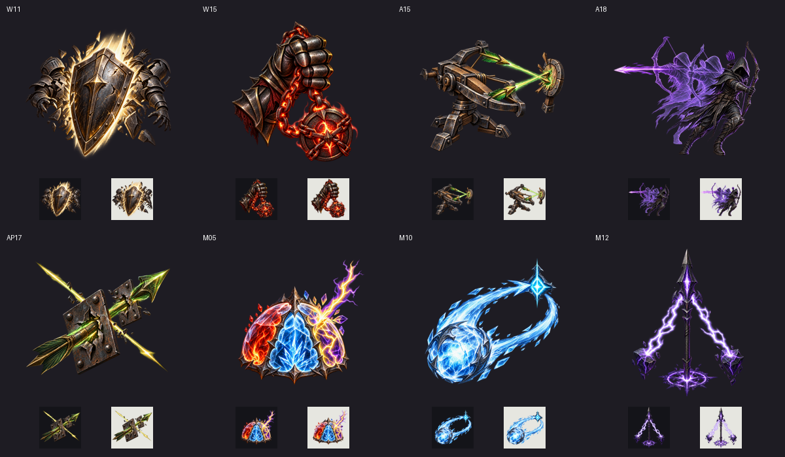

# 스킬 개성 재설계 검증 자료 / Skill identity evidence

작성일: 2026-10-04. macOS development player, Unity 6000.6.0f1, source `7c6f2724`. 실제 uGUI와 합성 포인터 입력이며 모바일 실기기 검사는 아니다. / Actual uGUI with synthetic pointer input; physical mobile was not tested.

[검증 요약 / Summary](validation.json) · [빌드 해시 / Build hashes](build-manifest.json) · [실행 결과 / Runtime result](native-ui/identity-runtime.txt)

## 자동 전투 / Automatic combat

| 스킬 / Skill | 실제 상태 / State | 전투 / Combat | 440×956 | 956×440 | 1600×900 | 1600×1000 | 2100×900 |
| --- | --- | --- | --- | --- | --- | --- | --- |
| 전선 돌파 / Front Break | [JSON](native-ui/W11-combat.json) | [PNG](native-ui/W11-automatic-combat.png) | [KO](native-ui/W11-440x956-ko.png) / [EN](native-ui/W11-440x956-en.png) | [KO](native-ui/W11-956x440-ko.png) / [EN](native-ui/W11-956x440-en.png) | [KO](native-ui/W11-1600x900-ko.png) / [EN](native-ui/W11-1600x900-en.png) | [KO](native-ui/W11-1600x1000-ko.png) / [EN](native-ui/W11-1600x1000-en.png) | [KO](native-ui/W11-2100x900-ko.png) / [EN](native-ui/W11-2100x900-en.png) |
| 투쟁의 빚 / Battle Loan | [JSON](native-ui/W15-combat.json) | [PNG](native-ui/W15-automatic-combat.png) | [KO](native-ui/W15-440x956-ko.png) / [EN](native-ui/W15-440x956-en.png) | [KO](native-ui/W15-956x440-ko.png) / [EN](native-ui/W15-956x440-en.png) | [KO](native-ui/W15-1600x900-ko.png) / [EN](native-ui/W15-1600x900-en.png) | [KO](native-ui/W15-1600x1000-ko.png) / [EN](native-ui/W15-1600x1000-en.png) | [KO](native-ui/W15-2100x900-ko.png) / [EN](native-ui/W15-2100x900-en.png) |
| 교차 쇠뇌 / Crossfire Ballista | [JSON](native-ui/A15-combat.json) | [PNG](native-ui/A15-automatic-combat.png) | [KO](native-ui/A15-440x956-ko.png) / [EN](native-ui/A15-440x956-en.png) | [KO](native-ui/A15-956x440-ko.png) / [EN](native-ui/A15-956x440-en.png) | [KO](native-ui/A15-1600x900-ko.png) / [EN](native-ui/A15-1600x900-en.png) | [KO](native-ui/A15-1600x1000-ko.png) / [EN](native-ui/A15-1600x1000-en.png) | [KO](native-ui/A15-2100x900-ko.png) / [EN](native-ui/A15-2100x900-en.png) |
| 잔상 행군 / Afterimage March | [JSON](native-ui/A18-combat.json) | [PNG](native-ui/A18-automatic-combat.png) | [KO](native-ui/A18-440x956-ko.png) / [EN](native-ui/A18-440x956-en.png) | [KO](native-ui/A18-956x440-ko.png) / [EN](native-ui/A18-956x440-en.png) | [KO](native-ui/A18-1600x900-ko.png) / [EN](native-ui/A18-1600x900-en.png) | [KO](native-ui/A18-1600x1000-ko.png) / [EN](native-ui/A18-1600x1000-en.png) | [KO](native-ui/A18-2100x900-ko.png) / [EN](native-ui/A18-2100x900-en.png) |
| 원소 보호막 / Elemental Shield | [JSON](native-ui/M05-combat.json) | [PNG](native-ui/M05-automatic-combat.png) | [KO](native-ui/M05-440x956-ko.png) / [EN](native-ui/M05-440x956-en.png) | [KO](native-ui/M05-956x440-ko.png) / [EN](native-ui/M05-956x440-en.png) | [KO](native-ui/M05-1600x900-ko.png) / [EN](native-ui/M05-1600x900-en.png) | [KO](native-ui/M05-1600x1000-ko.png) / [EN](native-ui/M05-1600x1000-en.png) | [KO](native-ui/M05-2100x900-ko.png) / [EN](native-ui/M05-2100x900-en.png) |
| 귀환 서리 / Returning Frost | [JSON](native-ui/M10-combat.json) | [PNG](native-ui/M10-automatic-combat.png) | [KO](native-ui/M10-440x956-ko.png) / [EN](native-ui/M10-440x956-en.png) | [KO](native-ui/M10-956x440-ko.png) / [EN](native-ui/M10-956x440-en.png) | [KO](native-ui/M10-1600x900-ko.png) / [EN](native-ui/M10-1600x900-en.png) | [KO](native-ui/M10-1600x1000-ko.png) / [EN](native-ui/M10-1600x1000-en.png) | [KO](native-ui/M10-2100x900-ko.png) / [EN](native-ui/M10-2100x900-en.png) |
| 접지창 / Grounding Spear | [JSON](native-ui/M12-combat.json) | [PNG](native-ui/M12-automatic-combat.png) | [KO](native-ui/M12-440x956-ko.png) / [EN](native-ui/M12-440x956-en.png) | [KO](native-ui/M12-956x440-ko.png) / [EN](native-ui/M12-956x440-en.png) | [KO](native-ui/M12-1600x900-ko.png) / [EN](native-ui/M12-1600x900-en.png) | [KO](native-ui/M12-1600x1000-ko.png) / [EN](native-ui/M12-1600x1000-en.png) | [KO](native-ui/M12-2100x900-ko.png) / [EN](native-ui/M12-2100x900-en.png) |

## 프리셋과 패시브 / Presets and passive

| 화면 / Screen | 자료 / Evidence |
| --- | --- |
| 공격 순서 / Order 440x956 | [KO](native-ui/identity-order-440x956-ko.png) / [EN](native-ui/identity-order-440x956-en.png) |
| 공격 순서 / Order 956x440 | [KO](native-ui/identity-order-956x440-ko.png) / [EN](native-ui/identity-order-956x440-en.png) |
| 공격 순서 / Order 1600x900 | [KO](native-ui/identity-order-1600x900-ko.png) / [EN](native-ui/identity-order-1600x900-en.png) |
| 공격 순서 / Order 1600x1000 | [KO](native-ui/identity-order-1600x1000-ko.png) / [EN](native-ui/identity-order-1600x1000-en.png) |
| 공격 순서 / Order 2100x900 | [KO](native-ui/identity-order-2100x900-ko.png) / [EN](native-ui/identity-order-2100x900-en.png) |
| 가로 안전 영역 / Landscape safe area | [PNG](native-ui/identity-order-safe-area.png) |
| 관통 사선 / Piercing Crossfire | [PNG](native-ui/AP17-tree-icon.png) |
| 사선 선회 / Orbit for crossfire | [선택 / Picker](native-ui/orbit-preset-picker.png) / [저장 / Saved](native-ui/orbit-preset-saved.png) |

## 새 프로세스 전투 재개 / Fresh-process resume

[실행 결과 / Runtime result](native-restart.txt) · [시작 체크포인트 / Checkpoint result](native-checkpoint.txt) · [궁극기 패시브 / Ultimate support](ultimate-support.txt)

| 저장 상태 / Case | 중단 없는 결과 / Expected | 새 프로세스 결과 / Actual |
| --- | --- | --- |
| A07 | [JSON](restart-receipts/expected-A07.json) | [JSON](restart-receipts/actual-A07.json) |
| A18-image | [JSON](restart-receipts/expected-A18-image.json) | [JSON](restart-receipts/actual-A18-image.json) |
| M05-memory | [JSON](restart-receipts/expected-M05-memory.json) | [JSON](restart-receipts/actual-M05-memory.json) |
| M10-return | [JSON](restart-receipts/expected-M10-return.json) | [JSON](restart-receipts/actual-M10-return.json) |
| M11 | [JSON](restart-receipts/expected-M11.json) | [JSON](restart-receipts/actual-M11.json) |
| M12-conduit | [JSON](restart-receipts/expected-M12-conduit.json) | [JSON](restart-receipts/actual-M12-conduit.json) |
| M13 | [JSON](restart-receipts/expected-M13.json) | [JSON](restart-receipts/actual-M13.json) |
| W02 | [JSON](restart-receipts/expected-W02.json) | [JSON](restart-receipts/actual-W02.json) |
| W09-after-kill | [JSON](restart-receipts/expected-W09-after-kill.json) | [JSON](restart-receipts/actual-W09-after-kill.json) |
| W09-before-kill | [JSON](restart-receipts/expected-W09-before-kill.json) | [JSON](restart-receipts/actual-W09-before-kill.json) |
| W15-debt | [JSON](restart-receipts/expected-W15-debt.json) | [JSON](restart-receipts/actual-W15-debt.json) |
| W18 | [JSON](restart-receipts/expected-W18.json) | [JSON](restart-receipts/actual-W18.json) |

## 검사 보고서 / Test reports

- [baseline-shield-preview](baseline-shield-preview.xml)
- [failed-related-recheck](failed-related-recheck.xml)
- [full-editmode](full-editmode.xml)
- [loan-guard-recheck](loan-guard-recheck.xml)
- [localization-preview-repair](localization-preview-repair.xml)
- [localization-recheck](localization-recheck.xml)
- [mechanics-final-focused](mechanics-final-focused.xml)

[이전 실패 대조 / Prior assertions](full-baseline-comparison.json) · [보호막 기준선 / Shield baseline](shield-preview-baseline.json) · [정적 검사 / Static checks](static-checks.json)

