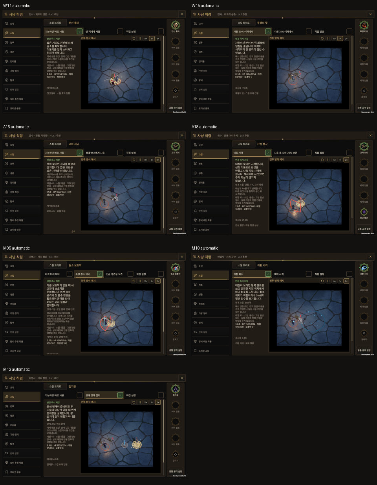

# Skill identity rework

[한국어](Skill_Identity_Rework.md)

As of: 2026-10-04. Seven existing skills now change distinct combat decisions while preserving skill IDs, the prerequisite graph, four active slots, one ultimate, shared codes and equipment owners. New fields are optional within combat state V1. Previously saved resource-over-time effects and old frost globes finish with their original behavior.

| Skill | Previous role | Implemented decision | Connections |
| --- | --- | --- | --- |
| Front Break | Path damage and landing defence | Push enemies sideways to open a lane; bosses gain control meter. | Landing barrier and defensive stance; changes positioning in the opposite direction from gathering |
| Battle Loan | Resource restoration over time | Borrow 60 immediately; actual credited resource becomes debt paid by natural regeneration or close hits/blocks for 4. | Fund a larger opening, then stay engaged. Vow equipment spends up to 8 current resource on repayment and added protection |
| Crossfire Ballista | Periodic extra shots | Add D45% to D35% when firing at a recent hero victim from an angle at least 60 degrees apart. | Marks, orbiting and firing lines. Piercing Crossfire hits a second victim for 50% shot damage |
| Afterimage March | Extra damage to the same victim | Moving 1.5m leaves an image at the previous location; a subsequent direct shot consumes it to fire from there. | Up to 2 images simultaneously and 8 total; passive extends duration and creation budget. Standing creates no images |
| Elemental Shield | Fixed barrier | Remember the last released element; the first absorption by this shield burns, roots or restores mana. | Choose the preceding element and anticipate absorption. Other shields and dodges do not react |
| Returning Frost | Destination explosion | Hit each leg once; returning hits freeze slowed victims. Catch at the cast location to recover mana. | Cold setups, holding ground and safe pickup movement; give up unsafe recovery |
| Grounding Spear | Straight lightning damage | A placed spear bridges two 4m chain segments, spending one M03 hop. | Set up before chaining; share walls, perception, visit limits and geometric forecast |

These starting numbers do not prove optimal balance. Compare equal equipment, ranks, seeds and enemy placement using damage, incoming damage, resource starvation, repayment time, movement and missed catches. Shout supplies sustained resource and damage; Battle Loan trades a larger immediate advance for later regeneration. The ballista holds its placement and crossfires with the hero; images consume locations created by moving. Capacitor Orb deals local periodic damage and a charged explosion; the spear changes chain reach.

## Hunt Edict presets

Existing skill-preset IDs retain compatibility while labels, descriptions and executable conditions change. Battle Loan distinguishes emergency borrowing at 30% from earlier borrowing at 75%. Returning Frost distinguishes pickup movement from controlled-target shots. Grounding Spear distinguishes immediate placement from setup before a ready chain. Rangers can select **Orbit for crossfire** to orbit at 4m, and **Set up skill identities** to prepare images and the ballista before shooting. Order presets never change equipped skills or allocations.

Production combat previews record the same conditions, companions and global movement. No unannounced manual casts manufacture the displayed effect. Presets use existing save, revert and share transactions.

The shield's **Prepare elemental absorption** example remembers lightning from an actual previous encounter, then holds ground and accepts the next enemy's attack through the shield. This example explicitly turns dodging off and describes that cost. Normal survival policies keep evasion first; a dodged hit cannot trigger the elemental reaction.

## Boundaries and validation

Implementation owners: [combat mechanics](../../Assets/HELLSCRIPT/Runtime/Core/CombatSimulation.SkillIdentity.cs), [persisted skill state](../../Assets/HELLSCRIPT/Runtime/Core/ClassSkillState.cs), [Hunt Edict presets](../../Assets/HELLSCRIPT/Runtime/Core/HuntEdictQuickPresets.cs), [macOS UI and automatic combat acceptance](../../Assets/HELLSCRIPT/Runtime/Presentation/RuntimeSkillTreeSmoke.Identity.cs), [fresh-process combat resume](../../Assets/HELLSCRIPT/Runtime/Core/ClassSkillNativeSmoke.cs).

Unequipping and save restoration retain debt; outstanding debt blocks manual and automatic borrowing. Extra arrows cannot reproduce direct-hit procs. Damage events record actual firing origins, while saved old arrows retain their cast-origin behavior. Conduits cannot grant perception or jump through walls. Survival responses take priority over frost pickup.

Eight icons are generated individually with original RGBA bytes and Unity GUIDs preserved. The original handoff remains immutable; `Docs/Art/ClassSkillIcons/identity-rework.json` explicitly supersedes revised names and concepts. The generation surface returns no model identity, so records retain `model=unknown` and `approval=candidate`. Check alpha, light/dark backgrounds, 64px distinction and clipping.

Twenty-six focused mechanic checks cover saved debt, return paths, elemental reactions, crossfire piercing, actual movement, automatic presets, sharing and state preservation when no debt exists. The full Edit Mode suite ran once at final integration: 4,978 of 5,114 checks passed and 136 failed. Eight failures introduced by this change were repaired; all 81 related checks then passed. The remaining 128 failures predate the change: 127 have the same assertions as the previous report, and one shield example also fails at baseline `4c9e7b7e`. This is not a passing full-suite result.

The macOS development player built from `7c6f2724` with zero build errors. Seven actual automatic encounters demonstrate pushing, borrowing, damaging crossfire, damaging afterimages, elemental absorption, completed frost return and conduit relaying. The new attack-order and orbit presets were selected through real controls, saved and read back from disk. Ninety-one captures cover KO/EN at 440×956, 956×440, 1600×900, 1600×1000 and 2100×900, plus simulated landscape safe area. Inputs use actual uGUI raycasts and synthetic pointer down/up/click events, not physical mouse or touch.

A fresh player process resumed twelve saved fights, including outstanding debt, frost in its return flight, a conduit, an afterimage and elemental memory. Damage, resources, RNG, events, policy progress and rewards match uninterrupted results. Physical mobile was not tested, and these initial numbers are not proof of optimal balance.

The mandatory CI combat comparison documents and prototype direct-dependency citations were refreshed for the new names and effects. All 111 effect links were audited and 39 progression/loadout checks passed. Front Break shield/item references and Battle Loan/Grounding Spear build descriptions were also updated. These follow-up repairs change description text and documentation/tool data only. Runtime code and every non-description runtime field match `7c6f2724`, so the successful runtime evidence was reused.

Evidence: [validation summary](SkillIdentityEvidence20261004/validation.json), [full suite](SkillIdentityEvidence20261004/full-editmode.xml), [related rerun](SkillIdentityEvidence20261004/failed-related-recheck.xml), [prior failure comparison](SkillIdentityEvidence20261004/full-baseline-comparison.json), [baseline shield check](SkillIdentityEvidence20261004/baseline-shield-preview.xml), [macOS runtime](SkillIdentityEvidence20261004/native-ui/identity-runtime.txt), [fresh-process resume](SkillIdentityEvidence20261004/native-restart.txt), [build hashes](SkillIdentityEvidence20261004/build-manifest.json).

[All 91 captures, combat states and twelve resume receipt pairs](SkillIdentityEvidence20261004/Skill_Identity_Evidence_20261004.md).

