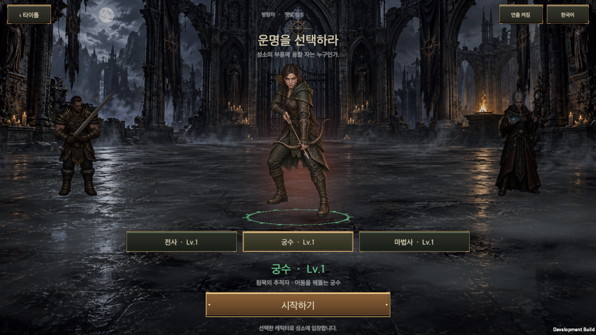
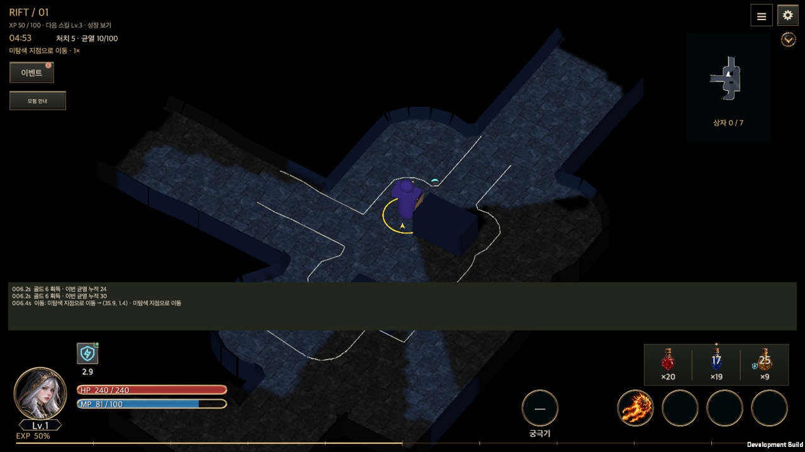

# 효과음 전면 교체

작성일: 2026-09-26 · [English](Sound_Effects_Bank.en.md)

게임의 효과음을 모두 새로 만들어 연결했다. 기존 `main`의 임시 합성음 20종을 대체하고, 버튼·장비 다루기·골드·분해 같은 시스템 소리부터 직업별 스킬 54종, 함성·신음·죽음 목소리, 적 12종·정예·보스 3종, 균열 사건까지 **283종, 변주 469개**를 둔다. 성소·균열 배경음은 바꾸지 않았다.

## 방향과 출처

목표는 디아블로 4가 들려주는 질감이다. 무겁고 거친 타격, 금속·가죽·돌의 촉감, 짧은 잔향, 원소마다 다른 결, 낮게 울리는 전설 획득음을 기준으로 삼았다. 느낌을 참고했을 뿐 **디아블로 4의 음원·녹음·샘플은 추출하거나 사용하지 않았다.** 저작권이 있는 게임 음원을 옮기는 것은 이 프로젝트에 넣을 수 없다.

모든 소리는 [`tools/generate_sfx.py`](../../tools/generate_sfx.py)와 [`tools/sfx`](../../tools/sfx/bank.py)의 시드 고정 제작법으로 합성한 원본이다. 외부 녹음, 음성 합성 엔진, AI 음향 모델을 쓰지 않았다. 주요 기법은 다음과 같다.

- 금속·돌·유리·동전은 물체별 고유 진동 비율을 쓰는 모달 합성으로 만든다. 활시위는 카플러스-스트롱 현 모델이다.
- 타격은 음높이가 떨어지는 저음, 포화시킨 중음 파열, 젖은 살 소리, 뼈 부서지는 입자를 겹친다.
- 휘두름·돌진은 중심 주파수가 움직이는 필터 잡음이다. 불·얼음·번개·독·암흑은 각자 잡음 색과 입자 밀도를 다르게 한다.
- 잔향은 방 크기별로 합성한 임펄스 응답으로 입힌다(작은 방, 홀, 지하 묘실, 광대한 공간).
- 목소리는 성문 펄스(떨림·흔들림·주기 배가)와 움직이는 성도 공명기로 만든 비언어 발성이다. 전사는 성인 남성, 궁수와 마법사는 성인 여성의 음역을 쓴다. 괴물은 공명을 낮추고 저음 배가와 왜곡을 더한다.

작업자는 소리를 직접 들을 수 없다. 스펙트로그램, 주파수 대역 비율, 음량 측정, 끝부분 잘림 검사로 구조를 확인했을 뿐이며 청감 평가는 사용자의 몫이다. 특히 합성 목소리는 녹음된 성우 연기보다 인공적으로 들릴 수 있다. 같은 소리 ID에 녹음 음원을 넣어 교체할 수 있게 구성했다.

## 구성

| 분류 | 효과음 | 변주 | 주요 내용 |
| --- | ---: | ---: | --- |
| 버튼·창 | 11 | 25 | 일반·주요·위험 버튼, 탭, 비활성, 창 열기·닫기, 확정, 거절, 슬라이더, 알림 |
| 장비 다루기 | 25 | 48 | 재질 9종(칼날·판금·가죽·장신구·활·지팡이·보주·두루마리·방패)의 집기·장착, 내려놓기, 잠금, 분해·일괄 분해, 버리기, 정렬 |
| 골드·재료 | 9 | 19 | 골드 획득(많은 골드 구분), 지불, 받기, 재료·코어·강화석·보석 획득, 가방 가득 참 |
| 전리품 떨어짐 | 5 | 10 | 일반·마법·희귀·전설·세트/고유 등급별 떨어지는 소리 |
| 마을 시설 | 25 | 35 | 옵션 변경·원하는 옵션, 강화, 슬롯 강화 시작·완료, 명작, 작업대 개방, 코어 제작·투입, 보석·룬·위상, 보상 상자, 출석, 도박 두근거림 |
| 진행·연출 | 15 | 18 | 게임 입장, 직업 선택 3종, 모험 시작, 균열 진입·귀환·차원문, 정복, 실패, 레벨 업, 새 스킬, 안내, 목표 달성, 보스 관문 |
| 스킬 | 73 | 94 | 기본 공격 3종, 액티브·궁극기 54종, 회오리 회전·착지·폭발·연쇄·덫 발동·소환 공격 등 후속 소리 |
| 적중 | 12 | 39 | 베기·관통·강타·화염·냉기·번개·독·암흑, 치명타, 뼈·금속·수정 재질 |
| 영웅 상태 | 7 | 17 | 피격, 막기, 회피, 보호막 흡수, 쓰러짐, 빈사 심장 박동, 물약 |
| 목소리 | 18 | 48 | 직업마다 기합, 필살 기합, 함성, 신음, 죽음, 가쁜 숨 |
| 적 | 45 | 77 | 12종의 공격 준비·공격·죽음, 독·불·얼음·폭발 장판, 정예 처치, 분노, 치유, 종소리, 시체 폭발 |
| 보스 | 21 | 21 | 보스 3종 등장, 기본·내려찍기·갈고리·소환·광선·돌진·연속 폭발의 준비와 발동, 격노, 제압, 처치, 소환물 |
| 균열 사건 | 17 | 18 | 황금 고블린 등장·도주·탈출·처치, 상자, 신단, 저주받은 상자, 봉인, 제물, 룬 발견 |

원본은 48 kHz·16-bit 모노 WAV이며 합계 51.3 MB, 8분 54초다. 이 폴더의 Unity 가져오기 설정은 2초 이하 ADPCM, 그보다 긴 소리는 Vorbis 품질 0.7로 메모리에 압축해 둔다. 소리 목록·한국어·영어 이름·재생 규칙은 [bank.json](../../Assets/HELLSCRIPT/Resources/Audio/Sfx/bank.json)에 있다.

## 게임 연결

소리는 게임 상태를 읽기만 한다. 전투 난수를 쓰지 않고, 변주 선택에는 별도의 `System.Random`을 쓴다. 저장이나 거래를 실행하지 않는다.

| 순간 | 연결 위치 |
| --- | --- |
| 버튼 | 공통 `UiButton`의 실제 포인터·키보드 입력만 역할별로 소리를 낸다. 같은 프레임이나 다음 프레임에 버튼의 결과(구매·장착·창 열기)가 소리를 내면 클릭음은 생략한다. 비활성 버튼은 둔한 소리를 낸다. 코드의 `onClick.Invoke()`는 소리를 내지 않는다. |
| 창 | `ContentWindowHost`에 창이 올라가고 내려갈 때 |
| 장비 선택·드래그 | 인벤토리·창고·상점·대장간·위상석 칸을 누르거나 끌기 시작하면 재질별 집기 소리. 놓을 수 없는 칸이면 거절음, 빈 곳에 놓아 취소하면 내려놓기 소리 |
| 장착·잠금·분해·정렬 | 저장이 끝난 거래(`GameStore.Committed`)의 종류로 고른다. 새로 장착된 장비의 재질, 거래에 기록된 새 잠금 상태(인벤토리·창고), 가방에서 줄어든 개수(3개 이상이면 일괄 분해)를 쓴다. 보석은 빈 보석을 넣는 거래를 제거로, 그 밖의 장착·교체를 장착으로 구분한다. 계정을 바꾸면 새 저장소를 다시 관찰한다. |
| 버리기 | 이 게임에는 장비를 바닥에 버리는 기능이 없다. 가방이 찼을 때 전리품을 두고 가는 거래(`leave-loot`)에 연결했다. |
| 골드·재료 | 균열에서 실제로 주운 자원(`RiftResourceDrop.claimed`). 평소보다 2.5배 이상 많은 골드는 많은 골드 소리. 상점 구매·판매·도박·창고 확장은 거래 종류로 구분 |
| 전리품 | 장비가 보이게 되면 등급별로 떨어지는 소리, 주우면 재질별 집기 소리 |
| 대장간·보석·룬·위상·보상 | 해당 거래가 저장된 뒤. 자동 옵션 변경이 원하는 옵션을 찾으면 성공음. 룬판에서 들기·놓기·회전·회수·칸 개방은 편집 단계에서 바로 소리를 낸다. |
| 균열 중 저장 | 신단·상자·제물처럼 균열 상태를 저장하면 기록 목록이 새 객체로 다시 만들어진다. 같은 기록을 값으로 다시 찾아 이어서 읽고, 찾지 못하면 지난 기록을 재생하지 않는다. |
| 실패 | 거래가 거절되면(`GameStore.Rejected`) 0.75초 안에 플레이어 입력이 있었던 경우에만 거절음. 배경 정산 실패에는 소리를 내지 않는다. |
| 흐름 | 타이틀 입장, 직업 선택(직업별), 모험 시작, 튜토리얼 안내, 균열 진입(1.5초 뒤 영웅 함성), 귀환, 정복, 실패, 레벨 업(새 스킬이 열리면 추가 알림) |
| 스킬 | 실제 스킬 수명 주기(`ClassSkillChanged`, 구형 경로는 `actionEvents`)의 시작·이동·발동. 회오리는 회전 틱마다, 화염구 폭발·연쇄 번개·맹독 덫은 해당 순간에, 소환·장판·화살비·잔영 공격은 `DAMAGE` 이벤트로 따로 낸다. 무거운 스킬에는 기합, 궁극기에는 필살 기합을 더한다. |
| 적중 | 적에게 들어간 피해의 원소와 공격자 직업. 치명타는 추가 소리, 뼈·갑옷·수정 적에게는 재질 소리를 겹친다. 도트 피해는 소리를 내지 않는다. |
| 영웅 | 피격(체력의 6% 이상이면 신음), 막기, 회피, 보호막 흡수, 싸우는 동안 체력 30% 미만이면 심장 박동과 가쁜 숨(다른 대사에 막히면 다시 시도, 전투가 끝나거나 멈추면 중지), 쓰러짐과 죽음 비명, 물약 |
| 적·보스 | 적 전투 기록(`enemyEvents`)의 준비·발동·장판·치유·종·분노·시체, 사망 기록(`effectEvents`)의 적 종류별 죽음과 정예 처치. 보스는 등장(종류별)·공격 준비·발동·격노·제압·처치 |
| 균열 사건 | 전투 기록의 상자·신단·저주·봉인·제물·관문·황금 고블린·룬 발견 태그 |

## 섞는 규칙

- 효과음 음원 16개를 함께 쓰고, 소리마다 재생 간격·동시 재생 수·우선순위를 둔다. 보상·보스·위험 소리가 반복 타격보다 먼저다.
- 영웅 목소리는 한 번에 한 줄만 낸다. 더 중요한 줄(죽음)은 진행 중인 줄(신음)을 끊는다.
- 같은 소리의 변주는 연속으로 반복하지 않는다. 음높이는 소리마다 ±2~6% 범위에서 조금씩 달라지고 전투 배속과 관계가 없다.
- 적과 전리품 소리는 영웅과의 거리로 줄이고 좌우 위치로 나눈다. 많은 소리가 겹치면 새 소리를 조금씩 낮추고, 청취 지점의 리미터가 최종 출력을 -3 dBFS 아래로 유지한다.
- 분류별 기본 목표 음량(짧은 구간 LUFS 근사): 버튼 -25, 적중 -23, 장비 -22, 골드·적 -21, 마을·영웅·목소리·전리품·균열 사건 -19, 스킬 -17, 진행·보스 -15. 전설 획득음과 궁극기는 더 크게 둔다.
- 기존 음량 설정(전체·음악·효과음·음소거), 기기 전용 저장, 앱 중단 시 정지, 이어 하기에서 지난 기록을 다시 재생하지 않는 규칙은 그대로다.

## 제작과 재현

```sh
python3 tools/generate_sfx.py            # WAV·Unity 메타·bank.json 생성
python3 tools/generate_sfx.py --check    # 제작법과 파일 일치, 코드가 부르는 ID 확인
python3 tools/generate_sfx.py --audition Artifacts/Audio   # 로컬 미리 듣기 페이지
python3 tools/generate_sfx.py --sheets Artifacts/Audio/sheets  # 스펙트로그램 시트
```

생성에는 NumPy와 SciPy가 필요하고 게임 실행에는 필요 없다. `--check`는 코드에 적힌 소리 ID와 스킬 도감의 액티브·궁극기가 모두 뱅크에 있는지도 확인한다.

## 검증

Unity 6000.6.0f1, macOS 개발 빌드에서 확인했다. 원본 폴더에는 다른 작업의 에디터가 열려 있어, `main` 24694040 기준 작업 폴더를 복제해 배치 모드로 검사·빌드했다.

| 검사 | 결과 |
| --- | --- |
| 음원 파일 | 469개 모두 피크 -1.0 dBFS 이하, 클리핑 0, 시작·끝 샘플 0, DC 최대 0.0005. `--check`에서 제작법과 파일이 일치하고, 코드가 부르는 ID 88개와 조합 ID·스킬 도감 ID가 모두 뱅크에 있다. [음원 감사](SfxEvidence/bank-audit.json) |
| 새 Edit Mode 검사 | 74/74 통과. 뱅크 로드와 누락 0, 스킬·적·보스·목소리 소리 존재, 재질·등급 매핑, 재생 간격과 음소거, 거래별 소리(잠금·해제·창고 잠금·보석 장착·제거)와 플레이어가 일으킨 실패만 거절음, 계정 전환 뒤 새 저장소만 관찰, 균열 상태를 JSON으로 다시 만들어도 지난 기록을 재생하지 않음, 실제 입력만 보고하는 버튼, **액티브·궁극기 54종이 실제 시전 흐름에서 자기 소리를 내고 소리 유무에 따라 피해·난수가 같음**, 기존 버튼 검사 12개. [결과](SfxEvidence/editmode-sound.xml) |
| 전체 Edit Mode | 병합 전 최종 코드로 4,033개 중 3,986개 통과. 실패 47개는 기준선인 `main` 24694040 전체 실행의 실패 47개와 같고 새 실패는 0개다. 새 검사 62개는 모두 통과했다. [비교](SfxEvidence/editmode-full-compare.txt) |
| 병합 전 독립 검토 | 다섯 관점(재생 핵심, 전투 연결, 거래 연결, 화면 변경, 생성기·검사)의 검토자가 21건을 제기했고, 건마다 반박 검증 3건을 거쳐 12건(중복 제외 10건)이 확정됐다. 계정 전환 뒤 거래 소리 끊김, 균열 저장 뒤 기록 재생, 결과 화면·일시 정지 중 심장 박동, 저체력 숨소리 누락, 첫 골드가 많은 골드 소리로 나는 문제, 보석 교체음, 창고 잠금음, 룬 탭 배치 무음, 자동 전투 소리가 버튼 클릭음을 가리는 문제, 잠금 검사가 실행되지 않던 문제를 고쳤다. |
| 공통 UI 계약 | `check_ui_contract.py` 통과, `test_ui_contract.py` 9/9 통과 |
| 실제 플레이 스모크 | 개발 빌드의 `-hellscriptSfxSmoke`가 합성 EventSystem 입력으로 게임을 진행하며 시작된 소리와 청취 지점의 출력 피크를 기록한다. 병합 전 최종 코드로 `HELLSCRIPT_SFX_SMOKE_OK`, 서로 다른 효과음 84종, 재생 1,341회, 오류 로그 0건. 스모크를 고치며 돌린 일곱 번의 실행을 합치면 92종을 실제 재생에서 확인했다. [요약](SfxEvidence/runtime-summary.txt) · [재생 기록](SfxEvidence/runtime-trace.tsv) |
| 믹스 | 리미터 적용 전 마법사 균열에서 청취 지점 피크가 1.034까지 올라 순간 클리핑이 있었다. 리미터 적용 후 모든 구간의 피크는 0.700 이하다. |

실제 플레이에서 확인한 흐름은 다음과 같다. 타이틀 입장, 세 직업 선택과 모험 시작, 필수 튜토리얼 전투(보스 포함)와 비교 후 장착, 전사의 균열 1단계 정복(보스 등장·격노·처치, 정복 연출, 상자, 레벨 업, 새 스킬, 골드·재료·보석·강화석 획득, 전리품), 궁수·마법사의 균열 75초 전투(기본 공격, 스킬, 화염 폭발, 원소 적중, 함성, 정예 처치), 인벤토리의 선택·잠금·해제·잘못된 칸으로 끌기·분해, 도박 구매(골드 지불·두근거림·등급 공개음), 대장간 장비 강화, 소리 설정의 미리 듣기.

확인하지 못한 것도 적어 둔다.

- 스모크에서는 장착 가능한 칸으로 끌어 놓는 장착을 실행하지 못했다(찾은 장비·칸 조합이 없었음). 장착음은 비교 창의 장착 버튼 경로에서 확인했고, 드래그 장착도 같은 저장 거래를 거친다.
- 도박 구매·공개 확인·상점 닫기, 대장간 강화·닫기는 튜토리얼 안내 창이 버튼을 가려 포인터 대신 버튼 동작을 직접 실행했다(소리는 저장된 거래에서 나므로 확인 범위는 같다). 대장간 옵션 변경은 장비 칸을 찾지 못해 실제 재생으로 확인하지 않았다.
- 모든 직업이 낮은 레벨이라 균열에서 쓴 스킬은 직업마다 1종이다. 54종 전체는 Edit Mode의 실제 시전 검사로 확인했다.
- 사람이 들어 본 청감 평가, 모바일 실기기의 출력·터치·성능, Windows 실행은 하지 않았다.





[궁수 균열 종료](SfxEvidence/06-rift-end-1.png) · [인벤토리 상세](SfxEvidence/07-inventory-detail.png) · [소리 설정 미리 듣기](SfxEvidence/11-sound-settings.png)

## 이전 작업과의 관계

- `main`의 `SoundCue` 20종과 실행 중 합성 코드는 삭제했다. `GameAudio.Clips.cs`에는 배경음 합성만 남는다.
- 같은 날 만든 미병합 브랜치 `codex/dark-fantasy-audio`(`45e0b468`)는 이 작업의 기반이 아니다. 두 작업 모두 `GameAudio`를 다시 쓰므로 함께 병합하지 않는다.
- 이전 기록: [임시 음향과 스킬 형태 연출](Audio_Skill_Presentation.md)
