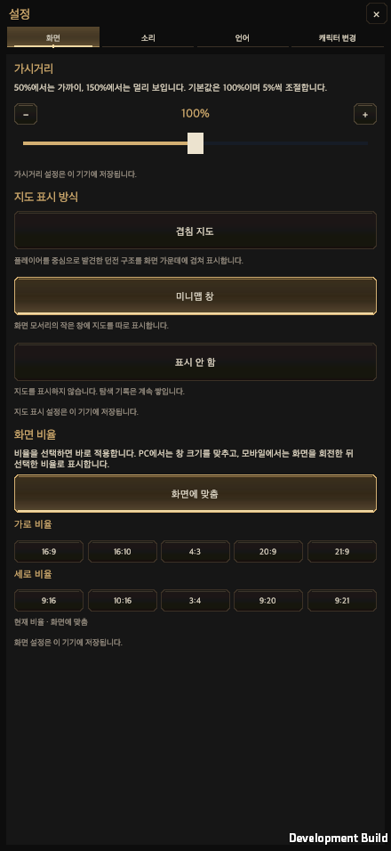
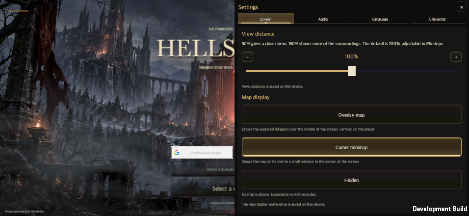

# Remove the player text-size preference

Date: 2026-09-30 · [한국어](Text_Size_Option_Removal.md)

The user retired the game's optional text-size multiplier. Settings no longer creates its heading, explanation, slider, step buttons or save retry. The device preference reader/writer and session were removed. Existing `hellscript-interface-scale-v1.json` files are neither deleted nor overwritten and are not read by the game. Title and shared UI adapters use a default factor of 1.

Responsive viewport, aspect-ratio and safe-area layouts remain. The separate 50–150% view-distance preference still controls the combat camera. Language, aspect ratio, audio and character switching remain available.

## Future validation

Repository `AGENTS.md`, `CLAUDE.md` and both shared UI contracts no longer require a text-size matrix or enlarged-text-only smoke. Obsolete preference unit tests were deleted. Executable acceptance drivers no longer change reading size or repeat profiles for it; their obsolete size arguments were removed. The usual five viewports and Korean/English matrix now has 10 profiles instead of 20.

Keep default-size clipping, fixed-action access, viewport/safe-area and actual-input checks. Historical 100%/140%/150% documents and images remain evidence of past runs, not active features or future test requirements. Current behavior is reflected in [settings](Settings_Revision.en.md) and the [shared UI contract](Shared_UI_Contract.en.md).

## Verification results

The affected Edit Mode selection ran 81 tests: 80 passed, and one failed because an orphaned translation survived preference removal. After deleting that line, only the failed test was rerun and passed. The 80 successful results were reused. The shared UI contract validator and its 11 tests also passed.

Unity 6000.6.0f1 compiled the macOS development player. Focused native settings acceptance checked 10 default-size profiles: 440×956, 956×440, and PC 16:9/16:10/21:9 in Korean and English. Screen, Sound, Language and Character tabs, close actions, safe-area bounds, clipping and raycast access passed, with no retired controls present. A legacy 150% preference file was preserved byte for byte. The run produced 13 captures.

This is an isolated-save macOS player result using synthetic uGUI input, not physical-mobile or OS-pointer proof. The previously completed full combat suite and 122-preset verification, and unrelated runtime smokes, were not repeated.

Preserved evidence: [summary](TextSizeOptionRemovalEvidence/verification.json), [initial tests](TextSizeOptionRemovalEvidence/focused-tests-initial.xml), [failed-test rerun](TextSizeOptionRemovalEvidence/localization-final.xml), [settings acceptance](TextSizeOptionRemovalEvidence/settings-focused.txt), and [legacy-file preservation](TextSizeOptionRemovalEvidence/legacy-file-preserved.json).

The newly merged rift-result changes (`1bfb7e4d`) were preserved. Their remaining size loops were retired and the integrated code compiled. Settings production sources were unchanged, so the native result above was reused. Only the wiki mirror and history affected by integration received additional checks.
