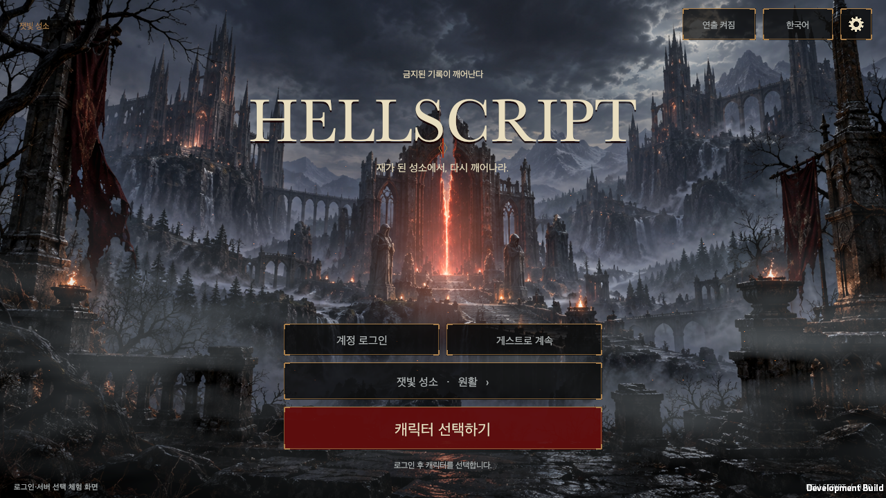

# HELLSCRIPT 살아 있는 타이틀 화면

작성일: 2026-09-20

[English](Title_Screen.en.md)

## 화면과 시작 흐름

폐성당과 붉은 균열을 그린 배경 위로 안개, 구름 그림자, 균열의 빛과 작은 불씨가 움직인다. 로고는 위쪽 중앙에 두고 로그인·서버 선택과 캐릭터 선택 화면으로 가는 버튼은 중앙 하단에 모았다. 배경은 화면을 가득 채우고, 조작부는 기기의 안전 영역 안에 배치한다. 연출 정지 버튼은 배경의 모든 애니메이션을 멈춘다.

로그인과 서버는 사용자가 요청한 모의 기능이다. 계정 이름과 체험용 비밀번호가 비어 있으면 안내를 표시하고, 입력하면 로그인 상태를 보여 준다. 비밀번호는 마스킹하며 창을 닫으면 입력 필드를 비운다. 네트워크 인증, 비밀번호 저장, 실제 서버 접속은 하지 않는다. 게스트 입장과 로그아웃도 지원한다. 서버 두 개는 선택할 수 있고 점검 중인 서버는 비활성화한다. 어느 서버를 선택해도 기존 저장 계정과 캐릭터를 그대로 사용한다.

로그인 또는 게스트 입장에 성공하면 별도의 [캐릭터 선택 화면](Character_Selection.md)으로 이동한다. 전사·마법사·궁수의 동작을 확인하고 캐릭터를 고른 뒤 시작하기를 누르면 기존 `GameController.EnterPlaza(true)`를 호출한다. 마을 이동은 입장 후 시작한다. 타이틀의 캐릭터 목록 대화상자는 이 독립 화면으로 대체했다.

## 화면 비율

[Apple 공식 제품 사양](https://support.apple.com/en-us/125091)에서 iPhone 17 Pro Max의 해상도 1320×2868을 확인했다. 타이틀은 이 비율의 세로·가로 화면과 PC 16:9, 16:10, 3440:1440 울트라와이드에 맞춰 배치한다. 기기 모델명을 검사하거나 특정 해상도를 강제로 설정하지 않는다.

| 대상 | 검증 창 크기 | 배치 |
|---|---|---|
| iPhone 17 Pro Max 세로 | 440×956, 원본 해상도의 1/3 | 중앙 하단에 세로로 배치한다. |
| iPhone 17 Pro Max 가로 | 956×440, 원본 해상도의 1/3 | 로그인·서버와 캐릭터 선택 화면 진입을 짧은 열로 배치한다. |
| PC 16:9 | 1280×720 | 중앙 조작부의 최대 폭을 제한한다. |
| PC 16:10 | 1440×900 | 늘어난 높이에 따라 배경과 여백을 확장한다. |
| PC 울트라와이드 | 1720×720, 3440×1440의 1/2 | 배경은 가득 채우고 조작부는 중앙에 유지한다. |

실제 모바일에서는 기존 `Screen.safeArea` 경로를 사용한다. 검증의 상단·하단·좌우 여백은 Dynamic Island와 홈 인디케이터에 대비한 모의 값이며, iPhone 실측치로 주장하지 않는다. 로그인 창은 회전 시 입력 필드를 다시 만들지 않는다. 작은 창에서는 대화상자의 내용만 스크롤하며 닫기 버튼은 고정한다.

## 소유권과 리소스

- [GameUI.Title.cs](../../Assets/HELLSCRIPT/Runtime/Presentation/GameUI.Title.cs)는 기존 UI의 타이틀 진입점이다.
- [TitleScreenView.cs](../../Assets/HELLSCRIPT/Runtime/Presentation/TitleScreenView.cs)와 [대화상자](../../Assets/HELLSCRIPT/Runtime/Presentation/TitleScreenView.Dialogs.cs)가 화면과 입력을 담당한다.
- [TitleSession.cs](../../Assets/HELLSCRIPT/Runtime/Core/TitleSession.cs)는 로그인·서버 선택을 메모리에만 유지한다. 게임 저장 파일과 분리되어 있다.
- [TitleAtmosphere.cs](../../Assets/HELLSCRIPT/Runtime/Presentation/TitleAtmosphere.cs)와 [셰이더](../../Assets/HELLSCRIPT/Resources/Art/Title/TitleAtmosphere.shader)가 배경을 한 번 그리면서 안개·빛을 합성한다. 타이틀을 떠나면 동적 재질을 해제한다.
- [배경 PNG](../../Assets/HELLSCRIPT/Resources/Art/Title/TitleSanctuary.png)는 1672×941 원본을 변경 없이 복사했다. 화면에서는 비율을 유지한 채 중앙을 기준으로 잘라 표시한다.

배경은 내장 `image_gen`으로 생성했다. 도구 반환값은 `image_url`, `output_hint`이며, 파일의 C2PA 생성 정보는 `softwareAgent.name=ChatGPT`, `version=gpt-image`이다. 정확한 모델 버전은 확인할 수 없으므로 `gpt-image-2` 사용을 주장하지 않는다. 개발용 배경으로 등록하며 출시 아트 승인을 마친 자산으로 분류하지 않는다. [정확한 생성 프롬프트](Title_Screen_Prompt.txt)와 [출처 기록](TitleScreenEvidence/provenance.json)을 보존한다.

로고와 프레임은 uGUI 텍스트·선으로 만든다. 운영체제 글꼴 파일을 복사하거나 재배포하지 않는다. 새 문구는 기존 한국어 원문 키와 영어 문구 표를 함께 사용한다.

## 검증

캐릭터 선택 화면을 연결한 뒤 관련 검사를 58/58개 통과했고, 타이틀 런타임 검증도 최종 빌드로 다시 통과했다. [확장 검증 기록](Character_Selection.md)을 함께 참고한다.

초기 타이틀 관련 Edit Mode 검사는 48/48개를 통과했다. 이 중 타이틀 세션·입장 차단·비율 유지·리소스 검사가 15개이며, 기존 번역 검사가 33개다. [검사 결과](TitleScreenEvidence/editmode.json)를 보존한다.

macOS 개발 빌드의 `RuntimeTitleSmoke`가 `HELLSCRIPT_TITLE_RUNTIME_OK checks=10`으로 종료 코드 0을 반환했다. PC 세 가지 비율, iPhone 비율의 두 방향, 한국어·영어 문구, 안전 영역, 버튼 겹침과 문구 잘림을 확인했다. 로그인 빈 값, 비밀번호 가림·제거, 회전 중 입력 유지, 서버 변경·점검 상태, 실제 캐릭터 선택, 로그아웃·게스트, 마을 입장도 통과했다. [런타임 결과](TitleScreenEvidence/validation.txt)를 보존한다.

최종 타이틀 실행에서 배경은 1.4초 간격의 실제 렌더링으로 평균 RGB 차이 1.7140을 보였다. 연출 정지 후에는 시계와 같은 영역의 픽셀이 모두 고정되었다. 프레임 속도나 모바일 성능을 측정한 결과는 아니다.

별도의 Mac 실행 창에서는 실제 포인터 클릭으로 로그인 창을 열고 문자 입력·Tab 이동·Enter 로그인·서버 선택·로그아웃을 확인했다. [입력 검증 범위](TitleScreenEvidence/native-input.json)에 기록했다. iPhone 실기기에서의 터치·키보드·방향 전환·성능과 Windows 실행은 미검증이다. 초기 타이틀 빌드는 오류 0개로 성공했고 프로젝트의 셰이더·가져오기 경고가 39개였다. 캐릭터 선택을 포함한 최종 빌드도 오류 0개로 성공했으며 전체 프로젝트 경고 384개가 남아 있다. [최종 빌드 기록](CharacterSelectionEvidence/build.json)을 함께 보존한다.

[iPhone 세로](TitleScreenEvidence/iphone-portrait-ko.png) · [iPhone 가로](TitleScreenEvidence/iphone-landscape-ko.png) · [PC 16:10](TitleScreenEvidence/pc-16x10-ko.png) · [PC 울트라와이드](TitleScreenEvidence/pc-ultrawide-ko.png) · [로그인 창](TitleScreenEvidence/iphone-login-ko.png) · [영어 서버 선택](TitleScreenEvidence/iphone-servers-en.png)

공개 위키 반영은 이 작업 브랜치가 `main`에 병합될 때, 병합 담당자가 생성·검사·배포를 완료한다. 작업 브랜치에서는 공개본을 덮어쓰지 않는다.
