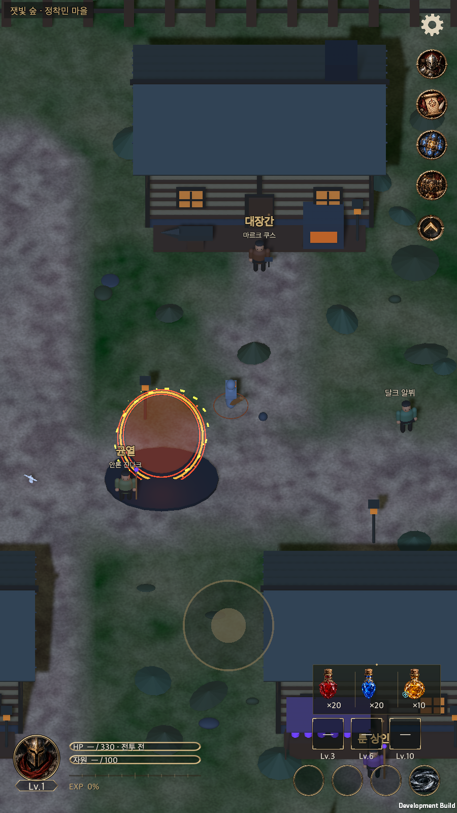
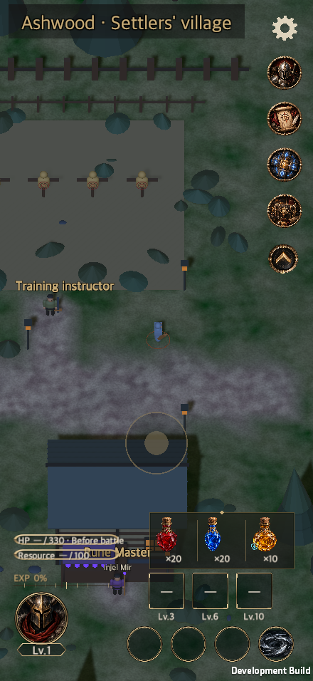
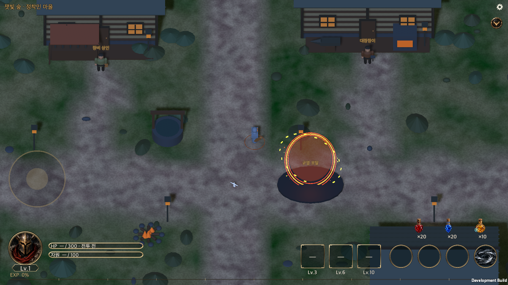
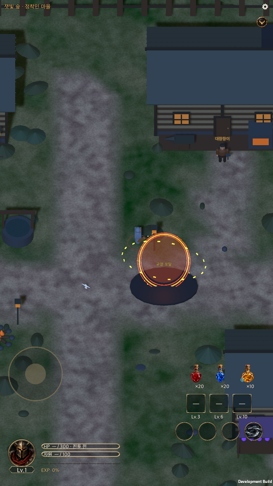
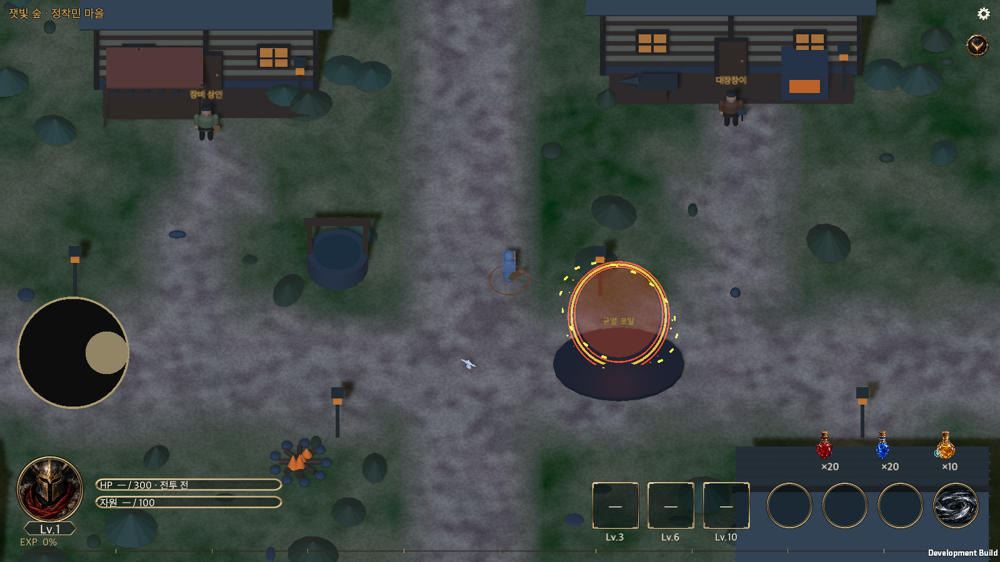
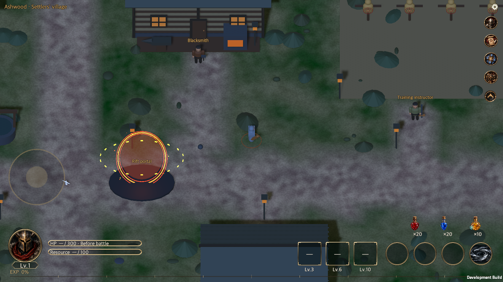
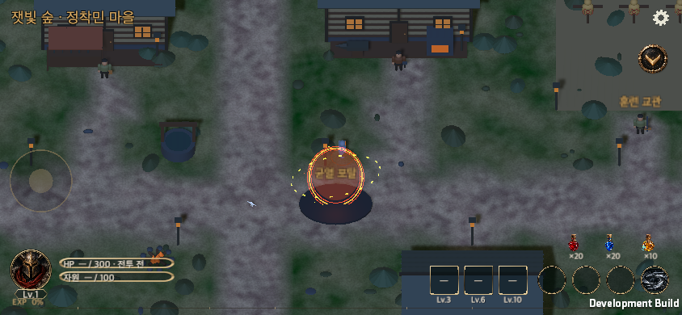

# 마을 HUD 크기·투명도·표시 정리

갱신일: 2026-09-23 · 최초 작성: 2026-09-20

[English](Town_Hud_Responsive.en.md)

## 적용한 동작

마을 UI와 전역 HUD에 9월 20일 요청과 9월 22일 후속 요청을 적용했다.

| 항목 | 현재 동작 |
|---|---|
| 창고 바로가기 | 첨부한 상자 PNG로 표시하며 기존 계정 창고를 연다. 마을과 전투가 같은 아이콘을 쓴다. |
| 이동 패드 | 안전 영역의 짧은 변 길이의 20%를 지름으로 사용한다. 원형과 손잡이 비율을 유지한다. 세로 화면에서는 하단 중앙, 가로 화면에서는 왼쪽 HUD 위에 두며 물약·스킬과 겹치지 않는다. |
| 패드 투명도 | 처음과 사용 종료 뒤에는 불투명도 30%, 누르는 동안에는 100%다. 두 번째 손가락이 소유권을 가져가지 못한다. 해상도 변경, 비활성화, 포커스 상실과 설정 진입 시에는 입력을 해제한다. |
| 물약 배치 | 가로·세로 화면 모두 가장 위에 있는 스킬 행보다 위에 둔다. 세 물약 뒤에는 어두운 올리브색 반투명 뒷판과 황동색 장식·구분선을 표시한다. |
| 마을 안내 | 직업·레벨·횡단 시간 문구, 시설 안내와 메뉴 버튼을 숨긴다. |
| NPC 이름 | 검은 외곽선을 둔 이름만 표시한다. 말풍선 배경과 꼬리, 가까이 갔을 때 이름에 붙던 행동 문구는 표시하지 않는다. 실제 상호작용 카드는 유지한다. |
| 상단 영역 | 안내 문구와 전체 너비 구분선은 숨긴다. 제목은 최대 18 크기로 표시하고 글자 뒤에만 작은 반투명 배경을 둔다. 좁은 화면의 긴 영어 제목도 한 줄 안에 맞춘다. |
| 상단 아이콘 | 스킬 아이콘과 같은 화면 배율을 사용해 확대한다. 설정·바로가기·접기 버튼의 사각 테두리를 제거한다. 원본 그림 안의 원형 장식은 유지한다. 열 전체가 물약 영역과 겹치면 사용할 수 있는 높이에 맞춘다. |
| 하단 기준선 | 세로 화면의 활성 스킬 행은 안전 영역 하단에서 32 논리 단위 위에 고정한다. 기존 148·340 단위 띄우기를 제거했다. 가로 화면은 경험치 선과 스킬 설명이 겹치지 않는 최소 여백을 둔다. 확대된 세로 화면에서는 생명력·자원 표시를 인장 위에 배치한다. |

## 소유 구조와 이미지 출처

기존 `GameUI.Plaza`가 마을 화면을, `TownJoystick`이 포인터 소유권·입력·투명도를, `GlobalHudLayout`이 물약 위치를 담당한다. 화면 픽셀 크기를 구한 뒤 캔버스 좌표로 한 번만 변환한다. 게임 저장 형식·패키지·씬·프리팹은 바꾸지 않았다.

`menu-storage.png`는 사용자가 첨부한 1254×1254 RGBA PNG의 바이트를 그대로 복사했다. 새 이미지 생성, 리사이즈, 배경 제거를 하지 않았다. 실제 완전 투명 픽셀 611,509개와 원본 해시를 [출처 기록](TownHudEvidence/provenance.json)에 보존했다. 기존 `GlobalHudImporter`의 스프라이트·무압축·알파 보존 설정을 사용한다.

## 2026-09-23 검증

관련 Unity Edit Mode 검사 **63개 통과, 실패·건너뜀 0개**를 확인했다. 범위는 `GlobalHudTests`, `GlobalHudResourceTests`, `TownWalkTests`, `InterfaceScaleTests`이며 전체 프로젝트 회귀 검사는 아니다. 공통 UI 계약 검사와 그 검증용 검사 9개도 통과했다. macOS 개발 빌드는 오류 0개로 완료했다.

실행본에서 화면 크기 1600×900, 1600×1000, 2100×900, 900×1600, 956×440, 440×956, 640×360, 360×640에 글자 크기 50·100·150%와 한국어·영어를 조합한 **48개 경우**를 통과했다. 별도로 가로 비대칭 안전 영역과 세로 상단 44·하단 34 여백도 확인했다.

중앙 이동 패드의 실제 이동·정지와 포인터 소유권, 누름·해제 투명도, 물약 뒷판과 스킬 기준선, 제목 한 줄 표시, 테두리 제거를 검사했다. 실제 UI 레이캐스트로 물약·바로가기·설정 버튼의 접근성을 확인했고, 메뉴를 접으면 숨긴 버튼이 눌리지 않고 다시 펼치면 눌리는 것도 검증했다. 창고 열기·닫기와 설정 진입 시 이동 해제, 기존 NPC 서비스 진입도 통과했다. 대장간 검사는 현재 `BlacksmithOpen` 상태를 확인하도록 맞췄다.

macOS 실행본에서 합성 포인터 이벤트를 사용했다. 실제 iOS·Android 기기의 터치 조작은 검증하지 않았다. Unity의 기존 URP 후처리 셰이더 경고가 있으며 이번 작업은 렌더 파이프라인을 변경하지 않는다.

[검사 결과](TownHudEvidence/2026-09-23/editmode.xml) · [실행 결과](TownHudEvidence/2026-09-23/runtime.txt) · [실측 배치](TownHudEvidence/2026-09-23/geometry.txt) · [빌드 결과](TownHudEvidence/2026-09-23/build.txt) · [검증 범위와 소스 해시](TownHudEvidence/2026-09-23/validation.json)

[세로 440×956](TownHudEvidence/2026-09-23/mobile-portrait-ko.png) · [가로 956×440](TownHudEvidence/2026-09-23/mobile-landscape-ko.png) · [PC 16:9](TownHudEvidence/2026-09-23/pc-16-9.png) · [PC 16:10](TownHudEvidence/2026-09-23/pc-16-10.png) · [PC 21:9](TownHudEvidence/2026-09-23/pc-21-9.png) · [세로 안전 영역](TownHudEvidence/2026-09-23/portrait-safe-area.png)

## 2026-09-20 검증 기록

Unity 6000.6.0f1의 관련 Edit Mode 검사 56개가 모두 통과했다. 범위는 `GlobalHudTests`, `GlobalHudResourceTests`, `TownWalkTests`, `InterfaceScaleTests`이며 프로젝트 전체 회귀 검사는 아니다. [검사 결과](TownHudEvidence/editmode-results.xml)를 보존한다.

macOS 개발 빌드는 오류 0개로 성공했다. 1600×900, 900×1600, 844×390, 390×844, 640×360, 360×640에서 글자 크기 50·100·150%를 조합한 18개 경우를 검증했다. 안전 영역과 한국어·영어, 실제 캐릭터 이동·정지, 누름·해제 시 투명도, 두 번째 포인터 간섭 방지, 창고 열기와 설정 진입도 통과했다. NPC 이름의 표시 범위도 현재 화면과 축소한 상단 영역에 맞췄다.

[실행 결과](TownHudEvidence/runtime.txt) · [실측 배치](TownHudEvidence/geometry.txt) · [검증 요약](TownHudEvidence/validation.json) · [빌드 결과](TownHudEvidence/build.txt)

입력 검증은 macOS 실행본에 전달한 EventSystem 포인터 이벤트이며 실제 iOS·Android 기기 터치 검증은 아니다. 실행 로그에 일부 URP 후처리 셰이더 제거 경고가 있었으며 이번 UI 작업에서 렌더 파이프라인은 변경하지 않았다.

## 실행 화면

