# Town 3D models (20 Hunyuan-generated models)

Updated: 2026-10-06

[한국어](Town_Hunyuan_Models.md)

The town's 12 NPCs, three buildings, rift arch, well, lanterns, training dummies and rune altar are now 20 models generated with Tencent Hunyuan3D. They follow this repository's world-art contract (`Resources/World/<family>/<Id>.fbx` + `_A.png` + `_N.png` + manifest) under `World/Town/`. The town scene draws a model when it exists and the previous primitive shapes when it does not. NPC names, positions, services, dialogue and save data are unchanged.

## At a glance

| Item | Detail |
|---|---|
| Models | 20: 12 NPCs · 3 buildings · 1 rift arch · 4 props |
| Triangles | 106,000 across the unique models (NPCs, buildings and arch 6,000 each; props 2,500 each) |
| Repository growth | about 32 MiB (FBX 10.9 + PNG 21.0) |
| Estimated shipped size | about 17.2 MiB (meshes 7.7 + ASTC textures 9.5, before APK compression). Calculated, not measured in a build |
| Validation | Edit Mode and a macOS development-build runtime smoke (landscape 1600×900, portrait 900×1600) |
| Status | Development candidate. Licence review and release-art approval are still pending |

## What was replaced

| Town element | Model | Height | Triangles | Texture |
|---|---|---:|---:|---:|
| Blacksmith NPC Marc Kus | `Npc_MarkKus` | 2.50 m | 6,000 | 512 |
| Warehouse NPC Chador Samaf | `Npc_ChadorSamaf` | 2.52 m | 6,000 | 512 |
| Weapon merchant Jake Bokun | `Npc_JakeBokun` | 2.52 m | 6,000 | 512 |
| Rift attendant Anton Jindark | `Npc_AntonJindark` | 2.47 m | 6,000 | 512 |
| Rune Master Injel Mir | `Npc_InjelMir` | 2.49 m | 6,000 | 512 |
| Gambler Jacques Chei | `Npc_JacquesChei` | 2.50 m | 6,000 | 512 |
| Training instructor Turk Garbi | `Npc_TurkGarbi` | 2.46 m | 6,000 | 512 |
| Gem merchant Guzel Pan | `Npc_GuzelPan` | 2.46 m | 6,000 | 512 |
| Rune merchant Mishu Karu | `Npc_MishuKaru` | 2.48 m | 6,000 | 512 |
| Resident Pyonya Nermwen | `Npc_PyonyaNermwen` | 2.47 m | 6,000 | 512 |
| Resident Jean Jorin | `Npc_JeanJorin` | 2.43 m | 6,000 | 512 |
| Resident Darc Alvi | `Npc_DarcAlvi` | 2.44 m | 6,000 | 512 |
| Blacksmith building | `Building_Blacksmith` | 9.6 m | 6,000 | 1024 |
| Warehouse building | `Building_Warehouse` | 9.6 m | 6,000 | 1024 |
| Weapon-merchant stall | `Building_Merchant` | 5.6 m | 6,000 | 1024 |
| Rift portal stone arch | `Portal_RiftGateway` | 8.0 m | 6,000 | 1024 |
| Rune altar (beside the Rune Master) | `Prop_RuneAltar` | 2.7 m | 2,500 | 512 |
| Stone well | `Prop_StoneWell` | 4.0 m | 2,500 | 512 |
| Iron lantern (reused at 17 places) | `Prop_TownLantern` | 4.0 m | 2,500 | 512 |
| Training dummy (reused at 4 places) | `Prop_TrainingDummy` | 3.0 m | 2,500 | 512 |

The gambling, gem and rune shop buildings, the rune workshop, the aspect stone, trees, fences and ground have no model and keep their existing look. Lanterns and dummies are placed several times, so the whole scene holds about 154,000 triangles (duplicates included, before culling).

## From source file to game tier

The sources are GLB files generated on 2026-10-06 by Hunyuan3D web (HY3D-V3.1, text-to-3D PBR): one mesh of 50,000 faces and three 4096×4096 PNGs (colour, metal/roughness, normal), 25–42 MiB per file. They could not be used as they were.

1. **Reduction.** Blender 5.2 runs headless. It welds vertices, decimates a copy of the source (collapse), unwraps new UVs and then bakes colour, ORM and tangent-space normal **from the source** into new textures. Reducing faces alone would flatten the shading of faces and cloth folds, so the bake is what keeps the form.
2. **Tiers.** The project asset budget (PLAN §4) applies: NPCs 6,000 faces at 512 px, buildings and arch 6,000 faces at 1024 px, large props 2,500 faces at 512 px. These were baked again from the same source, separately from the 10,000-face delivery tier; the already-reduced files were not reduced again, which keeps the loss small.
3. **Quality check.** Each result was rendered against its source from the same camera and light in eight directions (four at eye level, four at the game camera pitch of about 49°). All 20 show no blob-shaped colour or shading defect and no open mesh edges. Similarity to the source (SSIM, mean over the eight views) is 0.78–0.98 at normal size. The lowest scorers (dummy, well, rune altar, Jacques Chei, Chador Samaf) and the arch were also checked by eye on comparison sheets.
4. **Totals.** 20 models: 644 MiB → 28.8 MiB of game-tier GLB, and 993,495 → 106,000 triangles.

The full optimization record (per-model figures, comparison sheets, timings) lives outside the repository in the delivery folder `AssetDeliverables/Hunyuan/2026-10-06/optimized/`. The source GLB files were not modified.

## Import

- `tools/hunyuan_town_export.py` (Blender): applies transforms, fits height or scale, and turns the front to Unity +Z for NPCs and −Z (camera side) for buildings and props. The origin is the centre of the footprint at ground level, and the result is written as FBX. Each model is one mesh, which the importer merges into a single static mesh.
- `tools/import_hunyuan_town.py`: writes `<Id>.fbx`, `<Id>_A.png` (RGB albedo plus alpha = smoothness = 1 − roughness), `<Id>_N.png` (normal) and `manifest_town_hunyuan.json`, and the Unity metas. The manifest records triangles, height, footprint, front, the optimized GLB's SHA-256 and the budget tier per model, with `productionApproved: false`.
- `tools/generate_world_art.py --check` accepts the new revision `hellscript-hunyuan-town-v1`. For this set it checks the naming rule, power-of-two textures, budgets, meta GUIDs and code references (139 assets, 0 problems).
- The Android texture budget `ResourceTextureBudget` gained a `World/Town/` row (max 1024, ASTC 6×6), and the `WorldArtImporter` cap is 1024 for this folder. Only the buildings and arch are 1024 files; the rest are 512 files, so the larger cap never enlarges them.
- Metallic is not used: the world shader (`RiftTerrain`) has a single `_Metallic` value for the whole model, so there is nowhere to put a metal mask. There is no emission mask either; the lantern glow is still the existing point-light emitter.

## Game code

- `WorldView.TownModels.cs`: `TownNpcArt` and `TownBuildingArt` name the models and `SpawnTownModel` creates them through `WorldArt`. When the model is missing it returns `null` and the caller draws the previous primitive. People are built by `CreateTownModelFigure`, which keeps the old figure contract (front toward local −Z, turned to the camera by the caller) by flipping the model 180° inside.
- `WorldView.Town.cs`: builds the attendants, residents, buildings, lanterns, well, dummies, rune altar and rift arch from models. Buildings register with the existing `TownBuildingFade` (see-through when the hero stands behind). The lantern light follows the model's glass height (2.65 m; 2.62 m measured from the albedo). Imported meshes are not CPU readable, so `BatchTownGeometry` merges only readable meshes.
- `TownWalk.cs`: three building collision rectangles now follow the model footprints (table below).
- `RuntimeTownModelsSmoke.cs` (development builds only) and `TownModelTests.cs` (Edit Mode) validate this.

### Collision rectangle changes

The warehouse and blacksmith keep their front edge so the NPC standing spot still fits; the weapon stall was refitted. Walkability is decided by rectangles only (neither primitives nor models carry colliders), and only these rectangles changed.

| Building | Before (width × depth, town y range) | After | Model footprint |
|---|---|---|---|
| Warehouse | 14 × 10, y 16–26 | 11.2 × 9.6, y 16–25.6 | 11.09 × 9.63 |
| Weapon stall | 12 × 9, y 19.5–28.5 | 6.2 × 4.5, y 17.8–22.3 | 6.06 × 4.47 |
| Blacksmith | 14 × 9, y 20.5–29.5 | 8.2 × 8.4, y 20.5–28.9 | 8.05 × 8.38 |

### Rift arch and portal effect

The arch model replaces the old portal dais. The golden rings, orbiting sigils, embers, membrane and point light are grouped under `Portal effect`, shrunk into the arch (scale 0.55) and placed just behind the curtain plane. The curtains leave a gap about 3 m wide and 6 m tall (measured with raycasts); the lower half of the ring shows through best. The model's curtain mesh was not edited. The return portal (coming back from combat) does not use the model.

## Size

Calculated values, not measured in a Unity build. Meshes use the importer's vertex layout (52 B per vertex, 2 B per index); textures assume ASTC 6×6 with mipmaps.

| Item | Size |
|---|---:|
| Meshes (142,986 vertices, 106,000 triangles) | 7.7 MiB |
| Textures — 12 NPCs | 3.6 MiB |
| Textures — 3 buildings + arch | 4.7 MiB |
| Textures — 4 props | 1.2 MiB |
| **Total (before APK compression)** | **17.2 MiB** |

The WebGL build compresses this folder's textures as ETC2 RGBA8 (8 bits per pixel) through `ResourceTextureBudget`, so textures come to about 21.3 MiB and the total, with meshes, to about 29.0 MiB (calculated the same way).

## Validation

- `python3 tools/generate_world_art.py --check`: 139 assets, 0 problems. `python3 tools/test_world_art.py`: 26 tests passed. [Check log](TownHunyuanEvidence/checks.txt)
- Unity 6000.6.0f1 Edit Mode: the new `TownModelTests` check that all 12 NPCs have a model with a height of 2.2–2.8 m, that the three building collision rectangles are within 0.5 m of the model footprints, that each model is one static mesh with its base at y = 0, centred, and with the manifest's triangle count, and that all 40 PNGs carry the Android override (ASTC 6×6, max size ≥ the image edge). Full results are under "Full check" below.
- macOS development-build runtime smoke `-hellscriptTownModelsSmoke`: it enters as an offline-QA guest (`-hellscriptOfflineQa`, isolated save path), verifies by mesh name that every attendant, resident, the three buildings and the rift arch are `World/Town` models rather than primitives, reaches all 10 services, and confirms that the stall fades when the hero stands behind it. The well, dummies and lanterns are visited and captured. It passed in landscape 1600×900 and portrait 900×1600 (exit code 0, `HELLSCRIPT_TOWN_MODELS_SMOKE_OK`). [Result log](TownHunyuanEvidence/smoke-result.txt)
- The existing `Plaza` and `TownHud` smokes cannot reach the town regardless of this change. They failed at the same places in the 2026-09-26 full-smoke baseline (outside the repository, `Artifacts/Validation/FinalMain20260926/compare.txt`: `Entry did not arrive at spawn.` and `NullReferenceException`), because a new account starts with the tutorial. With a fixture that skips the tutorial and attendance windows applied only to a temporary clone, `Plaza` stopped at the interaction-card inset check (`Interaction right inset drifted.`) and `TownHud` at a check that still expects `Page=="training"` after the training-ground window rework (`Named NPC opened the wrong service: Training`). Both are UI and training-ground code this change does not touch. Repairing these smokes is out of scope, so the two repository files are unchanged.

Run the smoke from a development build like this. The save path must be an empty disposable folder, and the arguments must go through an array (zsh does not split a string).

```bash
ARGS=(-hellscriptTownModelsSmoke -hellscriptOfflineQa -hellscriptSavePath "$SAVE" -hellscriptScreenshots "$SHOTS" -screen-fullscreen 0 -screen-width 1600 -screen-height 900)
"<build>/HELLSCRIPT.app/Contents/MacOS/HELLSCRIPT" "${ARGS[@]}"
```

### Runtime captures

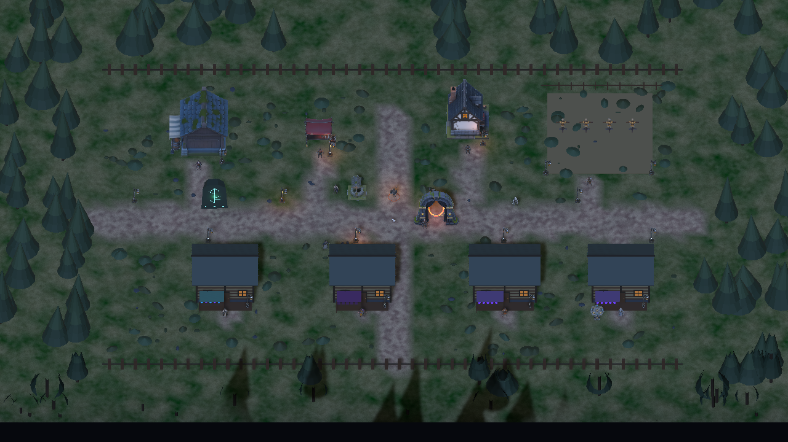

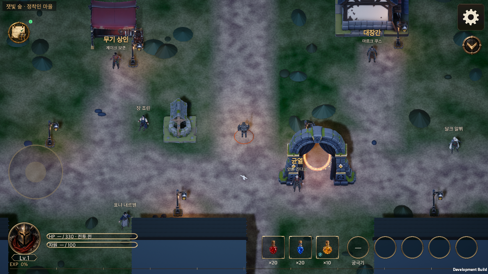

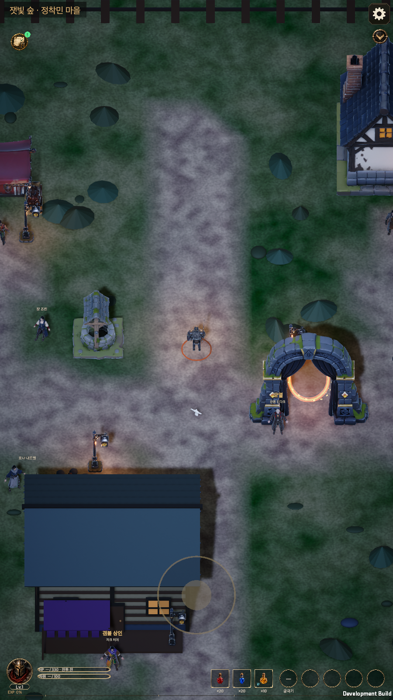

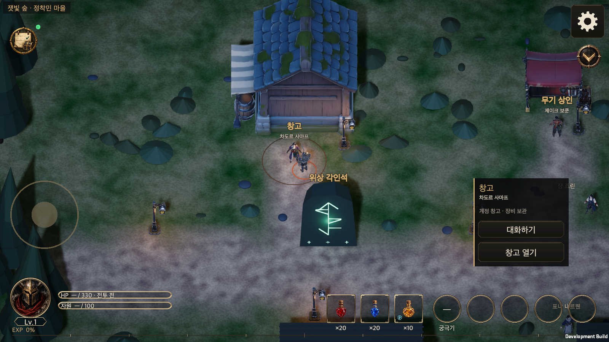

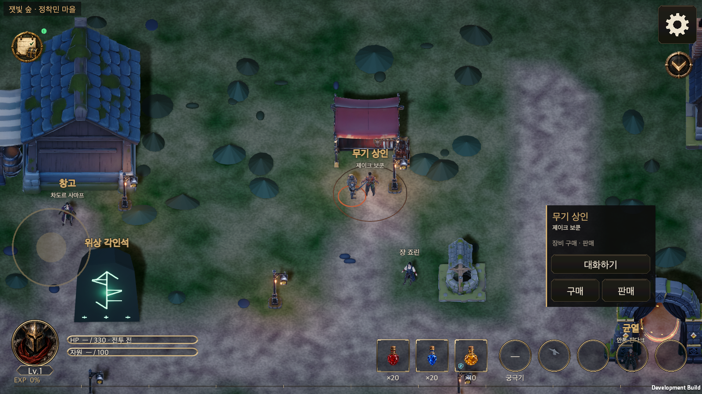

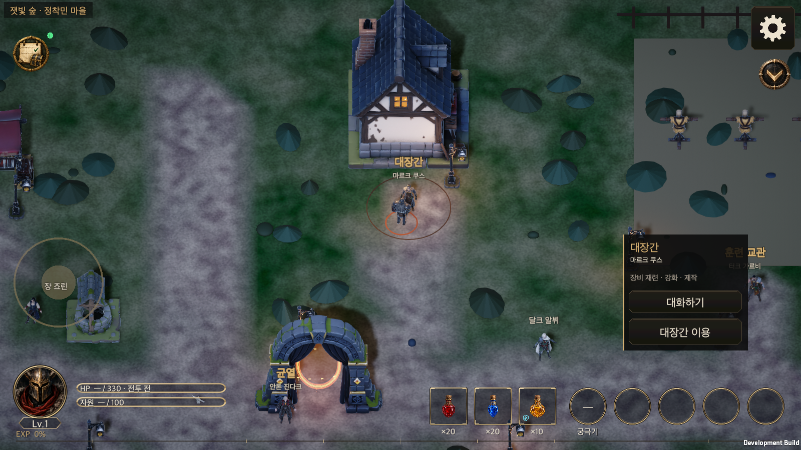

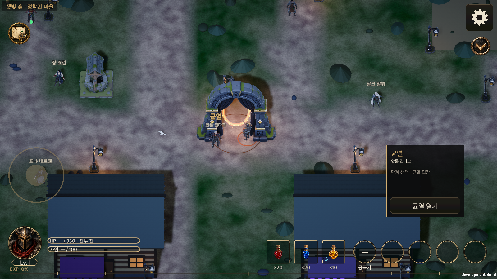

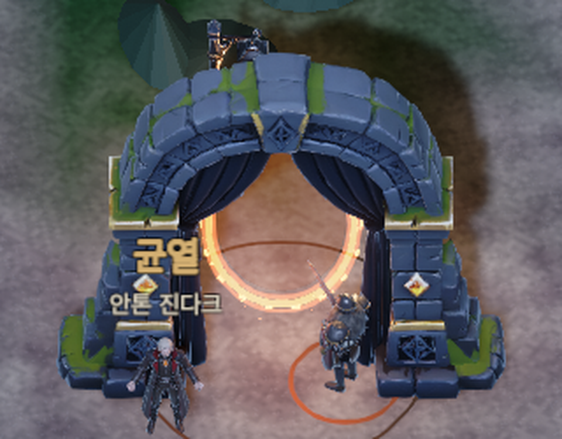

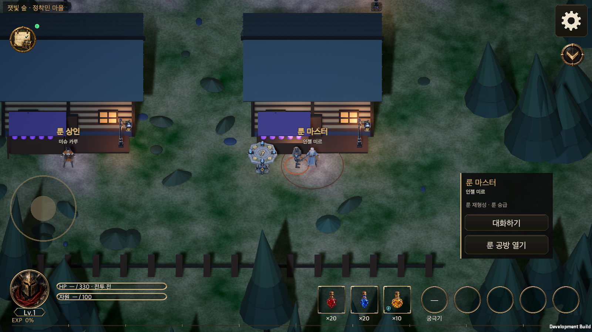

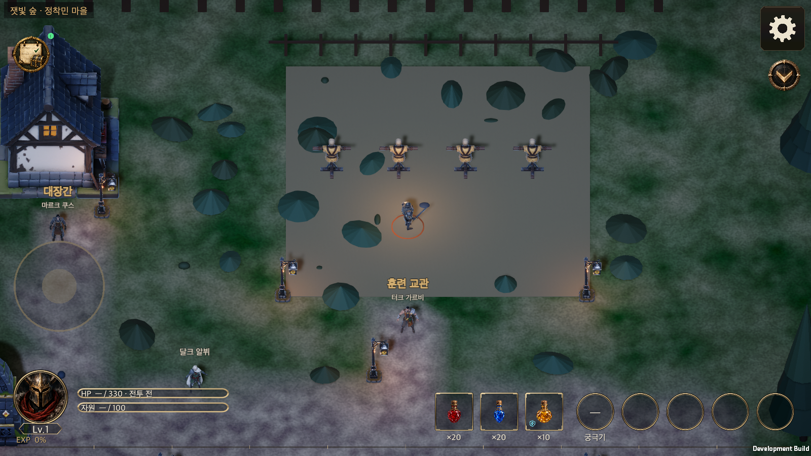

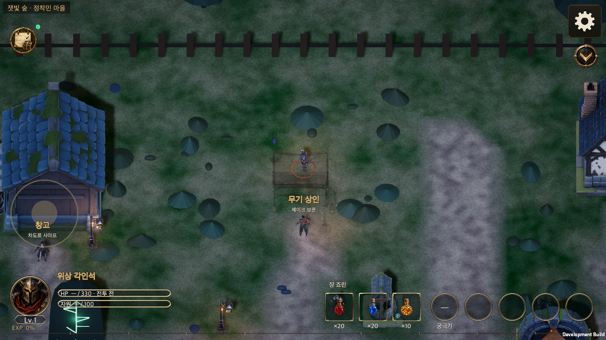

## Full check

After the last code change (the rune altar position) the whole Unity 6000.6.0f1 Edit Mode suite ran once, on commit c9460dd9 over `origin/main` d1d762fb, and took about 31 minutes. The project clone's `Assets` match this branch, and the Docs, Wiki, server and tools folders were copied in with it. The [result summary](TownHunyuanEvidence/editmode.json) is kept.

| Item | Result |
|---|---|
| Total | 5,210 of 5,211 passed, 0 failed, 1 skipped |
| The skipped one | `ClassSkillPassiveMeasurement.MeasureEveryDesignBuild`: a measurement tool that is run separately with the `HELLSCRIPT_MEASURE_OUT` environment variable, so a full run skips it |
| `TownModelTests` | 6/6 |
| `TownWalkTests` | 20/20 (including the collision rectangle changes) |
| `WorldArtTests` | 39/39 |
| `LocalizationTests` · `StoredLocalizationTests` | 33/33 · 19/19 |

The existing runtime smoke bundle was not rerun this time. The new town models smoke passed in landscape and portrait after the last code change (above). The existing smokes that pass through the town already failed at the entry stage in the 2026-09-26 baseline (`Plaza` and `TownHud` as described above), so they give no signal for this change.

## Known limits and follow-up

- **Not verified.** iOS and Android devices, the real size of Android and iOS builds, frame time and draw calls. The 17 lanterns and 12 NPCs are separate meshes, so draw calls may rise compared with the primitives that used to be merged into one batch. Nothing was measured, so no claim is made that performance improved or stayed the same.
- **Licence and approval.** The terms of use for Hunyuan output were not reviewed. The manifest says `productionApproved: false`; this is a development candidate.
- **Metal and emission.** There is no metal texture or emission mask, so the iron lantern and dummy fittings read as non-metal.
- **Arch curtains.** They hide part of the top of the portal effect. Fixing that needs a regenerated model without curtains or mesh surgery, which was judged too risky here.
- **Fine defects.** Jacques Chei has a small blemish on the back of the cape (0.55% of pixels); the game camera shows the front, so it was left. The dummy's straw simplifies at 2,500 faces.
- **No LOD or colliders.** Movement is still decided by rectangles only.
- **Remaining buildings.** The gambling, gem and rune shops and the rune workshop have no model and stay primitives. When models exist, add them as `Building_Gambler`, `Building_GemMerchant`, `Building_RuneMerchant` and `Building_RuneMaster` and fit the rectangles in `TownWalk.cs` to their footprints.

## Reverting and rebuilding

- Revert: delete `Resources/World/Town/` and the code falls back to the previous primitives (it checks `WorldArt.Has`).
- Rebuild: `python3 tools/import_hunyuan_town.py --source <delivery folder>/optimized/game` (needs Blender 5.2), then `python3 tools/generate_world_art.py --check`.
- Provenance: [Temporary asset provenance](Asset_Provenance.md) (Korean; see the "훈위안 생성 마을 3D 모델 (2026-10-06)" section).
