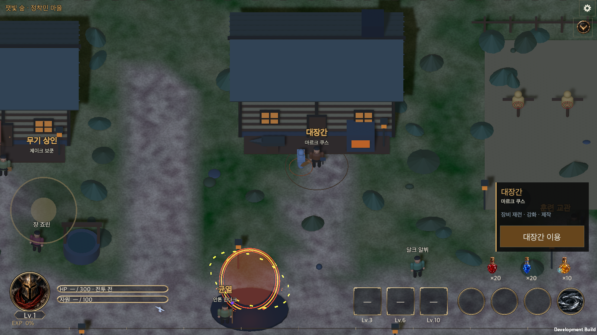
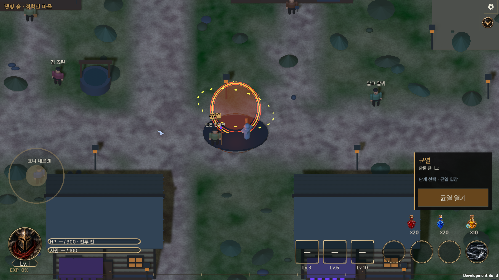
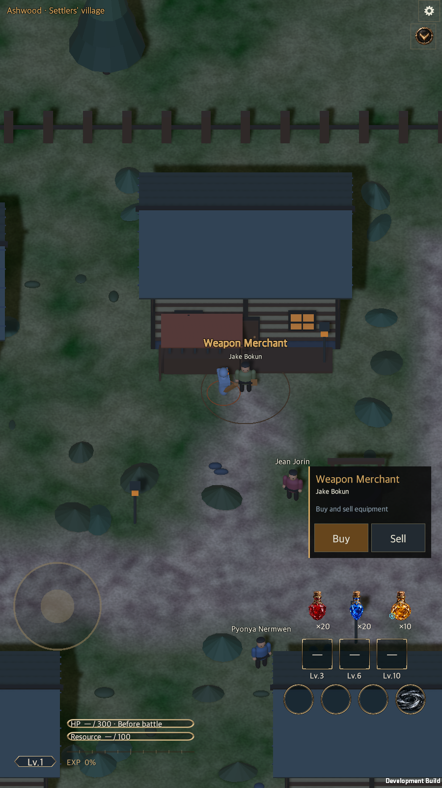

# 마을 NPC 이름과 콘텐츠 표시

작성일: 2026-09-22

[English](Town_Npc_Names.en.md)

## 이름과 배치

사용자가 최종 지정한 표기를 마을에 반영했다. 이전 후보의 철자와 달라도 아래 표기를 사용한다.

| 콘텐츠 | NPC 이름 | 위치 |
|---|---|---|
| 대장간 | 마르크 쿠스 | 기존 대장간 건물 앞 |
| 무기 상인 | 제이크 보쿤 | 기존 장비 상점 앞 |
| 창고 | 차도르 사마프 | 기존 창고 건물 앞 |
| 균열 | 안톤 진다크 | 중앙 오른쪽 포탈의 앞쪽 왼편 |
| 룬 마스터 | 인젤 미르 | 기존 룬 공방 앞 |
| 행인 | 표냐 내르뭰 | 중앙 모닥불 왼편, 마을 좌표 (-13, -7) |
| 행인 | 쟝 죠린 | 우물 왼편, 마을 좌표 (-11, 7) |
| 행인 | 달크 알뷔 | 중앙 길 오른편, 마을 좌표 (23, 4) |

균열 포탈 자체의 위치와 상호작용 목적지는 유지하고 담당 NPC를 추가했다. NPC와 포탈을 눌러 같은 균열 서비스로 이동할 수 있다. 행인은 고정 배치한 주민이며 서비스나 자동 이동을 부여하지 않는다. 기존 갬블·훈련·보석·룬 상점은 유지한다.

## 표시와 연결

- 콘텐츠가 연결된 NPC는 위쪽에 콘텐츠명을 크기 22의 굵은 금색 글자로, 아래에 인물명을 크기 14의 밝은 글자로 표시한다.
- 행인은 크기 16의 이름 한 줄만 표시한다.
- 이름에는 검은 외곽선을 사용하며, 배경이나 입력을 가로채는 버튼은 추가하지 않는다. 화면 좌우에서는 이름이 안전 영역 안에 들어오도록 위치를 보정한다.
- 가까이 갔을 때 뜨는 상호작용 카드에도 콘텐츠명 아래 작은 인물명을 표시한다. 구매·판매·대장간·창고·균열·룬 공방의 기존 동작을 재사용한다.
- 한국어는 프로젝트의 원문 키 방식, 영어는 기존 `Localization/en.txt` 문구 표를 사용한다. 언어 변경 시 이름과 콘텐츠명을 함께 다시 표시한다.

## 구현 근거

- [TownWalk.cs](../../Assets/HELLSCRIPT/Runtime/Core/TownWalk.cs): 콘텐츠·인물 이름과 배치 좌표.
- [WorldView.Town.cs](../../Assets/HELLSCRIPT/Runtime/Presentation/WorldView.Town.cs): 실제 담당 NPC·행인 생성과 균열 포탈 선택.
- [GameUI.Plaza.cs](../../Assets/HELLSCRIPT/Runtime/Presentation/GameUI.Plaza.cs): 두 줄 이름표와 상호작용 카드.
- [RuntimeTownHudSmoke.cs](../../Assets/HELLSCRIPT/Runtime/Presentation/RuntimeTownHudSmoke.cs): 실제 UI·캐릭터 이동·서비스 열기 검증.

## 검증

Unity 6000.6.0f1에서 `TownWalkTests`와 `LocalizationTests`를 실행해 52개 모두 통과했다. 실패·건너뜀은 0개이며 프로젝트 전체 회귀 검사는 아니다. [Edit Mode 결과](TownNpcEvidence/editmode.json)를 보존한다.

macOS 개발 빌드가 오류 0개로 성공했고, 별도 저장 경로를 사용하는 실제 실행본에서 다음을 확인했다.

- 한국어 가로 화면 1600×900과 영어 세로 화면 900×1600에서 담당 NPC 5명 모두에게 이동하고 실제 버튼의 포인터 클릭 처리로 해당 콘텐츠를 열었다. 자동 이동 도착만으로는 콘텐츠가 열리지 않았다.
- 행인 3명 모두에게 이동했으며 이름은 보이고 서비스 동작은 생기지 않았다.
- 실제 생성된 NPC 위치, 이름 원문·영문, 콘텐츠명과 인물명의 상하 순서·크기 차이, 글자 잘림과 안전 영역을 확인했다.
- 기존 HUD 검사를 함께 실행해 6개 해상도와 글자 크기 50·100·150%의 18개 조합, 안전 영역, 조이스틱 이동·정지와 창고 바로가기까지 통과했다.

[빌드 결과](TownNpcEvidence/build.json) · [NPC 실행 결과](TownNpcEvidence/npc-runtime.txt) · [HUD 실행 결과](TownNpcEvidence/runtime.txt) · [화면 배치 기록](TownNpcEvidence/geometry.txt)

검증에는 현재 체크아웃의 기존 변경사항이 포함된 실행본을 사용했다. 입력은 macOS에서 합성한 EventSystem 포인터 이벤트이며 iOS·Android 실기기 터치를 확인한 것은 아니다. NPC는 기존 마을의 단순 메시 표현을 재사용하며, 앞서 논의한 상세 인물 외형을 제작한 작업은 아니다.

## 실행 화면

