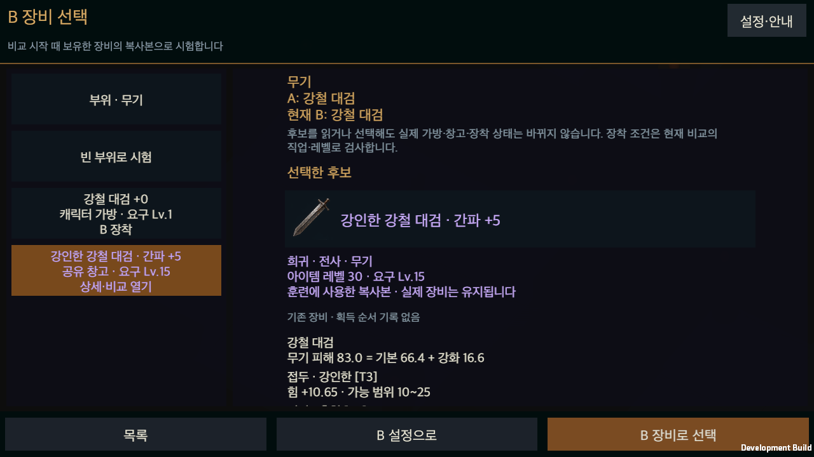
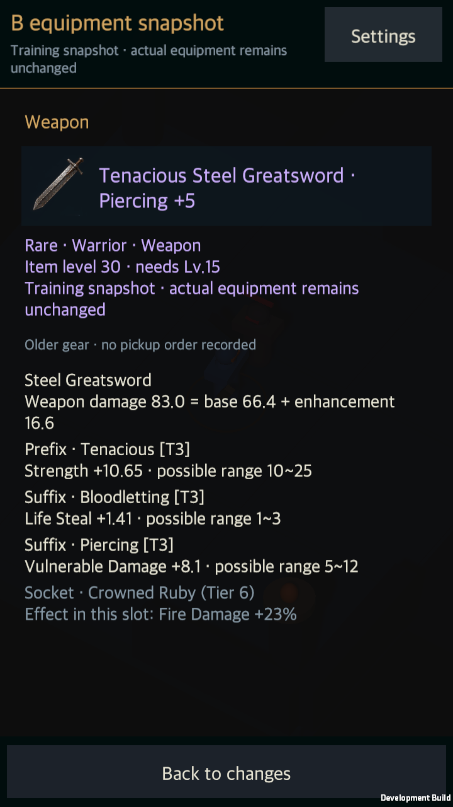
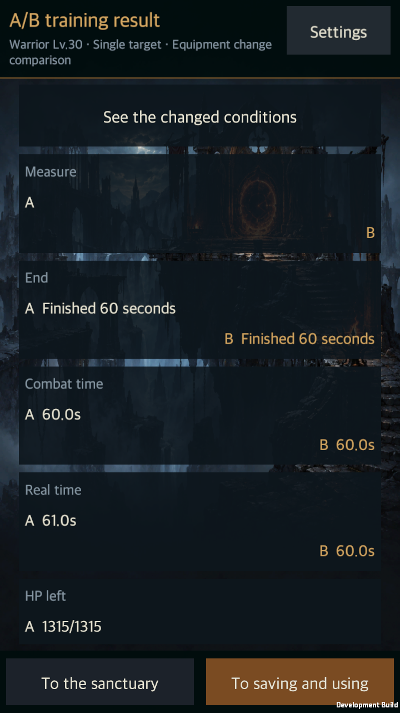
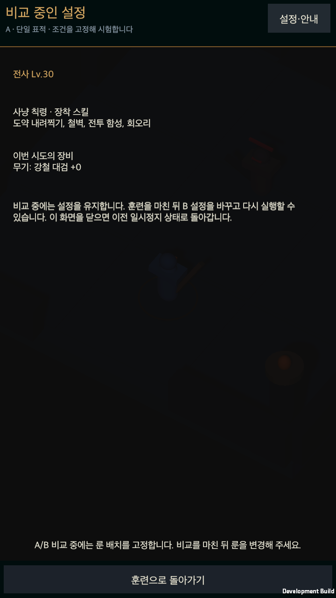

# 소유 장비로 훈련 A/B 비교

작성일: 2026-09-13 · [English](Training_Equipment_Expansion.en.md)

상태: 데스크톱 구현·검증을 마쳤다. 최종 전체 검사 2,515개와 실제 앱의 실행·재시작을 통과했으며 화면 13장을 검토했다. 모바일 실기기 검증은 남아 있다.

## 실제 보유 장비로 만드는 B

[소유 장비 훈련 기획](../Design/HELLSCRIPT_Training_Equipment_Detail.md)과 [화면 배치 기준](../Design/HELLSCRIPT_Screen_Layout_Detail.md)을 따라 훈련장 A/B 경로에 장비 선택을 추가했다. A를 마친 뒤 B 설정에서 부위를 고르고, 비교를 시작할 때 해당 캐릭터의 가방이나 공유 창고에 있던 장비를 선택한다. 직업·요구 레벨을 검사하며 부위당 한 개 또는 빈 부위를 시험할 수 있다.

소유 ID와 장비의 전체 값을 처음에 함께 복사한다. 강화·접사·각성·상위 접사·걸작·보석·잠금 상태를 보존한다. 창고 장비를 선택해도 실제 가방 용량을 소비하거나 장비를 옮기지 않는다. 상세 열람은 실제 장비의 확인 표시도 바꾸지 않는다. 다른 영웅의 개인 장비는 후보에서 제외한다. 비교 시작 뒤 얻은 장비를 사용하려면 새 비교를 시작해야 한다.

장비 후보는 좁은 화면에서 목록과 상세를 전환하고, 넓은 화면에서는 두 영역을 함께 보여 준다. 후보의 전체 옵션과 B 교체 전후 능력치·보석·세트 변화를 읽을 수 있다. 선택과 스크롤 위치를 유지하며 하단에는 목록·B 설정 복귀·선택 조작을 둔다. 모든 새 문구는 한국어와 영어를 갖춘다.

## 실제 전투 기준과 행동 편집

기존 A/B 생성 경로가 계정 룬 보드를 빠뜨리던 문제를 수정했다. A/B는 처음의 같은 룬 보드를 복사해서 사용하며, 무기를 바꾸면 해당 무기의 보드 효과를 적용한다. 실제 계정의 장비 수치나 룬 배치를 나중에 바꿔도 진행 중인 비교 기준은 바뀌지 않는다. A와 B는 같은 시드·배치에서 HP·자원·쿨타임·효과를 새로 시작한다.

비교 도중 성장 화면에서 룬 편집기로 이동하던 경로를 막았다. 룬 메뉴는 고정 조건을 읽는 화면으로 연결되며 돌아오면 이전 일시정지 상태를 복원한다. 룬 저장 서비스도 비교 실행을 식별해 실제 계정 저장과 전투 능력치 교체 전에 변경을 거부한다. 일반 훈련과 균열의 룬 변경 규칙은 유지한다.

사냥 칙령 사용자는 기존 칙령 편집기로 B의 실제 칙령을 편집하고, 기본 행동 사용자는 기존 행동·스킬 편집기를 사용한다. 패시브도 B에서 바꿀 수 있다. 칙령을 쓰는 캐릭터에게 비활성 기본 행동의 차이를 실제 행동 변화로 표시하지 않는다. 기본 칙령에 미리 들어 있던 미해금 스킬은 비활성 상태를 유지하며, B에 미해금 스킬을 새로 배치하는 것은 막는다.

실행을 시작한 뒤 장비·레벨·칙령을 바꾼 시도와 중도 포기는 완성된 고정 조건 비교로 저장하지 않는다. 기존 세 직업·세 훈련·내부 세 배속의 재현성 검사를 유지한다. 일반 사용자의 훈련은 기존 정책대로 1배속만 제공한다.

## 결과와 저장 범위

버전 2 결과는 A/B 장착 장비 원본·각 행동 설정·활성 칙령·계정 룬 보드를 보관한다. 행동과 장비의 변경을 함께 표시하고, 같은 장비를 썼는지 교체했는지를 구분한다. 장비 원본은 실제 아이템이 나중에 바뀌거나 사라져도 당시 값으로 읽는다. 이전 버전 1은 기존 의미로 보존하며 없던 룬 정보를 현재 계정에서 가져와 채우지 않는다. 지원하지 않거나 불완전한 기록은 원본을 유지하고 조회 제한을 알린다.

결과 저장과 슬롯 저장은 명시적인 조작이다. B를 슬롯에 저장하면 B가 실제 시험한 장비 ID를 저장한다. 기존에 A의 장비 ID만 저장하던 경로를 수정했다. 현재 장비를 즉시 교체하지 않으며 이후 프리셋 불러오기에서 누락·소유권을 다시 확인한다.

기존 빌드 슬롯은 장비 참조·패시브·기본 행동을 저장하며 전체 사냥 칙령 원본의 보관함이 아니다. 결과의 선택한 칙령은 별도 버튼으로 실제 칙령 편집안에 불러온다. 사용자가 직접 적용하기 전에는 실제 설정을 바꾸지 않는다.

## 검증과 남은 범위

최종 룬 변경 방지 보완 후 장비·룬·번역 집중 검사 100개를 다시 통과했다. 공개 룬 저장 경로에서 비교 조건을 변경할 수 없고, 일반 훈련의 기존 변경은 정상 동작함을 확인했다.

집중 검사 118개에서 장비·룬 동결, 소유권·직업·레벨·부위 중복, 실제 별도 장착 전투와의 일치, 전설·세트·각성·걸작·보석 원본, 활성 칙령, 구형 기록과 번역을 확인했다. 최초 집중 검사에서 발견한 시험 자료의 잘못된 필드·장비 분류·무기 ID와 직렬화 소수 오차 비교는 수정 이력에 남겨 두었다.

최종 전체 검사 2,515개와 Build8의 초기 실행·별도 프로세스 재시작이 통과했다. UI의 실제 클릭 대상 판정 후 이벤트로 창고 장비 선택·취소·활성 칙령 변경·결과 저장·B 장비 프리셋·실제 칙령 편집안 불러오기와 취소를 확인했다. 한국어·영어, 140% 글자와 세로·넓은 가로·짧은 가로 화면 13장을 검토했다. 큰 글자로 바꾼 후 장비 설명이 잘리던 문제를 고쳤다. 최종 전체 검사·룬 회귀 집중 검사·앱 빌드·현재 작업 소스의 해시가 모두 같다. 준비된 소유 장비를 사용하는 통제된 검증이며 자연 성장이나 파밍 밸런스 완성을 뜻하지 않는다. Android 실기기의 물리 터치·장시간 실행, 단일 비교를 통한 신규 사용자의 이해도, N10 이외 적의 회피 분석과 시간당 파밍 효율은 별도 후속 범위다.

근거: [전체 검사 XML](../../Artifacts/Validation/training-equipment-editmode.xml), [검증 요약](../../Artifacts/Validation/TrainingEquipment/validation-summary.json), [검증 소스](../../Artifacts/Validation/TrainingEquipment/validated-source.json).

