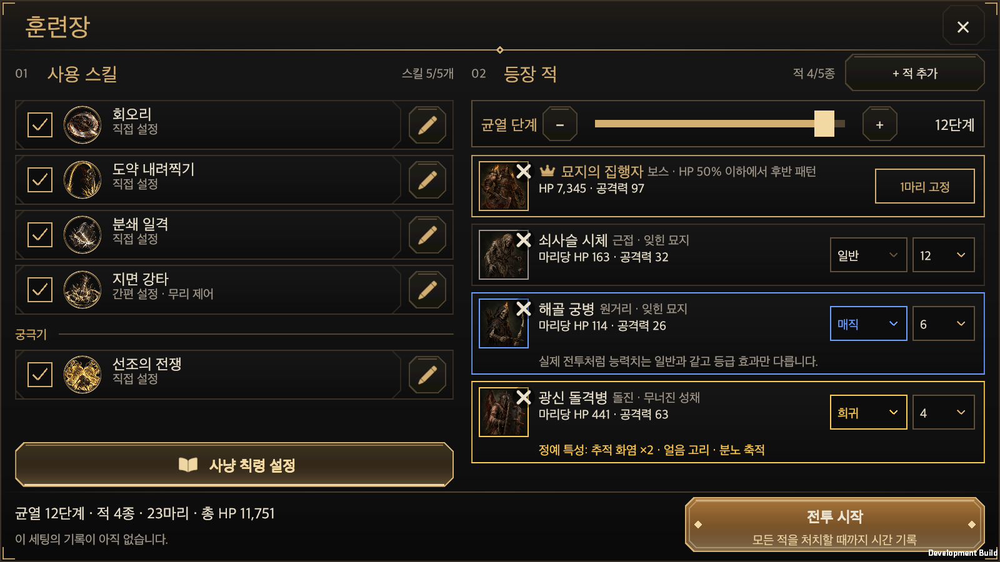
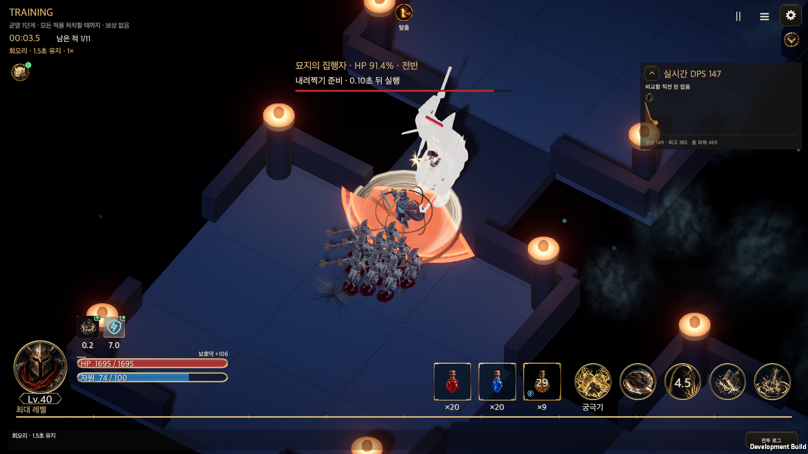
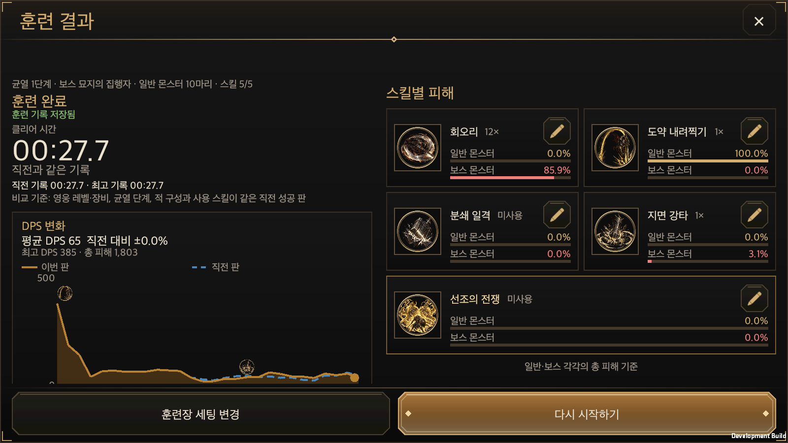

# 훈련장 구현

갱신일: 2026-09-30 · 최초 작성 2026-09-29 · [English](Training_Ground.en.md)

[훈련장 개편 상세안](../Design/HELLSCRIPT_Training_Ground_Rework.md)을 실제 게임에 구현한 기록입니다. 규칙과 배경은 상세안을, 화면 구성은 [HTML 시안](../../Prototypes/TrainingGround/README.md)을 따릅니다. 이 문서에는 소유 코드, 동작, 바뀐 기존 기능, 검증 결과를 적습니다.

## 소유 구조

| 영역 | 소유 코드 | 책임 |
|---|---|---|
| 규칙과 기록 | `TrainingGround` | 세팅 검증, 같은 세팅의 기준, 시드, 행별 정예 특성, 초당 피해의 3초 평균, 결과 요약, 세팅별 직전·최고 기록(최근 12개 세팅), 칙령 변경 목록 |
| 전투 모드 | `CombatSimulation.TrainingGround`, 생성자·`SpawnEnemy`·`SettleCombatOutcome`·`Deal`의 연결 | 훈련 번호 4, 계정 사본, 시작 방의 무리 배치, 이동형 보스 등장, 성공·실패 판정, 초당 피해 기록, 체크를 끈 스킬의 자동 사용 끄기 |
| 적 능력치 | `CombatSimulation.EnemyStats` | 모든 적 생성이 거치는 단일 공식입니다. 균열·훈련장·로비 표시가 같은 값을 씁니다. |
| 정예 특성 | `RiftGenerator.RollEliteTraits`, `RollElitePair` | 균열 생성과 같은 규칙과 추첨 순서입니다. |
| 저장 | `GameStore.SaveTrainingGroundSetup`, `RecordTrainingGround`, `HeroSave.trainingGround` | 로비 세팅과 성공 기록을 영웅 저장에 보관합니다. 저장이 실패하면 이전 상태로 되돌립니다. |
| 진행 | `GameController.TrainingGround` | 균열과 같은 `BeginRun` 경로로 시작하고, 라이브 운영 스냅샷을 전달합니다. 끝나면 기록하고, 중단·세팅 변경 시 로비로 돌아갑니다. 매직·전설 무리에 등급 효과를 표시합니다. |
| 화면 | `TrainingGroundWindow`(`.Skills`·`.Enemies`·`.Hero`·`.Picker`), `TrainingGroundResultWindow`, `GameUI.TrainingGround`, `TrainingChartView`, `TrainingDpsChart` | 로비(스킬 열·적 열·훈련장 배경 패널·하단 바)·적 추가·결과 창, 칙령 바로가기, 전투 중 DPS 패널(접기)·일시정지 창·Esc 처리, 두 판의 DPS 그래프와 스킬 사용 표시·조사 툴팁 |
| 스킬 사용 기록 | `TrainingGroundRunState.casts`, `CombatSimulation.RecordTrainingCasts`, `TrainingGround.MarkedOnGraph`·`CastsIn` | 전투 통계의 스킬 발동 횟수가 늘 때마다 그 시각(틱 중간)을 기록한다. 그래프에 아이콘을 얹을 스킬(쿨타임 3초 이상, 궁극기 포함)을 정하고, 초마다 묶어 툴팁에 준다. |
| 공통 부품 | `UiIconButton`, `UiDropdown`, `RiftSkillShareView` | 글자 없는 아이콘 버튼(연필·접기·삭제), 목록 상자(등급·마릿수), 균열 결과와 공유하는 스킬 피해 카드(연필 버튼 추가 인자). |
| 그림 | `Resources/Art/TrainingGround/Icons`, `TrainingGroundArtImporter`, `ResourceTextureBudget` | Codex가 그린 흰색 픽토그램 4개(연필·책·삭제 X·왕관). 게임에서 색을 입힌다. [이미지 출처](../Art/TrainingGround/training-ground-icons-manifest.json) |

공통 창(`ContentWindowView`), 글꼴·색(`UiFonts`, `UiTheme`), 스킬 아이콘(`SkillIconView`), 슬라이더(`SettingsStepSlider`), 사냥 칙령 편집(`HuntEdictWindow`, `GameStore.CommitHuntEdict`)을 그대로 사용합니다. 새 캔버스나 글꼴, 칙령 저장 경로는 만들지 않았습니다. 가로 로비의 두 열 독립 스크롤은 [공통 UI 계약서](Shared_UI_Contract.md#훈련장)에 기록했습니다.

`RiftSkillShareView`는 균열 결과 개편(PR 40, 아직 병합 전)이 만든 스킬 카드입니다. 훈련장 결과가 같은 양식을 쓰도록 같은 파일(내용·GUID 동일)을 이 작업에도 넣었고, 카드 오른쪽 위에 연필 버튼을 달 수 있는 선택 인자(`edit`)와 카드 최소 높이 함수(`MinHeight`)만 더했습니다. 두 작업이 모두 병합되면 이 파일은 한쪽 내용(이쪽이 상위 집합)으로 합치면 됩니다.

## 동작

- **진입:** 광장의 훈련장, 성소 메뉴의 **훈련장**, 균열 관리자의 **훈련장**에서 로비를 엽니다. 옛 고정 훈련 3종과 **같은 조건으로 A/B 비교** 버튼은 없앴습니다. 직업별 실습(튜토리얼 H17)은 튜토리얼 목록에서 계속 열 수 있고, 내부의 A/B 비교 기능은 그대로 둡니다.
- **로비:** 시안(2026-09-30)과 같은 구성입니다. 가로 화면은 두 구역의 제목(`01 사용 스킬`, `02 등장 적`과 개수, `+ 적 추가`)을 고정 탐색 행에 두고 두 열이 각자 스크롤합니다. 21:9(폭 900 단위 이상)에서는 왼쪽에 훈련장 배경 패널(배경 그림, 제목, 이 세팅의 최고·직전 기록)이 붙고, 세로 화면은 배경 패널·스킬·적을 한 페이지에 쌓습니다.
  - **사용 스킬:** 장착한 액티브 4칸과 궁극기를 보여 줍니다. 스킬마다 체크박스와 현재 칙령 요약, 글자 없는 **연필 아이콘 버튼**(칙령 수정)이 있고, 자동 사용이 꺼진 스킬은 경고를 표시합니다. **사냥 칙령 설정** 바로가기는 스킬 열 아래에 책 그림이 있는 넓은 금색 버튼으로 고정합니다(세로 화면은 제목 바로 아래, 기본 공격 안내와 함께). 가로 화면에서는 장착 스킬 5개가 스크롤 없이 한 화면에 들어옵니다(글자 크기를 키우면 스크롤).
  - **등장 적:** 균열 단계는 한 줄에 −/+ 버튼, 슬라이더, 단계 값으로 고릅니다. 1단계부터 최고 돌파 + 1단계까지이며, 열린 단계가 40을 넘으면 −10/+10 버튼이 붙습니다. 슬라이더를 끄는 동안에는 값만 바뀌고 손을 떼면 로비를 다시 그립니다. 적은 5종까지이며, 행은 낮게 만들었습니다. 초상화 오른쪽 위에 테두리 없는 ×, 이름·역할과 실제 HP·공격력, 일반 몬스터는 오른쪽에 **등급 목록 상자**와 **마릿수 목록 상자**(1~20)를 나란히 둡니다. 보스 행은 `1마리 고정`을 표시합니다. 폭이 좁으면 목록 상자가 글 아래로 내려갑니다. 희귀 행은 정예 특성을, 매직·전설 행은 능력치가 일반과 같다는 안내를 한 줄 더 보여 줍니다.
  - **하단 바:** 가로는 균열 단계·종류·마릿수·총 HP 요약과 이 세팅의 최고·직전 기록을 왼쪽에, 부제(`모든 적을 처치할 때까지 시간 기록`)가 있는 **전투 시작**을 오른쪽에 고정합니다. 세로는 요약을 탐색 행에 둡니다. 세팅은 로비를 닫거나 전투를 시작할 때 저장합니다.
- **전투:** 훈련은 실제 계정의 사본으로 실행하며 보상·XP·균열 기록을 남기지 않습니다. 상단에 걸린 시간과 남은 적을 표시합니다. DPS 패널은 최근 3초 평균, 직전 성공 판의 같은 시점 대비 증감, 두 판의 그래프, 평균·최고·총 피해를 보여 줍니다. 그래프에는 쿨타임이 3초 이상인 스킬(궁극기 포함)을 쓴 시점마다 그 스킬 아이콘이 선 위에 붙습니다. 패널 왼쪽 위의 **화살표 버튼**으로 패널을 실시간 DPS 한 줄로 접었다 펼 수 있고, 접은 상태는 앱을 켜 둔 동안 유지됩니다. 일시정지 버튼·Esc·관찰 메뉴로 멈추면 전투 시간이 멈춥니다. 일시정지 창과 전투 탈출 버튼의 **훈련 중단**은 기록 없이 로비로 돌아갑니다. 훈련 중에는 사냥 칙령·행동 편집을 막습니다. 편집한 판은 같은 세팅의 비교에 쓸 수 없기 때문입니다.
- **결과:** 성공하면 클리어 시간, 직전 성공 판 대비 증감(초와 %), 첫 기록·빨라짐·느려짐·같음, 최고 기록 갱신, 평균 DPS 증감, 두 판의 그래프를 보여 줍니다. 그래프를 마우스로 가리키거나 손가락으로 누르면 십자선과 툴팁이 나타나 그 초의 두 판 DPS와 **그 초에 쓴 스킬 이름**(아이콘이 없는 회오리·분쇄 일격도)을 보여 주고, 손을 떼도 다른 곳을 누를 때까지 남습니다. 세로로 문지르면 페이지가 스크롤됩니다. 실패하면 **기록 없음**과 쓰러진 시점(또는 제한 시간 초과), 남은 적을 보여 줍니다. 스킬별 피해는 균열 결과와 같은 카드입니다. 일반 스킬 4개는 2×2로, 궁극기는 전체 너비로 놓고, 카드마다 큰 아이콘·이름·사용 횟수·일반 몬스터와 보스 각각의 피해 비중 게이지와 연필 아이콘 버튼(칙령 수정)을 둡니다. 쓰지 않은 스킬은 흐리게 보이고 `미사용`이라고 적힙니다. 아래에 직전 판 이후 바뀐 칙령 목록이 이어집니다. 결과 화면에서 저장한 칙령은 **다시 시작하기**부터 적용되며, 그 건수를 안내합니다.
- **튜토리얼:** 훈련장 튜토리얼(UL01_TRAIN)과 개방 안내 문구를 새 훈련장에 맞게 바꿨습니다. 성공·사망·제한 시간으로 끝난 훈련은 훈련 튜토리얼과 첫 플레이 안내의 훈련 단계로 인정하고, 중단한 판은 인정하지 않습니다.

## 기존 스모크 수정

- `RuntimeTutorialSmoke`: F07 단계가 옛 훈련 버튼 대신 로비의 **전투 시작**으로 훈련합니다.
- `RuntimeFirstPlaySmoke`: 7단계가 로비에서 훈련을 시작합니다.
- `RuntimeComparisonSmoke`: 훈련장 페이지 대신 A/B 비교 선택 화면을 직접 엽니다.
- `RuntimeTouchLayoutSmoke`: 더는 페이지가 아닌 훈련장 항목을 페이지 순회에서 뺐습니다. 훈련장의 배치는 새 스모크가 검사합니다.
- `RuntimeTrainingSmoke`: 없어진 고정 훈련 화면을 검사하던 스모크라 삭제했습니다.

## 검증

### 2026-09-30 시안 반영

검증은 이번에도 작업 폴더를 APFS로 복제한 Unity 6000.6.0f1 프로젝트에서 했습니다. 사용자가 열어 둔 Unity 편집기와 실제 계정 저장은 쓰지 않았습니다. `main`을 `513b940b`까지 병합한 최종 상태에서 전체 편집 모드 검사와 macOS 개발 빌드의 훈련장 스모크를 돌렸습니다. 검사를 돌린 뒤에는 스모크 코드(폰 폭 DPS 띠 항목)와 문서·증거만 바뀌었습니다.

- **새 편집 모드 검사 12개.** `TrainingGroundTests`에 3개(스킬 발동을 시각과 함께 기록하고 통계와 일치, 쿨타임 3초 이상만 그래프 아이콘 대상, 발동을 초 단위로 묶음)를 더했고, 새 `TrainingGroundUiTests` 9개가 그래프의 스킬 아이콘(대상 스킬만, 기록된 초만, 차트 안쪽, 긴 전투는 최근 것만), 툴팁(그 초의 스킬 이름, 아이콘 없는 스킬도, 두 판의 값, 양 끝에서 차트 안쪽), 빈 그래프, 목록 상자, 아이콘 버튼과 스킬 카드의 연필(장착한 스킬에만)을 확인합니다.
- **관련 검사 통과.** 훈련장(35)·훈련장 화면 부품(9)·번역·저장된 기록 번역·공통 UI·전투 기록·빌드 리소스 묶음이 모두 통과했습니다. 번역 검사가 중복 키 1개와 남은 항목 7개(없어진 문구)를 잡아 고쳤습니다.
- **전체 편집 모드 검사.** 4,896개 중 4,849개가 통과했고 47개가 실패했습니다(약 32분). 실패 47개는 2026-09-26 main 전체 검사에서 이미 실패하던 47개와 이름까지 같은 목록(`ActionContinuityTests`, `CurrentBuildSaveTests`, `RestoreFidelityTests` 등)이라 이 작업이 만든 실패는 없습니다. 훈련장 검사 44개는 모두 통과했습니다. 검사한 커밋은 스킬 아이콘 수 제한을 넣은 뒤의 `4ee7d96c`입니다.
- **훈련장 스모크 51줄 통과.** 실제 uGUI 레이캐스트와 포인터 누름·놓음·클릭으로 다음을 확인했습니다. [조작 결과](TrainingGroundEvidence/runtime.txt)
  - 로비: 장착 스킬 5개가 16:9 가로에서 스크롤 없이 들어가고, 연필 버튼·스킬 아래 사냥 칙령 설정·등급과 마릿수 목록 상자·보스 `1마리 고정`·Codex 아이콘 4개가 있습니다. 목록 상자를 눌러 항목을 고르고(긴 마릿수 목록은 스크롤), 슬라이더를 눌러 균열 단계를 올리며, 손을 떼면 값이 로비에 반영됩니다.
  - 전투: 그래프를 접으면 실시간 DPS 한 줄이 되고 펼치면 돌아옵니다. 폰 폭(420×900, 글자 150%)에서는 헤더 아래 띠가 접히고 펴집니다.
  - 결과: 일반·보스 게이지가 있는 스킬 카드와 카드마다 연필 버튼, 그래프의 스킬 아이콘 4개, 마우스를 올린 초의 툴팁에 스킬 이름이 나오고 떠나면 사라집니다. 같은 칙령으로 다시 시작하면 클리어 시간이 27.75초로 정확히 같았습니다.
  - 화면 크기: 로비와 결과를 각각 20개 조합(세로 440×956, 가로 956×440, PC 1600×900·1600×1000·2100×900 × 한국어·영어 × 글자 100%·150%)에서 검사했습니다. 고정 버튼이 창 안에 있고 포인터가 닿으며(다시 그린 직후를 위해 몇 프레임 재시도), 스크롤 영역 글자가 잘리지 않고, 영어에 한국어가 남지 않았습니다. 훈련장 배경 패널은 세로와 21:9에서만 나타납니다.
- **UI 스타일 스모크**(1440×810 한국어)가 통과했습니다. 스킬이 없는 새 영웅의 훈련장 로비(빈 스킬 칸 4개, 궁극기 없음)도 정상으로 그려집니다. 이 스모크는 아이콘 수 제한을 넣기 전 빌드로 돌렸고 그 뒤에는 다시 돌리지 않았습니다(제한은 로비와 무관합니다).
- **공통 UI 계약 검사** `check_ui_contract.py`와 시험 11개가 통과했습니다. 첫 검사에서 배경 패널의 색 리터럴 2건을 `UiTheme` 토큰으로 바꿨습니다.
- **HTML 시안**은 `node Prototypes/TrainingGround/build.cjs`로 다시 빌드해 출처 해시만 갱신했고, 헤드리스 Chrome 검사 183개가 통과했습니다.

스모크를 돌리며 찾아 고친 것: 회전한 접기 화살표가 사라짐(회전 중심), 목록 상자 항목이 화면 밖이라 눌리지 않음(스모크가 목록을 스크롤), 영어 150% 결과 카드의 글자 겹침(한 열로 전환), 접힌 DPS 패널의 비교 문구 잘림(2행 배치), 큰 글자에서 시작 버튼 부제 잘림, 폰 가로 화면에 배경 패널이 나옴(가로세로비 2.2 이상만), 옛 고정 스킬 픽스처(새 계정은 스킬 없이 시작).

아래 세 절은 2026-09-29 최초 구현의 기록입니다.

검증은 작업 폴더를 APFS로 복제한 Unity 6000.6.0f1 프로젝트에서 했습니다. 사용자가 열어 둔 Unity 편집기와 실제 계정 저장은 사용하지 않았습니다. 전체 편집 모드 검사는 `main`을 `ac3c5183`까지 병합한 상태에서 처음 돌렸습니다. 그 뒤 `main`의 대장간 이동 작업(`b1989282`)을 병합하고 전체 검사에서 찾은 결함을 고친 최종 상태로 관련 검사, 전체 검사, macOS 빌드, 훈련장 스모크를 다시 돌렸습니다.

### 편집 모드 검사

- 새 검사 `TrainingGroundTests` 32개가 통과했습니다. 확인한 내용은 다음과 같습니다.
  - 단계별 적 능력치가 같은 단계 실제 균열의 생성 결과와 같습니다(1·4·10·37단계, 일반 20종과 보스 5종). 라이브 운영 배율도 균열과 같게 적용합니다.
  - 정예 특성은 균열 규칙을 따르고, HTML 시안과 같은 추첨 결과 7개를 두 검사가 함께 고정합니다. 정예 두 마리 행의 생명 연결 쌍도 확인했습니다.
  - 같은 세팅은 같은 배치로 시작하고 같은 전투를 반복합니다. 일반 몬스터를 모두 잡으면 보스가 나오고, 보스를 잡으면 성공합니다.
  - 사망과 제한 시간은 실패이며 기록하지 않습니다. 체크를 끈 스킬은 장착을 유지한 채 쓰지 않습니다(기본 추천 세팅을 켠 경우 포함).
  - 초당 피해의 합은 준 피해와 같고, 3초 평균을 계산합니다. 직전·최고 기록과 12개 세팅 제한, 세팅 기준, 칙령 변경 목록, 잘못된 세팅 거부를 확인합니다. 훈련은 보상과 균열 진행을 바꾸지 않습니다.
- 관련 검사가 모두 통과했습니다. 마지막 병합 전에는 147개(번역·공통 UI·사냥 칙령 요약·플레이어 훈련·훈련장), 병합 뒤에는 170개(번역·공통 UI·플레이어 훈련·훈련 비교·훈련장)를 돌렸습니다.
- 전체 편집 모드 검사는 4,711개 중 4,661개가 통과했습니다. 실패 50개 가운데 47개는 2026-09-26 main 전체 검사(3,971개 중 47개 실패)에서 이미 실패하던 것과 같습니다. 1개(`TutorialProgressionTests.EdictAndNewSkillRequireCommittedChangeThenMatchingTrainingAndFreshRift`)는 main의 스킬 트리 변경(`7dc11ff1`) 때문에 main에서도 실패합니다. [대장간 작업의 기반 비교](ForgeNavigationEvidence/baseline-skill-failure.xml)에 같은 실패가 기록돼 있습니다.
- 나머지 2개(`CombatJournalTests`와 `StoredLocalizationTests`의 전투 기록 번역 검사)는 이 작업의 결함이었습니다. 로비에 넣은 문구 틀 `{0}/{1} 사용`이 저장된 전투 기록 `회오리 · 실행 확정 / 자원 0 사용` 전체와 맞아떨어져, 영어 화면에 `실행 확정`과 `자원 0`이 한국어로 남았습니다. 저장된 기록을 번역할 때는 기록 전체와 맞는 문구 틀을 먼저 쓰는데, 첫 칸 앞에 고정 글자가 없는 두 칸짜리 틀이 원래 ` · `로 나눠 번역하던 기록을 통째로 가로챈 것입니다. 틀을 앞뒤가 고정된 `스킬 {0}/{1}개`와 `적 {0}/{1}종`으로 바꿔 고쳤습니다. 고친 뒤 두 검사를 포함한 관련 검사 226개가 통과했고, 새 빌드에서 훈련장 스모크도 다시 통과했습니다.
- 최종 상태로 다시 돌린 전체 검사는 4,711개 중 4,663개가 통과했습니다. 남은 실패 48개는 위의 기준 실패 47개와 main의 튜토리얼 검사 1개입니다.

### macOS 개발 빌드와 런타임 스모크

macOS 개발 빌드가 오류 없이 완료됐습니다. 새 `RuntimeTrainingGroundSmoke`가 실제 uGUI 레이캐스트와 포인터 누름·놓음·클릭으로 끝까지 통과했습니다. [조작 결과](TrainingGroundEvidence/runtime.txt)

- **로비:** 스킬 체크, 균열 단계 ±, 등급·마릿수, 적 추가 창의 보스 교체와 5종 제한, 적 빼기, 사냥 칙령 바로가기 두 가지를 확인했습니다.
- **전투:** 실시간 DPS 패널과 일시정지 중 전투 시간 정지, 계속하기를 확인했습니다.
- **결과와 기록:** 첫 판이 30.40초에 성공해 기록됐습니다. 같은 칙령으로 다시 시작한 판은 클리어 시간이 정확히 같았고 칙령 변경 없음으로 표시됐습니다. 결과 화면에서 저장한 칙령은 대기 안내가 나온 뒤 다음 판에 적용되고 변경 목록에 나타났습니다.
- **화면 크기:** 결과와 로비를 각각 20개 조합(세로 440×956, 가로 956×440, PC 1600×900·1600×1000·2100×900 × 한국어·영어 × 글자 100%·150%)에서 검사했습니다. 고정 버튼이 창 안에 있고 포인터가 닿으며, 스크롤 영역의 글자가 잘리지 않고, 영어 화면에 한국어가 남지 않았습니다.
- **훈련 중단:** 일시정지 창의 **훈련 중단**이 기록 없이 로비로 돌아갔습니다.

스모크는 시간을 줄이려고 전투 틱을 직접 진행했습니다. 첫 실행에서 결과 창이 처음 그려질 때의 오류, 영어·150%의 결과 칙령 문구 잘림, 기본 공격 행의 글자 잘림을 찾아 고쳤습니다.

### 화면

- 로비: [PC 한국어](TrainingGroundEvidence/lobby-1600x900-ko-100.png) · [세로 한국어](TrainingGroundEvidence/lobby-440x956-ko-100.png) · [세로 영어 150%](TrainingGroundEvidence/lobby-440x956-en-150.png) · [가로 한국어](TrainingGroundEvidence/lobby-956x440-ko-100.png) · [가로 영어 150%](TrainingGroundEvidence/lobby-956x440-en-150.png) · [16:10 영어](TrainingGroundEvidence/lobby-1600x1000-en-100.png) · [21:9](TrainingGroundEvidence/lobby-2100x900-ko-100.png) · [적 추가](TrainingGroundEvidence/picker-1600x900-ko-100.png)
- 전투: [PC](TrainingGroundEvidence/battle-1600x900-ko-100.png) · [PC에서 접은 패널](TrainingGroundEvidence/battle-folded-1600x900-ko-100.png) · [세로](TrainingGroundEvidence/battle-440x956-ko-100.png) · [폰 폭 띠 150%](TrainingGroundEvidence/battle-420x900-ko-150.png) · [폰 폭 띠 접음](TrainingGroundEvidence/battle-420x900-folded-ko-150.png) · [가로 영어 150%](TrainingGroundEvidence/battle-956x440-en-150.png) · [일시정지](TrainingGroundEvidence/paused-1600x900-ko-100.png)
- 결과: [그래프 툴팁](TrainingGroundEvidence/result-tooltip-1600x900-ko-100.png) · [첫 기록](TrainingGroundEvidence/result-first-1600x900-ko-100.png) · [같은 기록](TrainingGroundEvidence/result-same-1600x900-ko-100.png) · [칙령 대기](TrainingGroundEvidence/result-pending-1600x900-ko-100.png) · [칙령 변경 후](TrainingGroundEvidence/result-changed-1600x900-ko-100.png) · [세로 한국어](TrainingGroundEvidence/result-440x956-ko-100.png) · [세로 영어 150%](TrainingGroundEvidence/result-440x956-en-150.png) · [가로 한국어](TrainingGroundEvidence/result-956x440-ko-100.png) · [가로 영어 150%](TrainingGroundEvidence/result-956x440-en-150.png) · [16:10 영어](TrainingGroundEvidence/result-1600x1000-en-100.png) · [21:9](TrainingGroundEvidence/result-2100x900-ko-100.png)

### 검증하지 않은 것

2026-09-30 시안 반영에서 추가로 확인하지 못한 것:

- 손가락 터치로 결과 그래프를 누르고 문지르는 조작. 스모크는 마우스 이동과 같은 합성 이벤트만 썼고, 터치 경로(`ExtendedPointerEventData`)와 누른 채 세로로 문지를 때 페이지로 넘기는 동작은 실행하지 않았습니다.
- 화면 아래 가장자리에서 목록 상자가 위로 뒤집혀 열리는 경우. 스모크가 고른 행은 모두 위쪽입니다.
- 폰 폭 DPS 띠는 한국어 150%만 봤습니다. 영어나 100%의 띠, 글자 150%의 폰 가로 접힘은 캡처하지 않았습니다.
- Android·iOS 빌드와 새 아이콘 4개의 ASTC 4×4·128 px 압축 결과(macOS 빌드는 이 압축을 쓰지 않습니다).
- `RiftSkillShareView`를 PR 40과 함께 병합할 때의 충돌 정리(같은 파일, 번역 4줄 중복)는 두 작업이 만나는 병합에서 합니다.
- 이 작업으로 다시 돌리지 않은 옛 스모크: `RuntimeFirstPlaySmoke`(훈련 시작 단추 이름은 그대로), `RuntimeTutorialSmoke`, `RuntimeComparisonSmoke`, `RuntimeTouchLayoutSmoke`. 2026-09-29의 기준선에서 이미 다른 원인으로 실패하던 것들입니다.

2026-09-29 최초 구현에서 확인하지 못한 것:

- 휴대폰·태블릿 실기기에서 보지 않았습니다. 세로·가로 배치는 macOS 창 크기로만 확인했습니다. Android·iOS 빌드도 만들지 않았습니다.
- Esc 키 일시정지는 실제 키 입력으로 확인하지 않았습니다. 같은 처리 함수를 쓰는 일시정지 버튼만 확인했습니다. 전투 탈출 버튼으로 훈련을 끝내는 경로도 스모크에 넣지 않았습니다.
- 실제 시간으로 끝까지 싸우는 흐름은 스모크가 틱을 직접 진행했기 때문에 따로 보지 않았습니다.
- `RuntimeTutorialSmoke`는 main의 스킬 트리 변경(`7dc11ff1`)으로 F06 단계에서 막혀 F07의 훈련 단계까지 가지 못합니다. 같은 원인으로 `TutorialProgressionTests` 1개가 main에서도 실패합니다. 이 작업과 별개라 수정하지 않았습니다.
- 수정한 `RuntimeFirstPlaySmoke`, `RuntimeComparisonSmoke`, `RuntimeTouchLayoutSmoke`는 2026-09-26 기준선에서 다른 원인으로 이미 실패하던 스모크라 다시 실행하지 않았습니다.
- 공격력이 낮은 영웅으로 높은 단계를 오래 싸우는 경우의 성능(프레임)은 측정하지 않았습니다.
