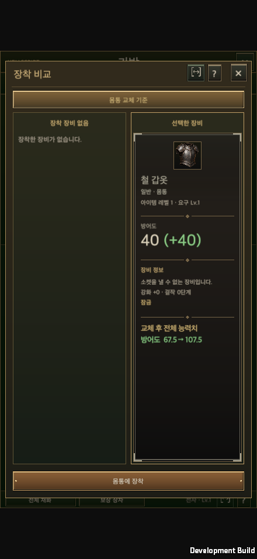
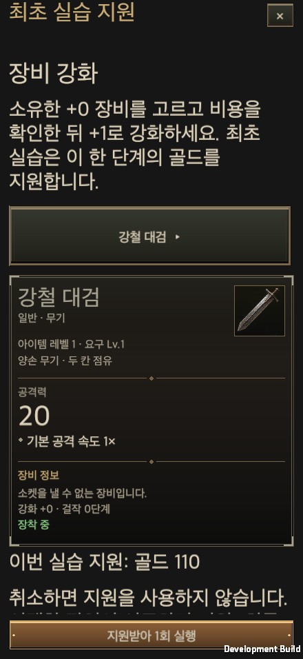
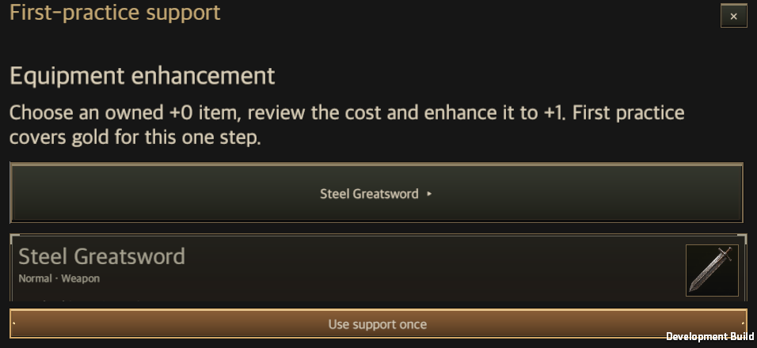

# Tutorial implementation and validation

Updated: 2026-09-30

The [design](../Design/Tutorial_Flow_Design.en.md) connects 38 guide groups to the existing game loop: dedicated map, real inventory equipment, town, rifts, Hunt Edict, skill changes and content practice.

> 2026-09-29: the mandatory map is now the "Voice of the Edict" prologue. The armor award and equip step are gone; the current flow is [Prologue — the Voice of the Edict](Prologue_Edict_Voice.en.md).

## Ownership

`AccountGuide` owns versioned read, practiced, deferred and hidden records. `Tutorials` defines the 38 groups and resolves unlocks from the existing content catalog. `TutorialProgress` observes committed gameplay. Existing `HeroGuide.completed` fields preserve old-save compatibility; the player-facing entrypoint is the shared journal.

`CombatSimulation.Tutorial` owns a fixed three-room map with real enemies and a boss. `GameStore.Tutorials` owns map admission, once-only common armor and completion. `GameController.Tutorials` routes the first account character and restores the saved checkpoint. Tutorial runs carry an explicit flag, use actual-level stats and remain outside ordinary rift economy, fatigue, progression, records and offline supply baselines. Required armor cannot be unprotected, unequipped or transferred to storage before completion. Rewardless replay uses an independent level 1 account copy.

## Saves and transactions

Save schema 17 preserves released live-operations schema 16 saves and adds tutorial definition version 1. Legacy accounts receive an exemption, not fabricated completion. Equivalent actual entry/result/retry, owned training and genuine equipment comparison facts migrate; fallback comparison explanations do not count as practice; the old combined read/skip acknowledgement migrates only as read. Support receipts and armor grants do not reset when copy changes. New account identity is initialized before the first save and stays stable across restart.

`GameStore.Transact` adopts guide state only after disk success. Practice quotes capture the selected owned item, choice and current prerequisites. NPC distance and domain validation run again at execution. Support, consumption, actual result and the support receipt commit atomically. Cancelling, stale selection, capacity failure or disk failure retains support.

| Practice | One supported operation | Existing domain owner |
| --- | --- | --- |
| Enhance | Owned +0 → +1, gold | `GearEnhancement` |
| Rare craft | One selected slot, gold and materials | `ContentServices.Purchase` |
| Slot upgrade | Level 1 → 2, stones, normal 300 seconds | `BlacksmithCatalog.Start` |
| Gem fusion | Five selected T1 → one T2 | `Jeweler.Convert` |
| Rune | One G0 single-cell rune, gold | `TownTrade.BuyRune` |
| Unidentified item | One slot, current price and normal probabilities | `GambleShop` |
| Reroll | One actual affix, one attempt, gold | `Economy.Reroll` |
| Elixir | One selected T1 gem → one potion | `Jeweler.Craft` |
| Masterwork | Actual +5 equipment, masterwork 0 → 1 | `ItemQuality.Advance` |
| Core craft | Ten slot cores, zero premium investment | `CoreCrafting` |

Training, offline supplies, aspect imprinting and sweeping use existing free operations and limits. Tutorial support does not invent prerequisites, levels, legendary items, aspects or additional sweep attempts.

## UI and sequencing

2026-09-29: The persistent top-left Adventure guide button was removed from town and battle while tutorial, quest and mission guidance is deferred for future design. The new-guide notification directing players to that button was also removed. Attendance keeps its existing size and position. This change only removes the HUD shortcut; existing first-map progression, saved records and directly opened content journals remain intact.

This HUD change passed a macOS development build and the existing attendance runtime acceptance: 56 layout checks covering five sizes, KO/EN and 100%/150% reading scale, 98 clicks and 22 drags. The [town capture](AdventureGuideRemovalEvidence/plaza-without-guide.png) and [landscape battle capture](AdventureGuideRemovalEvidence/battle-without-guide.png) confirm the guide button is absent and attendance remains. Shared UI checks and all nine validator tests passed. Focused Edit Mode results were 55 passed and one failed; the existing skill/training test failed identically on the unchanged baseline. See the [validation summary](AdventureGuideRemovalEvidence/validation.json) and [baseline comparison](AdventureGuideRemovalEvidence/test-comparison.json). Physical mobile was not tested; Web and APK were not rebuilt.

2026-09-29: F06 "Equip a new skill" now means **a new active equipped after the first skill**. All three first-row actives of every class open at tree level 1, and the first active that level growth opens is Ground Slam, Retreat Leap or Teleport at level 10. The earlier code did not match this tree. F06 showed as available from level 3, but completing it required an active above tree level 1. The recommendation chose its target by the skill catalog's unlock level, which also disagreed with the tree. So from level 3 to 9 the journal offered a practice that could not be done. Reading the code, the automatic attendance and offline-supply popups could also stay deferred while F06 remained the next guide.

F06 now completes the first time the player equips and saves an active that has never been in a slot, after the first skill. The level-1 point buys that first skill (W01, A01 or M01 in the prologue), so F06 becomes available at level 2 with the second point. Availability, completion and the recommendation all use the same list from `TutorialProgress.NewSkills`. The list is computed from the skill tree's unlocks and the hero's equip history. No unlock level is hard-coded: an existing hero that has already equipped every first-row active becomes eligible again when the tree opens its next active (level 10 today). Moving the first skill to another slot does not count as a new skill. The recommendation prefers a new skill that is already learned. If none is learned, it picks a new skill that a free point can learn. Before, it only suggested skills with an invested rank. The guide body in Korean and English and the English title were updated. Setting the skill catalog's unlock levels to 1 and starting every hero of a new account without skills were not in `main` when this was written. The new check does not read the catalog, so the catalog change does not affect it. Once a new account's heroes start without skills, a hero that did not play the prologue treats the first active it equips as its first skill, and the next new active completes F06. This was checked in the code, not run on that branch.

In batch-mode Edit Mode on a project clone, all 429 tests in 19 classes passed. They cover the tutorial, first play, localization, stored text, combat journal, skill tree, Hunt Edict and growth. The full Edit Mode suite ran 4,736 tests: 4,689 passed and 47 failed. The 47 failures match the list of known failures recorded on 2026-09-27, before this work, so none is new ([full-suite comparison](TutorialNewSkillRuleEvidence/full-suite-comparison.json)). The new test `NewSkillIsAnActiveNeverEquippedAfterTheFirstSkill` checks the following for all three classes:

- In the prologue's prepared state, learning and equipping the first skill does not complete F06.
- At level 2, F06 becomes available and the recommendation points to a new skill that the free point can learn.
- Moving the first skill to another slot does not complete it. Equipping and saving a new skill does.
- A hero that has used every open active becomes eligible again at the level where the tree opens its next active.

Run against the previous rule, the same tests fail 4 times. The three new cases fail at the assertion that F06 is available at level 2, and the older test fails at the assertion that equipping W02 completed F06.

The tutorial smoke on a macOS development build passed both processes. Right after arriving in town, at level 1, F06 was not available. After the first rift raised the hero to level 4, it was available. The Warrior then learned Leap Slam (W02), equipped it in slot 2 and saved with pointer input, which completed F06. No level fixture was used. The reworded F06 detail window passed the layout checks in 20 profiles: five screen sizes, Korean and English, and 100% and 150% text size. The shared UI check and its 9 tool tests passed. Physical mobile devices were not tested, and Web and APK were not rebuilt. [Validation summary](TutorialNewSkillRuleEvidence/validation.json) · [Edit Mode results](TutorialNewSkillRuleEvidence/editmode.xml) · [Previous-rule run](TutorialNewSkillRuleEvidence/editmode-old-rule.xml) · [First process](TutorialNewSkillRuleEvidence/phase-one.txt) · [Resumed result](TutorialNewSkillRuleEvidence/runtime-tutorial-smoke.txt) · [New skill equipped](TutorialNewSkillRuleEvidence/new-skill-equipped.png) · [Portrait, Korean, 150%](TutorialNewSkillRuleEvidence/f06-440x956-ko-150.png) · [Landscape, English, 150%](TutorialNewSkillRuleEvidence/f06-956x440-en-150.png)

All new text uses the existing Korean keys and English localization table. Equipment and encounter variants have separate, localized explanations.

Since 2026-09-28 the mandatory map is told through the rift keeper Anton Jindark's lines and staged scenes, and the first use of a content is explained by its resident in the shared dialogue box; see [tutorial staging](Tutorial_Staging.en.md). `GameUI.TutorialStaging`, `StoryDialogueWindow` and `TutorialCinematic` own that staging. `TutorialJournalWindow` was scaffolded with `tools/new_content_ui.py`. `ContentWindowView` owns the safe-area frame, navigation, scrolling body and actions. Actual inventory and shared details/comparison retain ownership of equipment UI. `TutorialAnchorRing` attaches to logical targets, follows their transforms through reflow and draws a breathing border with a pointer. The journal records reading separately from actual execution.

Mandatory map explanations pause safely. Regular rifts show nonblocking tips; full guidance stays in town. First content usage offers its guide with read, later and hide actions. Active practice takes priority. Attendance recording and offline settlement continue while their automatic popups are deferred during the first map, initial departure preparation and active combat.

Implementation order: owners and isolated main worktree; versioned state and atomic support; map and checkpoint recovery; core gameplay facts; unlock and contextual guides; Edit Mode and native macOS acceptance; documentation/wiki generation and branch delivery. Public wiki deployment occurs only from merged main.

## Validation status

Final validation uses Unity 6000.6.0f1 and main commit `32baf0fcb3d0d8872eb9188c699604b52e6a432f`. The initial full audit used `bdf659139c7705f59047eccd57111b07eccf1d66`. The original checkout's 408 art metadata changes were preserved. A separate project with matching game sources built the macOS player without touching the user's running Editor.

| Check | Result |
| --- | --- |
| Final focused Edit Mode regression | 538 / 538 passed, 0 skipped after latest-main integration, covering tutorials, save migration, transaction failures, existing content, live operations and asynchronous admission |
| Shared UI ownership | Passed; validator tests 9 / 9 |
| Native macOS development build | Succeeded, 0 build errors |
| Final native runtime | Passed separate-process restore, equipment, boss, town, first rift, edict and new skill saves, owned training/fresh retry, supported enhancement and rewardless replay. The new skill unlocked through actual first-rift growth; no level fixture was used. |
| Layout matrix | Intro, journal and supported practice each cover 20 combinations: 440×956, 956×440, 1600×900, 1600×1000, 2100×900 × KO/EN × 100%/150% text |
| Physical Android/iOS | Not verified; macOS synthetic pointer and window-size evidence is separate |
| Human 4–6 minute target and comprehension | Not verified |
| Main integration | [PR #11](https://github.com/dakrdong/HELLSCRIPT/pull/11) merged on 2026-09-25 as `613e95689a8cb35c9a57503137d20606d5fe38fb`. The merged game code matches validated feature commit `85206553191054b8bfe724fec009f076b21d1102`. |
| Public wiki release path | Generate the complete read-only mirror of documents, history, databases, images and source evidence from merged main. The [public wiki](https://dakrdong.github.io/HELLSCRIPT-Wiki/#/page/tutorial-progression.en) requires successful Pages deployment and logged-out verification of the actual pages. |

### Broad regression audit

Before the latest live-operations integration, the full audit ran 3,923 cases: 3,875 passed and 48 failed. This is not reported as a green full suite.

Four feature-related failures were corrected and are covered by the final 538 cases: absent/foreign edicts must remain inactive without preventing combat, Unity component null checks, and the highlight graphic's required `CanvasRenderer` declaration.

Independent copies of both the original base and latest main reproduced 43 failures with identical test names: 36 `ActionContinuityTests`, 4 `CurrentBuildSaveTests`, and 3 `RestoreFidelityTests`, all concerning combat-journal JSON equality. Those combat journal implementations are outside this change. The remaining unseeded dungeon assertion was separately reproduced on base main at stage 6, seed 2: one optional goblin raises its count from the expected 150 to 151; excluding the goblin gives 150.

Evidence: [comparison](../../Artifacts/Validation/tutorial-progression/regression-comparison.json), [full audit](../../Artifacts/Validation/tutorial-progression/editmode-full-audit.xml), [original baseline](../../Artifacts/Validation/tutorial-progression/editmode-baseline.xml), [original goblin result](../../Artifacts/Validation/tutorial-progression/baseline-goblin.txt), [latest-main goblin result](../../Artifacts/Validation/tutorial-progression/baseline-goblin-current.txt), and [reproducer source](../../Artifacts/Validation/tutorial-progression/baseline-goblin-current-probe.cs.txt). The final scope is [538 integrated cases](../../Artifacts/Validation/tutorial-progression/editmode-integrated.xml). Earlier [440](../../Artifacts/Validation/tutorial-progression/editmode-focused.xml) and [66](../../Artifacts/Validation/tutorial-progression/editmode-additional.xml) runs are history, not additional final coverage.

### Native acceptance

`RuntimeTutorialSmoke` runs only in a development player with the explicit smoke flag, disposable save path and evidence path. It checks real EventSystem raycasts before synthetic pointer clicks. Combat wins and tutorial completion are not injected. The first process exits at the actual armor checkpoint; a second process uses the same save with `-hellscriptTutorialResume`. It checks exactly one armor, comparison/equip, real boss death and town arrival, first-rift results, committed edict/skill changes, owned training, matching fresh rift, supported enhancement and rewardless replay. Late-content UI uses an explicit highest-clear-120 fixture, not a natural-progression claim.

2026-09-29: commit `7dc11ff1` opened all three first-row actives of every class at level 1, which left only passives at level 3. F06 completes only when the player first equips and saves an active opened by level growth, that is, one whose tree level is above 1. The Edit Mode check and the runtime smoke still looked for a level-3 active and failed. Both now pick the lowest-level active that meets this rule and set the hero level to that skill's level. With the current tree they pick the level-10 Ground Slam, Retreat Leap and Teleport. When this was first fixed, new characters used version-3 loadouts, so the skill was equipped without allocating a rank. Later the same day a player's new account and the prologue hero switched to the zero-rank version-4 state, so the runtime smoke now allocates one point before equipping. The Edit Mode check builds its account directly, keeps version 3 and equips without allocating ([skill tree record](Hunt_Edict_Skill_Tree.en.md)).

In this run the first rift raised the level-1 hero to level 4. Because that is below 10, the smoke used a fixture that only raises the level to 10; this is not reported as natural growth. Before the fix, 1 of the 30 `TutorialProgressionTests` failed with `Sequence contains no matching element`; after it, all 30 passed. The macOS development build passed the first process and the full resumed flow, and the Warrior equipped and saved Ground Slam with pointer input to complete F06. The shared UI check and its 9 tool tests also passed. Physical mobile devices were not tested. [Validation summary](TutorialNewSkillFixtureEvidence/validation.json) · [Edit Mode after](TutorialNewSkillFixtureEvidence/editmode.xml) · [Edit Mode before](TutorialNewSkillFixtureEvidence/editmode-baseline.xml) · [First process](TutorialNewSkillFixtureEvidence/phase-one.txt) · [Resumed result](TutorialNewSkillFixtureEvidence/runtime-tutorial-smoke.txt) · [New skill equipped](TutorialNewSkillFixtureEvidence/new-skill-equipped.png)

Later the same day, F06 changed to a new active after the first skill (see "UI and sequencing" above). The Edit Mode test and the runtime smoke now equip another first-row active from level 2 instead of raising the hero to level 10.

The [build result](../../Artifacts/Validation/tutorial-progression/build-result.txt) and [source comparison](../../Artifacts/Validation/tutorial-progression/source-parity.json) accompany the runtime evidence. Generated art import metadata, material version metadata, Editor settings and unrelated floating-point evidence churn are excluded from the feature commit.

The Korean [implementation record](Tutorial_Progression.md) contains the detailed ownership table.

Integration uses tutorial schema 17 to preserve released schema 16 accounts and their pinned live-operations runs. Starting replay cancels pending rift admission. Rift guidance describes the time limit fixed at admission. The [latest-main baseline](../../Artifacts/Validation/tutorial-progression/editmode-baseline-current.xml) is retained separately.

The final runtime fetched and pinned an HTTP [loopback release of shipped defaults](../../Artifacts/Validation/tutorial-progression/loopback-liveops-release.json) for normal admission. This does not verify the public cloud or telemetry uploads. Evidence includes [phase one](../../Artifacts/Validation/tutorial-progression/phase-one.txt), [restarted flow](../../Artifacts/Validation/tutorial-progression/runtime-tutorial-smoke.txt), [save summary](../../Artifacts/Validation/tutorial-progression/runtime-summary.json), and [screenshot hashes](../../Artifacts/Validation/tutorial-progression/screenshots-manifest.json). All 60 layout combinations passed automated geometry checks, with representative portrait, landscape and wide-PC captures visually reviewed.

### Original captures by profile

| Resolution | Language | Text | Intro | Journal | Support |
| --- | --- | --- | --- | --- | --- |
| 440×956 | KO | 100% | [PNG](../../Artifacts/Validation/tutorial-progression/screenshots/intro-440x956-ko-100.png) | [PNG](../../Artifacts/Validation/tutorial-progression/screenshots/journal-440x956-ko-100.png) | [PNG](../../Artifacts/Validation/tutorial-progression/screenshots/support-440x956-ko-100.png) |
| 440×956 | KO | 150% | [PNG](../../Artifacts/Validation/tutorial-progression/screenshots/intro-440x956-ko-150.png) | [PNG](../../Artifacts/Validation/tutorial-progression/screenshots/journal-440x956-ko-150.png) | [PNG](../../Artifacts/Validation/tutorial-progression/screenshots/support-440x956-ko-150.png) |
| 440×956 | EN | 100% | [PNG](../../Artifacts/Validation/tutorial-progression/screenshots/intro-440x956-en-100.png) | [PNG](../../Artifacts/Validation/tutorial-progression/screenshots/journal-440x956-en-100.png) | [PNG](../../Artifacts/Validation/tutorial-progression/screenshots/support-440x956-en-100.png) |
| 440×956 | EN | 150% | [PNG](../../Artifacts/Validation/tutorial-progression/screenshots/intro-440x956-en-150.png) | [PNG](../../Artifacts/Validation/tutorial-progression/screenshots/journal-440x956-en-150.png) | [PNG](../../Artifacts/Validation/tutorial-progression/screenshots/support-440x956-en-150.png) |
| 956×440 | KO | 100% | [PNG](../../Artifacts/Validation/tutorial-progression/screenshots/intro-956x440-ko-100.png) | [PNG](../../Artifacts/Validation/tutorial-progression/screenshots/journal-956x440-ko-100.png) | [PNG](../../Artifacts/Validation/tutorial-progression/screenshots/support-956x440-ko-100.png) |
| 956×440 | KO | 150% | [PNG](../../Artifacts/Validation/tutorial-progression/screenshots/intro-956x440-ko-150.png) | [PNG](../../Artifacts/Validation/tutorial-progression/screenshots/journal-956x440-ko-150.png) | [PNG](../../Artifacts/Validation/tutorial-progression/screenshots/support-956x440-ko-150.png) |
| 956×440 | EN | 100% | [PNG](../../Artifacts/Validation/tutorial-progression/screenshots/intro-956x440-en-100.png) | [PNG](../../Artifacts/Validation/tutorial-progression/screenshots/journal-956x440-en-100.png) | [PNG](../../Artifacts/Validation/tutorial-progression/screenshots/support-956x440-en-100.png) |
| 956×440 | EN | 150% | [PNG](../../Artifacts/Validation/tutorial-progression/screenshots/intro-956x440-en-150.png) | [PNG](../../Artifacts/Validation/tutorial-progression/screenshots/journal-956x440-en-150.png) | [PNG](../../Artifacts/Validation/tutorial-progression/screenshots/support-956x440-en-150.png) |
| 1600×900 | KO | 100% | [PNG](../../Artifacts/Validation/tutorial-progression/screenshots/intro-1600x900-ko-100.png) | [PNG](../../Artifacts/Validation/tutorial-progression/screenshots/journal-1600x900-ko-100.png) | [PNG](../../Artifacts/Validation/tutorial-progression/screenshots/support-1600x900-ko-100.png) |
| 1600×900 | KO | 150% | [PNG](../../Artifacts/Validation/tutorial-progression/screenshots/intro-1600x900-ko-150.png) | [PNG](../../Artifacts/Validation/tutorial-progression/screenshots/journal-1600x900-ko-150.png) | [PNG](../../Artifacts/Validation/tutorial-progression/screenshots/support-1600x900-ko-150.png) |
| 1600×900 | EN | 100% | [PNG](../../Artifacts/Validation/tutorial-progression/screenshots/intro-1600x900-en-100.png) | [PNG](../../Artifacts/Validation/tutorial-progression/screenshots/journal-1600x900-en-100.png) | [PNG](../../Artifacts/Validation/tutorial-progression/screenshots/support-1600x900-en-100.png) |
| 1600×900 | EN | 150% | [PNG](../../Artifacts/Validation/tutorial-progression/screenshots/intro-1600x900-en-150.png) | [PNG](../../Artifacts/Validation/tutorial-progression/screenshots/journal-1600x900-en-150.png) | [PNG](../../Artifacts/Validation/tutorial-progression/screenshots/support-1600x900-en-150.png) |
| 1600×1000 | KO | 100% | [PNG](../../Artifacts/Validation/tutorial-progression/screenshots/intro-1600x1000-ko-100.png) | [PNG](../../Artifacts/Validation/tutorial-progression/screenshots/journal-1600x1000-ko-100.png) | [PNG](../../Artifacts/Validation/tutorial-progression/screenshots/support-1600x1000-ko-100.png) |
| 1600×1000 | KO | 150% | [PNG](../../Artifacts/Validation/tutorial-progression/screenshots/intro-1600x1000-ko-150.png) | [PNG](../../Artifacts/Validation/tutorial-progression/screenshots/journal-1600x1000-ko-150.png) | [PNG](../../Artifacts/Validation/tutorial-progression/screenshots/support-1600x1000-ko-150.png) |
| 1600×1000 | EN | 100% | [PNG](../../Artifacts/Validation/tutorial-progression/screenshots/intro-1600x1000-en-100.png) | [PNG](../../Artifacts/Validation/tutorial-progression/screenshots/journal-1600x1000-en-100.png) | [PNG](../../Artifacts/Validation/tutorial-progression/screenshots/support-1600x1000-en-100.png) |
| 1600×1000 | EN | 150% | [PNG](../../Artifacts/Validation/tutorial-progression/screenshots/intro-1600x1000-en-150.png) | [PNG](../../Artifacts/Validation/tutorial-progression/screenshots/journal-1600x1000-en-150.png) | [PNG](../../Artifacts/Validation/tutorial-progression/screenshots/support-1600x1000-en-150.png) |
| 2100×900 | KO | 100% | [PNG](../../Artifacts/Validation/tutorial-progression/screenshots/intro-2100x900-ko-100.png) | [PNG](../../Artifacts/Validation/tutorial-progression/screenshots/journal-2100x900-ko-100.png) | [PNG](../../Artifacts/Validation/tutorial-progression/screenshots/support-2100x900-ko-100.png) |
| 2100×900 | KO | 150% | [PNG](../../Artifacts/Validation/tutorial-progression/screenshots/intro-2100x900-ko-150.png) | [PNG](../../Artifacts/Validation/tutorial-progression/screenshots/journal-2100x900-ko-150.png) | [PNG](../../Artifacts/Validation/tutorial-progression/screenshots/support-2100x900-ko-150.png) |
| 2100×900 | EN | 100% | [PNG](../../Artifacts/Validation/tutorial-progression/screenshots/intro-2100x900-en-100.png) | [PNG](../../Artifacts/Validation/tutorial-progression/screenshots/journal-2100x900-en-100.png) | [PNG](../../Artifacts/Validation/tutorial-progression/screenshots/support-2100x900-en-100.png) |
| 2100×900 | EN | 150% | [PNG](../../Artifacts/Validation/tutorial-progression/screenshots/intro-2100x900-en-150.png) | [PNG](../../Artifacts/Validation/tutorial-progression/screenshots/journal-2100x900-en-150.png) | [PNG](../../Artifacts/Validation/tutorial-progression/screenshots/support-2100x900-en-150.png) |

Additional scenes:

[Armor checkpoint](../../Artifacts/Validation/tutorial-progression/screenshots/armor-checkpoint.png) · [Boss cleared](../../Artifacts/Validation/tutorial-progression/screenshots/real-boss-cleared.png) · [First-rift preparation](../../Artifacts/Validation/tutorial-progression/screenshots/first-rift-preparation.png) · [Edict saved](../../Artifacts/Validation/tutorial-progression/screenshots/edict-saved.png) · [New skill equipped](../../Artifacts/Validation/tutorial-progression/screenshots/new-skill-equipped.png) · [Support review](../../Artifacts/Validation/tutorial-progression/screenshots/support-review.png) · [Rewardless replay](../../Artifacts/Validation/tutorial-progression/screenshots/rewardless-replay.png)
