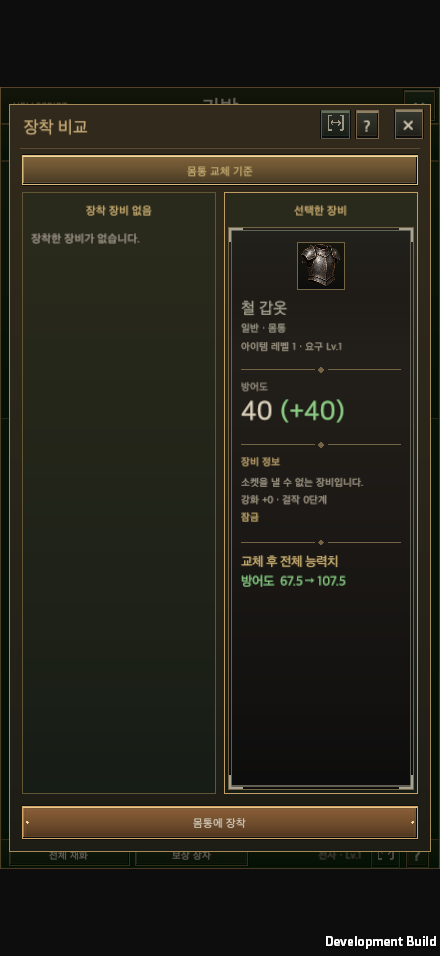
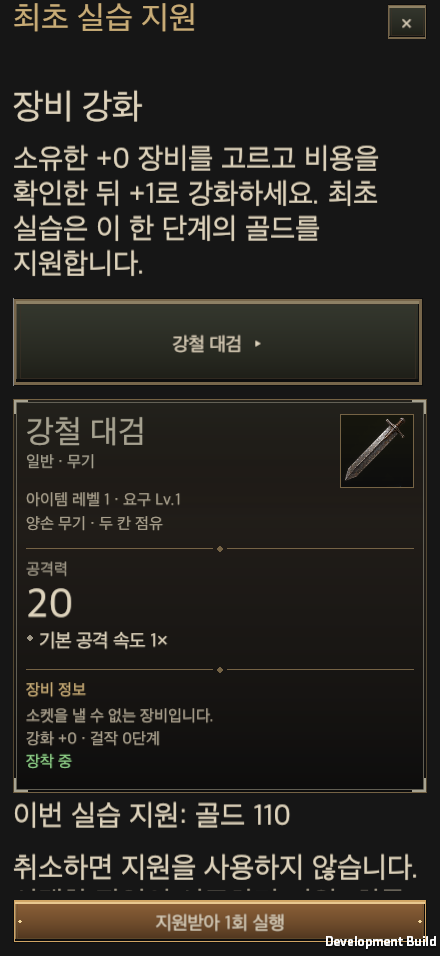
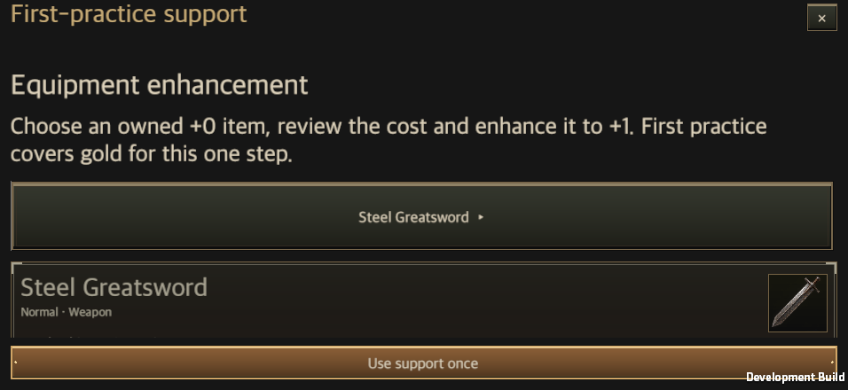

# 튜토리얼 구현과 검증

갱신일: 2026-09-25

[기획](../Design/Tutorial_Flow_Design.md)의 38개 안내 그룹을 기존 첫 플레이 안내와 콘텐츠 개방 흐름에 연결한다. 최초 맵, 실제 인벤토리 장착, 마을 도착, 균열, 사냥칙령·스킬 변경과 콘텐츠 실습을 같은 저장 기록에서 추적한다.

## 소유 구조

| 영역 | 소유 코드 | 책임 |
| --- | --- | --- |
| 안내 정의와 상태 | `Tutorials.cs`, `FirstPlayGuide.cs` | 계정·영웅 범위, 읽음·실제 수행·미루기·숨김, 구버전 이전, 개방 순서 |
| 실제 수행 판정 | `Tutorials.Progress.cs` | 실제 저장한 물약 HP 조건, 새로 장착한 성장 스킬, 동일 설정 훈련 후 새 균열 |
| 전용 맵 | `CombatSimulation.Tutorial.cs` | 고정 3개 방, 실제 적·보스 전투, 장착 대기, 사망 구간 재시작 |
| 저장과 일회성 지급 | `GameStore.Tutorials.cs` | 맵 시작·갑옷 지급·마을 도착을 검증하고 저장 |
| 실습 지원 | `TutorialPractice.cs` | 현재 비용·소유품으로 견적 작성, 기존 도메인 실행, 결과와 지원 사용 기록의 원자적 저장 |
| 게임 진행 연결 | `GameController.Tutorials.cs` | 신규 계정 분기, 재시작 복원, 다시보기 복사본, 필수 맵 이탈 방지 |
| 안내 화면 | `TutorialJournalWindow.cs`, `GameUI.Tutorials.cs` | 공통 창 템플릿, 목록·상세·다시보기, 미루기와 숨김, 전투 중 비차단 안내 |
| 실습 선택 화면 | `GameUI.TutorialPractice.cs` | 실제 소유품 선택, 공통 장비 상세, 현재 지원 견적과 실행 결과 |
| 조작 대상 표시 | `TutorialAnchorRing.cs` | 실제 버튼과 소유 아이템 칸에 붙는 테두리, 화면 좌표를 저장하지 않는 표시 |

`AccountGuide`가 새 안내 기록을 소유한다. 기존 `HeroGuide.completed`는 이전 데이터와 기존 판정 코드의 호환성을 위해 유지하며, 사용자 진입점은 새 안내 일지로 통합한다. 기존의 9단계 전체 화면을 별도 사용자 안내로 운영하지 않는다.

## 저장과 이전

저장 스키마는 17이다. 운영 설정을 사용하던 정식 스키마 16도 기존 계정으로 안전하게 이전한다. 튜토리얼 정의 버전은 1이며, 지원 사용 기록과 갑옷 지급 영수증은 정의 문구가 바뀌어도 초기화하지 않는다. 신규 계정은 맵 미완료 상태로 시작한다. 구버전 계정은 `legacyExempt`로 면제하며 완료했다고 기록하지 않는다. 기존 실제 균열 입장·결과·재도전·소유 상태 훈련·실제 장비 비교 기록은 의미가 같은 새 안내로 이전한다. 장비가 없어 비교 설명만 확인한 기록은 실습 완료로 이전하지 않는다. 구 콘텐츠의 확인/건너뛰기 기록은 읽음으로만 이전한다.

`GameStore.Transact`가 계정 안내도 저장 성공 후 채택하도록 확장했다. 신규 계정 식별자 역시 최초 생성 시 확정해 저장 전후와 재시작 이후에 달라지지 않게 했다. 디스크 저장 실패 시 지원 재료, 소비, 결과, 완료 표시를 실제 계정에 채택하지 않는다.

필수 맵은 일반 균열의 `suspendedRun` 대신 `AccountGuide.tutorialRun`에 저장한다. 실행에는 명시적인 `tutorial` 표지가 있으며, 기존 무보상 실행 구분과 함께 경험치·재화·피로도·균열 기록·미접속 보급 기준을 차단한다. 스킬과 장비는 실제 레벨의 능력치를 사용한다. 튜토리얼 갑옷은 완료 전 잠금 해제·장착 해제·창고 이동을 막아 필수 장착 대상이 사라지지 않게 한다. 다시보기는 별도 레벨 1 계정 복사본을 사용한다.

## 최초 실습 지원

| 콘텐츠 | 지원하는 한 번의 실행 | 기존 실행 경로 |
| --- | --- | --- |
| 장비 강화 | 소유 +0 장비 → +1의 골드 | `GearEnhancement.Quote/Apply` |
| 희귀 제작 | 선택 부위 장비 1개의 골드·재료 | `ContentServices.Purchase` |
| 부위 강화 | 1 → 2의 강화석, 정상 5분 대기 | `BlacksmithCatalog.Start` |
| 보석 합성 | 선택 T1 보석 5개 → T2 1개 | `Jeweler.Convert` |
| 룬 구입 | G0 한 칸 룬 1개의 골드 | `TownTrade.BuyRune` |
| 미확인 장비 | 선택 부위 장비 1개의 현재 가격 | `GambleShop.Price/Buy` |
| 속성 재설정 | 소유 장비의 선택한 한 줄, 1회 골드 | `Economy.Reroll` |
| 영약 제조 | 선택 T1 보석 1개 → 영약 1개 | `Jeweler.Craft` |
| 명품화 | 실제 +5 이상 장비, 명품화 0 → 1의 골드·재료 | `ItemQuality.Advance` |
| 코어 제작 | 선택 제작법의 부위 코어 10개, 유료 투자 0 | `CoreCrafting.Quote/Apply` |

지원 선택 화면은 가상의 장비를 소유품처럼 표시하지 않는다. 장비는 실제 소유품을, 코어 제작법은 `EquipmentViewSource.Catalog`를 전달한다. 실행 시 NPC의 실제 거리, 개방 상태, 선택의 변경 여부, 소유권과 공간을 다시 확인한다. 견적 단계에서는 재료를 지급하지 않는다. 중복 요청은 기존 영수증으로 처리한다.

훈련, 미접속 보급, 위상 각인, 소탕은 기존 무료 기능과 정상 한도를 사용한다. 최초 안내라는 이유로 위상·전설·레벨·소탕 횟수를 만들지 않는다.

## 화면과 진행 정책

모든 새 문구는 기존 한국어 키와 `Resources/Localization/en.txt` 번역표를 사용한다. 38개 그룹뿐 아니라 전설·세트·각성과 여덟 가지 균열 목표·조우에도 별도 설명을 제공한다.

`tools/new_content_ui.py TutorialJournal`에서 생성한 공통 창 진입점을 사용한다. 장비 상세·비교·장착은 기존 소유 부품과 거래를 사용한다. 화면 회전·안전 영역·언어·글자 크기는 공통 창이 다시 배치하며, 버튼 테두리는 실제 조작 대상의 `RectTransform`에 붙는다.

필수 맵의 설명과 장착 단계는 안전하게 멈춘다. 일반 균열에서는 긴 안내창을 열지 않고 짧은 안내만 표시한다. 콘텐츠를 처음 이용할 때 해당 안내를 제안하며, 사용자는 읽기·나중에 보기·숨기기를 선택할 수 있다. 활성 실습이 있으면 다른 안내가 중간에 끼어들지 않는다. 출석 기록과 미접속 정산은 유지하면서 필수 맵·첫 입장 준비·진행 중인 전투에서는 자동 팝업만 미룬다.

## 개발 순서와 검증

1. 기존 첫 플레이·개방·저장·공통 UI 소유자를 확인하고 최신 `main`의 별도 작업 폴더를 만들었다.
2. 버전이 있는 계정 기록, 구버전 이전, 실습 비용 거래를 구현했다.
3. 전용 맵과 실제 장착·보스·마을 복원을 연결했다.
4. 실제 균열, 칙령·스킬 저장, 훈련과 재도전 판정을 연결했다.
5. 14개 콘텐츠 안내와 16개 상황 안내, 세부 조우 기록을 연결했다.
6. 관련 Edit Mode 검사와 macOS 런타임 조작·화면 배치를 검증했다.
7. 위키 생성·검사를 통과한 작업을 커밋·푸시하고, 2026-09-25에 [PR #11](https://github.com/dakrdong/HELLSCRIPT/pull/11)을 `main`에 병합했다. 공개 위키는 병합된 `main`에서만 게시한다.

최종 검증 기준은 Unity 6000.6.0f1과 `main` 커밋 `32baf0fcb3d0d8872eb9188c699604b52e6a432f`이다. 초기 전체 회귀 감사는 `bdf659139c7705f59047eccd57111b07eccf1d66`에서 수행했다. 원래 작업 폴더의 408개 아트 메타데이터 변경은 그대로 두고 별도 작업 폴더에서 구현했다. macOS 빌드는 실행 중인 원본 에디터를 건드리지 않도록 소스가 일치하는 별도 검증 프로젝트에서 만들었다.

| 검사 | 결과 |
| --- | --- |
| 최종 관련 Edit Mode 회귀 | 최신 `main` 통합 후 538 / 538 통과, 건너뜀 0. 튜토리얼, 저장 이전, 거래 실패, 기존 콘텐츠, 운영 설정과 비동기 입장 검사를 포함한다. |
| 공통 UI 소유권 검사 | 검사 통과, 검사기 자체 테스트 9 / 9 통과 |
| macOS 개발 빌드 | 성공, 빌드 오류 0 |
| macOS 최종 런타임 | 별도 프로세스 복원부터 장착·보스·마을·첫 균열·칙령·새 스킬·훈련 후 재도전·강화 지원·무보상 다시보기까지 통과. 새 스킬은 실제 첫 균열의 성장으로 해금했으며 레벨 주입을 사용하지 않았다. |
| 화면 배치 | 도입·안내 일지·실습 지원 각각 20개 조합: 440×956, 956×440, 1600×900, 1600×1000, 2100×900 × 한국어·영어 × 글자 크기 100%·150% |
| Android/iOS 실기기 | 미검증. macOS의 합성 포인터 입력과 화면 크기 검사를 실기기 결과로 취급하지 않는다. |
| 사람의 4~6분 첫 플레이·이해도 | 미검증 |
| 원본 `main` 병합 | 2026-09-25, [PR #11](https://github.com/dakrdong/HELLSCRIPT/pull/11), 병합 커밋 `613e95689a8cb35c9a57503137d20606d5fe38fb`. 병합 결과의 게임 코드는 검증한 기능 커밋 `85206553191054b8bfe724fec009f076b21d1102`와 같다. |
| 공개 위키 배포 경로 | 병합된 `main`에서 문서·이력·DB·이미지·근거 전체를 읽기 전용으로 생성한다. [공개 위키](https://dakrdong.github.io/HELLSCRIPT-Wiki/#/page/tutorial-progression)는 Pages 성공과 비로그인 실제 화면 확인을 완료 조건으로 삼는다. |

### 전체 회귀 감사에서 구분한 실패

최신 운영 설정 통합 전 전체 검사는 3,923건 중 3,875건 통과, 48건 실패였다. 이 결과를 전체 통과로 보고하지 않는다.

- 튜토리얼에서 추가한 실패 4건을 수정했다. 잘못되거나 없는 사냥칙령은 연습 설정으로 인정하지 않되 기존 전투 시작을 막지 않는다. Unity 컴포넌트의 null 검사와 강조 테두리의 `CanvasRenderer` 선언도 수정했다. 해당 검사는 최종 538건에 포함된다.
- 전투 기록 JSON의 동일성 검사 43건은 초기 기준 코드와 최신 `main`의 독립된 복사본에서도 같은 테스트 이름으로 실패했다. `ActionContinuityTests` 36건, `CurrentBuildSaveTests` 4건, `RestoreFidelityTests` 3건이다. 이 작업에서 해당 전투 기록 코드는 수정하지 않았다.
- 던전 생성 검사 1건은 시드가 고정되지 않은 검사다. 기준 `main`의 6단계·시드 2에서 고블린 1마리가 추가되어 기대값 150 대신 151이 되는 것을 별도 재현했다. 고블린을 제외한 값은 150이다.

전체 감사와 기준 코드의 비교는 [회귀 비교](../../Artifacts/Validation/tutorial-progression/regression-comparison.json), [전체 검사 원본](../../Artifacts/Validation/tutorial-progression/editmode-full-audit.xml), [초기 기준 코드 검사](../../Artifacts/Validation/tutorial-progression/editmode-baseline.xml), [초기 고블린 재현](../../Artifacts/Validation/tutorial-progression/baseline-goblin.txt)에 남겼다. 최신 `main`에서도 같은 시드로 재현했다([결과](../../Artifacts/Validation/tutorial-progression/baseline-goblin-current.txt), [재현 코드](../../Artifacts/Validation/tutorial-progression/baseline-goblin-current-probe.cs.txt)). 최종 관련 검사 근거는 [통합 후 538건](../../Artifacts/Validation/tutorial-progression/editmode-integrated.xml)이다. 통합 전 [440건](../../Artifacts/Validation/tutorial-progression/editmode-focused.xml)과 [추가 66건](../../Artifacts/Validation/tutorial-progression/editmode-additional.xml)은 이전 검증 이력이며 최종 수에 더하지 않는다.

### 런타임 검증 경로

`RuntimeTutorialSmoke`는 개발 빌드에서 명시적인 `-hellscriptTutorialSmoke`, 임시 저장 경로, 증거 경로가 있을 때만 실행한다. UI 대상의 실제 레이캐스트를 확인한 후 포인터 입력으로 비교·장착·저장·실습 버튼을 누른다. 전투의 승리나 튜토리얼 완료 상태를 주입하지 않는다.

첫 프로세스는 신규 계정의 도입과 실제 일반 전투를 진행한 뒤 갑옷 지급 지점에서 종료한다. 두 번째 프로세스는 같은 임시 저장으로 `-hellscriptTutorialResume`을 추가해 시작한다. 갑옷 수량, 비교와 장착, 실제 보스 처치, 마을 도착, 첫 균열의 결과, 칙령·스킬 저장, 소유 상태 훈련, 동일 설정의 새 균열, 강화 지원과 다시보기를 확인한다. 고단계 콘텐츠의 화면 검사는 최고 클리어 120의 명시적인 검증용 상태를 사용하며 자연 성장 결과라고 보고하지 않는다.

[빌드 결과](../../Artifacts/Validation/tutorial-progression/build-result.txt)와 [빌드 소스 대조](../../Artifacts/Validation/tutorial-progression/source-parity.json)를 함께 보관한다. Unity가 자동 갱신한 아트 메타데이터, 머티리얼 버전, 에디터 설정과 기존 스킬 증거의 부동소수점 차이는 기능 변경에서 제외했다.

운영 설정 통합 시 저장 스키마 16과의 충돌을 피하도록 튜토리얼을 스키마 17로 분리했다. 스키마 16 계정의 진행 중인 균열과 입장 시 고정된 운영 설정을 보존한다. 다시보기를 시작하면 대기 중인 균열 입장을 취소한다. 일반 균열의 제한시간 안내는 고정 수치 대신 입장 당시 설정을 기준으로 설명한다. [최신 기준 코드 검사](../../Artifacts/Validation/tutorial-progression/editmode-baseline-current.xml)를 함께 보관한다.

최종 실행은 [정상 기본값의 로컬 게시 설정](../../Artifacts/Validation/tutorial-progression/loopback-liveops-release.json)을 HTTP로 받아 일반 균열 입장에 고정했다. 공개 서버나 전투 기록 업로드를 검증한 것은 아니다. [첫 프로세스 결과](../../Artifacts/Validation/tutorial-progression/phase-one.txt), [복원 이후 전체 결과](../../Artifacts/Validation/tutorial-progression/runtime-tutorial-smoke.txt), [저장 결과 요약](../../Artifacts/Validation/tutorial-progression/runtime-summary.json), [화면 파일 해시](../../Artifacts/Validation/tutorial-progression/screenshots-manifest.json)를 보관했다. 화면 60개 조합의 자동 배치 검사와 세로·가로·넓은 PC 화면의 대표 캡처 확인을 함께 수행했다.

### 화면 조합별 원본

| 화면 크기 | 언어 | 글자 크기 | 도입 | 안내 일지 | 실습 지원 |
| --- | --- | --- | --- | --- | --- |
| 440×956 | KO | 100% | [PNG](../../Artifacts/Validation/tutorial-progression/screenshots/intro-440x956-ko-100.png) | [PNG](../../Artifacts/Validation/tutorial-progression/screenshots/journal-440x956-ko-100.png) | [PNG](../../Artifacts/Validation/tutorial-progression/screenshots/support-440x956-ko-100.png) |
| 440×956 | KO | 150% | [PNG](../../Artifacts/Validation/tutorial-progression/screenshots/intro-440x956-ko-150.png) | [PNG](../../Artifacts/Validation/tutorial-progression/screenshots/journal-440x956-ko-150.png) | [PNG](../../Artifacts/Validation/tutorial-progression/screenshots/support-440x956-ko-150.png) |
| 440×956 | EN | 100% | [PNG](../../Artifacts/Validation/tutorial-progression/screenshots/intro-440x956-en-100.png) | [PNG](../../Artifacts/Validation/tutorial-progression/screenshots/journal-440x956-en-100.png) | [PNG](../../Artifacts/Validation/tutorial-progression/screenshots/support-440x956-en-100.png) |
| 440×956 | EN | 150% | [PNG](../../Artifacts/Validation/tutorial-progression/screenshots/intro-440x956-en-150.png) | [PNG](../../Artifacts/Validation/tutorial-progression/screenshots/journal-440x956-en-150.png) | [PNG](../../Artifacts/Validation/tutorial-progression/screenshots/support-440x956-en-150.png) |
| 956×440 | KO | 100% | [PNG](../../Artifacts/Validation/tutorial-progression/screenshots/intro-956x440-ko-100.png) | [PNG](../../Artifacts/Validation/tutorial-progression/screenshots/journal-956x440-ko-100.png) | [PNG](../../Artifacts/Validation/tutorial-progression/screenshots/support-956x440-ko-100.png) |
| 956×440 | KO | 150% | [PNG](../../Artifacts/Validation/tutorial-progression/screenshots/intro-956x440-ko-150.png) | [PNG](../../Artifacts/Validation/tutorial-progression/screenshots/journal-956x440-ko-150.png) | [PNG](../../Artifacts/Validation/tutorial-progression/screenshots/support-956x440-ko-150.png) |
| 956×440 | EN | 100% | [PNG](../../Artifacts/Validation/tutorial-progression/screenshots/intro-956x440-en-100.png) | [PNG](../../Artifacts/Validation/tutorial-progression/screenshots/journal-956x440-en-100.png) | [PNG](../../Artifacts/Validation/tutorial-progression/screenshots/support-956x440-en-100.png) |
| 956×440 | EN | 150% | [PNG](../../Artifacts/Validation/tutorial-progression/screenshots/intro-956x440-en-150.png) | [PNG](../../Artifacts/Validation/tutorial-progression/screenshots/journal-956x440-en-150.png) | [PNG](../../Artifacts/Validation/tutorial-progression/screenshots/support-956x440-en-150.png) |
| 1600×900 | KO | 100% | [PNG](../../Artifacts/Validation/tutorial-progression/screenshots/intro-1600x900-ko-100.png) | [PNG](../../Artifacts/Validation/tutorial-progression/screenshots/journal-1600x900-ko-100.png) | [PNG](../../Artifacts/Validation/tutorial-progression/screenshots/support-1600x900-ko-100.png) |
| 1600×900 | KO | 150% | [PNG](../../Artifacts/Validation/tutorial-progression/screenshots/intro-1600x900-ko-150.png) | [PNG](../../Artifacts/Validation/tutorial-progression/screenshots/journal-1600x900-ko-150.png) | [PNG](../../Artifacts/Validation/tutorial-progression/screenshots/support-1600x900-ko-150.png) |
| 1600×900 | EN | 100% | [PNG](../../Artifacts/Validation/tutorial-progression/screenshots/intro-1600x900-en-100.png) | [PNG](../../Artifacts/Validation/tutorial-progression/screenshots/journal-1600x900-en-100.png) | [PNG](../../Artifacts/Validation/tutorial-progression/screenshots/support-1600x900-en-100.png) |
| 1600×900 | EN | 150% | [PNG](../../Artifacts/Validation/tutorial-progression/screenshots/intro-1600x900-en-150.png) | [PNG](../../Artifacts/Validation/tutorial-progression/screenshots/journal-1600x900-en-150.png) | [PNG](../../Artifacts/Validation/tutorial-progression/screenshots/support-1600x900-en-150.png) |
| 1600×1000 | KO | 100% | [PNG](../../Artifacts/Validation/tutorial-progression/screenshots/intro-1600x1000-ko-100.png) | [PNG](../../Artifacts/Validation/tutorial-progression/screenshots/journal-1600x1000-ko-100.png) | [PNG](../../Artifacts/Validation/tutorial-progression/screenshots/support-1600x1000-ko-100.png) |
| 1600×1000 | KO | 150% | [PNG](../../Artifacts/Validation/tutorial-progression/screenshots/intro-1600x1000-ko-150.png) | [PNG](../../Artifacts/Validation/tutorial-progression/screenshots/journal-1600x1000-ko-150.png) | [PNG](../../Artifacts/Validation/tutorial-progression/screenshots/support-1600x1000-ko-150.png) |
| 1600×1000 | EN | 100% | [PNG](../../Artifacts/Validation/tutorial-progression/screenshots/intro-1600x1000-en-100.png) | [PNG](../../Artifacts/Validation/tutorial-progression/screenshots/journal-1600x1000-en-100.png) | [PNG](../../Artifacts/Validation/tutorial-progression/screenshots/support-1600x1000-en-100.png) |
| 1600×1000 | EN | 150% | [PNG](../../Artifacts/Validation/tutorial-progression/screenshots/intro-1600x1000-en-150.png) | [PNG](../../Artifacts/Validation/tutorial-progression/screenshots/journal-1600x1000-en-150.png) | [PNG](../../Artifacts/Validation/tutorial-progression/screenshots/support-1600x1000-en-150.png) |
| 2100×900 | KO | 100% | [PNG](../../Artifacts/Validation/tutorial-progression/screenshots/intro-2100x900-ko-100.png) | [PNG](../../Artifacts/Validation/tutorial-progression/screenshots/journal-2100x900-ko-100.png) | [PNG](../../Artifacts/Validation/tutorial-progression/screenshots/support-2100x900-ko-100.png) |
| 2100×900 | KO | 150% | [PNG](../../Artifacts/Validation/tutorial-progression/screenshots/intro-2100x900-ko-150.png) | [PNG](../../Artifacts/Validation/tutorial-progression/screenshots/journal-2100x900-ko-150.png) | [PNG](../../Artifacts/Validation/tutorial-progression/screenshots/support-2100x900-ko-150.png) |
| 2100×900 | EN | 100% | [PNG](../../Artifacts/Validation/tutorial-progression/screenshots/intro-2100x900-en-100.png) | [PNG](../../Artifacts/Validation/tutorial-progression/screenshots/journal-2100x900-en-100.png) | [PNG](../../Artifacts/Validation/tutorial-progression/screenshots/support-2100x900-en-100.png) |
| 2100×900 | EN | 150% | [PNG](../../Artifacts/Validation/tutorial-progression/screenshots/intro-2100x900-en-150.png) | [PNG](../../Artifacts/Validation/tutorial-progression/screenshots/journal-2100x900-en-150.png) | [PNG](../../Artifacts/Validation/tutorial-progression/screenshots/support-2100x900-en-150.png) |

추가 장면:

[갑옷 지급 지점](../../Artifacts/Validation/tutorial-progression/screenshots/armor-checkpoint.png) · [보스 처치](../../Artifacts/Validation/tutorial-progression/screenshots/real-boss-cleared.png) · [첫 균열 준비](../../Artifacts/Validation/tutorial-progression/screenshots/first-rift-preparation.png) · [칙령 저장](../../Artifacts/Validation/tutorial-progression/screenshots/edict-saved.png) · [새 스킬 장착](../../Artifacts/Validation/tutorial-progression/screenshots/new-skill-equipped.png) · [실습 지원 검토](../../Artifacts/Validation/tutorial-progression/screenshots/support-review.png) · [보상 없는 다시보기](../../Artifacts/Validation/tutorial-progression/screenshots/rewardless-replay.png)
