# 튜토리얼 연출과 게임 대화창

갱신일: 2026-09-28

[English](Tutorial_Staging.en.md)

첫 튜토리얼이 설명창과 "계속" 버튼만으로 진행되고 연출이 없다는 요청에 따라, 필수 맵 「성소로 가는 길」을 장면 연출과 인물 대사로 다시 구성했다. 투박하던 대화창도 게임용 대화창으로 바꾸고, NPC 대화와 콘텐츠 첫 이용 안내에 같은 대화창을 사용한다.

진행 조건, 저장, 갑옷 지급, 보상 차단과 복원 규칙은 [튜토리얼 구현](Tutorial_Progression.md)을 그대로 따른다. 이번 작업은 무엇을 어떤 순서로 보여 주는지만 바꾸며, 모든 선택지는 기존 진행 명령을 호출한다.

## 안내자

성소의 균열지기 **안톤 진다크**가 첫 여정을 안내한다. 초상화 속 인물이 들고 있는 호박 나침반으로 멀리 있는 주인공에게 목소리를 보낸다는 설정이다. 마을에 도착하면 같은 인물이 균열 앞에서 첫 균열을 준비해 준다. 초상화와 이름은 [NPC 초상화와 대화](Npc_Dialogue_Portraits.md)의 기존 정의를 사용하며, 이번 작업에서 새 그림은 만들지 않았다.

## 첫 맵의 흐름

| 단계 | 화면 연출 | 대사와 선택 |
| --- | --- | --- |
| 도입 | 검은 화면에서 밝아지고 위아래에 영화식 띠가 내려온다. 카메라가 주인공에게 다가갔다가 천천히 물러나며 「프롤로그 · 성소로 가는 길」 제목 카드가 뜬다. | 안톤이 자신을 소개하고, 둘째 줄에서 카메라가 길을 막은 적 무리를 비춘다. 자동 이동·공격과 사냥칙령에 따른 스킬 사용을 설명한다. **전투 시작** |
| 첫 전투 | 띠가 걷히고 「새 목표」 알림이 뜬다. 전투 화면 제목 아래에 `목표 · 앞을 막은 마물 처치 0/3`이 진행 수와 함께 표시된다. | 첫 처치 때 안톤이 화면 위쪽에서 짧게 격려한다. 전투는 멈추지 않는다. |
| 갑옷 획득 | 「목표 완료」 알림 뒤 장비 획득 연출이 나온다. 공통 장비 칸 위에 등급 색 후광과 섬광이 돌고, 등급별 획득 효과음이 난다. | 안톤이 갑옷을 비교해 장착하라고 말한다. **인벤토리 열기** |
| 장착 | 비교·장착 대상에 맥동하는 금빛 테두리와 퍼지는 물결, 움직이는 화살표가 붙는다. | 실제 인벤토리에서 비교하고 장착한다. |
| 장착 완료 | 「목표 완료」 알림이 뜬다. | 안톤이 수문장과 붉은 예고 게이지를 설명한다. 게이지가 가득 차는 순간 공격이 떨어진다는 실제 전투 규칙과 같은 내용이다. **수문장에게로** |
| 수문장 등장 | 보스가 실제로 화면에 그려지는 거리에 들어오면 전투가 잠시 멈춘다. 띠가 내려오고 카메라가 주인공과 보스를 함께 잡는다. 포효와 화면 흔들림, 붉은 가장자리가 나오고 보스 이름 카드가 뜬다. | 연출이 끝나면 전투가 이어지고 안톤이 예고를 피하라고 외친다. 보스 체력이 절반이 되면 한 번 더 격려한다. |
| 쓰러짐 | 붉은 가장자리와 「쓰러졌다」 카드가 나온다. | 안톤이 구간 재시작을 알린다. **다시 일어서기** |
| 승리 | 띠와 금빛 가장자리, 「승리 · 수문장 처치」 카드가 나온다. | 안톤이 마을에서 기다리겠다고 말한다. **성소로 향한다**를 누르면 화면이 어두워진 뒤 마을로 이동한다. |
| 마을 도착 | 화면이 다시 밝아지고 「잿빛 숲 · 정착민 마을」 지명 카드가 뜬다. | 안톤이 이동 방법과 자신의 위치를 알려 준다. **균열지기에게 가기**는 기존 자동 이동을 요청하고, **둘러보기**는 대화만 닫는다. 같은 내용의 「새 안내」 알림은 이때 띄우지 않는다. |

다시보기도 같은 연출을 사용한다. 첫 대사 앞에 레벨 1 복사본이며 계정에 아무것도 남지 않는다는 안내가 붙고, 갑옷 단계는 기존처럼 복사본에만 장착하는 상세 창으로 이어진다. 마을 도착 대사는 첫 완료 때만 나온다.

연출 중에는 화면 어디를 눌러도, 오른쪽 위의 **건너뛰기**를 눌러도 장면이 바로 끝난다. 전투 연출은 카드와 암전만 건너뛰며, 진행 조건과 저장은 바뀌지 않는다.

## 게임 대화창

사용자가 보여 준 참고 화면처럼, 투명 배경의 큰 인물 그림이 대사 영역 밖으로 솟아 있는 이야기 장면 방식이다.

- **대사 띠**: 안전 영역 하단의 화면 폭 전체 띠이며 높이는 30% 이하다. 위쪽은 투명에서 어두워지는 그라데이션이고, 대사가 놓이는 아래쪽은 불투명한 옻칠색이다. 선형 색 공간에서는 0.96 알파의 어두운 바탕도 뒤쪽 HUD가 눈에 띄게 비치므로 글자 뒤는 불투명으로 둔다. 띠 위쪽에는 양끝이 흐려지는 황동 이중선이 가로지른다.
- **이름표**: 금색 선 가운데에 끝이 뾰족한 장식 이름표가 놓인다. 이름과 역할(또는 안내 제목)을 함께 쓰며, 공간이 모자라면 역할을 먼저 줄인다.
- **말하는 인물**: 가로 화면에서는 안전 영역 아래에서 화면 높이의 약 80%까지 솟은 흉상이 왼쪽에 서고, 띠보다 앞에 그려진다. 세로 화면에서는 띠 위에 서고 띠가 그림의 잘린 아래쪽을 덮는다. 말하는 사람이 바뀌면 제자리에서 서서히 나타난다.
- **듣는 인물**: 가로 화면에서는 오른쪽에 주인공이 어둡게 선다. 직업(전사·궁수·마법사)에 맞는 흉상을 쓰고, 다시보기에서도 같은 직업을 쓴다. 세로 화면은 폭이 좁아 두 인물이 필드를 모두 가리므로 말하는 인물만 세운다.
- **대사**: 인물 사이의 가운데 영역에 가운데 정렬로 쓰며, 인물 그림과 겹치지 않는다. 초당 38자씩 쓰인다. 문장 자체를 잘라 내지 않고 글자 사각형의 투명도만 바꾸므로 줄바꿈, 높이 계산과 모든 문구 검사는 처음부터 완성된 문장을 기준으로 한다. 두 인물 사이에 대사가 다 들어가지 않으면 듣는 인물을 빼고 대사 폭을 넓힌다. 그래도 큰 글자에서 띠보다 길면 오른쪽에 얇은 스크롤 표시가 나타나고, 쓰이는 위치를 따라 아래로 스크롤한다. 직접 스크롤하면 따라가기를 멈춘다.
- **진행**: 한 번 누르면 쓰던 줄이 완성되고, 다시 누르면 다음 줄로 넘어간다. 화면 어디를 누르거나 Space·Enter, 오른쪽 아래 ▶ 버튼을 사용할 수 있으며 줄이 완성되면 ▶가 깜박인다. **건너뛰기**와 ESC·뒤로가기는 마지막 줄로 이동한다.
- **선택지**: 마지막 줄이 완성되면 대사 아래 가운데에 나타난다. 이름과 행동은 기존 튜토리얼 버튼 이름(`tutorial-continue`, `tutorial-practice` 등)을 유지한다.
- 모든 문구는 한국어 원문을 키로 전달하고 그릴 때 번역한다. 언어·글자 크기·화면 방향을 바꾸면 같은 줄과 진행 정도를 유지한 채 다시 그린다.

NPC 대화도 같은 장면으로 그린다. 인사말 한 줄을 쓰는 동안에도 서비스·판매·대화 종료 선택지를 바로 제공하고, 닫기와 뒤로가기는 대화를 닫는다. 오른쪽에는 주인공이 어둡게 선다.

### 주인공 흉상

듣는 쪽에 서는 전사·궁수·마법사 흉상 3장은 사용자가 정해 둔 방식대로 GPT(Codex 내장 image_gen)에 요청해 만들었다. 기존 NPC 초상화 두 장을 화풍 참고로, 캐릭터 선택 화면의 직업별 그림을 외형 참고로 주었다. 1024×1536 원본 PNG와 알파를 그대로 쓰며 크로마키나 배경 제거를 하지 않았다. 도구가 실제 모델명을 알려 주지 않아 모델은 확인하지 못했고, 개발용 후보로 기록한다. NPC 초상화와 같은 가져오기 설정을 받도록 `Resources/Art/NpcPortraits/hero-*.png`에 두었다. [생성 기록](../Art/HeroPortraits/hero-portraits-manifest.json) · [요청문](../Art/HeroPortraits/hero-portraits-prompt.txt)

## 콘텐츠 첫 이용 안내

대장간·갬블 상인·보석상의 콘텐츠를 처음 열면, 전체 화면 안내 일지 대신 그 콘텐츠를 맡은 주민이 대화창으로 사용법을 설명한다. 예를 들어 장비 강화는 대장장이 마르크 쿠스가, 보석 합성은 구젤 판이 설명한다. 최초 실습 지원이 남아 있으면 둘째 줄에서 알려 준다. **실습·읽음·나중에**는 안내 일지와 같은 기록을 남긴다. 모든 안내를 모아 보는 곳은 기존 「모험 안내」 일지다.

## 소유 구조

| 파일 | 책임 |
| --- | --- |
| `StoryDialogueWindow.cs` | 대사·선택 정의, 진행 상태(`StoryDialogueState`), 이야기 장면 배치(`Scene`), 입력(`StoryDialogueDriver`), 한 글자씩 표시(`DialogueReveal`), 인물 등장, 대사 띠(`DialogueBandGraphic`)와 이름표(`CartoucheGraphic`) |
| `TutorialCinematic.cs` | 연출 층의 표시: 띠, 암전, 제목 카드와 어두운 띠, 목표 알림, 동료의 짧은 대사, 장비 획득, 가장자리 색, 건너뛰기 |
| `GameUI.TutorialStaging.cs` | 단계별 대사·선택·연출 순서, 수문장 등장, 마을 도착, 주민 안내 |
| `GameUI.cs` | 연출 층 캔버스 생성. 정렬 130으로 전투 HUD(105) 위, 콘텐츠 창(400 이상) 아래에 놓는다. |
| `WorldView.cs` | `Frame(초점, 확대)`로 카메라만 움직인다. 게임 판정은 이 값을 읽지 않으며 던전을 정리하면 초기화된다. |
| `TutorialAnchorRing.cs` | 조작 대상 표시. 스크롤 목록 안에서는 가려지는 위쪽 대신 오른쪽 옆에서 가리킨다. |
| `NpcDialogueWindow.cs` | `ContentWindowView`를 열고 `StoryDialogueWindow.Scene`으로 그리는 NPC 대화. 서비스는 기존 `GameController.NpcDialogue` 경로를 쓴다. |

연출 층은 계정을 읽거나 바꾸지 않는다. 전투 중 대화창은 `blocksGameplay:false`로 열어 월드 표시와 카메라 이동을 이어 가며, 창 관리자의 일시정지 임대는 그대로 적용된다. 마을의 대화는 기본값대로 이동과 배경 입력을 막는다. 수문장 등장의 일시정지는 끝날 때 `ContentWindowHost.AcceptPauseState`로 해제한다. 앱을 다시 열면 `CombatSimulation`이 단계별 일시정지 상태를 원래 규칙대로 복원하므로 연출 중 종료해도 전투가 멈춘 채로 남지 않는다.

움직임 줄이기 설정(`hellscript.reduce-motion`)을 켜면 한 글자씩 표시, 인물 등장, 카메라 확대, 화살표의 흔들림과 물결을 끈다. 화면 흔들림은 기존 조명 규칙을 따른다.

## 번역

대사, 카드, 목표, 버튼의 한국어·영어 문구 48개를 번역표의 검사 구역에 추가했다. 새 흐름에서 쓰지 않는 기존 안내 문구 10개의 번역은 삭제했다. 영어에서는 긴 제목과 짧은 대사가 상자 안에서 자동으로 줄어든다.

## 검증 기록

기준은 Unity 6000.6.0f1과, 원본 main `672e4a0c`에서 분기해 main `40e601c4`(보스 이동·빌드 최적화)와 `b418de72`(새 적 공격)를 차례로 합친 작업 브랜치다. 전체 Edit Mode는 `40e601c4`를 합친 코드에서, 관련 Edit Mode·빌드·튜토리얼과 NPC 런타임 증거는 `b418de72`까지 합친 코드에서 만들었다. PR 직전에 main `bfaf2ddc`(사냥칙령 개요)까지 합친 코드에서도 관련 Edit Mode 85/85, 빌드, 튜토리얼 두 프로세스와 NPC 스모크가 다시 통과했다. 에디터가 실행되지 않은 상태였으므로 CoplayDev Unity MCP 대신 기존 방식대로 복제한 검증 프로젝트에서 배치 모드로 검사·빌드했다. 원본 저장소의 ProjectSettings는 바뀌지 않았다.

| 검사 | 결과 |
| --- | --- |
| 관련 Edit Mode | 85 / 85 통과, 건너뜀 0. 새 `StoryDialogueTests` 6개(누를 때 줄 완성 후 진행, 건너뛰기, 빈 대화 거부, 쓰지 않은 글자만 숨김, 안내자·주민 초상화, 세 직업의 주인공 흉상)와 번역·NPC·튜토리얼·첫 플레이 검사를 포함한다. [원본](TutorialStagingEvidence/editmode-focused.xml) |
| 전체 Edit Mode | 4,584개 중 4,537개 통과, 47개 실패, 건너뜀 0(main `40e601c4`를 합친 코드). 실패는 ActionContinuityTests 36, CurrentBuildSaveTests 4, RestoreFidelityTests 3, EnemyTests 2, EdictTargetIntegrationTests 1, RuleTests 1이며, 같은 여섯 묶음을 최신 main `b418de72`에서 돌려 47개가 모두 똑같이 실패함을 확인했다. 이 작업에서만 실패하는 테스트는 없다. [요약](TutorialStagingEvidence/editmode-full-summary.json) |
| 공통 UI 계약 | 통과, 검사기 자체 테스트 9 / 9 |
| macOS 개발 빌드 | 성공, 빌드 오류 0. [결과](TutorialStagingEvidence/build.txt) |
| 튜토리얼 런타임(두 프로세스) | 통과. 첫 프로세스는 도입 연출·대화·실제 전투·갑옷 저장까지, 두 번째 프로세스는 복원·실제 비교와 장착·수문장 등장(전투 일시정지와 재개 확인)·실제 보스 처치·승리·마을 도착·안내 일지·첫 균열·칙령과 새 스킬 저장·훈련 후 재도전·주민 안내·실습 지원·무보상 다시보기까지 확인했다. [첫 프로세스](TutorialStagingEvidence/phase-one.txt) · [전체 결과](TutorialStagingEvidence/runtime-tutorial-smoke.txt) |
| 화면 조합 | 도입 대화, 마을 도착 대화, 주민 안내 각각 20개 조합(440×956, 956×440, 1600×900, 1600×1000, 2100×900 × 한국어·영어 × 글자 100%·150%). 하단 30% 고정, 초상화 비율과 안전 영역, 버튼·이름표 글자 잘림, 영어 화면의 한국어 잔존을 검사했다. |
| NPC 대화 | 기존 NPC 스모크 통과: 12명, 242개 배치·언어·글자 크기 검사, 508회 레이캐스트 확인 클릭, 인사말 끝까지 스크롤 73회, 서비스 11개 진입. 캡처 전에 띠를 눌러 인사말이 완성되는지도 확인했다. 인물이 띠 밖으로 나오는 새 배치에 맞춰, 그림 위치 기준을 「틀 안」에서 「안전 영역 안, 인사말·행동과 겹치지 않음」으로 바꿨다. [결과](TutorialStagingEvidence/npc-runtime.txt) |
| 기준 빌드 비교 | main `672e4a0c` 빌드에서는 같은 스모크의 두 번째 프로세스가 첫 균열 결과 대기(400초)에서 시간 초과로 끝났다. 튜토리얼 구간은 모두 통과한 뒤였다. 이번 빌드에서는 두 번의 실행 모두 첫 균열이 약 2분 안에 끝났다. 대기 한도를 1500초로 늘리고, 시간 초과 시 전투 시간·일시정지·포털·길찾기 오류·체력을 함께 기록하도록 했다. 원인이 무엇이었는지는 확인하지 않았다. |
| Android/iOS 실기기 | 미검증. macOS 합성 포인터와 창 크기 검사를 실기기 결과로 보지 않는다. |
| 사람의 체감·이해도 | 미검증 |

효과음 스모크(`RuntimeSfxSmoke`)와 첫 플레이 검사(`RuntimeFirstPlayAcceptance`)는 튜토리얼 버튼 흐름만 새 대화창에 맞췄다. 두 검사는 이번 작업 전부터 실패하던 목록에 있으며, 이번 작업에서 다시 실행하지 않았다.

### 장면

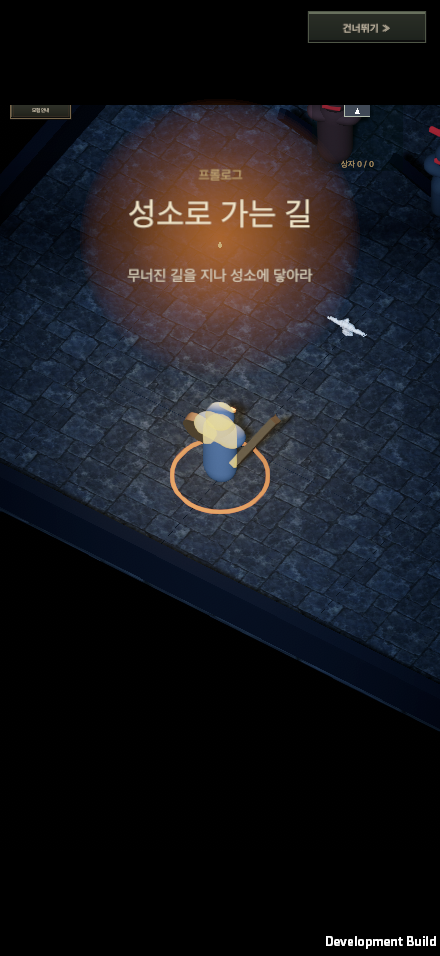
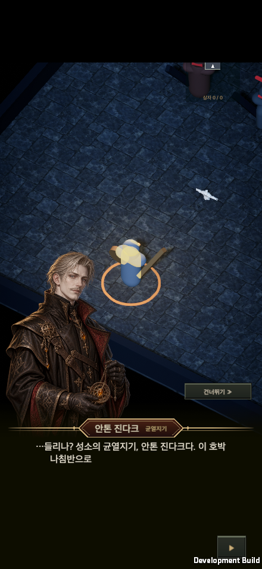
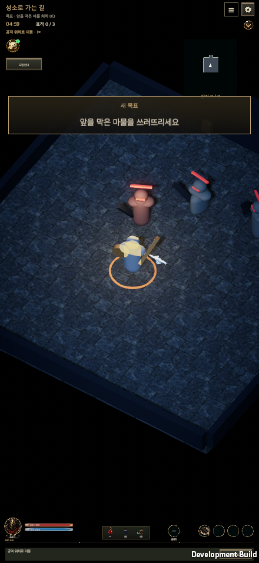
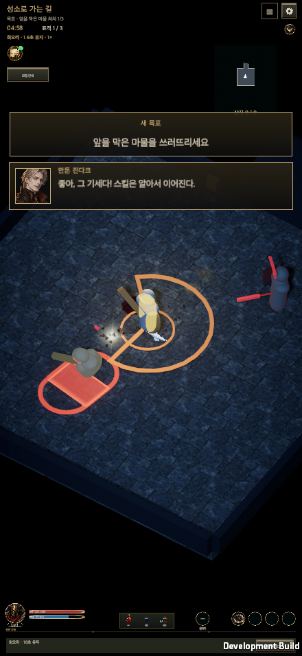
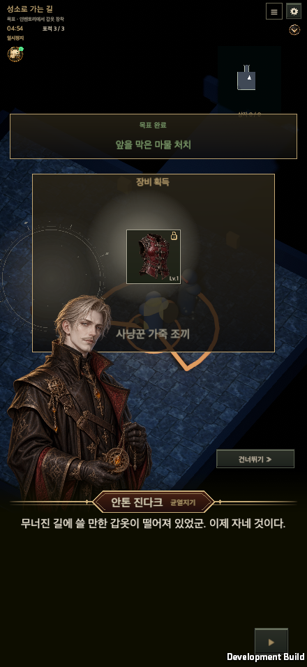
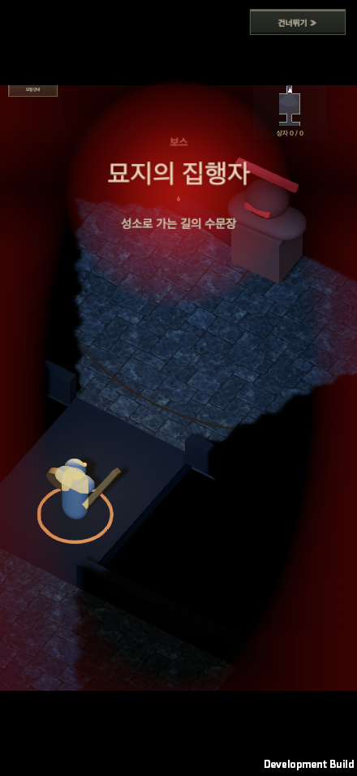
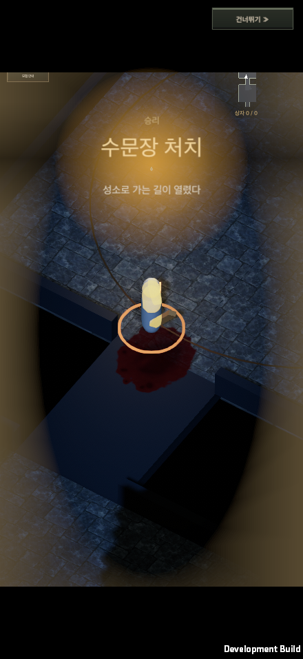
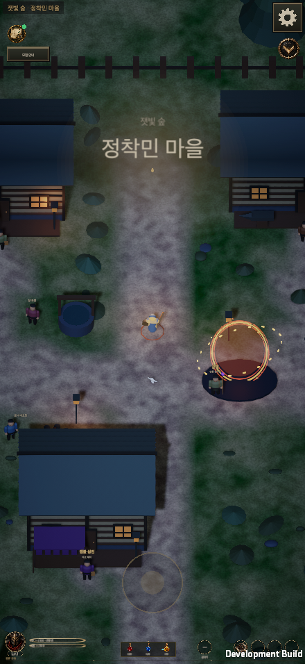
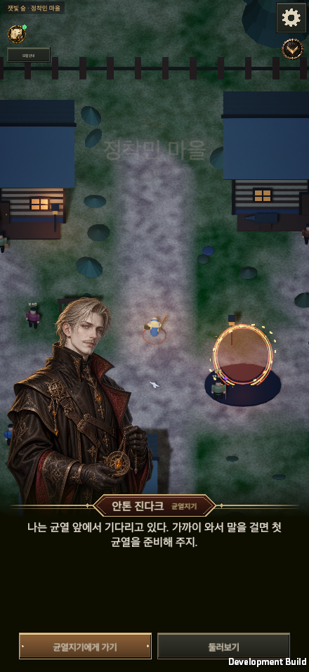
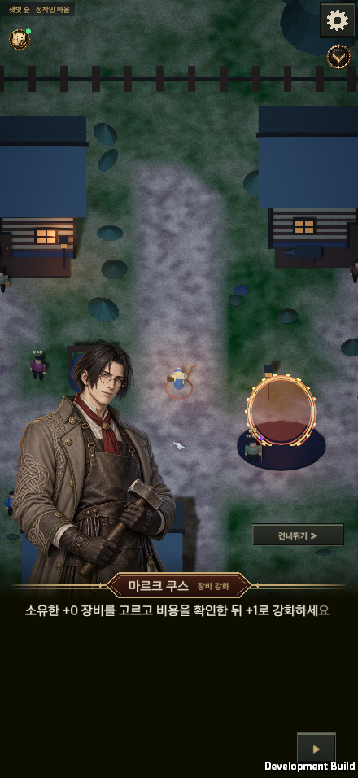

추가 장면: [인벤토리 강조](TutorialStagingEvidence/staging-inventory-pointer.png) · [수문장 처치 후 대화](TutorialStagingEvidence/real-boss-cleared.png) · [다시보기 승리](TutorialStagingEvidence/rewardless-replay.png)

### 화면 조합 예시

20개 조합 전체는 스모크가 자동으로 검사했고, 여기에는 대표 캡처만 남긴다.

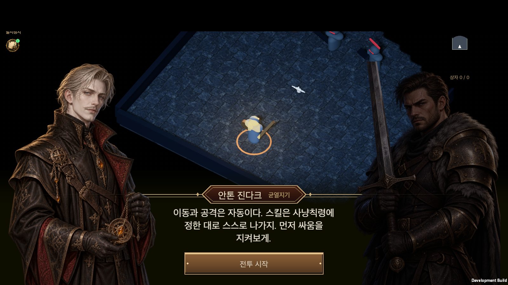

| 화면 | 440×956 한국어 150% | 956×440 영어 100% |
| --- | --- | --- |
| 도입 대화 | [PNG](TutorialStagingEvidence/intro-440x956-ko-150.png) | [PNG](TutorialStagingEvidence/intro-956x440-en-100.png) |
| 마을 도착 | [PNG](TutorialStagingEvidence/arrival-440x956-ko-150.png) | [PNG](TutorialStagingEvidence/arrival-956x440-en-100.png) |
| 주민 안내 | [PNG](TutorialStagingEvidence/briefing-440x956-ko-150.png) | [PNG](TutorialStagingEvidence/briefing-956x440-en-100.png) |

NPC 대화: [안톤 진다크 1440×810 한국어](TutorialStagingEvidence/npc-anton-jindark-1440x810-ko-100.png) · [마르크 쿠스 1440×810 한국어](TutorialStagingEvidence/npc-mark-kus-1440x810-ko-100.png) · [터크 가르비 440×956 영어 150%](TutorialStagingEvidence/npc-turk-garbi-440x956-en-150.png)

[화면 파일 해시](TutorialStagingEvidence/screenshots-manifest.json)
