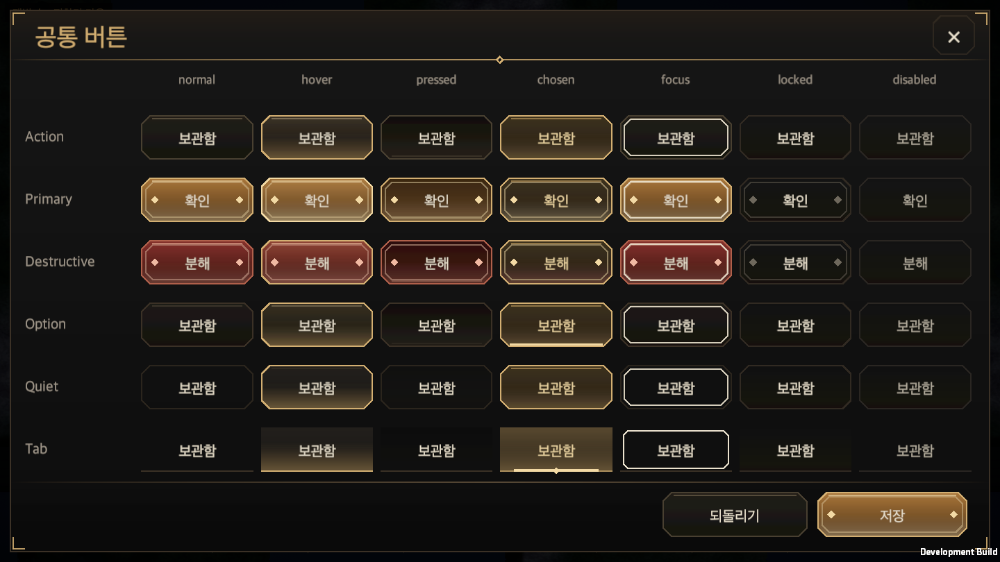
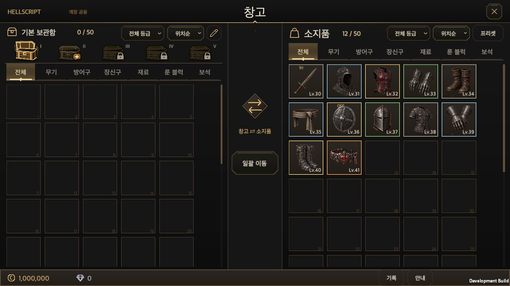
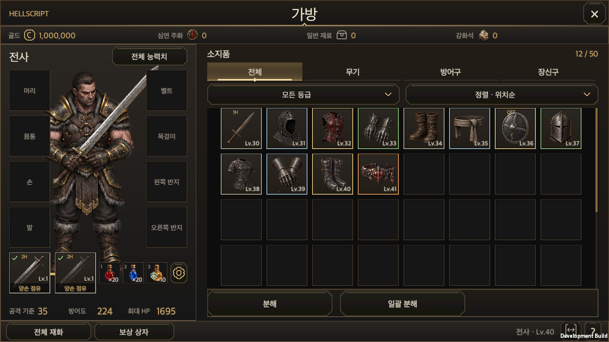
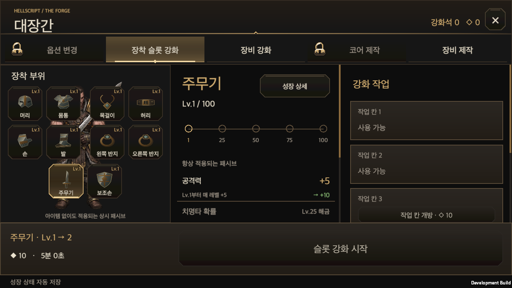
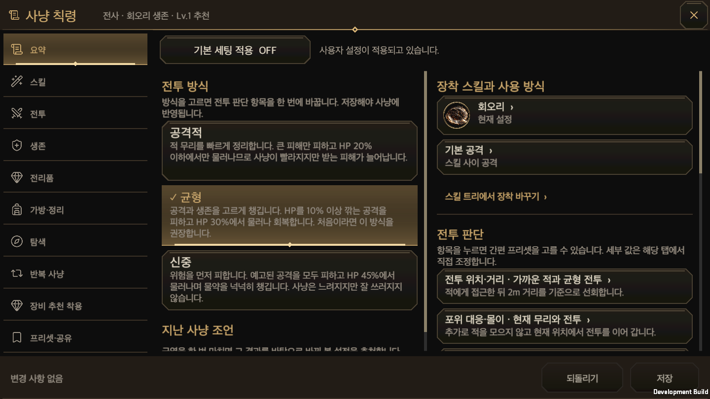
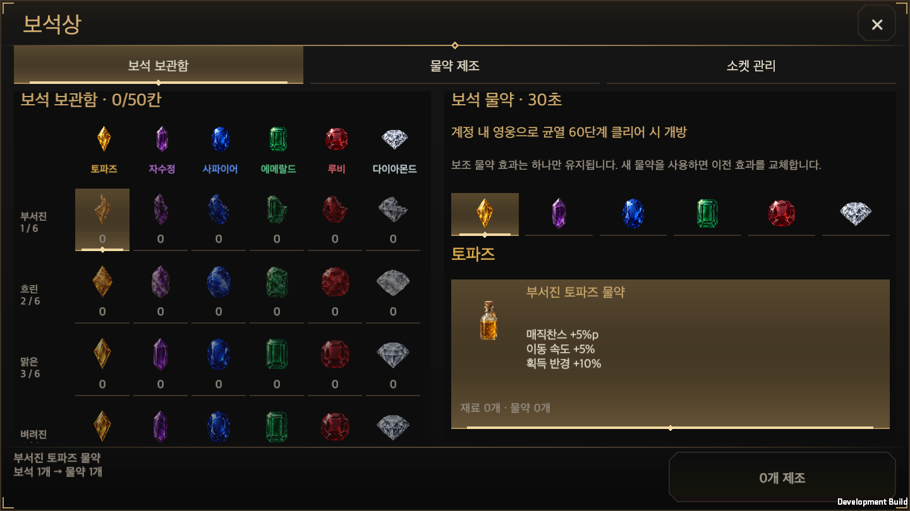
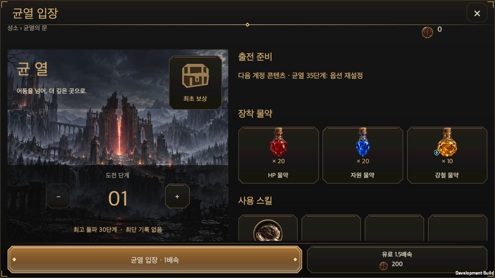
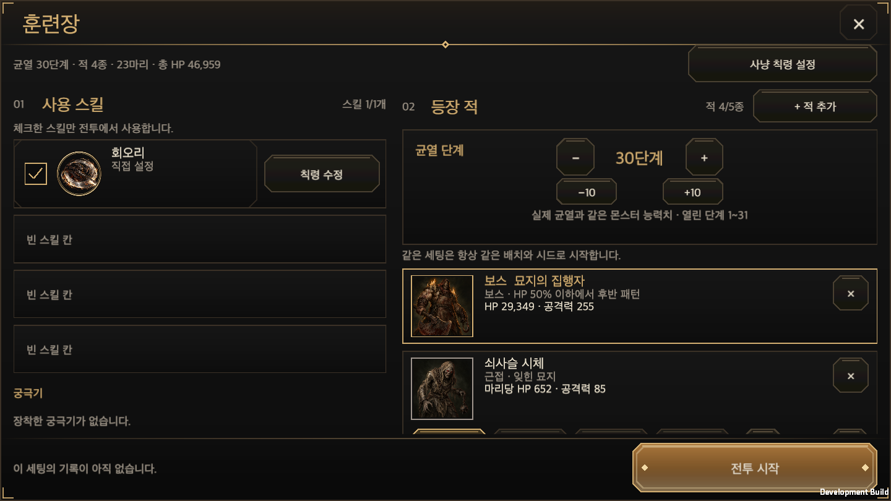
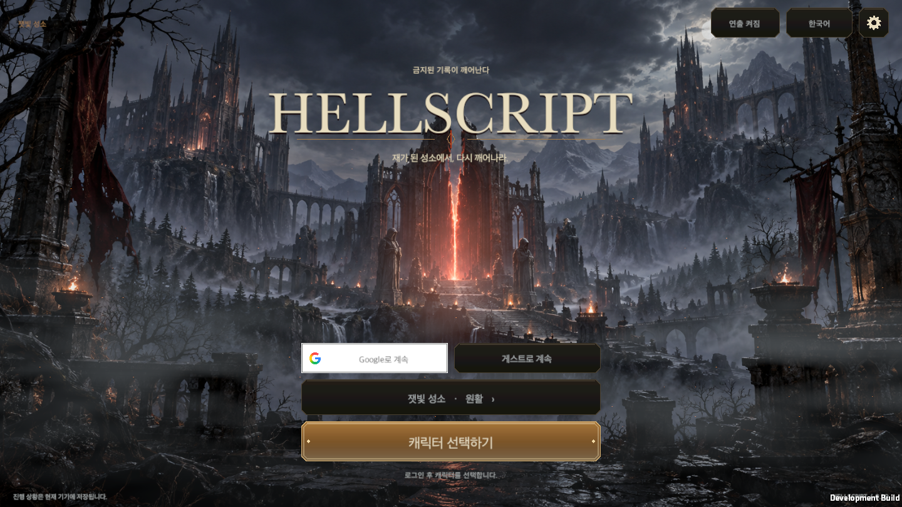
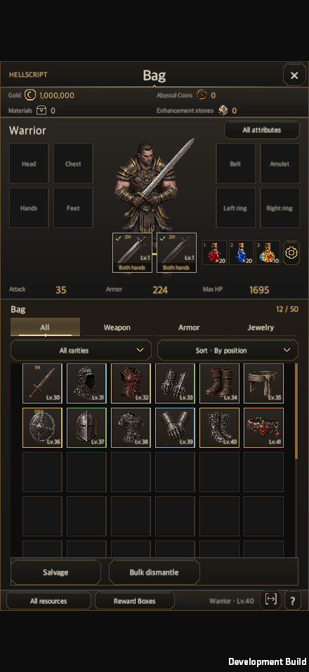

# Shared UI style overhaul: Obsidian & Gilt

Updated: 2026-09-29 · [한국어](Ui_Style_Obsidian_Gilt.md)

The previous shared buttons used a thick black outline and a raised bevel, and every surface had an olive tint, which made the game look heavy and dated. This work retires that style and introduces **Obsidian & Gilt** in the shared owners, then fixes the places where screens had drifted from the shared style.

## Direction

- **Surfaces** use one warm obsidian ramp (`Void`→`Inset`→`Background`→`Panel`→`Raised`→`Hover`). The green cast is gone, so the UI matches the grey stone and embers of the title art.
- **Lines** are a single hairline in bronze (`Border`, `Edge`). Gold (`Gold`, `GoldBright`) is reserved for the current choice and the primary action.
- **Buttons** are chamfered octagons: one hairline ring, a face that darkens downward, a thin inner top light and a soft glow rising from the lower edge. The black outline and bevel are removed.
- **Tabs** read as one strip instead of boxes. The chosen tab has a gold underline, a centre lozenge and a rising glow.
- **Windows** have a gilt divider that fades at both ends under the header, with a centre lozenge, and gilt corner marks.

## Roles

| Role | Normal | Chosen / emphasis |
| --- | --- | --- |
| `Action` | Obsidian face, bronze ring | Hover adds a gold ring and a lower glow. |
| `Primary` | Amber-gold face, gilt double line, flanking lozenges | Only the one committing action on a screen. |
| `Destructive` | Deep blood-red face, ember ring | Irreversible actions such as confirming a salvage. |
| `Option` | A darker face | Gold ring and a gold lower line when chosen. |
| `Quiet` | No face, faint ring | Secondary controls such as the `×` close. |
| `Tab` | Shared baseline only | Gold underline, lozenge and glow when chosen. |

Pressed, keyboard focus, disabled and sequential-lock input rules still follow [Button and tab interaction](Button_UX.en.md). Only the presentation changed; hit areas, layout and account writes are untouched.

## Owners

- `UiTheme`: the Obsidian & Gilt ramp and per-role button colours. `Tint(hex, alpha)` builds a token colour with transparency.
- `UiButtonFace`: draws the chamfered face, ring, lights and ornaments as one vector mesh, without textures or material instances.
- `UiMesh`: shared primitives for chamfered fills, rings, height gradients, lozenges and corner marks.
- `UiWindowFrame`: the `ContentWindowView` frame. It extends `Image` so existing adapters can still hide it through `Image.color`.
- `UiHeaderRule`: adds the same gilt divider to adapters that keep their own header layout: storage, bag, blacksmith, equipment merchant, rune master and Hunt Edict.
- `UiButton`: hides its own legacy rectangular skin, which would otherwise show under the chamfered face. The skin keeps receiving raycasts, so the hit area is unchanged. Content graphics such as items and icons are untouched.

## Drift that was fixed

| Drift | Fix |
| --- | --- |
| 340 surface/edge/gold hex literals in 29 screen files | Moved to the nearest shared token. Semantic colours (rarity, element, danger, success, Google brand) keep their values. |
| 12 olive float colours on window surfaces (town interaction card, rift entry/result, rune board, edict skills, story dialogue, training DPS panel) | Moved to `UiTheme.Tint` tokens. World lighting (`FieldLook`), maps, HUD layout and title-art grading keep their art-matched values. |
| Aspect Runestone steps, Adventure journal and reward-box filters drew tabs as primary actions | Added `ContentWindowView.Tab` and switched them to the tab role. |
| Equipment merchant and rune master tabs rendered as option chips | Switched to `tab-current`/`tab-idle`. |
| Jeweler "Sockets" shown as a plain button inside the tab strip | Shown as an unselected tab. |
| Close controls were `×`, `X` or a "Close" label | Every header close is now a quiet `×`. Footer "Close" actions stay because they are explicit actions. |
| A title-only square gold frame drawn over the title buttons | Buttons use the shared face only; the panel ornament remains. |
| The shared window title hugged the top of the header | Vertically centred and moved clear of the corner marks. |

To keep this from recurring, `tools/check_ui_contract.py` now reports surface, edge, gold and text-family hex literals in screen code. `UiTheme` and the rarity palette owner are exempt. `tools/test_ui_contract.py` gains an injected-violation test and a semantic-colour allowance test.

## Screens

Before images are kept for [storage](UiStyleEvidence/before-storage-1440x810-ko.png), [bag](UiStyleEvidence/before-inventory-1440x810-ko.png), [blacksmith](UiStyleEvidence/before-forge-1440x810-ko.png) and [title](UiStyleEvidence/before-title-1440x810.png), captured by running the same scenario on the unchanged `main`.

## Verification

- The shared UI ownership check passes, and all 11 regression tests pass.
- Related Unity Edit Mode, 28 fixtures: **653 of 654 passed**. The failing `TutorialProgressionTests.EdictAndNewSkillRequireCommittedChangeThenMatchingTrainingAndFreshRift` looks up a level-3 active skill in the skill tree data; it fails the same way on unchanged `main`. [Test XML](UiStyleEvidence/editmode.xml)
- On a macOS development build, the new `-hellscriptUiStyleSmoke` scenario captured the button gallery and the storage, bag, merchant, blacksmith, Hunt Edict (overview and skills), jeweler, Aspect Runestone, rift entry, Adventure journal, settings, town and title screens. After merging the training ground from `main`, its window was added and rechecked at 1440×810 Korean, 440×956 English and 1680×720 Korean at 150%. All **20 combinations** of 1440×810, 1440×900, 1680×720, 440×956 and 956×440 × Korean/English × 100%/150% text exited with code 0. [Run result](UiStyleEvidence/runtime.txt)
- The existing `-hellscriptButtonUxSmoke` passes hover, press, press-cancel, persistent choice, keyboard focus/submit, purchase cancel and exact-cost purchase. Later stages fail at a different point on each run, on unchanged `main` too. One cause I confirmed is the account's `lastSeenUtc` crossing a second boundary, which trips the "navigation did not change the account" comparison. That timing dependency belongs to the scenario and was not fixed here.
- Layouts were reproduced in macOS windows. **Physical mobile touch and performance were not tested.** Captures are display evidence; input and persistence evidence comes from the button scenario and Edit Mode tests above.
