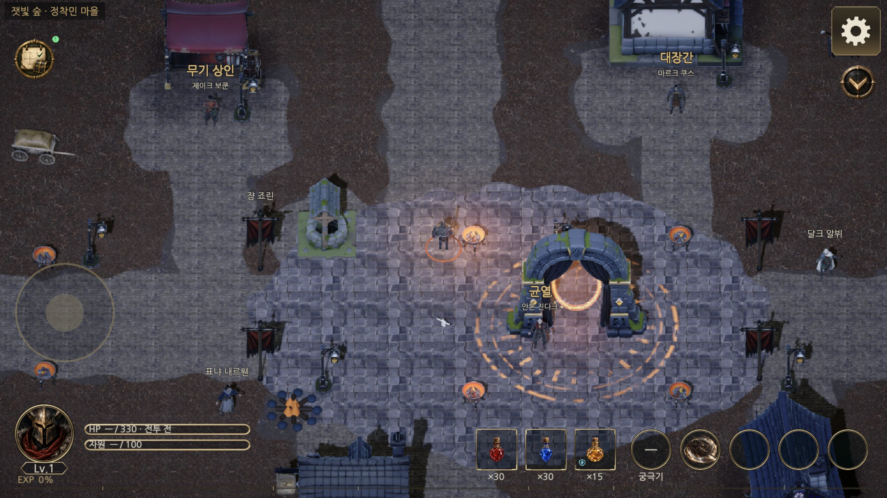
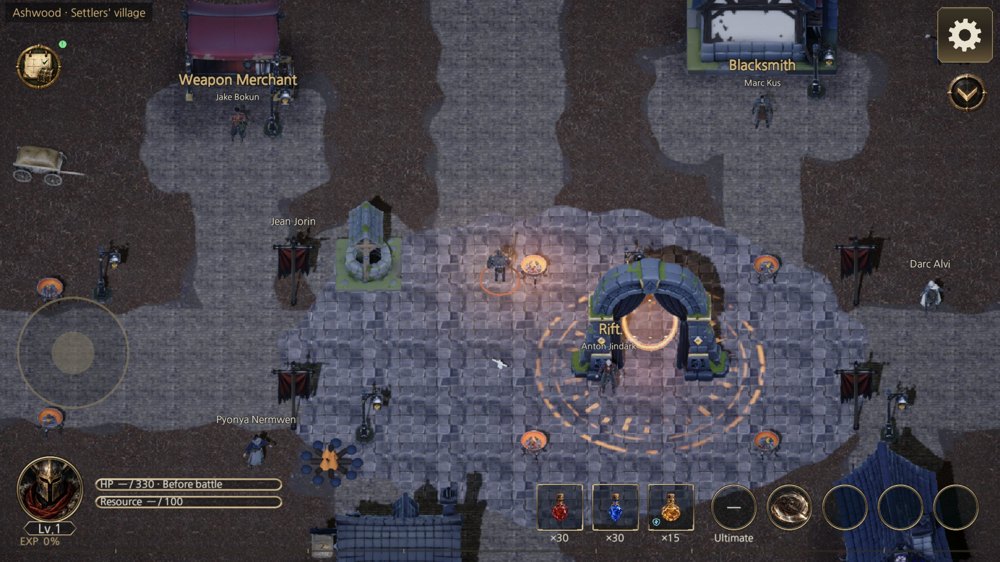
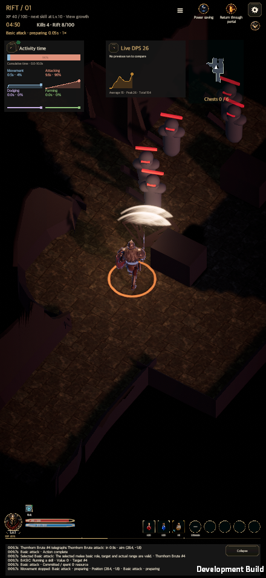
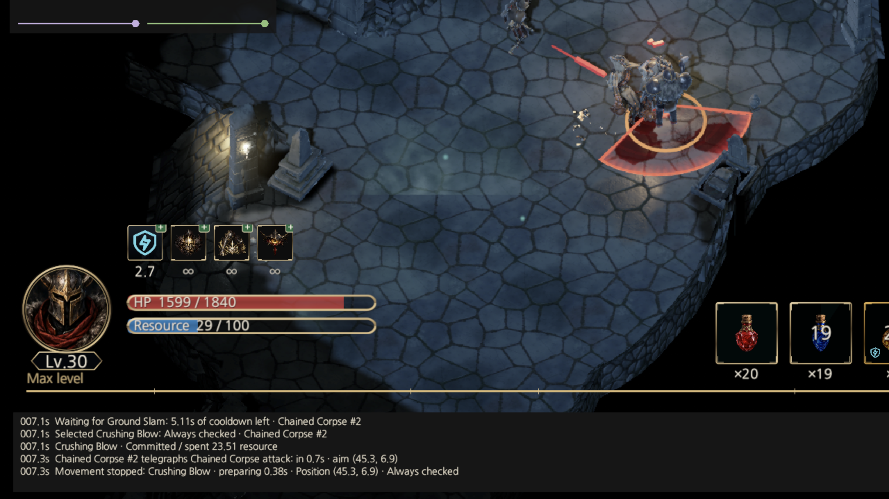

# WebGL 최적화 단계 0·1 결과와 다음 개발 계획

갱신일: 2026-10-07 · [English](WebGL_Optimization_20261006.en.md)

## 메인 병합과 공개 출시 — 2026-10-07

사용자의 메인 병합·공개 배포 요청으로 [PR #65](https://github.com/dakrdong/HELLSCRIPT/pull/65)를 병합했다. 게임 소스는 `1147406775f39406c99223042b46fdb6c71803a1`이다. 기존 측정 이후의 최신 `main`(`c0b33f3f`)에 포함된 마을 환경과 튜토리얼 재입장 변경도 함께 반영했다. 아래 성능 표는 **10월 6일의 고정된 개발 바이너리 비교**이며, 이번 출시 바이너리의 새 성능 측정으로 표현하지 않는다.

| 항목 | 결과와 범위 |
| --- | --- |
| 통합 코드 | 단계 1 소유 코드 10개가 기존 최종 소스와 바이트 단위로 같다. 개발 계측의 마을 진입은 최신 main의 실제 게스트·버튼 경로를 유지하며 선택한 직업을 사용한다. [통합 근거](WebGLOptimization20261006Evidence/Release20261007/source-integration.json) |
| 통합 영향 검사 | 최적화·저장 문구·튜토리얼·마을 관련 EditMode **52 통과 / 실패 0 / 제외 0**. 통과한 기존 전체 검사와 스모크는 변경되지 않은 범위에서 재사용했다. 전체 검사를 다시 실행했다고 주장하지 않는다. [검사 결과](WebGLOptimization20261006Evidence/Release20261007/integration-tests.json) |
| 생성물·CI | 스킬 트리 근거의 이동한 소스 줄 번호 130→132를 기존 생성기로 갱신했다. 최초 CI 실패는 보존했다. 이후 PR·main의 Class skill data와 Shared UI contract가 모두 통과했다. [main CI](WebGLOptimization20261006Evidence/Release20261007/main-ci.json) |
| 출시 WebGL | Unity 6000.6.0f1, IL2CPP, 오류 0. `Development` 옵션·측정 인자·계측 페이지를 포함하지 않는다. 공개 **7파일·259,348,573바이트**, 11개 조각에서 복원한 SHA-256이 전부 같다. 로더 5개·패키지 5개 검사 통과. [빌드](WebGLOptimization20261006Evidence/Release20261007/web-build.json) · [패키지](WebGLOptimization20261006Evidence/Release20261007/package-validation.json) |
| 주 공개 게임 | [hellscript-game.github.io](https://hellscript-game.github.io/) · 배포 `ec200f40` · [Pages 성공](https://github.com/hellscript-game/hellscript-game.github.io/actions/runs/37519716373) |
| 기존 공개 게임 | [기존 저장 주소](https://dakrdong.github.io/HELLSCRIPT-Web/) · 배포 `cfe60e14` · [Pages 성공](https://github.com/dakrdong/HELLSCRIPT-Web/actions/runs/37519746846), 같은 커밋의 2번째 시도. 최초 서버 대기 작업만 취소·재시도했으며 승인·보안 정책은 바꾸지 않았다. |
| 실제 공개 조작 | 로그인 없는 macOS 내장 `iab`에서 주 주소의 로딩·시작·게스트·전사 선택·마을 KO/EN·언어 KO 복원을 확인했다. 기존 주소에서도 로딩·시작·실제 타이틀을 확인했다. 두 주소의 공개 `build-info.json`이 소스·7파일 해시까지 일치한다. Console 오류 0. 주 주소의 기존 URP FSR 경고 1건과 Content-Length 경고 8건은 남아 있다. [실제 조회 기록](WebGLOptimization20261006Evidence/Release20261007/public-browser.json) |
| 원본 작업 보호 | 원본 main을 안전하게 fast-forward했고 사용자 변경 15항목과 수정 중인 Actors 파일 해시를 보존했다. [확인](WebGLOptimization20261006Evidence/Release20261007/original-main-update.json) |

출시 소스의 Assets·Packages·ProjectSettings **6,083개 입력 해시**를 [별도 기록](WebGLOptimization20261006Evidence/Release20261007/release-source-sha256.json)으로 고정했다. Unity 빌드가 생성한 네 경로의 설정 차이는 패치를 보존한 후 원래 값으로 복원했다. 공개 위키는 이 문서·이력·DB·이미지·근거를 포함한 병합 main 전체를 [읽기 전용 주소](https://dakrdong.github.io/HELLSCRIPT-Wiki/#/tree)에 동기화하며, 최종 Pages·실제 문서/DB 조회 영수증은 작업 전용 `release-20261007`에 보존한다.

이번 공개 확인은 기본 글자 크기의 PC 동작 범위다. 전투·보상·저장 전체 스모크나 출시 전후 성능 A/B, 30분 soak, Android/iPhone 실기기 검증을 새로 수행한 결과가 아니다. **단계 2~6은 시작하지 않았고 고밀도 60FPS 안정화는 아직 완료하지 않았다.** 기존 비교 바이너리와 원자료는 2026-10-13 검토까지 유지한다. 이번 출시 출력·재조립 사본·생성 위키 사본도 수명 manifest에 추가하며 영구 삭제 승인이 없는 산출물은 정확한 경로로 정리 대기를 남긴다.

## 2026-10-06 개발 검증 기록

아래 기록은 당시의 구현·고정 조건 측정·검증 범위를 보존한다. 이후 병합·공개 상태는 위의 2026-10-07 기록을 따른다.

## 결론과 적용 범위

작업 브랜치 `codex/webgl-optimization-stage0-1`에서 단계 0 측정 도구와 단계 1 즉시 수정을 구현했다. 최신 `origin/main`의 `945fa46f`를 `c53a144a`에서 반영한 뒤 기준 빌드를 다시 만들었다. 초기 `4fc52dba` 기반 자료와 섞어 개선율을 계산하지 않았다. 기준 계측 소스는 `4b1c1916`, 개선 소스는 여기에 단계 1 런타임 변경을 적용한 상태다. 측정 후 발견한 기존 로그 번역 오류도 공통 번역 소유자에서 수정했고 관련 검사와 최종 개발 플레이어 검증을 마쳤다. 측정 바이너리와 번역 수정을 포함한 최종 검증 바이너리는 각각 변경·소스·파일 해시를 보존했으며 서로 대체하지 않았다.

PC WebGL 19개 조건에서 저장 바이트와 프레임당 GC 할당의 전후 3회 범위가 모두 겹치지 않게 감소했다. 저장 바이트는 조건별 중앙값 기준 **62.0~67.4%**, GC 할당은 **43.2~77.7%** 감소했다. 프레임 p95와 실제 FPS는 19개 중 18개 조건에서 개선을 인정했다. 전사·칙령 OFF·4배 조건에는 개선 후 약 43FPS의 유효한 느린 표본이 있어 프레임 개선을 인정하지 않았다.

**고밀도 p95가 여전히 16.7ms를 넘는다. 모든 조건에서 끊김 해소·60FPS 안정화가 끝난 것은 아니다.** 모바일 실기기와 일반 Chrome·Safari·Firefox, 출시 빌드, 30분 장기 안정성은 미검증이다. 이번 결과는 macOS 개발 플레이어와 Codex 내장 브라우저의 WebGL 개발 플레이어 범위다.

전투 20Hz, 판단 0.2초, 자동저장 3초, HUD 0.15초, RNG·행동 순서·보상·거래 검증·스키마 21·서버 V1 계약은 유지했다. 단계 2~6과 V2 기록 저장은 시작하지 않았다. PR 생성, 작업 브랜치의 main 병합, 공개 위키 게시는 최종 프롬프트에 따라 후속 사용자 확인 대상이다.

## 항목별 상태

| 항목 | 상태 | 근거 또는 남은 일 |
| --- | --- | --- |
| 격리 작업 폴더·최신 main 반영 | 구현·확인 | 원본 사용자 변경 보존, 관리형 worktree |
| 기준 WebGL·macOS 개발 빌드와 해시 | 검증 완료 | 전후 빌드 모두 오류 0, 계측 후 SHA-256 고정 |
| 저장·저널·시야·미니맵·칙령·몹 틱 계측 | 검증 완료 | 실제 플레이어 마커·카운터·원시 프레임 |
| 직업·칙령·밀도·언어·로그·저장 경로 인자 | 구현·PC 측정 | 3직업 × ON/OFF × 1/2/4배, 펼침 추가 |
| 개발 전용 고밀도 스트레스 | 승인·검증 완료 | 검증된 맵에 일반 몹 추가; 콘텐츠 최대 밀도와 구분 |
| 구간별 요약·최대·p99·시간축 스파이크 | 검증 완료 | 요약기 검사, 실제 자료 집계 |
| 실제 IDBFS 저장 경로·콜백 관찰 | 검증 완료 | 모든 유효 웹 구간에 저장 2회; 관찰된 동기화 오류 0 |
| 시뮬레이션 전체 상태·저널 동일성 | 검증 완료 | 108조건 모두 덤프 바이트·해시·RNG·결과 동일 |
| compact 저장·기존 파일과 백업 복원 | 구현·관련 검사 통과 | JSON 공백만 제거; 원자적 교체·복구 유지 |
| 빈 덫·눈보라·오라 경로 | 구현·관련 검사 통과 | 빈 경로 의미·이벤트 순서·엄격한 무할당 검사 |
| 미니맵 표시 상태에 따른 dirty | 구현·관련 검사 통과 | 이동/안개 기존 경로 + 제자리 상태 변화 감지 |
| 표시되는 로그 행의 갱신 키 | 구현·관련 검사 통과 | 기록 이벤트 유지, 실제 표시·언어·크기 변경 반영 |
| 보스 공격 정의 조회 캐시 | 구현·관련 검사 통과 | enum 순서 유지, 번역 문자열은 캐시하지 않음 |
| 최종 전체 EditMode·관련 UI 스모크 | 검증 완료·범위 제한 명시 | 전체 5,221 통과·실패 0, 후속 번역 관련 25개 통과, 미니맵·로그·UI 갱신 검사 통과 |
| 최종 WebGL KO/EN 동작 | 확인 완료·성능 비교 제외 | 언어별 전투 120틱·저장 2회·IDBFS 오류 0, 실제 DPR/해상도 차이로 성능 표에 합산하지 않음 |
| 60초 창 분할·긴 측정 인자 | 구현·장기 운용 미검증 | 20초 ON 표본에 정상 자동 반복 대기가 섞여 활성 전투 기준 미충족 |
| Android·iPhone·30분 soak | 미검증 | 실기기 없음; 장기 표본 미수집 |
| 단계 2~6, 최근 100회 전체 이벤트·저장소 막힘 처리 | 계획 | 별도 승인·후속 개발 범위 |
| 산출물 종료 처리 | 보존·정리 승인 대기 | 서버·작업 탭 종료, 비교 바이너리/근거 보존, 영구 삭제 없음 |

## 구현 내용과 보존한 동작

1. **저장:** `GameStore.Write`의 `JsonUtility.ToJson(data,true)`를 `false`로 바꿨다. 필드·스키마·저장 주기·검증·임시 파일 교체·백업·아카이브 동기화는 그대로다. 기존 들여쓰기 파일과 손상된 primary의 pretty 백업 복원을 검사했다.
2. **빈 효과:** 덫이 없으면 살아 있는 적의 `trapTick=.5f`만 반영한다. 눈보라가 없으면 기존 dt 조건에 따른 타이머 복원과 해당 영웅의 M02 영역 상태 제거만 수행한다. 실제 효과가 있는 경로의 정렬 규칙은 유지했다. 캡처 lambda가 있는 기존 눈보라 본문은 별도 함수로 옮겨 빈 경로에서도 생성되던 객체를 제거했다.
3. **오라:** 살아 있는 일반 오라 몹이 없을 때 필요한 source 초기화와 `AURA_REMOVED` 이벤트만 기존 순서로 수행한다. 틱당 세 번 호출은 그대로다.
4. **미니맵:** HUD의 무조건 dirty를 표시 마커 상태 비교로 바꿨다. 이동·안개 revision 경로는 유지한다. 상자 상태/종류/포기, 정예 관측과 만료/시야, 성소, 방문한 봉인, 운반체·공물·제단, 문 상태/위치/방향, 보스 위치/시야, 펼침과 맵 교체를 비교한다. 변하지 않는 상태에서는 새 목록을 만들지 않는다.
5. **실시간 로그:** 숨기는 HIT_DEALT/ACTION_COMPLETE/ACTION_RELEASE 이벤트만 추가됐을 때 같은 행을 다시 측정하지 않는다. 표시 행의 마지막·첫 sequence·개수와 저널 참조, 언어, 크기, 현재 행동, 펼침 변경을 반영한다. 2만 개 한도에서 중간 행이 밀려나는 경우도 키에 포함했다. 표시 간격과 출력 문자열 형식은 유지했다.
6. **이름 조회:** 보스 정의 ID→enum 인덱스를 한 번 만든다. 같은 정의가 여러 enum에 대응하면 기존 첫 enum을 유지한다. 이름은 매번 번역 소유자에서 얻는다. `ClassSkills.Find`까지 포함한 전체 `AttackName`이 무할당이라고 주장하지 않는다.
7. **기존 로그 번역 오류:** `Loc.TranslateStored`가 대상 `#번호`로 끝나는 전체 메시지를 개체 이름으로 먼저 분해하던 원인을 수정했다. 구분자가 있는 조립 메시지는 전체 문구 템플릿으로 처리하고, 일반/고유 개체 이름은 기존 정확한 조회를 유지한다. 저장 이벤트 원문은 바꾸지 않는다. 이 후속 표시 수정의 성능 효과는 측정하지 않았다.

캐시는 표시만 위한 파생 상태다. 저장 데이터·보상·거래의 최종 검증을 대신하지 않는다. 현재 기록 2만 개와 서버 V1 제한을 확대하거나 이벤트를 삭제하지 않았다.

## 검증과 도구 문제 처리

### 동일성·관련 검사

- 기존 관련 기준선: 90개 통과, 실패·건너뜀 0.
- 단계 1 최초 관련 실행: 118개 중 116개 통과, 새 GC 검사 2개 실패. 사용자에게 중단 규칙대로 확인한 뒤, **기준 유지·원인 수정·계속 진행** 승인을 받았다.
- 보스 조회 실패는 정확한 측정 delegate의 첫 실행 비용이 섞인 문제였다. 측정 전에 동일 delegate를 워밍업했다.
- 빈 효과 실패는 실제 눈보라 캡처 객체 할당이었다. 본문을 효과가 있을 때만 호출하도록 고쳤다. 수정 후 무할당 및 dt별 동일성 6개 검사가 통과했다. 보스 조회 검사도 통과했다. 실패 자료를 보존했고 허용 오차·검사 기준을 완화하지 않았다.
- 최신 main 기반 변경 전/후 명시적 시뮬레이션 검사: 각각 1개 통과. 3직업 × 칙령 ON/OFF × 밀도 1/2/4 × 일반 맵·무리·오라·원거리·치유·보스 = **108조건**. 같은 시드·고정 개발 전투 ID·300틱 입력의 전체 RunState와 저널이 모두 바이트 단위로 일치한다. 실제 시각/빌드 식별자/표시 ID만 정규화하며 RNG·보상·이벤트·행동 상태는 제외하지 않았다.
- `GC.GetAllocatedBytesForCurrentThread`가 제어 할당에도 0을 반환한 환경은 미지원으로 기록했다. 그 값을 무할당 근거로 사용하지 않고 Unity GC 제약의 양성 제어와 엄격한 무할당 검사를 사용했다.

### 최종 검증

| 검증 | 결과 | 범위·근거 |
| --- | --- | --- |
| 최종 전체 EditMode, 필터 없음, 1회 | **5,221 통과 / 0 실패 / 2 제외** | 총 5,223개. 후속 번역 수정 전 실행이며 변하지 않은 범위의 성공을 재사용한다. 제외는 별도 측정 도구 두 개다. `WebGlOptimizationMeasurement.Capture`는 전후 각각 별도 통과했다. |
| 후속 저장 문구·전체 저널 번역 검사 | **25 통과 / 0 실패 / 0 제외** | 공통 번역 수정의 직접 영향 범위. 대상 -1/0/53, 일반/고유 보스 이름, 전체 자연 전투/패배 로그와 저장 이벤트 바이트 유지 |
| 전후 전체 상태·저널 비교 | 108조건 모두 일치 | 최신 main 기반 고정 입력, 상태/저널 바이트·SHA-256 동일 |
| 공통 UI 정적 소유권 | 통과 | `check_ui_contract.py` |
| 공통 UI 도구 검사 | 11개 통과 | `test_ui_contract.py` |
| 저장 후 UI 갱신 규칙 | 통과 | 12 binding guard, 161 UI 소스 목록 |
| macOS 미니맵 스모크 | 통과 | 94개 PASS 기록, 129장 캡처. KO/EN, 세로·가로·PC 16:9/16:10/21:9, 작은 화면과 모의 safe area, 실제 합성 pointer 전후 상태 |
| macOS 실시간 로그 스모크 | **수정 후 통과** | 24 compact/expanded KO/EN 사례. 440×956·956×440·1600×900·1600×1000·2100×900·512×288, 기본 글자 크기, 로그 불변·줄 용량·클리핑/겹침·물약 합성 입력 및 상태 복원 |
| macOS 저장 후 UI 갱신 스모크 | 통과 | 26 화면/언어 조합·78장 캡처. 무변경 Save 5회 × 3회, 실제 값 변경·누름 중 저장·child 동안 지연 검사. 동기 Save+binding+Canvas 관찰이며 전 프레임·모든 팝업/스크롤/빠른 탐색의 안정성 증명은 아니다. |
| 최종 macOS·WebGL 개발 빌드 | 모두 성공·오류 0 | 번역 수정을 포함한 별도 `final/` 출력. 원시 웹 7개 파일과 계측 변형 8개, 네이티브 323개 해시; 최종 소스 4,042개 파일 일치 |
| 최종 로컬 WebGL 전투·로그·저장 | KO/EN 동작 확인 | 각 전투 120틱·저장 2회·IDBFS callback 9개 오류 0·전체 저널 POST 204·런타임 예외 0. 실제 canvas 1920×1080/DPR 2로 고정 성능 비교에서는 제외 |
| 측정 후 바이너리 무결성 | 통과 | 전후 웹 각 8개·macOS 각 323개 파일 해시 동일. 런타임 소스 일치; 빌드 때 생성된 두 ProjectSettings 파일은 저장소 값으로 복원했다. |
| 로컬 위키 생성·검사 | 통과 | Python 12개, Node 문서 532개·DB 33개·상세 4,589개, 사본 일치·날짜만 표시·읽기 전용 검사. 실제 결과는 `final-document-validation.json`에 보존한다. 공개 게시는 수행하지 않는다. |

로그 스모크 최초 실패는 변경 전의 고정 기준 바이너리에서도 같은 문구로 재현됐다. 사용자의 계속 진행 지시에 따라 기준을 유지하며 공통 번역 원인을 수정했다. 첫 수정은 기존 고유 보스 이름 분해 검사에 실패했다(73개 중 72개 통과·1개 실패). 단독 개체 이름의 조회 순서를 보존하도록 보완한 뒤 직접 영향 검사 25개와 로그 스모크 24개가 통과했다. 실패 원본과 두 수정 시도의 기록을 보존한다.

후속 수정은 표시 번역에 한정된다. 이미 통과한 전체 EditMode, 미니맵 스모크와 정적 UI 검사는 다시 실행하지 않았으며, 그 결과를 최종 소스 전체의 재실행 결과로 표현하지 않는다. 실패한 로그 스모크와 영향 번역 검사, 남아 있던 UI 갱신 스모크 및 최종 개발 빌드만 실행했다. 이번 요청의 단계 0·1 구현과 이 검증 범위를 마쳤다. 장기·모바일·출시 성능은 여전히 미검증이다.

최종 WebGL 한국어 실행은 실제 약 119FPS(기록된 rAF rate 60, 타이밍 divisor 1), 영어 실행은 실제 약 59FPS(기록된 rate 120, divisor 2)였으며 둘 다 DPR 2였다. rate 관찰값만으로 실제 페이싱을 단정하지 않는다. `Visibility, resolution or focus mismatch`와 `Insufficient workload` 판정을 그대로 보존하고 **114개 성능 표본에 추가하지 않았다**. 이 두 실행은 로컬 언어/전투/로그/저장 동작 확인만 뒷받침한다.

위키 첫 생성은 Git에서 제외된 기존 `Artifacts/Validation` 입력이 worktree에 없어 중단됐다. 문서·과거 이력이 참조하는 원본 파일 283개(122,724,222바이트)만 읽기 전용으로 가져와 SHA-256 일치를 확인했다. 원본 폴더를 수정하거나 프로젝트·빌드·캐시를 복사하지 않았다. 이는 역사적 근거 복원이며 이번 검사의 새 통과로 집계하지 않는다. 실패 로그와 복원 목록을 보존한다.

### 제외·실행하지 않은 항목

- 20초 Mage·칙령 ON·4배·로그 펼침의 **변경 전** 진단 실행은 정상 결과/자동 재입장 대기가 포함돼 293틱으로 활성 전투 측정의 최소 기준을 충족하지 못했다. 전투 ID가 첫 실행에서 두 번째 실행으로 바뀐 것도 확인했다. 기준을 낮추지 않았으며 전후 개선 판정에서 제외했다. 이 구간의 저장 13회·누적 68,498,579바이트는 거래/결과/재입장을 포함한 진단 관찰이며 3초 자동저장 횟수로 해석하지 않는다.
- 자연스러운 반복 대기를 포함하는 장기 표본은 활성 시간과 대기 시간을 분리하는 하네스 보완 후 다시 측정해야 한다. 30분 soak는 실행하지 않았다.
- Android·iPhone 실기기, 실제 모바일 터치·발열·배터리·저전력, 일반 Chrome/Safari/Firefox와 공개 배포 플레이어는 실행하지 않았다.
- 알려진 `-hellscriptEdictProgressionSmoke` 재실행 출석 창 정체는 이번 변경의 관련 스모크가 아니므로 다시 실행하지 않았다.
- PR·main 병합·공개 위키 게시는 실행하지 않았다. 로컬 위키 검사와 작업 브랜치 푸시를 공개 반영 완료로 표현하지 않는다.

## 측정 조건과 판정 기준

- Unity 6000.6.0f1, URP 17.6, 같은 게임/장비/맵/시드·개발 전투 ID. 실제 콘텐츠 맵 배치 안전 검증은 유지하고 추가 몹만 개발 전용으로 생성했다.
- WebGL: 내장 `iab`, IL2CPP, 1280×720, DPR 1, Mobile 품질, 실제 60Hz rAF, 고정 타이머 사용 안 함. 전후 18조건 × 3회 × 2 = 108표본, Mage ON 4배 펼침 6표본 추가: **114개 유효 표본**. 각 6초·워밍업 1초, 각 저장 2회, 고유 세션의 실제 persistentDataPath/IDBFS.
- 네이티브: 같은 해상도·품질의 macOS 개발 플레이어, Mage OFF 1배와 ON 4배 각각 전후 3회: **12표본**. 네이티브와 웹을 같은 플랫폼의 효과로 합치지 않는다.
- 여러 즉시 수정을 함께 적용한 비교다. 각 수정의 개별 기여율은 별도 A/B로 분리하지 않았다. 프레임당 GC·마커 값에는 실제 FPS 차이가 반영되므로 동일 페이싱의 순수 CPU 절감률로 해석하지 않는다.
- 실행 순서는 전→후 / 후→전 / 전→후. 빌드·검사·측정은 직렬로 실행했다. 초기/차단/이전 main 자료와 무효 표본은 별도 폴더에 보존했다.
- 평균·p95·p99·최대·합계·0이 아닌 횟수와 프레임 스파이크를 보존했다. 저장 마커 p95·p99가 0이어도 3초 저장 비용이 없다는 의미가 아니다. 중첩 마커를 합산하지 않는다.
- 반복 범위가 겹치면 개선을 인정하지 않는다. FPS 증가는 반대 방향의 범위로 판정했다. FPS가 바뀐 구간의 CPU/프레임은 동일 페이싱 CPU 개선으로 인정하지 않는다.
- 웹 CDP ProcessTime은 독립 renderer 목록으로 검증하지 못했다. 실제 renderer CPU·RSS 개선은 미확인이다. 네이티브 CPU는 프로세스 CPU 시간이나 전후 실제 FPS 범위가 겹치지 않아 CPU/프레임 개선 판정은 보류했다. 아래 마커는 프로파일러 **구간 소요 시간**이며 순수 프로세스 CPU와 동일한 뜻이 아니다.
- 관리 힙·Unity 할당·네이티브 RSS·웹 JS 힙·GC 수집 횟수는 따로 기록했다. 웹 관리 힙 관찰 범위는 전 29.8~36.2MiB, 후 29.3~34.8MiB로 겹친다. 메모리 사용량 전체 감소는 인정하지 않는다.

### WebGL 조건별 전후 비교

수치는 전후 각 3회 범위다. MB는 1,000,000바이트, KiB는 1,024바이트다. 저장량은 호출당, GC는 프레임당 평균이다. 표의 판정은 프레임 p95 기준이며 저장 바이트·GC는 모든 행에서 감소 범위가 겹치지 않았다.

| 조건 | 실제 FPS 전 → 후 | 저장 MB/회 전 → 후 | GC KiB/프레임 전 → 후 | 프레임 p95 ms 전 → 후 | 판정 |
| --- | --- | --- | --- | --- | --- |
| Mage OFF 1배 | 59.60~59.68 → 60.02~60.06 | 2.13~2.16 → 0.69~0.71 | 124.52~124.69 → 40.93~41.28 | 23.00~24.00 → 22.00~22.00 | 인정 |
| Mage OFF 2배 | 59.39~59.50 → 59.84~59.86 | 2.84~2.84 → 0.97~0.97 | 208.60~210.05 → 58.28~58.60 | 26.00~28.00 → 22.00~24.00 | 인정 |
| Mage OFF 4배 | 54.98~55.89 → 59.34~59.45 | 4.14~4.14 → 1.45~1.46 | 401.67~406.16 → 92.17~92.41 | 36.00~38.00 → 24.00~25.00 | 인정 |
| Mage ON 1배 | 59.67~59.68 → 59.90~60.05 | 2.15~2.25 → 0.75~0.75 | 166.22~167.62 → 82.87~83.34 | 23.00~24.00 → 22.00~23.00 | 인정 |
| Mage ON 2배 | 59.26~59.75 → 59.96~60.01 | 2.99~2.99 → 0.98~0.99 | 251.82~254.32 → 99.98~100.76 | 26.00~27.00 → 22.00~23.00 | 인정 |
| Mage ON 4배 | 51.24~55.31 → 59.35~59.57 | 4.38~4.38 → 1.56~1.56 | 455.82~494.14 → 138.26~139.40 | 39.00~41.00 → 25.00~26.00 | 인정 |
| Mage ON 4배 펼침 | 49.78~55.10 → 59.22~59.56 | 4.16~4.38 → 1.56~1.56 | 467.00~514.81 → 147.72~149.37 | 38.00~42.00 → 25.00~25.00 | 인정 |
| Ranger OFF 1배 | 59.68~59.70 → 60.00~60.07 | 2.17~2.26 → 0.75~0.75 | 125.64~126.87 → 48.93~49.00 | 23.00~23.00 → 22.00~22.00 | 인정 |
| Ranger OFF 2배 | 59.27~59.46 → 60.01~60.06 | 2.96~3.05 → 0.99~1.05 | 211.29~212.10 → 71.38~72.17 | 26.00~27.00 → 23.00~23.00 | 인정 |
| Ranger OFF 4배 | 54.99~55.72 → 59.72~59.73 | 4.43~4.54 → 1.63~1.63 | 408.06~410.41 → 118.96~119.18 | 36.00~37.00 → 24.00~25.00 | 인정 |
| Ranger ON 1배 | 59.53~59.68 → 60.06~60.07 | 2.22~2.26 → 0.71~0.75 | 193.54~193.97 → 109.78~110.07 | 25.00~25.00 → 23.00~23.00 | 인정 |
| Ranger ON 2배 | 58.50~58.92 → 59.80~60.01 | 2.83~3.00 → 1.00~1.03 | 283.19~287.07 → 130.59~131.29 | 29.00~32.00 → 24.00~27.00 | 인정 |
| Ranger ON 4배 | 45.50~51.81 → 58.17~58.24 | 4.25~4.33 → 1.54~1.54 | 520.00~589.76 → 171.88~172.54 | 42.00~55.00 → 27.00~28.00 | 인정 |
| Warrior OFF 1배 | 59.52~59.68 → 60.00~60.06 | 2.19~2.26 → 0.72~0.75 | 123.75~124.78 → 40.87~41.73 | 23.00~23.00 → 22.00~22.00 | 인정 |
| Warrior OFF 2배 | 59.11~59.59 → 59.85~60.02 | 3.09~3.11 → 1.08~1.08 | 206.57~208.20 → 58.14~58.15 | 26.00~27.00 → 22.00~22.00 | 인정 |
| Warrior OFF 4배 | 53.41~56.21 → 43.09~59.55 | 4.27~4.63 → 1.56~1.67 | 394.37~410.20 → 90.24~121.62 | 37.00~38.00 → 24.00~46.00 | 인정 안 함 |
| Warrior ON 1배 | 59.52~59.60 → 60.00~60.06 | 2.30~2.35 → 0.72~0.76 | 174.92~175.94 → 91.44~91.47 | 24.00~25.00 → 23.00~24.00 | 인정 |
| Warrior ON 2배 | 58.81~59.34 → 59.52~60.02 | 2.93~3.11 → 1.08~1.08 | 260.42~263.52 → 109.91~110.84 | 28.00~28.00 → 24.00~25.00 | 인정 |
| Warrior ON 4배 | 52.50~56.94 → 59.35~59.58 | 4.58~4.58 → 1.65~1.67 | 445.86~483.62 → 145.42~146.48 | 38.00~39.00 → 26.00~26.00 | 인정 |

### 핵심 마커별 평균 / p95 / p99 / 최대

단위는 ms/프레임이다. 평균·p95·p99는 각 표본 통계의 3회 중앙값, 최대는 세 표본 중 가장 큰 최대값이다. 중첩 마커를 더하지 않는다. 정확한 반복 범위·합계·횟수는 비교 JSON에 있다.

#### HELLSCRIPT.Save

| 조건 | 변경 전 평균 / p95 / p99 / 최대 | 변경 후 평균 / p95 / p99 / 최대 |
| --- | --- | --- |
| Mage OFF 1배 | 0.133 / 0.000 / 0.000 / 25.300 | 0.082 / 0.000 / 0.000 / 15.600 |
| Mage OFF 2배 | 0.172 / 0.000 / 0.000 / 32.600 | 0.099 / 0.000 / 0.000 / 18.800 |
| Mage OFF 4배 | 0.248 / 0.000 / 0.000 / 42.200 | 0.139 / 0.000 / 0.000 / 25.600 |
| Mage ON 1배 | 0.140 / 0.000 / 0.000 / 26.800 | 0.089 / 0.000 / 0.000 / 16.800 |
| Mage ON 2배 | 0.179 / 0.000 / 0.000 / 33.600 | 0.104 / 0.000 / 0.000 / 19.000 |
| Mage ON 4배 | 0.281 / 0.000 / 0.000 / 48.800 | 0.149 / 0.000 / 0.000 / 27.700 |
| Mage ON 4배 펼침 | 0.285 / 0.000 / 0.000 / 49.700 | 0.148 / 0.000 / 0.000 / 27.600 |
| Ranger OFF 1배 | 0.132 / 0.000 / 0.000 / 26.200 | 0.090 / 0.000 / 0.000 / 19.900 |
| Ranger OFF 2배 | 0.182 / 0.000 / 0.000 / 34.400 | 0.110 / 0.000 / 0.000 / 20.700 |
| Ranger OFF 4배 | 0.271 / 0.000 / 0.000 / 50.600 | 0.150 / 0.000 / 0.000 / 29.100 |
| Ranger ON 1배 | 0.135 / 0.000 / 0.000 / 26.300 | 0.088 / 0.000 / 0.000 / 17.200 |
| Ranger ON 2배 | 0.175 / 0.000 / 0.000 / 35.100 | 0.105 / 0.000 / 0.000 / 20.900 |
| Ranger ON 4배 | 0.360 / 0.000 / 0.000 / 59.100 | 0.152 / 0.000 / 0.000 / 29.700 |
| Warrior OFF 1배 | 0.134 / 0.000 / 0.000 / 27.400 | 0.090 / 0.000 / 0.000 / 18.200 |
| Warrior OFF 2배 | 0.191 / 0.000 / 0.000 / 37.000 | 0.113 / 0.000 / 0.000 / 22.200 |
| Warrior OFF 4배 | 0.276 / 0.000 / 0.000 / 58.100 | 0.161 / 0.000 / 0.000 / 160.900 |
| Warrior ON 1배 | 0.140 / 0.000 / 0.000 / 27.800 | 0.091 / 0.000 / 0.000 / 17.500 |
| Warrior ON 2배 | 0.179 / 0.000 / 0.000 / 38.000 | 0.118 / 0.000 / 0.000 / 23.600 |
| Warrior ON 4배 | 0.285 / 0.000 / 0.000 / 54.900 | 0.153 / 0.000 / 0.000 / 29.400 |

#### HELLSCRIPT.Journal.Append

| 조건 | 변경 전 평균 / p95 / p99 / 최대 | 변경 후 평균 / p95 / p99 / 최대 |
| --- | --- | --- |
| Mage OFF 1배 | 0.002 / 0.000 / 0.100 / 0.500 | 0.003 / 0.000 / 0.100 / 0.400 |
| Mage OFF 2배 | 0.003 / 0.000 / 0.100 / 0.400 | 0.003 / 0.000 / 0.100 / 0.500 |
| Mage OFF 4배 | 0.003 / 0.000 / 0.100 / 0.500 | 0.003 / 0.000 / 0.100 / 0.400 |
| Mage ON 1배 | 0.004 / 0.000 / 0.100 / 0.300 | 0.003 / 0.000 / 0.100 / 0.200 |
| Mage ON 2배 | 0.004 / 0.000 / 0.100 / 0.300 | 0.004 / 0.000 / 0.100 / 0.400 |
| Mage ON 4배 | 0.008 / 0.000 / 0.200 / 0.400 | 0.006 / 0.000 / 0.200 / 0.400 |
| Mage ON 4배 펼침 | 0.007 / 0.000 / 0.200 / 0.600 | 0.006 / 0.000 / 0.200 / 0.500 |
| Ranger OFF 1배 | 0.006 / 0.100 / 0.100 / 0.300 | 0.007 / 0.000 / 0.200 / 0.300 |
| Ranger OFF 2배 | 0.007 / 0.000 / 0.200 / 0.300 | 0.009 / 0.100 / 0.200 / 0.400 |
| Ranger OFF 4배 | 0.014 / 0.100 / 0.300 / 0.700 | 0.013 / 0.100 / 0.300 / 0.700 |
| Ranger ON 1배 | 0.005 / 0.000 / 0.100 / 0.200 | 0.005 / 0.000 / 0.100 / 0.300 |
| Ranger ON 2배 | 0.008 / 0.000 / 0.200 / 0.500 | 0.006 / 0.000 / 0.200 / 0.600 |
| Ranger ON 4배 | 0.011 / 0.100 / 0.200 / 0.400 | 0.008 / 0.000 / 0.200 / 0.500 |
| Warrior OFF 1배 | 0.004 / 0.000 / 0.100 / 0.300 | 0.004 / 0.000 / 0.100 / 0.400 |
| Warrior OFF 2배 | 0.006 / 0.000 / 0.200 / 0.500 | 0.005 / 0.000 / 0.100 / 0.500 |
| Warrior OFF 4배 | 0.011 / 0.000 / 0.300 / 0.600 | 0.011 / 0.000 / 0.300 / 1.600 |
| Warrior ON 1배 | 0.005 / 0.000 / 0.100 / 0.300 | 0.004 / 0.000 / 0.100 / 0.400 |
| Warrior ON 2배 | 0.008 / 0.000 / 0.200 / 0.400 | 0.009 / 0.000 / 0.200 / 0.700 |
| Warrior ON 4배 | 0.011 / 0.100 / 0.300 / 0.600 | 0.011 / 0.000 / 0.300 / 0.600 |

#### HELLSCRIPT.Visibility.Update

| 조건 | 변경 전 평균 / p95 / p99 / 최대 | 변경 후 평균 / p95 / p99 / 최대 |
| --- | --- | --- |
| Mage OFF 1배 | 0.372 / 3.300 / 3.700 / 7.400 | 0.366 / 3.200 / 3.600 / 4.000 |
| Mage OFF 2배 | 0.352 / 3.200 / 3.700 / 4.500 | 0.348 / 3.200 / 3.600 / 6.500 |
| Mage OFF 4배 | 0.362 / 3.200 / 3.600 / 5.800 | 0.367 / 3.200 / 3.600 / 4.100 |
| Mage ON 1배 | 0.235 / 3.400 / 3.700 / 3.800 | 0.235 / 3.300 / 3.700 / 7.800 |
| Mage ON 2배 | 0.228 / 3.400 / 3.700 / 5.100 | 0.252 / 3.400 / 3.700 / 4.100 |
| Mage ON 4배 | 0.243 / 3.400 / 3.700 / 4.600 | 0.228 / 3.400 / 3.700 / 4.100 |
| Mage ON 4배 펼침 | 0.280 / 3.400 / 3.800 / 7.700 | 0.228 / 3.400 / 3.700 / 3.800 |
| Ranger OFF 1배 | 0.362 / 3.500 / 4.500 / 4.700 | 0.348 / 3.500 / 4.400 / 4.800 |
| Ranger OFF 2배 | 0.356 / 3.500 / 4.500 / 6.200 | 0.350 / 3.500 / 4.600 / 5.000 |
| Ranger OFF 4배 | 0.353 / 3.600 / 4.500 / 5.500 | 0.338 / 3.500 / 4.500 / 6.400 |
| Ranger ON 1배 | 0.230 / 3.200 / 3.400 / 3.600 | 0.234 / 3.200 / 3.500 / 3.900 |
| Ranger ON 2배 | 0.255 / 3.300 / 3.600 / 5.000 | 0.236 / 3.300 / 3.600 / 7.300 |
| Ranger ON 4배 | 0.287 / 3.300 / 4.400 / 6.700 | 0.244 / 3.300 / 3.800 / 6.400 |
| Warrior OFF 1배 | 0.447 / 3.600 / 4.200 / 5.000 | 0.430 / 3.600 / 4.100 / 5.000 |
| Warrior OFF 2배 | 0.452 / 3.900 / 4.400 / 7.700 | 0.440 / 3.800 / 4.100 / 5.000 |
| Warrior OFF 4배 | 0.425 / 3.800 / 4.100 / 5.000 | 0.379 / 3.900 / 4.800 / 28.400 |
| Warrior ON 1배 | 0.405 / 3.600 / 4.100 / 5.300 | 0.393 / 3.600 / 4.100 / 5.100 |
| Warrior ON 2배 | 0.416 / 3.700 / 4.100 / 6.000 | 0.416 / 3.800 / 4.400 / 7.000 |
| Warrior ON 4배 | 0.453 / 3.800 / 4.100 / 5.200 | 0.393 / 3.600 / 4.000 / 5.000 |

#### HELLSCRIPT.Minimap.Rebuild

| 조건 | 변경 전 평균 / p95 / p99 / 최대 | 변경 후 평균 / p95 / p99 / 최대 |
| --- | --- | --- |
| Mage OFF 1배 | 0.888 / 4.200 / 4.500 / 8.600 | 0.473 / 4.100 / 4.200 / 5.000 |
| Mage OFF 2배 | 0.860 / 4.200 / 4.500 / 7.200 | 0.441 / 4.100 / 4.200 / 5.300 |
| Mage OFF 4배 | 0.909 / 4.200 / 4.300 / 6.200 | 0.471 / 4.100 / 4.200 / 5.500 |
| Mage ON 1배 | 0.690 / 4.100 / 4.300 / 6.000 | 0.284 / 4.000 / 4.100 / 8.700 |
| Mage ON 2배 | 0.700 / 4.200 / 4.300 / 7.400 | 0.294 / 4.000 / 4.200 / 4.400 |
| Mage ON 4배 | 0.815 / 4.200 / 4.700 / 6.900 | 0.277 / 4.100 / 4.300 / 5.100 |
| Mage ON 4배 펼침 | 0.770 / 4.200 / 4.300 / 6.400 | 0.278 / 4.000 / 4.300 / 5.600 |
| Ranger OFF 1배 | 0.774 / 4.100 / 4.200 / 4.900 | 0.385 / 4.100 / 4.200 / 5.200 |
| Ranger OFF 2배 | 0.805 / 4.200 / 4.700 / 5.600 | 0.394 / 4.100 / 4.200 / 4.700 |
| Ranger OFF 4배 | 0.823 / 4.200 / 4.300 / 4.900 | 0.384 / 4.100 / 4.300 / 8.500 |
| Ranger ON 1배 | 0.726 / 4.200 / 4.400 / 6.200 | 0.304 / 4.100 / 4.400 / 5.700 |
| Ranger ON 2배 | 0.743 / 4.200 / 4.700 / 9.000 | 0.296 / 4.000 / 4.400 / 6.000 |
| Ranger ON 4배 | 0.891 / 4.700 / 6.100 / 8.100 | 0.301 / 4.100 / 4.500 / 6.600 |
| Warrior OFF 1배 | 0.899 / 4.200 / 4.600 / 5.700 | 0.502 / 4.200 / 4.800 / 6.800 |
| Warrior OFF 2배 | 0.920 / 4.200 / 4.600 / 6.200 | 0.486 / 4.100 / 4.500 / 5.900 |
| Warrior OFF 4배 | 0.947 / 4.200 / 5.300 / 8.600 | 0.402 / 4.100 / 4.500 / 15.800 |
| Warrior ON 1배 | 0.866 / 4.200 / 4.300 / 5.600 | 0.443 / 4.100 / 4.200 / 4.800 |
| Warrior ON 2배 | 0.837 / 4.200 / 4.300 / 6.400 | 0.454 / 4.100 / 4.300 / 6.200 |
| Warrior ON 4배 | 0.916 / 4.200 / 4.300 / 4.800 | 0.442 / 4.000 / 4.200 / 4.500 |

#### HELLSCRIPT.Edict.Decision

| 조건 | 변경 전 평균 / p95 / p99 / 최대 | 변경 후 평균 / p95 / p99 / 최대 |
| --- | --- | --- |
| Mage OFF 1배 | 0.067 / 0.600 / 0.800 / 5.700 | 0.065 / 0.600 / 0.700 / 5.400 |
| Mage OFF 2배 | 0.112 / 1.000 / 1.400 / 9.400 | 0.109 / 1.000 / 1.300 / 9.400 |
| Mage OFF 4배 | 0.189 / 1.700 / 2.100 / 16.900 | 0.206 / 2.100 / 2.400 / 17.500 |
| Mage ON 1배 | 0.324 / 3.600 / 4.400 / 6.400 | 0.345 / 3.600 / 4.800 / 7.300 |
| Mage ON 2배 | 0.399 / 4.200 / 5.400 / 11.600 | 0.394 / 4.100 / 5.400 / 11.400 |
| Mage ON 4배 | 0.754 / 6.400 / 7.800 / 34.200 | 0.645 / 5.900 / 8.600 / 30.000 |
| Mage ON 4배 펼침 | 0.703 / 6.000 / 8.300 / 29.200 | 0.659 / 6.000 / 7.900 / 31.400 |
| Ranger OFF 1배 | 0.079 / 0.800 / 1.100 / 4.200 | 0.079 / 0.800 / 1.100 / 4.500 |
| Ranger OFF 2배 | 0.119 / 1.200 / 1.400 / 6.600 | 0.121 / 1.200 / 1.500 / 8.300 |
| Ranger OFF 4배 | 0.229 / 2.200 / 2.700 / 11.900 | 0.223 / 2.300 / 2.800 / 12.700 |
| Ranger ON 1배 | 0.593 / 4.100 / 14.900 / 19.100 | 0.578 / 4.100 / 14.100 / 19.700 |
| Ranger ON 2배 | 0.832 / 5.200 / 19.600 / 25.600 | 0.818 / 5.300 / 19.600 / 24.300 |
| Ranger ON 4배 | 1.760 / 9.900 / 35.300 / 39.100 | 1.243 / 7.700 / 30.200 / 34.500 |
| Warrior OFF 1배 | 0.056 / 0.600 / 0.900 / 1.400 | 0.059 / 0.600 / 0.900 / 1.300 |
| Warrior OFF 2배 | 0.100 / 1.000 / 1.600 / 1.900 | 0.097 / 1.000 / 1.600 / 2.700 |
| Warrior OFF 4배 | 0.226 / 2.000 / 3.900 / 4.100 | 0.220 / 2.000 / 4.100 / 17.700 |
| Warrior ON 1배 | 0.374 / 3.900 / 5.200 / 8.600 | 0.376 / 4.000 / 5.400 / 8.000 |
| Warrior ON 2배 | 0.463 / 5.000 / 6.800 / 10.100 | 0.484 / 5.300 / 7.100 / 14.500 |
| Warrior ON 4배 | 0.640 / 6.900 / 9.100 / 10.800 | 0.609 / 6.900 / 9.000 / 10.800 |

#### HELLSCRIPT.Combat.Tick.Enemies

| 조건 | 변경 전 평균 / p95 / p99 / 최대 | 변경 후 평균 / p95 / p99 / 최대 |
| --- | --- | --- |
| Mage OFF 1배 | 0.254 / 0.800 / 0.900 / 3.600 | 0.131 / 0.500 / 0.600 / 2.900 |
| Mage OFF 2배 | 0.669 / 2.200 / 2.900 / 3.900 | 0.257 / 1.000 / 1.300 / 2.000 |
| Mage OFF 4배 | 1.977 / 5.900 / 6.000 / 10.800 | 0.475 / 1.800 / 2.100 / 3.000 |
| Mage ON 1배 | 0.220 / 0.800 / 0.900 / 2.300 | 0.119 / 0.500 / 0.900 / 1.100 |
| Mage ON 2배 | 0.567 / 1.900 / 2.100 / 3.100 | 0.194 / 0.800 / 1.000 / 1.700 |
| Mage ON 4배 | 2.044 / 6.000 / 6.800 / 11.500 | 0.377 / 1.600 / 1.800 / 2.300 |
| Mage ON 4배 펼침 | 1.966 / 6.000 / 6.700 / 14.600 | 0.386 / 1.600 / 1.800 / 3.000 |
| Ranger OFF 1배 | 0.233 / 0.800 / 1.100 / 1.700 | 0.125 / 0.500 / 0.800 / 1.300 |
| Ranger OFF 2배 | 0.599 / 2.000 / 2.300 / 3.400 | 0.214 / 0.900 / 1.200 / 2.200 |
| Ranger OFF 4배 | 1.910 / 5.800 / 7.700 / 10.600 | 0.426 / 1.700 / 2.500 / 4.100 |
| Ranger ON 1배 | 0.209 / 0.700 / 1.100 / 1.700 | 0.093 / 0.400 / 0.600 / 1.400 |
| Ranger ON 2배 | 0.610 / 1.900 / 2.900 / 5.800 | 0.201 / 0.800 / 1.200 / 2.600 |
| Ranger ON 4배 | 2.731 / 7.800 / 9.100 / 17.600 | 0.388 / 1.400 / 2.300 / 9.200 |
| Warrior OFF 1배 | 0.185 / 0.700 / 0.900 / 2.800 | 0.073 / 0.400 / 0.500 / 2.600 |
| Warrior OFF 2배 | 0.508 / 1.800 / 2.100 / 4.300 | 0.127 / 0.700 / 0.900 / 3.200 |
| Warrior OFF 4배 | 1.869 / 5.700 / 6.400 / 10.900 | 0.272 / 1.500 / 2.000 / 20.100 |
| Warrior ON 1배 | 0.191 / 0.700 / 1.000 / 3.200 | 0.079 / 0.400 / 0.500 / 2.600 |
| Warrior ON 2배 | 0.549 / 2.000 / 2.300 / 4.700 | 0.160 / 0.800 / 1.700 / 2.800 |
| Warrior ON 4배 | 1.806 / 5.600 / 6.100 / 10.400 | 0.259 / 1.400 / 1.800 / 3.500 |

### 네이티브 실제 프로세스 CPU

| 조건 | 실제 FPS 전 → 후 | CPU ms/프레임 전 → 후 | 판정 |
| --- | --- | --- | --- |
| Mage OFF 1배 | 55.14~55.80 → 56.56~58.43 | 9.52~9.90 → 7.90~8.72 | 실제 페이싱 불일치로 CPU 개선 인정 보류 |
| Mage ON 4배 | 44.77~47.78 → 54.32~55.44 | 15.52~15.95 → 10.45~11.19 | 실제 페이싱 불일치로 CPU 개선 인정 보류 |

## 우리 게임의 실시간 기록·가공에 맞는 다음 개발 계획

직접 조작 대신 기록·즉시 설명·판단 이유를 제공하는 게임이므로, 비용 절감은 기록 누락이나 갱신 지연을 통해 얻지 않는다. **원본 이벤트 생성/보존, 실시간 집계, 화면용 문구 생성, 디스크 영속화**를 각각 측정하고 기존 소유자에서 불필요한 재처리를 줄인다.

| 제안 순서 | 후속 개발 범위 | 현재 근거 | 완료 기준 |
| --- | --- | --- | --- |
| 1: 단계 2 기록·가공 | DamageEvent 명시적 복사, RecordGraphCasts 증분, RiftResult.SyncDisposals의 전체 저널 JSON 복사 제거, 상세 로그 필요한 행만 포맷, 표시 측정 캐시와 id 조회 | 저장 순간 스파이크는 여전하다. 본문 공백 제거만으로 바이트가 약 2/3 감소했지만, 거래/결과/재입장에서는 전체 계정·기록 재처리가 이어진다. 기록이 커진 반복 구간은 별도 측정이 필요하다. | 전체 상태/이벤트 동일성, 일반 저장·거래·완료·재입장 각각 비용, 동일 KO/EN 문구와 0.15초 반영, 실제 이전/이후 플레이어 3회 |
| 2: 단계 3 몹 수 비례 계산 | 틱 단위 Perceived/LOS/플래너 중복 조회, 오라 수집, 살아 있는 적 파생 목록, 미니맵 창 컬링을 **측정된 경로부터** 적용 | 빈 효과 경로 제거로 틱 구간 소요가 줄었으나 Ranger ON 4배는 약 58.2FPS와 p95 27~28ms다. 칙령 마커는 전체 결정 구간이므로 플래너만의 비용은 추가 분리가 필요하다. | 이동·사망·시야·문·장애물 무효화 명세, 같은 RNG/행동/저널/보상, 고밀도 반복 프레임·GC 비교 |
| 3: 단계 5 렌더링·첫 등장·빌드 | 몹 리그/MPB/체력바, 셰이더·글리프·풀 첫 사용, LTO/OptimizeSpeed 별도 A/B | 월드 표시와 UGUI 비용이 남아 있다. 단일 느린 표본의 모든 원인을 렌더링으로 단정할 근거는 없다. | 프레임 원인 분리, 실기기와 출시 빌드 측정, 같은 DPR·해상도·품질에서 비교 |
| 별도 승인: 단계 4 V2 보존 | 최근 100회 전체 이벤트 청크, 체크포인트·페이지 조회, 저장소 막힘 시 안전한 틱 경계 일시정지, 서버 V2 | 현행 2만 개·V1 한도를 보존한 단계 1은 100회 전체 이벤트 요구의 완성이 아니다. 압축 저장도 동기 전체 저장의 비용 증가를 해결하지 못한다. | 4A 명세 및 D1/D2/D5/D7 결정, 용량 부족·ACK·중복·롤백·재시작·기록 무손실 검증 |

첫 후속 작업은 기록 가공의 **정확한 비용 분리**와 기존 JSON 왕복 복사/전체 재스캔 제거로 제안한다. 즉시 통계는 새 이벤트에 대해서만 기존 집계 상태를 갱신하고, 화면 문자열은 보이는 행만 생성한다. 상세 페이지가 닫혀 있어도 원본 기록은 보존한다. 원본 이벤트를 화면 표시용 목록으로 대체하거나 3초 저장·20Hz 전투·0.2초 판단을 늦추지 않는다.

D3 캐치업 정책과 D6 저장 데이터 슬림화는 이번에 적용하지 않았다. D4는 실기기 없음으로 확정됐다. 단계 4의 서버 정책·스키마·인코딩·V1 보관소 결정은 후속 승인 전 코드를 쓰지 않는다. 단계 2·3·5도 이 제안 보고 후 사용자 지시에 따라 착수한다.

## 산출물·재현·종료 처리

작업 폴더: `/Users/t8g-2410-pn-005/.codex/worktrees/webgl-optimization-stage0-1/HELLSCRIPT`.
원시 자료·바이너리·레시피·검사 XML: 그 아래 `Builds/Optimization20261006/`.
[비교 요약](WebGLOptimization20261006Evidence/web-comparison.json), [네이티브 요약](WebGLOptimization20261006Evidence/native-comparison.json), [108조건 동일성](WebGLOptimization20261006Evidence/simulation-equivalence.json), 전후 SHA-256 manifest를 간결한 추적 근거로 남겼다.

빌드는 기존 `ProjectBuilder.BuildMac`과 `WebPlayerBuild.BuildGitHubPages -hellscriptDevelopment`를 사용했다. 실행 명령은 `validation/run-native-comparison.py`, `validation/run-final-smoke.py`, `validation/run-repaired-smoke.py`, `validation/iab-capture-source.js`, 검사/빌드 로그와 수명 manifest에 보존했다. 새 웹 개발 출력에만 `prepare_web_cpu_profile.py`를 한 번 적용한다. 재현 시 자동 외부 브라우저를 사용하지 않고 확인된 `iab`에서 실행한다.

현재 비교 바이너리·원시 프레임·전체 덤프·검사 XML/로그·실패 재현 자료는 2026-10-13 검토까지 보존한다. 기존 비교용 서버 둘과 최종 검증 서버(57710), 작업용 브라우저 탭과 네이티브 플레이어는 종료했고 뷰포트 override를 복원했다. 활성 작업 프로세스는 없으며 관리형 작업 폴더는 검토·재현을 위해 유지한다. 영구 삭제는 수행하지 않았다.

다음은 더 이상 현재 비교에 쓰지 않는 산출물의 **정확한 삭제 승인 대기 목록**이다. 표의 MiB는 파일 논리 크기이며 APFS 독점 점유나 회수량이 아니다. 승인되더라도 형제 경로의 로그·해시·덤프·원본 소스·사용자 변경·현재 비교 빌드·Library/AI 작업 상태·공유 캐시는 보호한다. 옛 바이너리 일부는 정확한 역사적 소스 receipt가 없어 삭제 후 같은 바이너리로 복구할 수 있다고 보장하지 않는다.

| Exact path / 정확한 경로 | MiB |
| --- | ---: |
| `/Users/t8g-2410-pn-005/.codex/worktrees/webgl-optimization-stage0-1/HELLSCRIPT/Builds/Optimization20261006/validation/blocked-admission/Web` | 301.94 |
| `/Users/t8g-2410-pn-005/.codex/worktrees/webgl-optimization-stage0-1/HELLSCRIPT/Builds/Optimization20261006/validation/blocked-admission/HELLSCRIPT.app` | 629.95 |
| `/Users/t8g-2410-pn-005/.codex/worktrees/webgl-optimization-stage0-1/HELLSCRIPT/Builds/Optimization20261006/validation/blocked-rune-intro/Web` | 305.19 |
| `/Users/t8g-2410-pn-005/.codex/worktrees/webgl-optimization-stage0-1/HELLSCRIPT/Builds/Optimization20261006/validation/blocked-rune-intro/HELLSCRIPT.app` | 635.30 |
| `/Users/t8g-2410-pn-005/.codex/worktrees/webgl-optimization-stage0-1/HELLSCRIPT/Builds/Optimization20261006/validation/pre-main-adoption-before/Web` | 301.95 |
| `/Users/t8g-2410-pn-005/.codex/worktrees/webgl-optimization-stage0-1/HELLSCRIPT/Builds/Optimization20261006/validation/pre-main-adoption-before/HELLSCRIPT.app` | 629.95 |
| `/Users/t8g-2410-pn-005/.codex/worktrees/webgl-optimization-stage0-1/HELLSCRIPT/Builds/Optimization20261006/validation/pre-main-adoption-before/HELLSCRIPT_BackUpThisFolder_ButDontShipItWithYourGame` | 0.11 |
| `/Users/t8g-2410-pn-005/.codex/worktrees/webgl-optimization-stage0-1/HELLSCRIPT/Data` | 0.47 |

같은 데이터 볼륨의 종료 처리 직전/직후 여유 공간, 시각과 바이트 값은 `artifact-disposition.json`에 남겼다. 삭제한 경로는 없고 공간 회수를 주장하지 않는다. 병행 디스크 쓰기와 APFS 공유 블록의 영향을 구분한다. 영구 삭제 승인이 없어 정리는 대기이며 백그라운드 청소기를 설치하지 않았다.

원본 폴더의 두 계획/조사 문서에 이번 상태와 후속 제안 링크를 갱신했다. 단계 0·1 보고 뒤 멈추며 후속 단계·PR·main 통합·공개 배포를 자동 시작하지 않는다.

최종 소스·빌드 무결성은 [최종 소스 기록](WebGLOptimization20261006Evidence/final-source-integrity.json), 후속 번역 검사는 [수정 기록](WebGLOptimization20261006Evidence/translation-repair-receipt.json), 스모크는 [재실행 기록](WebGLOptimization20261006Evidence/smoke-repaired-results.json), 웹 동작은 [별도 확인 기록](WebGLOptimization20261006Evidence/final-web-functional.json)에 보존했다. 원본 조사와 개발 계획 파일의 실행 현황도 갱신했다.

검사 결과와 페이싱 관찰값을 최종 문서에 반영한 뒤 위키 생성본과 링크만 다시 확인했다. 위키 Python/Node 검사, 게임 전체 검사와 통과한 스모크는 다시 실행하지 않았다. 위키 도구와 화면 동작은 변하지 않았다.
