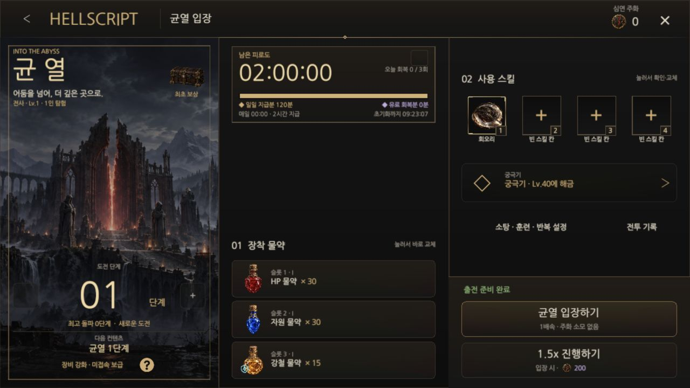
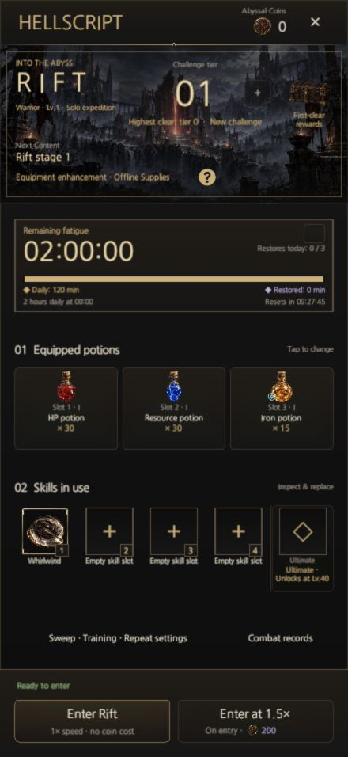

# HELLSCRIPT Web player

Updated: 2026-10-02 · [한국어](Web_Build.md)

The Web player is a separate deployment of the Unity game. Only executable build artifacts are published to `dakrdong/HELLSCRIPT-Web`; private profiles and the development project are not copied. Game source remains in the existing repository and the public wiki keeps its separate deployment.

Public player: [HELLSCRIPT Web](https://dakrdong.github.io/HELLSCRIPT-Web/). Deployment status is available through the deployment runs linked below.

## Playing and saving

- The Web edition starts as a guest. Native Google sign-in uses operating-system callbacks and is not offered by the Web UI. This release does not provide account linking or cross-device save synchronization.
- Progress and display/language preferences live in this browser's site storage. Unity's `autoSyncPersistentDataPath` preserves the existing file-based save transactions and backups. Clearing browser data deletes the Web save.
- Leaving the tab invokes the existing pause, save and resume flow. Time spent suspended by the browser is not treated as real-time combat. The existing in-game power-saving screen remains available while the game tab is visible.
- This edition uses the game rules bundled with the build. It does not connect to native authentication or the operator server's same-origin APIs. Server security and authentication are not changed.
- Browsers supporting Web Locks allow one game tab at the same address to reduce save conflicts. The loader presents storage and loading failures in Korean and English.

## Building and publishing

Use Unity 6000.6.0f1 with Web Build Support installed.

```bash
Unity -batchmode -nographics -buildTarget WebGL -projectPath <checkout> \
  -executeMethod Hellscript.Editor.WebPlayerBuild.BuildGitHubPages \
  -hellscriptBuildOutput <output>/Web -logFile <output>/web-build.log -quit
python3 tools/package_web_build.py package <output>/Web <deployment-checkout> --revision <source-commit>
```

`WebPlayerBuild` uses a release player, WebAssembly DiskSizeLTO and IL2CPP size optimization, Low managed stripping, WebGL 2, one thread and gzip compression. Decompression fallback supports static hosting without custom encoding headers. `ResourceTextureBudget` owns Web texture overrides while retaining original images, GUIDs and other platform settings. Release Web builds also remove the performance-test package's generated machine-information resources and verify their absence in the completed report.

Browsers cannot read operating-system fonts. `UiFonts` uses a preloaded Nanum Gothic font on Web. The unchanged Google Fonts release and SIL Open Font License 1.1 are stored in `Assets/HELLSCRIPT/ThirdParty/Fonts/`. The font stays outside `Resources` and is preloaded only by the Web build so native player size does not increase. Public deployments include `ThirdPartyNotices.txt`.

`Assets/WebGLTemplates/HELLSCRIPT/` owns the responsive loader and browser lifecycle. Existing owners still control the game canvas, safe area and combat. The current UI uses default text size. Aspect selection fits the game area without forcing the browser window's resolution.

Copy `tools/package_web_build.py` to `assemble_web.py` in the deployment repository and `tools/web_pages_workflow.yml` to `.github/workflows/pages.yml`. Set Pages to GitHub Actions. Files larger than a Git-friendly size are stored as chunks of at most 48 MiB. The workflow verifies size and SHA-256 and reconstructs the original files before uploading the Pages artifact. Browsers receive ordinary Unity build files.

## Android APK

After validating the Web build, use the existing `ProjectBuilder.BuildAndroid` on the same `main` source. With no development flag, it produces a release player with LZ4HC compression. Keep the existing application ID and signing configuration.

```bash
Unity -batchmode -nographics -buildTarget Android -projectPath <checkout> \
  -executeMethod Hellscript.Editor.ProjectBuilder.BuildAndroid \
  -hellscriptBuildOutput <output>/HELLSCRIPT.apk -logFile <output>/android-build.log -quit
```

Successful packaging, package/signature checks and installation/play on a physical Android device are separate validation claims.

## Integrated main public Web deployment — 2026-10-02

Merged `main` revision `fc2ac18157e96765199fcb7437b60e1c6af14631` was frozen at build start and built in release WebGL mode from a separate copy. Existing `WebPlayerBuild.BuildGitHubPages` and packaging tools preserved the original checkout, saves and package configuration. The [build result](WebBuildEvidence20261002/build.json) records zero errors, exit code 0 and 296.18 seconds. All seven public files, totaling 180,815,739 bytes, were reconstructed from ten chunks of at most 48 MiB and matched the original SHA-256 hashes. [Package validation](WebBuildEvidence20261002/package-validation.json).

Five package tests and five loader tests passed. Public commit `04416f6be197dee63a207a59e22855d845d92528` completed [Pages run 36967964914](https://github.com/dakrdong/HELLSCRIPT-Web/actions/runs/36967964914). The actual public page loaded this build's loader file.

Real input in the macOS in-app browser covered guest entry, Warrior selection, town entry and the Rift entry screen. Korean and English each covered 440×956 portrait, 956×440 landscape and PC 1280×720/1440×900/1680×720 at default text size. After saving English, reload and re-entry restored language, Warrior, town, potions and equipped skills; Korean was restored afterward. Runtime errors were zero. The existing unsupported URP FSR shader warning occurred once per game start, totaling two across the two launches. [Validation summary](WebBuildEvidence20261002/validation.json).

This validation covers the release Web build, package, public execution, Rift entry layout and existing-save restoration. With no game code changes and identical build inputs, full Edit Mode/native smoke checks were not repeated. Full combat transactions, rewards, performance and physical Android/iOS devices were not tested here; no APK was generated.





## Daily Quest public Web deployment — 2026-10-01

The scroll-free Daily Quest player was built in release WebGL mode from merged `main` revision `74a2477d6b454875020cc788982a218a9c7847fb`, frozen at build start. Existing `WebPlayerBuild.BuildGitHubPages` and packaging tools preserved the original checkout and saves. Later independent artwork/wiki changes merged during the build are outside this deployment source.

The [build result](DailyQuestWebEvidence20261001/build.json) records zero errors and exit code 0. All seven public files, totaling 176,376,654 bytes, were reconstructed from chunks and matched the original SHA-256 hashes. [Packaging check](DailyQuestWebEvidence20261001/package-validation.json). Public commit `17035f7d14723b933b6cc43c776d151772358500` completed [Pages run 36858217920](https://github.com/dakrdong/HELLSCRIPT-Web/actions/runs/36858217920); the loaded public root HTML also matched the local build hash. Direct navigation to `build-info.json` was blocked by the in-app browser, so live inspection of that endpoint is not counted.

The existing guest entered the real public game. Daily Quests covered twelve Korean/English viewports at default text size: 440×956 portrait, 956×440 landscape, PC 16:9/16:10/21:9 and 640×360 small landscape. All five cards and fixed actions remained visible without scrolling, and dragging left the body in place. Attendance round trips, close, Back and refresh were checked. Saving English, reloading the page and re-entering the guest restored language, town, character and daily state; Korean was saved again afterward. [Daily details and captures](Daily_Quests.en.md) · [Validation summary](DailyQuestWebEvidence20261001/validation.json).

There were zero browser runtime errors and two existing URP FSR shader warnings. Daily owners, transactions and data match the native validation, so the previous individual 100-coin claims, save failure, midnight, safe-area/additional-state checks and full Edit Mode result are reused. No completed reward was newly claimed in the public guest, and full game tests/native smokes were not repeated. No Android device was connected and the iOS inspection tool was unavailable, so physical-mobile validation remains unrun; no new APK was generated. This record covers macOS in-app-browser input.

## Historical verification — 2026-09-28

Built from the integrated `main` with Unity 6000.6.0f1 on 2026-09-28. The [validation summary](WebBuildEvidence/validation.json) includes the results and APK hash.

| Check | Result |
| --- | --- |
| Unity Edit Mode | 59 resource, bundled-font, title and localization tests passed |
| Shared UI, packaging, Web loader | 9, 5 and 5 tests passed respectively |
| Web build | Release, zero errors, 163,844,655 download bytes (about 164 MB) |
| Browser interaction | Guest entry, Warrior selection, tutorial combat, loot, equipment and town entry verified |
| Browser persistence | Reloaded after equipping armor; the same equipped item and defense 92 were restored |
| Layout and language | 440×956, 956×440, 1280×720, 1440×900 and 1680×720; Korean, English and 140% reading size checked |
| macOS compatibility | Native startup, 283 sound cues/454 clips, potion crops and world texture checks passed |
| APK | Release, zero errors, 142,832,282 bytes (about 143 MB), ARM64, Android 8.0/API 26 minimum, target API 36 |
| APK signature | Existing Android Debug certificate verified with APK v2; for direct installation, with store signing separate |

No browser runtime errors were observed. Unity URP still reports an unsupported FSR upscaling shader; the listed screens and interactions were checked in the rendered player. The first Web build hit Unity Bee's six-pass graph regeneration limit; an incremental retry succeeded with no source changes.

Public deployment commits and status are available in [deployment runs](https://github.com/dakrdong/HELLSCRIPT-Web/actions) and the public site's `build-info.json`. Browser evidence is from the macOS in-app browser. Installation, gameplay and performance on physical Android/iOS devices were not tested in this task.


